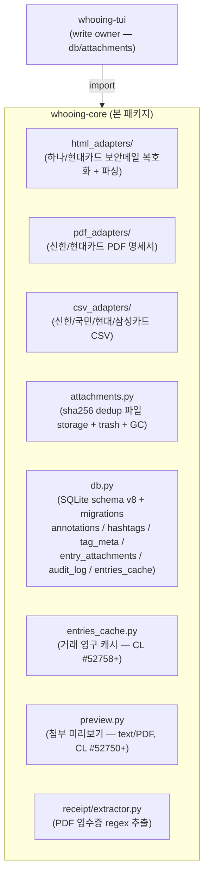

# whooing-core

후잉 가계부([whooing.com](https://whooing.com)) 데이터를 다루는 두 시스템 —
**[whooing-mcp-server-wrapper](https://github.com/neoocean/whooing-mcp-server-wrapper)**
(MCP 도구 묶음) 과 **whooing-tui** (터미널 UI) — 가 공유하는 코어 라이브러리.

## 책임 범위



## 책임이 **아닌** 것

- HTTP / API 호출 (각 consumer 가 알아서)
- MCP 서버 등록 / TUI 화면 (해당 repo 의 책임)
- P4 자동 sync (wrapper 의 자체 정책 — core 외부)
- pending queue 테이블 (wrapper 단독 사용)

## 설치

```bash
# 두 consumer 의 pyproject.toml 에 dependency 로 등록:
dependencies = [
    "whooing-core @ git+ssh://p4d.tail94e991.ts.net/whooing-core.git@v0.1.0",
    # 또는 PyPI publish 후:
    # "whooing-core>=0.1",
]
```

Playwright 브라우저는 한 번만 설치 필요 (HTML 보안메일 복호화):

```bash
playwright install chromium
```

## 사용 예

```python
# HTML 카드 보안메일 (하나/현대) 복호화 + 거래 추출
from whooing_core.html_adapters import detect, parse, known_issuers

issuer, rows = await parse_async(
    "/path/to/hyundaicard_20260425.html",
    password="820115",  # 생년월일 6자리 (한국 카드사 모두 공통)
)
for row in rows:
    print(row.date, row.merchant, row.amount)
```

```python
# 첨부파일 (sha256 dedup)
from whooing_core.attachments import store_file
sha, rel_path, was_new = store_file(
    src="/Users/me/Downloads/invoice.pdf",
    attachments_root="/Users/me/.whooing/attachments",
)
```

```python
# DB schema init (TUI 가 owner). 현재 SCHEMA_VERSION = 8.
from whooing_core.db import init_schema, current_version, SCHEMA_VERSION
init_schema("/Users/me/.whooing/data.sqlite")
print(f"schema version: {current_version(...)} / latest: {SCHEMA_VERSION}")
```

```python
# entries 영구 캐시 (CL #52758+)
from whooing_core.entries_cache import (
    upsert_entries, list_cached, cached_oldest_date,
)
import sqlite3
conn = sqlite3.connect("...sqlite")
conn.row_factory = sqlite3.Row
upsert_entries(conn, "s9046", [{"entry_id": "e1", ...}, ...])
rows = list_cached(conn, "s9046", start_date="20250101", end_date="20251231")
```

```python
# 첨부 미리보기 — text + PDF (CL #52750+)
from whooing_core.preview import extract_preview_text
text = extract_preview_text("/Users/me/invoice.pdf", mime="application/pdf")
# PDF 면 페이지별 "━━━ Page N/total ━━━" 헤더 포함 추출.
# binary 면 None — caller 가 "미리보기 불가" 안내.
```

## 문서

- [DESIGN.md](DESIGN.md) — schema, 어댑터 구조, 분리 정책
- [CHANGELOG.md](CHANGELOG.md) — 버전별 변경
- [mcp/](../mcp/) — read-only consumer (ex-whooing-mcp-server-wrapper, archived 2026-05-10 후 monorepo 로 흡수)
- [whooing-tui](../whooing-tui/) — write owner

## License

MIT.
