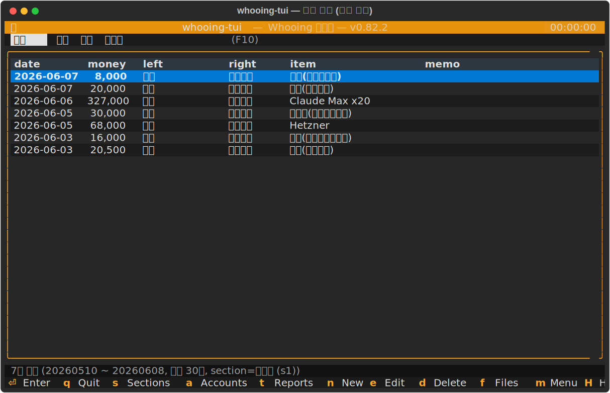
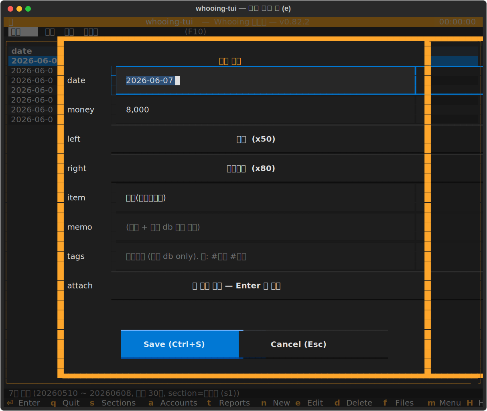
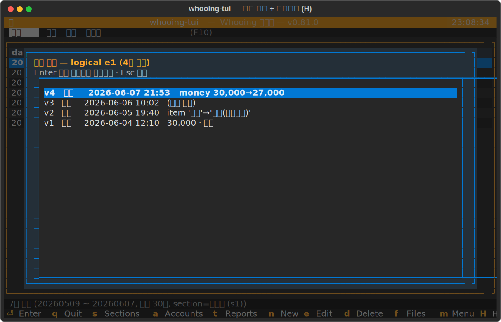
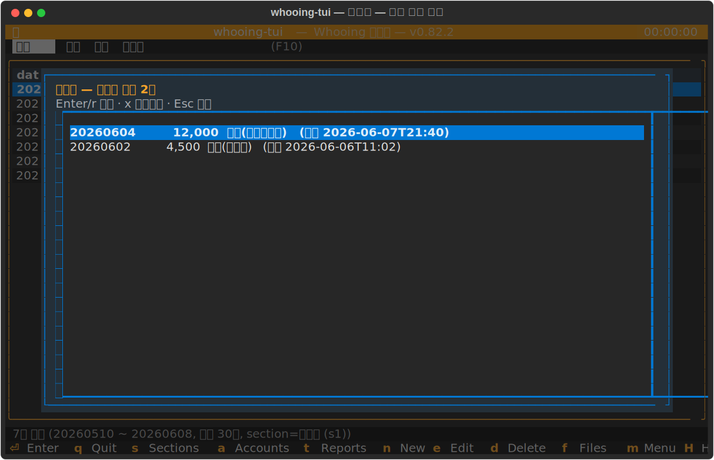
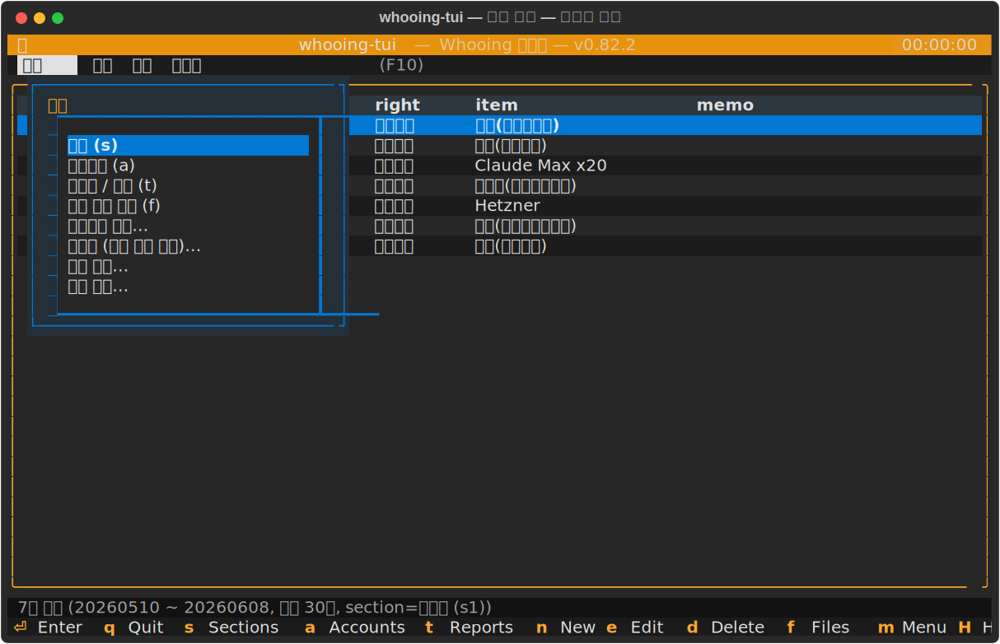
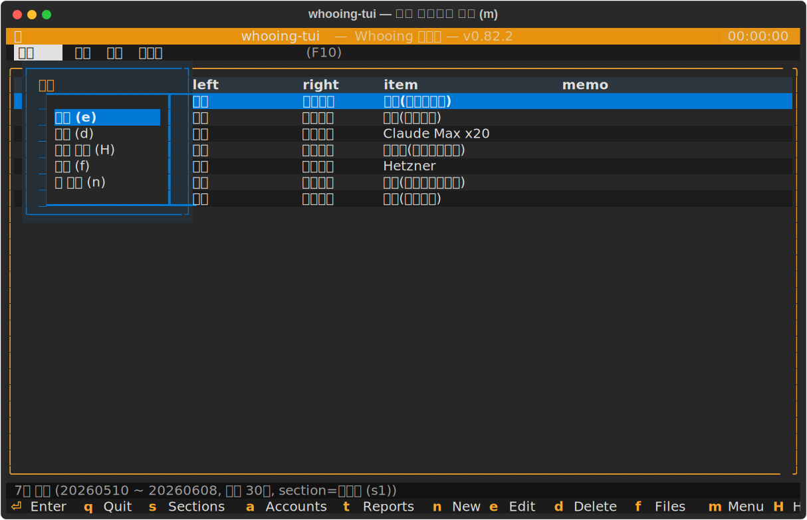

# whooing-tui 사용 매뉴얼

이 문서는 **whooing-tui** — 후잉(whooing.com) 가계부를 터미널에서 다루는
Textual TUI — 를 설치부터 일상 사용까지 **실제 화면 스크린샷**과 함께
안내합니다.

> 더 짧은 소개는 [README](../README.md), 워크플로별 상세는
> [시나리오 문서](README.md), 설계/내부는 [`tui/DESIGN.md`](../tui/DESIGN.md)
> 를 참고하세요. 스크린샷은 `scripts/gen_screenshots.py` 가 실제 화면을
> 헤드리스로 떠 `docs/image/` 에 저장합니다(아래 [부록](#부록-스크린샷-재생성)).

---

## 목차

1. [whooing-tui 가 무엇인가요](#1-whooing-tui-가-무엇인가요)
2. [설치와 실행](#2-설치와-실행)
3. [메인 화면 — 거래 목록](#3-메인-화면--거래-목록)
4. [거래 추가 · 수정 · 삭제](#4-거래-추가--수정--삭제)
5. [수정 이력 · 휴지통 · 복원](#5-수정-이력--휴지통--복원)
6. [메뉴 (F10) 와 컨텍스트 메뉴 (m)](#6-메뉴-f10-와-컨텍스트-메뉴-m)
7. [필터 · 검색 · 첨부 · 보고서](#7-필터--검색--첨부--보고서)
8. [동기화 (Perforce) 와 종료](#8-동기화-perforce-와-종료)
9. [키 레퍼런스](#9-키-레퍼런스)
10. [부록: 스크린샷 재생성](#부록-스크린샷-재생성)

---

## 1. whooing-tui 가 무엇인가요

후잉의 **섹션(장부) · 계정과목 · 거래내역**을 터미널에서 빠르게
조회·입력·수정하는 도구입니다. 키보드 중심이지만 마우스 클릭/메뉴도 됩니다.
후잉 REST/MCP 가 모르는 **메모·해시태그·첨부파일·수정 이력**은 로컬 SQLite
(`db/whooing-data.sqlite`) 에 따로 보관하고, 매 변경마다 Perforce 로 자동
동기화해 여러 환경에서 같은 상태를 봅니다.

## 2. 설치와 실행

```sh
make install          # .venv 생성 + core/tui editable + playwright chromium
# .env 에 후잉 AI 토큰 설정 (또는 ~/.config/whooing/.env)
echo 'WHOOING_AI_TOKEN=...' > .env

make run              # 실행 (= python3 whooing.py)
```

처음 실행하면 시작 점검(Perforce 동기화 확인) 후 곧바로 거래 목록이 뜹니다.

## 3. 메인 화면 — 거래 목록

실행 직후의 기본 화면입니다. 최근 거래가 날짜 내림차순으로 표시됩니다.



- **상단**: 제목줄 + 메뉴바(`파일 / 입력 / 화면 / 도움말` — `F10`).
- **표**: `date · money · L(차변 계정) · item` 등 컬럼. `↑/↓` 로 이동.
- **하단 상태줄**: 마지막 동작 결과 + 표시 범위 + 주요 키 힌트.
- `←/→` 로 컬럼을 옮겨 그 컬럼 기준 필터/정렬을 걸 수 있습니다(7장).

## 4. 거래 추가 · 수정 · 삭제

| 키 | 동작 |
|---|---|
| `n` | 새 거래 추가 (빈 폼) |
| `e` | 선택 거래 수정 |
| `d` | 선택 거래 삭제 (휴지통으로 — 5장) |

`n` / `e` 를 누르면 거래 입력 폼이 열립니다. 날짜·금액·차변/대변 계정·아이템·
메모·해시태그를 입력합니다. 계정은 직접 타이핑이 아니라 **계정 선택기**(트리)
에서 고릅니다.



저장하면 후잉에 반영되고, 메모/해시태그는 로컬에 함께 저장됩니다. 화면이
작아 폼이 한 번에 안 들어가면 **폼이 스크롤**되며(필드 이동 시 자동으로
보이게 스크롤), `Ctrl+S` 로 저장 / `Esc` 로 취소할 수 있어 좁은 터미널·모바일
SSH 에서도 모든 필드와 버튼을 쓸 수 있습니다. (자세한 흐름은
[시나리오 02](scenarios/02-add-edit-delete-entry.md).)

## 5. 수정 이력 · 휴지통 · 복원

whooing-tui 는 거래의 **모든 수정·삭제를 되돌릴 수 있게** 로컬에 버전 이력을
남깁니다. (설계: [시나리오 11](scenarios/11-edit-history-and-soft-delete.md).)

### 수정 이력 보기 + 되돌리기 — `H`

거래를 고르고 `H`(또는 컨텍스트 메뉴 → "수정 이력") 를 누르면 그 거래의 전체
버전 목록이 뜹니다. 각 줄은 `v번호 · 동작 · 시각 · 변경 요약`입니다.
`Enter` 로 **그 버전으로 되돌리기** — 되돌림도 같은 거래의 새 최신 버전이
되어 이력이 계속 이어집니다.



### 삭제는 휴지통으로

`d` 삭제는 **휴지통**으로 보내는 소프트 삭제입니다(후잉 잔액/보고서에서는
실제로 빠져 정확). 화면 메뉴 → **휴지통** 에서 삭제한 거래를 보고 `r`/`Enter`
로 **복원**, `x` 로 영구 삭제합니다.



> **동작 방식(안 B)**: 삭제 시 후잉에서 실제 삭제하되 로컬에 전체 스냅샷을
> 보관합니다. 복원하면 후잉에 다시 만들어지며 **후잉 entry_id 는 새로
> 발급**되지만, 내부 `logical_id` 로 동일 거래로 이어 추적합니다. 메모·태그·
> 첨부도 복원된 거래로 따라옵니다.
>
> **알려진 한계**: 후잉 웹/공식앱/MCP 등 **TUI 밖에서** 한 변경은 이력에
> 남지 않습니다.

## 6. 메뉴 (F10) 와 컨텍스트 메뉴 (m)

`F10`(또는 메뉴 이름 클릭) 으로 풀다운 메뉴를 엽니다. 메뉴 바깥을 클릭하면
닫히고, 다른 메뉴 이름을 클릭하면 그 메뉴로 바뀝니다. **화면** 메뉴에 섹션·
계정과목·보고서·해시태그·**휴지통**·예산·목표가 있습니다.



거래 위에서 `m`(또는 우클릭) 을 누르면 그 거래에 대한 컨텍스트 메뉴 —
수정/삭제/수정 이력/첨부/새 거래 — 가 뜹니다.



## 7. 필터 · 검색 · 첨부 · 보고서

- **필터/검색**: `←/→` 로 컬럼 선택 후 `Enter` 로 그 컬럼 값으로 필터, `/`
  로 검색. ([시나리오 07](scenarios/07-filter-and-search.md))
- **첨부**: `f` 로 선택 거래의 영수증·인보이스 첨부 관리.
  ([시나리오 03](scenarios/03-attach-files.md))
- **카드 명세서 가져오기**: 입력 메뉴 → 카드 import.
  ([시나리오 04](scenarios/04-import-card-statement.md))
- **중복 정리**: `space` 로 다중 선택 후 `m` → 중복 평가, 또는 입력 메뉴의
  일괄 스캔. ([시나리오 05](scenarios/05-evaluate-duplicates.md))
- **해시태그**: `#` 로 태그, 일괄 태그.
  ([시나리오 06](scenarios/06-hashtags-and-batch-tagging.md))
- **보고서/통계**: `t`. ([시나리오 08](scenarios/08-reports.md))

## 8. 동기화 (Perforce) 와 종료

로컬 SQLite 의 메모·태그·첨부·**수정 이력**은 매 변경마다 Perforce 로
자동 submit 되어 다른 환경과 동기화됩니다. 시작 시 `p4 sync` 로 최신을
받아옵니다. ([시나리오 09](scenarios/09-startup-shutdown.md))

`q` 로 종료하면 진행 중인 동기화 작업을 마무리(flush)한 뒤 닫힙니다.

## 9. 키 레퍼런스

| 키 | 동작 | 키 | 동작 |
|---|---|---|---|
| `↑/↓` | 거래 이동 | `n` | 새 거래 |
| `←/→` | 컬럼 이동 | `e` | 수정 |
| `Enter` | 컬럼별 동작/필터 | `d` | 삭제(휴지통) |
| `H` | 수정 이력/되돌리기 | `m` | 컨텍스트 메뉴 |
| `f` | 첨부 | `#` | 해시태그 |
| `t` | 보고서/통계 | `/` | 검색 |
| `s` | 섹션 | `a` | 계정과목 |
| `F10` | 메뉴바 | `q` | 종료 |
| `t`(앱) | 테마 전환 | `?` | 단축키 도움말 |

> 한글(두벌식) 입력 상태에서도 같은 키가 동작합니다(`bind_ko` — 영문 자모
> 양쪽 바인딩).

## 부록: 스크린샷 재생성

이 매뉴얼의 스크린샷은 실제 화면을 헤드리스로 떠 만든 SVG 입니다(가짜·결정적
샘플 데이터, PII 없음). 코드/화면이 바뀌면 다시 생성하세요:

```sh
.venv/bin/python scripts/gen_screenshots.py          # 전체
.venv/bin/python scripts/gen_screenshots.py edit     # 이름에 'edit' 포함만
```

방식은 pytmux/docker-monitor 의 매뉴얼 스크린샷 방식을 따릅니다 — Textual
`export_screenshot` 로 SVG 를 뜨고, 한글 자간(Rich textLength 버그) 보정 +
이메일 PII 마스킹 후처리를 적용합니다.
