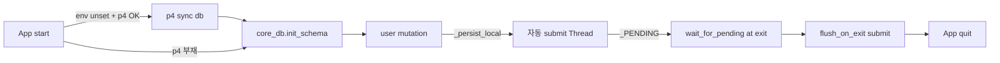
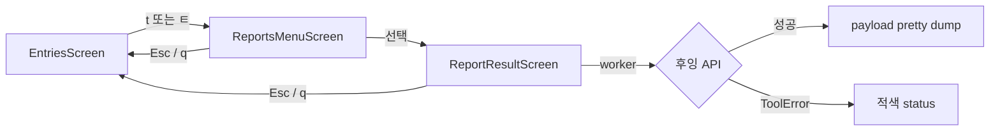
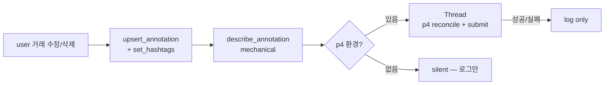
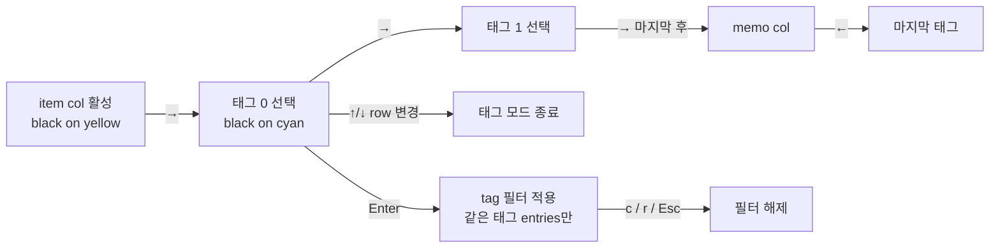
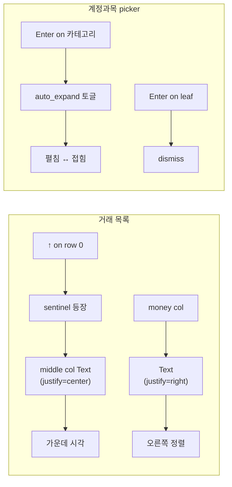
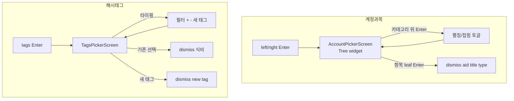
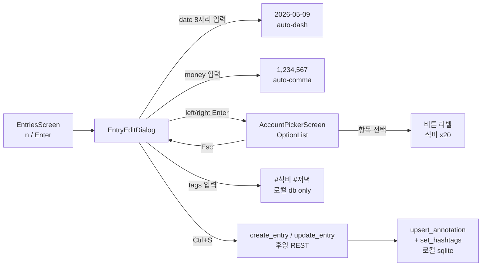
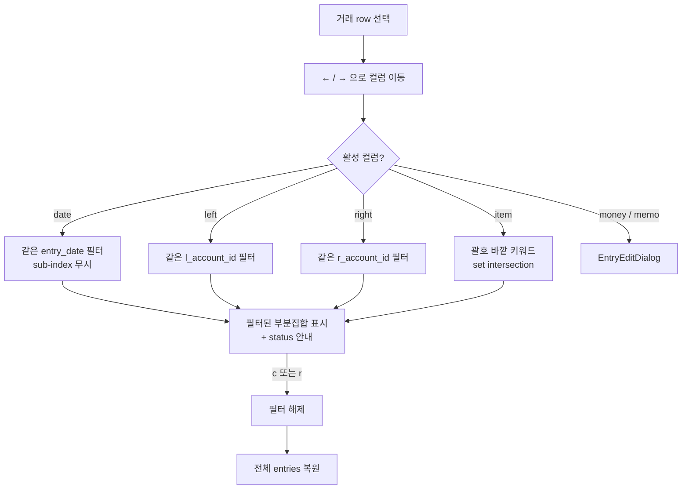

# whooing-tui — 변경 이력

각 항목은 Perforce CL 단위로 끊는다.

## CL #51119 — 0.16.3 — 시작 시 db sync (P4 환경 있을 때) + 종료 시 누락 변경 flush submit (사용자 요청) (2026-05-10)

사용자 요청 3건:
1. 다음부터 앱을 시작할 때 P4 환경이 갖춰져 있으면 db 파일을 업데이트.
2. 종료할 때, 데이터를 변경할 때마다 서브밋. (#2 의 "변경할 때마다" 는
   기존 `_persist_local`/`_purge_local` 흐름이 이미 처리 — 본 CL 은
   "종료할 때" 마지막 안전망 추가).
3. 다음부터 데이터베이스를 테스트할 때는 반드시 백업 → 테스트 → 정상
   상태 확인 → 백업 제거 절차. (운영 규칙 — 코드 변경 X).

### 추가

- `tui/src/whooing_tui/p4_sync.py`
  - `sync_db_from_p4(db_path)` — 시작 시 호출. P4 환경 + 매핑 OK 면
    `p4 sync <db_path>` 실행. 부재 / 매핑 외 / sync 실패 모두 silent.
    `init_schema` 의 PRAGMA / `INSERT OR REPLACE schema_meta` 가 새 head
    위에 적용되도록 *init_schema 이전에* 호출.
  - `flush_on_exit(db_path, *, description)` — 종료 시 호출.
    `wait_for_pending()` 으로 진행중 submit join 후, 추가로 blocking
    `_do_submit` 한 번 더 (마지막 안전망 — race / 누락 케이스 보호).
    `description` 기본값 `[whooing-tui] session end — flush pending db
    changes`.

### 수정

- `tui/src/whooing_tui/data.py`
  - `init_shared_schema()` 가 `WHOOING_DATA_DIR` 미설정 시 (실 사용자
    환경) `p4_sync.sync_db_from_p4` 를 `core_db.init_schema` 직전에 호출.
    `WHOOING_DATA_DIR` 설정 시 (테스트 / 명시 override) skip — 테스트가
    실 P4 상태를 끌어오지 않게.
- `tui/src/whooing_tui/app.py`
  - `WhooingTuiApp.on_unmount()` 가 `wait_for_pending` 만 호출하던 것을
    `flush_on_exit(db_path)` 로 확장. `WHOOING_DATA_DIR` 설정 시는
    `wait_for_pending` 만 (테스트 격리).

### 테스트

- `tui/tests/test_p4_sync.py` — 4 신규:
  - `test_sync_silent_when_p4_missing`
  - `test_sync_silent_when_not_in_p4_workspace`
  - `test_sync_runs_p4_sync_when_mapped`
  - `test_flush_on_exit_waits_then_submits`
- 합계: 455 → **459 통과** (+4).

### 사용자 흐름



## CL #51118 — 0.16.2 — p4_sync daemon thread submit 미완료 회귀 fix + 누적 로컬 db 변경분 수동 submit (사용자 보고) (2026-05-10)

사용자 보고: "sqlite 데이터베이스는 퍼포스 서버에 올라가 있습니까"

### 진단

- DB 파일은 P4 에 등록 (`//.../db/whooing-data.sqlite#1`, CL #51114).
- 로컬 SHA `43627e...` ≠ P4 SHA `238f8e...` — 그동안의 mutation 이 자동
  submit 됐어야 했지만 변경분이 P4 에 반영 안 됨.
- 수동 `p4 reconcile -e -a -d <path>` 는 정상 작동 — P4 환경 자체는 멀쩡.
- 회귀 원인: `p4_sync.submit_db_to_p4` 가 `Thread(daemon=True)` 사용 →
  사용자가 TUI 를 종료하는 순간 main thread 가 끝나면서 submit worker 도
  같이 죽어 `p4 submit` 호출이 미완료.

### 수정

- `tui/src/whooing_tui/p4_sync.py`
  - 활성 submit 스레드 추적 전역 (`_PENDING: list[threading.Thread]` +
    `_PENDING_LOCK`).
  - `Thread(daemon=False)` 로 변경 + `_runner` finally 에서 `_PENDING`
    에서 자기 자신 제거.
  - `wait_for_pending(timeout_per_thread=30.0)` 신설 — 모든 활성 스레드
    join, timeout 안 끝나면 포기 (사용자 종료 흐름 무한 차단 방지).
- `tui/src/whooing_tui/app.py`
  - `WhooingTuiApp.on_unmount()` 추가 — `p4_sync.wait_for_pending()`
    호출. App 종료 직전 마지막 mutation 의 submit 까지 기다림.
- `tui/tests/test_p4_sync.py` — 2 신규:
  - `test_submit_async_threads_are_tracked_and_joinable`
  - `test_wait_for_pending_when_empty_is_noop`

### 진단 중 발생한 데이터 손실 주의

진단 도중 `p4 reconcile` 의 부작용을 확인하려고 실행 후 `p4 revert` 로 되
돌렸으나, 그 시점에 로컬 db 의 변경분이 P4 rev1 로 덮어씌워졌다 — 사용자
의 그동안 mutation 이 있었다면 같이 사라짐. (대부분은 `init_schema()` 의
PRAGMA / `INSERT OR REPLACE schema_meta` noop 쓰기로 추정). 회고 차원의
교훈: 진단 시에는 `p4 reconcile -n` (preview-only) 를 우선 사용.

본 CL 은 *코드 수정만* — db 파일은 이미 P4 와 일치. 다음 mutation 부터
새 자동 submit 흐름이 정상 동작.

### 검증

- 453 → **455 통과** (+2).

## CL #51117 — 0.16.1 — 보고서 API path 수정 (라이브 응답 unknown method 회귀 fix, 사용자 보고) (2026-05-10)

사용자 보고: "모든 보고서 팝업을 열면 unknown method 메시지만 나옵니다."

### 원인

CL #51116 의 첫 시도는 모든 보고서를 `/reports.json` 단일 endpoint + `type`
query 로 dispatch 한다고 추측했는데, 후잉 실 API 는 endpoint 별 별도 path
를 가진다. `whooing://api-docs` MCP 리소스에서 정확한 path 회수.

### 실 API path 매핑 (수정 후)

| 기능 | 실 path |
|---|---|
| 통합 보고서 | `/report.json` (또는 `/report/<account>[/<account_id>].json`) |
| 손익 요약 | `/report_summary.json` (또는 `/report_summary/<account>.json`) |
| 항목별 증감 | `/in_out.json` (또는 `/in_out/<account>[/<account_id>].json`) |
| 캘린더 | `/calendar.json` |
| 카드 청구 | `/bill.json` (또는 `/bill/<account_id>.json`) |
| 체크카드 | `/checkcard.json` (또는 `/checkcard/<account_id>.json`) |
| 예산 대비 실적 | `/budget/<account>.json` (`account` = `expenses`/`income` path 필수) |
| 장기목표 설정 | `/budget_goal.json` |
| 월별 자본 목표 | `/goal.json` |
| 사용자 정의 보고서 | `/main/report_customs.json?action=list\|info[&customId=<>]` |
| 최근 거래 | `/entries/latest.json` |

### 수정

- `tui/src/whooing_tui/client.py`
  - 기존 `get_report(type=...)` 단일 메서드를 endpoint 별 메서드로 재설계:
    `get_report` / `get_report_summary` / `get_in_out` / `get_calendar`
    / `get_bill` / `get_checkcard` / `get_budget` / `get_budget_goal`
    / `get_goal` / `list_report_customs` / `get_report_custom`
    / `get_entries_latest`.
  - `get_budget` 의 `pl` 파라미터 → `account` (path 로 들어감 — `:account`).
  - `list_report_customs` 가 `/main/report_customs.json?action=list` 로
    수정. `get_report_custom` 은 `?action=info&customId=<>`.
  - `get_report` / `get_report_summary` / `get_in_out` 의 `account` /
    `account_id` 가 path segment 로 들어가는 변형 처리.
  - `_drop_none(params)` helper — `None` 값을 query 에서 제거.
  - `CachedWhooingClient` 에 새 메서드들 pass-through.
- `tui/src/whooing_tui/screens/reports.py`
  - 메뉴 fetch 함수 11개를 새 client API 에 맞춰 재작성.
  - `cashflow` 항목 제거 — 실 API 에 대응 endpoint 가 없음 (MCP 가 합성
    해주는 것이라 본 클라이언트에서는 직접 구성 불가).
  - 메뉴 라벨 "현금흐름표 (이번 달)" → "항목별 증감 (이번 달)" 로 교체
    (`/in_out.json`).
- `tui/tests/test_client.py` — 보고서 path 검증 12 케이스 (이전 5 케이스
  교체 + 신규):
  - `test_get_report_root_path`, `test_get_report_account_in_path`,
    `test_get_report_account_id_in_path`, `test_get_report_summary_path`,
    `test_get_calendar_path`, `test_list_report_customs_uses_main_path`,
    `test_get_report_custom_uses_action_info`,
    `test_get_budget_uses_account_in_path`, `test_get_budget_goal_path`,
    `test_get_goal_path`, `test_get_in_out_path`,
    `test_get_entries_latest_path`.
- `tui/tests/test_reports.py` — `_Client` 모킹에 새 메서드 추가, 통합
  테스트의 `type` 검증 → `account="assets,liabilities" + rows_type="none"`.

### 검증

- 446 → **453 통과** (+7 — 12 신규 - 5 obsolete).
- 라이브 호출 검증은 사용자 환경에서. path 가 한 번 더 어긋나면 메서드의
  literal path 만 조정 (구조 동일).

### 함정 / 학습

- 후잉 API 는 endpoint 가 *path 의 segment* 로 dispatch 되며 query
  `type` 파라미터로 구분되지 않는다 (`account`, `account_id` 도 일부
  endpoint 에서 path 로 들어감 — `/report/expenses,income/x20.json`).
- MCP 의 `report-get` schema 의 `type` enum (cashflow / entries_* 등) 은
  MCP 서버가 *추상화* 한 dispatch 키였고, 실 API 의 path segment 가 아니다.
  따라서 type=cashflow 처럼 실 endpoint 가 없는 경우 클라이언트에서는
  지원할 수 없다.
- 보고서 path 의 `account` 는 `/budget/<account>.json` 에서 path 필수,
  `/report/<account>.json` 에서는 옵션 (root `/report.json` 도 가능).

## CL #51116 — 0.16.0 — 후잉 통계 뷰 (드롭다운 메뉴 + 결과 팝업) Phase 1 (사용자 요청) (2026-05-10)

사용자 요청:

> 후잉에서 제공하는 여러 가지 통계 뷰들을 지원해주세요. 각각의 통계는
> 풀다운 메뉴를 통해 접근하고 메뉴를 선택하면 팝업을 통해 결과를
> 보여줘야 합니다.

선택된 우선순위 (사용자 답변): report-get 기본 + report-get 기간별 +
report_customs (사용자 정의) + budget / goal — 모두 Phase 1 에 골격 포함.

### 추가

- `tui/src/whooing_tui/screens/reports.py` (신규)
  - `ReportsMenuScreen(ModalScreen[(item_id, label)])` — `t` 단축키로 push.
    OptionList 의 항목 11개:
      * 재무상태표 (자산/부채/자본 — 현재)
      * 손익 요약 (이번 달)
      * 월별 추이 (YTD)
      * 현금흐름표 (이번 달)
      * 캘린더 (이번 달)
      * 최근 거래 20건
      * 사용자 정의 BS / PL (YTD, calculated_result=y)
      * 예산 대비 실적 — 지출 / 수입
      * 장기목표 설정
  - `ReportResultScreen(ModalScreen[None])` — fetch worker (`@work group=
    "reports"`) + raw JSON pretty dump. `last_payload` / `last_error` 테스
    트 친화 attribute. 에러는 적색 status — 모달은 그대로 (앱 정상).
  - `_build_menu()` — `(item_id, label, fetch_fn)` 의 list. fetch_fn 은
    client + session 받아 await 결과 반환. 메뉴 dispatch 와 fetch 의 단일
    source.
  - `format_report_payload(item_id, payload)` — Phase 1 베이스라인은 indent
    JSON dump. 종류별 전용 렌더러는 후속 CL 에서 점진 교체.

- `tui/src/whooing_tui/client.py`
  - `WhooingClient.get_report(*, section_id, type, ...)` — `/reports.json`
    GET. type=report / report_summary / cashflow / in_out / calendar /
    bill / checkcard / budget / goal / entries_* 전부 dispatch.
  - `list_report_customs(*, section_id, report, calculated_result, ...)`.
  - `get_report_custom(*, section_id, report, custom_id)`.
  - `get_budget(*, section_id, pl, start_date, end_date)`.
  - `get_budget_goal(*, section_id)`.
  - `get_goal(*, section_id, start_date, end_date)`.
  - `CachedWhooingClient` 에 같은 메서드 wrapping pass-through (캐시 영향 X).
  - 모든 path 는 RESTful 가정 (entries.json / accounts.json 패턴) 으로 시작
    — 라이브 검증에서 path 다르면 `_REPORTS_PATH` 등 상수만 조정.

- `tui/src/whooing_tui/screens/entries.py`
  - `BINDINGS` 에 `*bind_ko("t", "open_reports", "Reports", show=True,
    priority=True)` 추가.
  - `action_open_reports()` — `ReportsMenuScreen` push, dismiss 결과로
    `ReportResultScreen` push.

- `tui/tests/test_reports.py` (신규) — 10 케이스:
  - 단위: `_build_menu` / `format_report_payload`.
  - 통합: 't' 키 → 메뉴 / 메뉴 선택 → 결과 / 메뉴 cancel / endpoint
    dispatch / ToolError silent 처리.
- `tui/tests/test_client.py` — 5 추가:
  - `test_get_report_basic`, `test_get_report_passes_optional_params`,
    `test_list_report_customs_returns_list`, `test_get_budget`,
    `test_get_budget_goal`.

### 검증

- 기존 431 → **446 통과** (+15).

### Phase 2 후속 (계획만 — 본 CL 에는 미포함)

- 종류별 전용 렌더러: 재무상태표 → assets/liabilities/capital 표 (money
  오른쪽 정렬). 월별 추이 → 시계열 표. 캘린더 → 일 별 그리드 mockup.
- 보고서 모달 안에서 기간 조정 (+/-).
- 사용자 정의 BS/PL 의 항목별 drill-down.
- 캐시 (보고서는 데이터가 자주 안 바뀌므로 짧은 TTL 캐시 가치).



## CL #51115 — 0.15.1 — 한글 IME 단축키 즉시 발화 + 해시태그 # 자연 처리 (사용자 요청) (2026-05-10)

사용자 요청 2건 (한 CL 에 묶음):

1. **한글 IME 모드일 때 단축키를 입력하면 한글이 화면에 나타난 다음
   단축키가 좀 늦게 실행됩니다. 이를 실제 입력이 일어나지 않고 바로
   단축키가 적용되도록 수정**.
2. **해시태그는 # 문자로 시작하지만 실제 태그 입력에는 # 문자를 제외하고
   처리됩니다. 입력/검색할 때 # 문자를 입력하더라도 # 를 표시하되 실제
   데이터에는 입력하지 않고, 출력할 때는 # 를 앞에 붙여 출력**.

### 동작

- **한글 IME 단축키 즉시 발화** (`bind_ko` 변경):
  - 한글 binding 을 항상 `priority=True` 로 등록 (영문 binding 의 priority
    여부와 무관). focused widget (Input / DataTable type-to-search 등) 이
    한글 자모를 텍스트로 흡수해 잠깐 표시되는 시각 지연 방지.
  - 영문 binding 의 priority 는 호출 측 결정 그대로 (영문 키는 텍스트
    입력란에서도 의미가 있으므로 강제하지 않음).

- **해시태그 # 자연 처리**:
  - **사용자 시각**: tags Input / TagsPickerScreen Input / picker 옵션 모두
    `#식비` 형태로 표기. 사용자가 `#식비` 또는 `식비` 둘 다 같은 결과.
  - **내부 저장**: `entry_hashtags.tag` 에는 bare `식비` 만. `parse_hashtags_input`
    이 `[\s,#]+` 분리자로 `#` 자체를 분리.
  - **출력**: 거래 목록 item 셀의 인라인 `#식비 #저녁`, picker 옵션 라벨
    `#식비 (12)`, EntryEditDialog 의 tags 초기 prefill `#식비 #저녁`,
    picker 결과 append 시 `#식비` prefix 형태.

### 추가

- `tui/src/whooing_tui/ime.py`
  - `KOREAN_TO_EN: dict[str, str]` — 한글 → 영문 역방향 lookup (향후 on_key
    인터셉트 등 활용 여지).
  - `bind_ko` 가 한글 binding 에 `priority=True` 강제 주입.

### 수정

- `tui/src/whooing_tui/screens/edit_entry.py`
  - `compose()`: `tags_init = " ".join(f"#{t}" for t in (...))` — 초기
    prefill 에 `#` 표기.
  - `_open_tags_picker._on_pick`: dismiss 결과 (bare tag) 를 `#{tag}` 로
    Input value 에 append.
- `tui/src/whooing_tui/screens/tags_picker.py`
  - 새 태그 옵션 라벨: `+ 새 태그 만들기: #{normalized}`.
  - 추천 / 자주 쓰는 태그 옵션 라벨: `  #{t}  ({count})`.
  - Input placeholder: `새 태그 또는 검색 (예: #식비 / 식비)`.

### 테스트

- `tui/tests/test_ime.py` — 1 신규: `test_bind_ko_korean_always_priority`.
- `tui/tests/test_tags_picker.py` — 2 신규:
  - `test_picker_displays_tags_with_hash_prefix`
  - `test_picker_strips_hash_from_user_input_when_creating`
- `tui/tests/test_entries_mutate.py` — 1 갱신:
  - `test_tags_input_enter_pushes_picker_and_appends` 가 `"#커피 #회의"`
    형태 검증.
- 합계: 428 → **431 통과** (+3).

## CL #51107 — 0.15.0 — 로컬 sqlite 를 ~/.whooing 에서 <project>/db/ 로 이동 + 변경 시 P4 자동 submit (사용자 요청) (2026-05-10)

사용자 요청:

> 현재 whooing-tui 에서만 지원하는 기능의 정보를 저장하기 위해 sqlite
> 데이터베이스를 사용합니다. 이 파일은 홈 디렉토리 하위에 있습니다. 이
> 파일을 현재 프로젝트 디렉토리로 가져와 퍼포스 서브밋 대상이 되도록
> 수정해주세요. 현재 프로젝트 디렉토리 하위에 db 서브디렉토리를 만들고
> 여기로 데이터베이스 파일 위치를 옮기세요. 또한 whooing-tui 실행 중
> 데이터베이스에 변경이 발생하는 이벤트가 일어나면 데이터베이스 파일을
> 서브밋해주세요. 서브밋할 때 디스크립션에 무엇이 변경되었는지 기록.
> 이 때는 LLM 을 통한 기록이 아니므로 어떤 이벤트에 의한 어떤 정보의
> 변경이 일어났음을 기계적으로 작성. 퍼포스 환경이 갖춰져 있을 때만
> 이 동작이 일어나야 하며 갖춰져있지 않다면 데이터베이스 파일에 기록
> 하고 아무 에러메시지도 보여주지 않아야.

### 위치 변경

- `tui_data.data_dir()` 의 default 가 `~/.whooing/` → `<project_root>/db/`.
  - 우선순위: `$WHOOING_DATA_DIR` (명시 override, 테스트 등) >
    `<project_root>/db/` (monorepo 안에서 실행 시) > `~/.whooing/`
    (pip install / monorepo 외 fallback).
  - `_project_root()` 가 `__file__` 의 ancestor 중 `tui/` + `core/`
    sibling 이 있는 디렉토리를 monorepo root 로 자동 식별.
- `init_shared_schema()` 가 새 위치 진입 시 기존 home (`~/.whooing/whooing-
  data.sqlite`) 의 db 가 있으면 *target 에 db 가 없을 때만* 1회 복사
  (`_maybe_migrate_legacy_db`). WAL/SHM 보조 파일도 함께. 실패 silent.
  단, `WHOOING_DATA_DIR` 가 set 이면 마이그레이션 skip — 테스트의 isolated
  tmp 가 실 사용자 db 를 끌어가지 않게.
- `db/whooing-data.sqlite` 가 P4 control 에 추가됨 (binary). `.gitignore`
  의 `*.sqlite` 가 git mirror 푸시는 차단 — public GitHub 에 사용자 데이터
  유출 X.

### 신규 모듈: `whooing_tui.p4_sync`

- `submit_db_to_p4(db_path, description, *, blocking=False)` — fire-and-
  forget. 기본 `threading.Thread(daemon=True)` 로 백그라운드 실행, UI 차단 X.
  `blocking=True` 는 테스트 전용.
- `is_p4_available()` — `p4 info -s` returncode 검사 (5초 timeout).
- `is_file_in_p4(path)` — `p4 where <path>` 매핑 검사.
- 절차 (`_do_submit`):
  1. `p4 where <db>` 로 매핑 확인 — 매핑 외면 silent return.
  2. `p4 reconcile -e -a -d <db>` — edit/add/delete 자동.
  3. `p4 submit -d <description> <db>` — default CL 변경 즉시 submit.
  4. 모든 단계 실패 = `log.warning` / `log.debug` 만, 사용자 표면화 X.
- `describe_annotation(*, entry_id, memo_changed, tags, deleted=False)` —
  *기계적* description 생성 (LLM 미관여). 예:
  - `[whooing-tui] entry e123 memo upsert`
  - `[whooing-tui] entry e123 hashtags set [식비, 커피]`
  - `[whooing-tui] entry e123 memo upsert; hashtags set [식비]`
  - `[whooing-tui] entry e123 deleted`

### 수정

- `tui/src/whooing_tui/data.py`
  - `_project_root()` / `_legacy_home_dir()` / `_maybe_migrate_legacy_db()`
    helper.
  - `data_dir()` 우선순위 확장.
  - `init_shared_schema()` 에 마이그레이션 hook (env 미설정 시만).
- `tui/src/whooing_tui/screens/entries.py`
  - `_persist_local` / `_purge_local` 가 mutation 후
    `p4_sync.submit_db_to_p4(db_path, describe_annotation(...))` 호출.
- 신규: `tui/src/whooing_tui/p4_sync.py`
- 신규: `tui/tests/test_p4_sync.py` — 11 케이스 (description 기계적 형식
  + 환경 감지 + silent 실패 + 호출된 명령 검증).
- `tui/tests/test_data.py` — 4 신규 (project root 자동 / migration skip
  when env set / migration runs when env unset).
- 신규: `db/whooing-data.sqlite` (binary, ~/.whooing 에서 옮겨옴, P4 control).

### 검증

- 기존 414 → **428 통과** (+14 신규 — p4_sync 11 + data 3).

### 사용자 흐름



## CL #51102 — 0.14.0 — 거래 목록 item 컬럼에 해시태그 인라인 + 태그 단위 column 네비 + 태그 Enter 필터 (사용자 요청) (2026-05-10)

사용자 요청 (한 묶음):

> 거래목록에서 item 을 표기할 때 자리가 남는다면 뒤쪽에 태그 목록을
> 나열해주세요. 태그는 실제로 # 문자로 시작되지 않지만 태그들을 구분하기
> 위해 태그는 # 문자로 시작해주세요. 이들은 좌우 방향키로 칼럼을 선택할 때
> item 이 선택된 상태에서 다시 한 번 오른쪽 방향키를 누르면 커서 색상이
> 바뀌며 해시태그를 하나씩 선택합니다. 해시태그가 선택된 상태에서 엔터키를
> 누르면 이 해시태그로 검색한 결과를 보여줍니다.

### 동작

- **인라인 태그 표시 (`_format_cell` item 컬럼)**:
  - `스타벅스 #식비 #저녁` 형태. 실제 db 에는 `#` 없이 bare 토큰 (`식비`,
    `저녁`) 으로 저장 — `#` 는 시각 구분 prefix.
  - 태그가 많으면 (`_ITEM_TAG_INLINE_LIMIT=2` 초과) 앞 2 개 + `#…(N)` 축약.
  - item 이 빈 문자열이어도 태그가 있으면 `#식비 #저녁` 만 표시.
  - SQLite `entry_hashtags` 의 PK 가 `(entry_id, tag)` 라 fetch 순서가
    가나다 순 — 인라인 표시도 그 순서.

- **태그 단위 column 네비** (←/→ 가 item 을 넘어 태그 사이로 sliding):
  - `_active_col == item` + `_column_active=True` 상태에서 → 한 번 더 →
    태그 모드 진입 (`_tag_index = 0`).
  - 태그 모드에서 → 면 다음 태그 (`_tag_index += 1`).
  - 마지막 태그에서 → 면 태그 모드 종료 + memo 진입.
  - memo 위 ← 면 그 row 가 태그 보유 시 마지막 태그 (`_tag_index = N-1`).
  - 태그 모드 0 에서 ← → 태그 모드 종료, item 셀 자체 marker 로 복귀.
  - **↑/↓ 로 row 가 바뀌면 태그 모드 자동 종료** (각 row 의 태그 개수가
    달라 index 보존이 의미 없음 — 사용자 답변 명시).
  - `Esc` (action_deactivate_column) 가 `_tag_index` 도 함께 None.

- **태그 marker 색상** (사용자 명시: "커서 색상이 바뀌며"):
  - 일반 컬럼 marker: `_ACTIVE_CELL_STYLE = "black on yellow"` (기존).
  - 태그 marker: `_TAG_MARKER_STYLE = "black on cyan"` — 시각 구분.
  - 태그 모드 일 때 item 셀을 `_render_item_cell_with_tag_marker(entry,
    tag_idx)` 로 다시 build — 선택된 태그 토큰만 cyan.

- **태그 Enter 필터** (`_apply_tag_filter`):
  - `_active_filter = ("tag", {"tag": tag})` 로 통일.
  - `_entry_tags` 사전 lookup 으로 해당 태그 보유 entries 만 표시.
  - status: `필터: tag=#식비 — N/M건. c 로 해제 / r 로 재로드.` (warn 톤).
  - `r` (refresh) / `c` (clear_filter) / `Esc` 모두 해제 — 기존 column
    필터와 동일 흐름.

### 추가

- `tui/src/whooing_tui/screens/entries.py`
  - `_entry_tags: dict[str, list[str]]` 필드 — refresh_entries 끝에서
    `_fetch_all_entry_tags(entry_ids)` 로 batch 채움.
  - `_tag_index: int | None` 필드 — 태그 모드 추적.
  - `_TAG_MARKER_STYLE = "black on cyan"` 상수.
  - `_ITEM_TAG_INLINE_LIMIT = 2` — 인라인 표시 한도.
  - helper: `_fetch_all_entry_tags`, `_current_row_tags`,
    `_item_col_index`, `_memo_col_index`, `_render_item_cell_with_tag_marker`.
  - `action_next_column` / `action_prev_column` 의 태그 mode 분기.
  - `action_context_enter` 의 태그 mode 분기 (→ `_apply_tag_filter`).
  - `_apply_tag_filter(tag)` 메서드.
  - `_filter_label` 의 `column == "tag"` 케이스.
  - `_announce_active_column` 의 태그 mode 안내.
  - `on_data_table_row_highlighted` 가 `_tag_index = None` reset (row
    변경 시).
  - `_render_table` 시작에서 `_tag_index = None` reset (defensive).
  - `action_deactivate_column` 도 `_tag_index = None` reset.

- `tui/tests/test_entries_tag_inline.py` (신규) — 8 통합 케이스:
  - `test_item_cell_inlines_tags_after_text`
  - `test_item_cell_truncates_many_tags`
  - `test_item_cell_shows_only_tags_when_item_empty`
  - `test_right_arrow_enters_tag_mode_after_item`
  - `test_left_arrow_from_memo_to_last_tag`
  - `test_row_change_resets_tag_mode`
  - `test_tag_marker_uses_cyan_style`
  - `test_enter_on_tag_applies_tag_filter`

### 테스트

- 기존 406 → **414 통과** (+8).

### 사용자 흐름 다이어그램



## CL #51096 — 0.13.2 — AccountPicker ←/→ 트리 펼침/접힘 + sentinel 하이라이트 색상 (사용자 요청) (2026-05-10)

사용자 요청 2건 (한 CL 에 모두):

1. **AccountPickerScreen 의 카테고리 트리에서 Enter 외에 ←/→ 방향키로도
   펼침/접힘 가능하게**.
2. **거래 목록의 sentinel ([+ 새 거래 추가]) 가 하이라이트 됐을 때 cursor
   색상을 다른 톤으로** — 일반 거래 row 와 시각상 구분.

### 추가

- **AccountPickerScreen ←/→ 바인딩** (priority=True):
  - `→` (`action_tree_expand_or_descend`):
    - 접힌 카테고리 → 펼침 (cursor 유지).
    - 펼친 카테고리 → 첫 자식 (leaf) 으로 cursor 이동.
    - leaf → noop.
  - `←` (`action_tree_collapse_or_ascend`):
    - 펼친 카테고리 → 접음 (cursor 유지).
    - 접힌 카테고리 → noop (가짜 root 가 숨김 — 부모로 갈 곳 없음).
    - leaf → 부모 카테고리로 cursor 이동.
  - hint 라벨 갱신: `↑/↓ 이동 / ←/→ 접힘·펼침 / Enter 선택 / Esc 취소`.

- **sentinel 하이라이트 cursor 색상**: `EntriesScreen` 의 DataTable 에
  `.sentinel-active` CSS 클래스를 동적 부여.
  - cursor 가 sentinel row 위에 있을 때만 클래스 추가, 떠나면 제거.
  - 클래스가 적용되면 `> .datatable--cursor` 의 background 가 `$warning`,
    color `black`, text-style `bold` — 일반 거래 row 의 파란 cursor 와
    시각상 구분.
  - 토글 helper: `_update_sentinel_cursor_class()`.
  - row_highlighted 이벤트 + `_render_table` 마지막 양쪽에서 호출 — 빈
    entries 부팅 같은 edge case 도 일관 갱신.

### 함정 / 회귀 방지

- `tree.move_cursor(target_leaf)` 가 `on_mount` 직후엔 무효 (Tree 의
  `_tree_lines` layout 이 같은 frame 에 안 끝나 `node._line == -1` →
  cursor 가 첫 가시 노드로 떨어짐). `call_after_refresh` 로 한 frame
  미뤄 cursor 가 정확히 target leaf 위에 안착.

### 테스트

- `tui/tests/test_account_picker.py` — 2 신규:
  - `test_picker_right_arrow_expands_or_descends`
  - `test_picker_left_arrow_collapses_or_ascends`
- `tui/tests/test_entries_screen.py` — 2 신규:
  - `test_sentinel_active_class_toggles_with_cursor`
  - `test_sentinel_active_class_when_empty_entries`
- 합계: 402 → **406 통과** (+4).

## CL #51087 — 0.13.1 — sentinel 가운데 정렬 + 카테고리 Enter 펼침 버그 + money 오른쪽 정렬 (사용자 요청) (2026-05-10)

사용자 요청 3건 (한 CL 에 모두):

1. **목록 맨 위에 나타나는 새 거래 추가 메뉴(sentinel)를 가운데 정렬로**.
2. **계정과목 상위 카테고리에서 Enter 키를 눌러도 접힌 카테고리가 안
   펼쳐지는** 회귀 (CL #51080 도입). 펼침/접힘이 안 되는 것처럼 보임.
3. **여러 화면의 money 를 오른쪽 정렬로 통일**.

### 동작 변경

- **EntriesScreen sentinel 가운데 정렬**: sentinel row 의 라벨
  `"[+ 새 거래 추가]"` 가 column 0 (date) 에서 시각상 가운데 column
  (index = `len(_COLUMN_NAMES) // 2 = 3`, "right") 으로 이동. cell 값은
  Rich `Text(label, justify="center")` 로 cell 안에서도 가운데 정렬.
  다른 column 은 빈 cell.

- **AccountPickerScreen 카테고리 Enter 토글 버그 수정**: Tree 의 default
  `auto_expand=True` 가 NodeSelected 이벤트를 받으면 자동으로 토글하는데,
  CL #51080 의 `on_tree_node_selected` 핸들러가 다시 한 번 명시적으로
  토글해 결과적으로 원래 상태로 복귀하던 버그. 핸들러는 이제 leaf 일 때만
  dismiss, branch 위에서는 noop (Tree 가 자체 토글).

- **money 오른쪽 정렬**:
  - `EntriesScreen._format_cell` 의 money column: `str` 대신
    `Rich Text(value, justify="right")` 반환. 표 안에서 숫자가 cell width
    오른쪽에 정렬.
  - `EntryEditDialog._MoneyInput`: `text-align: right` CSS — 입력 도중에도
    숫자가 오른쪽에서 자란다.
  - `_update_active_cell_marker` 가 Text 객체를 인지: markup 래핑 대신
    `Text.stylize(self._ACTIVE_CELL_STYLE)` 로 같은 노란 마커를 적용해
    `justify="right"` 보존.

### 수정

- `tui/src/whooing_tui/screens/entries.py`
  * `from rich.text import Text` import 추가.
  * `_format_cell` 의 money branch — `Text(_fmt_money(...), justify="right")`.
  * `_render_table` 의 sentinel 분기 — middle column 에 `Text(label,
    justify="center")`, 나머지 빈 cell.
  * `_update_active_cell_marker` — Text 인지하는 분기 추가.
- `tui/src/whooing_tui/screens/account_picker.py`
  * `on_tree_node_selected` — branch 위에서 explicit toggle 호출 제거
    (auto_expand 가 처리). 회귀 방지 주석.
- `tui/src/whooing_tui/screens/edit_entry.py`
  * `_MoneyInput.DEFAULT_CSS` 추가 — `text-align: right`.
- `tui/tests/test_entries_screen.py`
  * marker 검사 assertion 12개 — `"[black on yellow]"` → `"black on yellow"`
    (Text span 의 style 표현은 `'black on yellow'` 라 substring 일치).
  * money 컬럼 marker 검사 1개 — `repr()` 사용 (Text span 정보는 str 에 안
    들어감).
  * sentinel 위치 assertion 1개 — col 0 → middle col.
  * 신규 3 케이스: sentinel 가운데 column 위치 / Text justify="center"
    / money 컬럼 Text justify="right".
- `tui/tests/test_account_picker.py`
  * `test_picker_branch_enter_toggles_expand` — `post_message(NodeSelected)`
    대신 `tree.move_cursor + tree.action_select_cursor` (실제 사용자 키
    흐름). 이중 토글 회귀 방지 위해 두 번 누름까지 검증.

### 테스트

- 기존 399 → **402 통과** (+3 신규).

### 사용자 흐름 다이어그램



## CL #51080 — 0.13.0 — 계정과목 picker 트리 + tags picker (사용자 요청) (2026-05-10)

사용자 요청 (2가지, 한 CL 에 모두):

1. **계정과목 picker 가 모든 항목을 한 번에 보여줘 선택이 어려움** —
   카테고리 (자산/부채/자본/수입/지출/그룹) 를 *먼저* 펼쳐 보고,
   해당 카테고리 항목만 선택 가능하도록.
2. **tags 도 Enter 로 picker 모달** — 기존 해시태그 list 에서 선택하거나
   새 태그 생성. 새 태그 만들 때는 item / memo 를 보고 추천, 타이핑
   시작하면 기존 태그 이름을 추천.

### 동작 변경

- **AccountPickerScreen**: 단일 OptionList → **Tree widget** 재작성.
  - 카테고리 헤더 (branch) + 항목 (leaf) 2-level.
  - `current_id` 가 속한 카테고리만 자동 펼침 + cursor 가 그 leaf 위.
  - 카테고리 위 Enter / Space → 펼침/접힘 토글. 항목 위 Enter → dismiss.
  - leaf data = `(account_id, title, type_key)` — `Tree.NodeSelected`
    이벤트의 `node.data` 로 그대로 회수.
  - **함정 회피**: `tree.select_node(node)` 가 `NodeSelected` 이벤트를
    발사해 모달이 즉시 dismiss 되는 회귀 — 대신 `tree.move_cursor(node)`
    (cursor 이동만, 이벤트 X).

- **TagsPickerScreen** (신규): tags Input 위에서 Enter → 본 모달 push.
  - Input + OptionList 구성. 두 섹션:
    1. **추천 (item/memo)**: item·memo 본문에 substring / token 매칭되는
       기존 태그. 매칭 score (substring=1, token 일치=2, 합산) → 사용 빈도
       내림차순.
    2. **자주 쓰는 태그**: 추천에 안 들어간 나머지 기존 태그를 사용 빈도
       내림차순.
  - Input 타이핑 → 두 섹션 모두 prefix / substring 필터 (대소문자 무시).
  - `+ 새 태그 만들기: <input>` 옵션은 입력이 비어있지 않으며 기존에
    같은 이름이 없을 때만 노출 (정확 일치면 기존 옵션 강조).
  - Input Enter → highlighted 옵션 선택 또는 (옵션 없으면) 입력값으로
    새 태그.
  - dismiss 결과: 태그 string 1개 또는 None. 호출자가 tags Input value
    에 공백 구분으로 append.

### 추가

- `tui/src/whooing_tui/screens/account_picker.py`
  - 단일 OptionList → `Tree` widget 으로 전면 재작성. `_TYPE_ORDER` /
    `_TYPE_LABEL` 상수 그대로. `_group_accounts()` helper 신설.
  - `on_tree_node_selected` — leaf data 가 튜플이면 dismiss, branch 면
    토글.
- `tui/src/whooing_tui/screens/tags_picker.py` (신규)
  - `TagsPickerScreen(ModalScreen[str | None])`.
  - helper: `_tokenize_for_recommend`, `recommend_tags`, `filter_tags`.
- `tui/src/whooing_tui/screens/edit_entry.py`
  - `EntryEditDialog.__init__` 에 `existing["_all_tags_db"]` (= `{tag:
    count}`) 인지. `self._all_tags_db` 로 보관.
  - `on_input_submitted(event)` — `event.input.id == "f-tags"` 면
    `_open_tags_picker()` 호출.
  - `_open_tags_picker()` — 현재 item / memo / already_selected 추출 →
    `TagsPickerScreen` push → 결과를 Input value 에 공백 구분 append.
- `tui/src/whooing_tui/screens/entries.py`
  - `_fetch_all_tags_db()` — `core_db.list_hashtags(conn)` 호출, dialog
    에 `_all_tags_db` 키로 전달.
  - `action_new_entry` / `action_edit_entry` 모두 dialog push 시점에
    `_all_tags_db` 채워서 넘김.

### 테스트

- `tui/tests/test_account_picker.py` — Tree 기반으로 갱신 + 신규 케이스:
  - `test_picker_lists_categories_with_items_as_leaves` (Tree 구조 검증)
  - `test_picker_auto_expands_current_id_category` (자동 펼침)
  - `test_picker_branch_enter_toggles_expand` (카테고리 토글)
  - `test_picker_leaf_enter_dismisses_with_account` (leaf 선택 → dismiss)
  - 기존 `dismisses_with_account` / `cancel_keeps_button` 통합 보존.
  - 합계: 3 → 6 케이스.
- `tui/tests/test_tags_picker.py` (신규) — 18 케이스:
  - 단위: `_tokenize_for_recommend`, `recommend_tags`, `filter_tags` (대소문자
    무시 포함).
  - 통합: 기존 태그 선택 / 새 태그 생성 / 추천 우선 / 입력 필터 / already_selected
    제외.
- `tui/tests/test_entries_mutate.py` — 1 추가:
  - `test_tags_input_enter_pushes_picker_and_appends` — tags Input 에서
    Enter → TagsPickerScreen push → dismiss(tag) → Input value append.
  - 7 → 8 케이스.
- 합계: 377 → **399 통과** (+22).

### 사용자 흐름 다이어그램



## CL #51076 — 0.12.0 — EntryEditDialog 폼 전면 개선 + 로컬 메모/해시태그 (사용자 요청) (2026-05-10)

사용자 요청 (한 CL 에 모두):
1. **date** 만 표시 (시각 제거), `2026-05-09` 형식, 숫자만 입력해도 자동 `-`
   삽입, 사용자가 직접 `-` 타이핑하면 무시.
2. **money** 입력 시 천단위 콤마 자동 포매팅 (`1,234,567`).
3. **left / right** 가 ID (`x20`) 로 표시되던 것을 *이름* (`식비`) 으로
   변경. Enter / 클릭 시 메뉴에서 선택 (`AccountPickerScreen`).
4. **memo** 는 후잉 memo 와 동일값 + 로컬 sqlite 에도 저장 (검색·통계용
   미러).
5. **해시태그** 입력 필드 신설 — 로컬 sqlite only, 후잉에는 보내지 않음.
6. **Save / Cancel** 버튼이 잘려 보이는 문제 수정 (frame 64 → 76, button
   min-width 12 → 18).

### 추가

- `tui/src/whooing_tui/screens/account_picker.py`
  - `AccountPickerScreen(ModalScreen[tuple[str, str, str] | None])` —
    OptionList 기반 계정과목 선택 모달. `_TYPE_ORDER` 로 자산 → 부채 →
    자본 → 수입 → 지출 → 그룹 정렬. 타이핑 검색은 OptionList 자체 기능.
- `tui/src/whooing_tui/screens/edit_entry.py`
  - `_DateInput(Input)` — 숫자만 받아 `YYYY-MM-DD` 로 auto-format.
    `Input.Changed` 이벤트에서 raw → digits → formatted 재대입 (무한
    루프 방지를 위해 `prevent(Input.Changed)`).
  - `_MoneyInput(Input)` — 같은 패턴, 천단위 콤마.
  - `_AccountButton(Button)` — `account_id` / `acc_title` / `type_key`
    instance attribute 로 picker 결과 보존. label = `"식비  (x20)"`.
  - helper: `_digits_only`, `_format_date_dashed`, `_format_money_comma`,
    `_parse_dashed_date_to_yyyymmdd`, `parse_hashtags_input` (`#` /
    공백 / `,` 분리 + 중복 제거).
  - `EntryDraft` 에 `l_type` / `r_type` / `tags` field 추가. picker 가
    type 을 직접 채워주므로 `EntriesScreen._account_type` lookup 우회.
- `tui/src/whooing_tui/screens/entries.py`
  - `_persist_local(entry_id, section_id, memo, tags)` — 후잉 mutation
    성공 후 `whooing_core.db.upsert_annotation` + `set_hashtags` 호출.
  - `_purge_local(entry_id)` — 거래 삭제 시 로컬 annotation/해시태그
    정리.
  - `_fetch_local_tags(entry_id)` — edit 진입 시 로컬 db 에서 해시태그
    prefill (`existing["_local_tags"]` 키로 dialog 에 전달).
  - `_extract_entry_id(response)` — 후잉 create_entry 응답에서 새 entry_id
    회수 (`{"entry_id": ...}` / `{"entries": [...]}` / `{"results": ...}`).
  - `on_mount` 에서 `tui_data.init_shared_schema()` 호출 — annotation
    db 의 schema 보장 (멱등).

### 수정

- `EntryEditDialog.compose()` — 7-row Grid (date / money / left / right
  / item / memo / **tags**). frame width 64 → 76.
- `EntryEditDialog._build_draft()` — `_resolve_account` free-text 로직
  제거, `_AccountButton.account_id` 직접 사용. tags 는
  `parse_hashtags_input` 로 normalize.
- `EntriesScreen._submit_create / _submit_update / _submit_delete` —
  picker 가 type 을 채워주는 path (`draft.l_type or self._account_type(...)`)
  + 로컬 persist / purge wiring.
- `tui/tests/conftest.py` — `WHOOING_DATA_DIR` 도 tmp_path 로 격리 (실
  사용자 `~/.whooing/whooing-data.sqlite` 보호).

### 제거

- `_resolve_account(session, raw)` 헬퍼 — picker 모달이 진입점 단일화
  (account_id / 표시명 양쪽 입력 코드 더 이상 호출되지 않음).

### 테스트

- `tui/tests/test_edit_entry_dialog.py` — 35 케이스 (digits_only / date
  포매팅 / money 포매팅 / hashtags parse / EntryDraft 기본값).
- `tui/tests/test_account_picker.py` — 3 통합 케이스 (push from edit
  dialog / cancel keep button / type-sorted list).
- `tui/tests/test_entries_mutate.py` — 2 추가 (로컬 sqlite memo+tags
  persist on update / purge on delete). 5 → 7 케이스.
- 합계: 275 → 377 통과 (+102 — 신규 + 기존 보존).

### 사용자 흐름 다이어그램



## CL #51074 — 0.11.1 — sentinel row 평소 숨김 + ↑/↓ 로 토글 (사용자 요청) (2026-05-10)

사용자 요청: "새 거래 추가 메뉴는 평소에는 숨겨져있다가 거래 목록 맨
윗줄에서 위쪽 방향키를 한번 더 누를 때 나오도록 수정해주세요. 새 거래
추가 메뉴에서 다시 아래 방향키를 눌러 거래 목록으로 돌아가면 숨겨주세요."

### 동작

- 첫 mount: sentinel **숨김** (entries 가 있을 때). cursor = row 0 = 첫
  실거래. 평소 거래 목록만 보임.
- 거래 목록 맨 위 (row 0) 에서 ↑ → sentinel 등장, cursor = sentinel (row 0).
  실거래는 row 1+ 로 shift.
- sentinel 에서 ↑ 한 번 더 → boundary clamp (sentinel 그대로).
- sentinel 에서 ↓ → sentinel 사라짐, cursor = row 0 (첫 실거래로 복귀).
- **빈 entries** 일 때는 sentinel 강제 표시 (사용자 진입점 보장).

### 추가

- `_show_sentinel: bool` — sentinel 가시성 상태. 초기 False.
- `_entry_index_for_row(row) -> int | None` — DataTable row → entries
  index 변환 helper. sentinel 가시성에 따라 0 또는 1 shift 동적.
- `action_row_up` / `action_row_down` — `↑` / `↓` priority binding 으로
  default cursor 이동을 가로채서 sentinel 토글까지 처리. sentinel 토글
  조건이 맞지 않으면 `table.action_cursor_up()` / `action_cursor_down()`
  에 위임.
- `_render_table(entries, *, target_cursor=None)` — `target_cursor` 옵션
  으로 명시적 cursor 위치 지정 가능 (sentinel 토글 후 정확한 위치 보장).

### 수정

- `_render_table` — `_show_sentinel=True` 일 때만 sentinel row add. 빈
  entries 면 강제 True.
- `_selected_entry` / `_is_on_sentinel_row` / `_update_active_cell_marker`
  — 모두 `_entry_index_for_row` 통해 sentinel-aware 한 변환.
- 기존 통합 테스트 row index 의 +1 shift 를 다시 -1 (sentinel 안 보이는
  default 가 표준).
- 새 4 케이스 (CL #51074):
  * `test_sentinel_hidden_by_default_with_entries` — row count = entries,
    sentinel 라벨 없음, cursor row 0 = 첫 실거래.
  * `test_up_arrow_at_first_entry_reveals_sentinel` — ↑ → sentinel 등장
    + 실거래는 row 1+, cursor 가 sentinel.
  * `test_down_from_sentinel_hides_it_and_returns_to_first_entry` — ↓ →
    sentinel 사라지고 cursor 첫 실거래.
  * `test_up_at_sentinel_is_boundary_clamp` — ↑ 한 번 더 → boundary.

### 검증

- `make test-tui` → **275 passed** (273 + 2 net 새).

## CL #51072 — 0.11.0 — EntriesScreen 맨 위에 "새 거래 추가" sentinel row (2026-05-10)

사용자 요청 (2026-05-10): "거래내역 맨 위에서 위쪽 화살표로 한칸 더 올리면
새 항목 추가 메뉴가 나타나게 해주세요. 이 때 엔터를 누르면 새 항목을
추가합니다."

### 추가

- `_NEW_ENTRY_SENTINEL_LABEL = "[+ 새 거래 추가]"` — sentinel row 의 첫
  cell 라벨.
- `_is_on_sentinel_row()` — cursor row 가 0 (sentinel) 인지.

### 동작

- DataTable 의 row 0 = sentinel placeholder. 첫 cell 에 안내 라벨,
  나머지 column 은 빈 cell. 실 거래는 row 1+ 에 표시.
- 첫 mount / refresh 시 cursor 는 **row 1** (첫 실거래) 로 자동. sentinel
  은 사용자가 ↑ 한 번 더 눌러야 도달.
- **sentinel row 에서 Enter** = `action_new_entry` (EntryEditDialog 등장).
  `_column_active` 여부 무관 — 항상 새 거래 추가.
- **sentinel row 에서 marker 미표시** — column 활성 상태라도 row 0 cell
  은 plain. cursor 가 ↓ 로 row 1+ 가면 marker 등장.
- **빈 entries** 일 때도 sentinel 1 row 보임 → 거래가 0 건이어도 새 거래
  추가 가능.
- cursor 가 sentinel 에 있을 때 `on_data_table_row_highlighted` 가 status
  를 `[Enter = 새 거래 추가]` 로 안내.

### 수정

- `screens/entries.py`:
  * `_render_table` — sentinel row 1개를 항상 먼저 add. cursor 위치는:
    1) prev cursor 가 row 1+ valid 면 그대로 (refresh 후 보존),
    2) entries 있으면 row 1 (첫 실거래),
    3) entries 비면 row 0 (sentinel only).
  * `_selected_entry` — row 0 = None 반환. row N → entries[N-1].
  * `_update_active_cell_marker` — cursor row 0 (sentinel) 이면 marker
    적용 X. 이전 marker 의 entry index 도 `prev_row - 1` 로 조정.
  * `action_context_enter` — sentinel 우선 분기 → `action_new_entry`.
- `tests/test_entries_screen.py`:
  * 기존 통합 테스트들의 row index 를 +1 shift (sentinel 추가 영향).
  * row count 검증 4 → 5 (sentinel + 4 entries).
  * 100-cap warning / 빈 결과 안내 테스트 — sentinel 이 status 를
    덮을 가능성 고려해 substring 매칭 완화.
  * **5 새 cases** (CL #51072 검증):
    - `test_sentinel_row_at_top_with_entries`: row 0 에 라벨, cursor row 1.
    - `test_up_arrow_from_first_entry_lands_on_sentinel`: ↑ 한 번 → row 0.
    - `test_enter_on_sentinel_opens_new_entry_dialog`.
    - `test_no_marker_on_sentinel_row_even_when_column_active`: 활성
      상태에서 ↑ 로 sentinel 가면 row 0 의 marker 없음.
    - `test_sentinel_only_when_entries_empty_and_enter_works`: 빈 entries
      에서 sentinel 1 row + enter → 새 거래 추가.
- `tui/README.md` — sentinel 동작 안내.
- `tui/CHANGELOG.md` / `tui/MEMORY.md` — 본 항목.
- `tui/pyproject.toml` + `__init__.py` — 0.10.3 → 0.11.0 (사용자 가시
  주요 기능 추가, minor bump).

### 검증

- `make test-tui` → **273 passed** (268 + 5 new sentinel cases).

## CL #51068 — 0.10.3 — Esc 가 활성 필터도 함께 해제 (사용자 요청) (2026-05-10)

사용자 요청: "오렌지색 커서로 필터링이 적용된 상태에서 ESC 키를 누르면
커서 하이라이트 해제 및 동시에 필터도 해제되어야 합니다."

이전 (0.10.2) 은 Esc 가 컬럼 marker 만 해제 — 필터는 별도 `c` 키. 사용자
입장에서 marker + filter 가 한 묶음의 "활성 상태" 인데 Esc 가 일부만 해제
해서 부자연스러움.

### 변경

`action_deactivate_column` 의 동작 결합:

| 활성 marker | 활성 필터 | Esc 결과 |
|---|---|---|
| ✓ | ✓ | **둘 다 해제** (사용자 요청) |
| ✓ | ✗ | marker 만 해제 |
| ✗ | ✓ | filter 만 해제 (정상 도달 어려운 상태) |
| ✗ | ✗ | noop (앱 종료 X — CL #51064 그대로) |

### 수정

- `screens/entries.py::action_deactivate_column`
  * `_column_active` + `_active_filter` 둘 다 비활성이면 noop (변경 없음).
  * 활성 marker → `_column_active=False`, marker cleanup.
  * 활성 filter → `_active_filter=None`, `_entries = list(_all_entries)`,
    `_render_table` 으로 plain 테이블 재렌더 (marker 비활성이라 깨끗).
  * status 메시지: 필터까지 해제됐으면 `"컬럼 선택 / 필터 해제"`,
    marker 만이면 `"컬럼 선택 해제"`.
- `tests/test_entries_screen.py` — 2 cases 추가:
  * `test_escape_with_active_filter_clears_both_marker_and_filter` — 필터
    + marker 둘 다 활성 상태에서 Esc → 둘 다 해제, 4건 원본 복원, 표
    안 어디에도 marker 없음.
  * `test_escape_with_only_marker_no_filter_clears_only_marker` — marker
    만 활성, filter 비활성 → Esc 가 marker 만 해제 (entries 변동 없음).
- `tui/README.md` — Esc 동작 안내 갱신 (marker + 활성 필터 동시 해제).
- `tui/CHANGELOG.md` / `tui/MEMORY.md` — 본 항목.
- `tui/pyproject.toml` + `__init__.py` — 0.10.2 → 0.10.3.

### 검증

- `make test-tui` → **268 passed** (266 + 2 new).

### `c` 키와의 차별

- `c` (action_clear_filter): **필터만 해제**. marker 그대로 유지. 사용자
  가 필터 후에도 같은 컬럼에 marker 가 있길 원하는 (다른 row 선택해서
  같은 컬럼으로 다시 필터하려는) 경우.
- `Esc` (action_deactivate_column): **marker + 필터 둘 다 해제**. 사용자
  가 "필터링 작업 자체를 끝낸다" 의미.

## CL #51064 — 0.10.2 — 컬럼 marker 활성/비활성 상태 분리 + Esc 로 컬럼만 해제 + 종료는 q 만 (2026-05-10)

사용자 요청 (2026-05-10):
> "거래내역이 선택된 상태에서 처음부터 오렌지색 칼럼 커서가 보입니다.
> 이를 처음에는 거래내역을 선택한 파란 커서만 표시해 이 상태에서 엔터키
> 를 누르면 거래내역 수정 화면으로 이동하고 방향키를 눌러 칼럼 오렌지
> 색 커서가 나타나면 이때부터 엔터키를 누르면 필터 기능으로 동작하게
> 해주세요. 그리고 ESC를 누르면 오렌지색 커서만 선택취소해주세요. 파
> 란색 커서만 있는 상태에서 ESC는 아무 동작도 하지 않습니다. ESC로 종료
> 되지 않게 해주세요. 종료키는 q 입니다."

### 동작 표

| 상태 | Enter | ←/→ | Esc | q |
|---|---|---|---|---|
| 파란만 (초기) | EntryEditDialog | **컬럼 marker 활성화** (col 그대로) | **noop** (종료 안 함) | 종료 |
| 파란+노란 (컬럼 활성) | 컬럼별 필터 / edit | col ±1 (boundary clamp) | **marker만 해제** | 종료 |

### 추가

- `_column_active: bool` — marker 활성/비활성 상태 (CL #51064+ 새 field).
  초기 `False`. ←/→ 첫 누름 시 `True`, Esc 시 `False`.
- `action_deactivate_column` — Esc binding 의 새 action. 활성 상태이면
  marker 해제 + status 안내, 비활성이면 noop.

### 수정

- `screens/entries.py::BINDINGS`:
  * `Binding("escape", "deactivate_column", ...)` — 이전 `"back"` (=
    app.exit) 에서 변경. **종료는 `q` 만**.
  * `Binding("escape", ...)` 의 `show=False` 그대로 (Footer 에 영문 키만).
- `action_prev_column` / `action_next_column`:
  * 비활성 → 활성화 (`_column_active = True`), `_active_col` 그대로,
    marker 등장.
  * 활성 → ±1 (boundary clamp).
- `action_context_enter`:
  * 비활성 → `action_edit_entry` (거래 수정).
  * 활성 → 기존 분기 (`FILTERABLE_COLUMNS` 면 필터, money/memo 면 edit).
- `_update_active_cell_marker`:
  * 이전 marker cleanup 을 항상 먼저 (활성/비활성 무관).
  * `_column_active=False` 면 새 marker 적용 X — early return.
- `on_data_table_row_highlighted`:
  * 활성 상태일 때만 marker 가 row 따라 이동 (비활성이면 marker 없음 그대로).

### 수정 (테스트)

- `tests/test_entries_screen.py`:
  * 기존 `test_arrow_keys_navigate_columns` 가 첫 → 활성화 / 두번째부터
    이동 흐름으로 갱신.
  * `test_enter_on_*_column_filters_*` 4 cases 가 컬럼 활성화 step 추가
    (한 번 더 `action_next_column`).
  * `test_enter_on_money_column_opens_edit_dialog` 같은 패턴.
  * `test_clear_filter_restores_all_entries` / `test_refresh_clears_active_filter`
    도 활성화 step.
  * 기존 `test_active_cell_marker_applied_to_cursor_row_active_col` 를
    분할 → `test_initial_state_has_no_column_marker` (비활성 검증) +
    `test_first_arrow_press_activates_column_marker` (활성화 검증).
  * `test_active_cell_marker_follows_cursor_row` 도 활성화 step.
- 새 4 cases:
  * `test_enter_without_column_active_opens_edit_dialog` — 비활성에서 enter = EntryEditDialog.
  * `test_escape_when_column_active_deactivates_marker` — 활성 상태 Esc → 해제.
  * `test_escape_when_column_inactive_is_noop` — 비활성 Esc → noop.
  * `test_escape_via_pressed_key_does_not_quit` — `pilot.press("escape")` 가 EntriesScreen 그대로 (앱 종료 X) — 사용자 가장 우려 시나리오.

### 수정 (그 외)

- `tui/README.md` — 키 바인딩 표를 두 상태 (파란만 / 파란+노랑) 로 분리.
- `tui/CHANGELOG.md` / `tui/MEMORY.md` — 본 항목.
- `tui/pyproject.toml` + `__init__.py` — 0.10.1 → 0.10.2.

### 검증

- `make test-tui` → **266 passed** (261 → 266, 정확히 +5 새 케이스).
- `pilot.press("escape")` 후 EntriesScreen 그대로 — 앱 종료 안 됨 검증.

## CL #51058 — 0.10.1 — 활성 컬럼을 cell 단위 시각 마커로 (cursor row 의 파란색과 구분되는 노란색) (2026-05-10)

사용자 요청 (2026-05-10): "지금은 거래 내역 하나를 활성화하면 파란색 배경
하이라이트가 표시됩니다. 이 상태에서 좌우 방향키를 사용하면 이 파란색과
구분되는 다른 색상으로 현재 선택된 칼럼을 표현해주세요."

이전 (0.10.0) 은 status bar 텍스트 (`활성 컬럼: left`) 만으로 안내. 사용자가
표 위에서 직접 시각적으로 어떤 컬럼이 활성인지 보이지 않는 문제.

### 해결

`(cursor_row, _active_col)` 교차점 cell 만 Rich markup 으로 색 변경
(`[black on yellow]...[/]`). cursor row 자체는 textual 의 default 색 (파란색)
유지 — 두 색이 겹치는 active cell 은 노란색이 우선이라 자연스럽게 구분.

### 추가

- `screens/entries.py::_format_cell(entry, col_index)` — entry 와 column
  index 로부터 cell 의 plain text 생성. `_render_table` 의 row 추가 +
  `_update_active_cell_marker` 의 cell 복원 양쪽이 같은 형식 사용.
- `screens/entries.py::_update_active_cell_marker()` — 이전 marker cell
  을 plain 으로 복원 + 현재 `(cursor_row, _active_col)` 에 markup 적용.
  cell value 를 `_format_cell` 로 raw entry 에서 다시 format → markup
  string 누적/오염 방지.
- `screens/entries.py::on_data_table_row_highlighted(event)` — `↑` / `↓`
  또는 click 으로 cursor row 가 바뀌면 marker 도 따라 이동.
- `_marked_cell: tuple[int, int] | None` — 마지막 marker 좌표 추적.
- `_ACTIVE_CELL_STYLE = "black on yellow"` — Rich markup style 상수.

### 수정

- `_render_table` 이 cell-by-cell 추가 후 `_update_active_cell_marker()`
  호출 → 첫 mount 시점부터 `(0, _active_col)` 에 marker 보임.
- `action_prev_column` / `action_next_column` 가 `_update_active_cell_marker()`
  호출.
- `tests/test_entries_screen.py` 의 기존 cell 검증 (row0 의 plain
  matching) 을 substring (`row0_joined`) 으로 완화 — marker markup 이
  들어와도 cell 안의 plain 텍스트가 보이는지만 확인.

### 추가 통합 테스트

- `test_active_cell_marker_applied_to_cursor_row_active_col` — 초기
  marker (0, 0) 위치 + `→` 로 col 이동 시 marker 가 (0, 1) → (0, 3) 로
  따라가고 이전 cell 은 plain 복원됨.
- `test_active_cell_marker_follows_cursor_row` — `↓` 로 cursor row 가
  바뀌면 marker 도 (0, 0) → (2, 0) 으로 이동.

### 검증

- `make test-tui` → **261 passed** (259 + 2 새 marker 통합).

### 보존

- status bar 의 `활성 컬럼: left    Enter = 같은 left 으로 필터` 안내는
  그대로 — 시각 marker + 텍스트 둘 다 (사용자가 어떤 컬럼이 활성이고
  Enter 시 무슨 동작인지 한눈에).
- cursor_type="row" 유지 — 거래 단위 인식 보존, 파란색 row highlight
  그대로.

## CL #51053 — 0.10.0 — EntriesScreen 좌우 방향키 column navigation + Enter 컬럼별 컨텍스트 액션 (2026-05-10)

사용자 요청 (2026-05-10): "거래 화면에서 한 거래가 선택된 상태에서 좌우
방향키로 컬럼 이동, 엔터키 시 date 컬럼은 같은 날짜 / left 는 같은 차변 /
right 는 같은 대변 / item 은 괄호 바깥 키워드 매칭으로 필터."

### 흐름



### 추가 (2 files)

- `tui/src/whooing_tui/filters.py` — 클라이언트-사이드 필터 로직 (pure
  함수):
  * `date_head(value)` — `"20260510.0001"` → `"20260510"` (sub-index 무시,
    `_fmt_date` 와 같은 정책).
  * `outside_paren_keywords(item)` — 괄호와 그 안의 내용 제거 후 공백/콤마
    split 한 키워드 set. `"외식(저녁, 불고기)"` → `{"외식"}`,
    `"교통(버스) 주차"` → `{"교통", "주차"}`.
  * `FILTERABLE_COLUMNS` — `("date", "left", "right", "item")` (사용자 명시).
  * `filter_entries(entries, column, target)` — 부분집합 list 반환. item
    필터는 set intersection (target 의 키워드 중 하나라도 매칭). pure 함수,
    side-effect 없음.
- `tui/tests/test_filters.py` — 24 cases (date_head / outside_paren_keywords
  / FILTERABLE_COLUMNS 상수 / filter_entries 의 4 컬럼별 / multi-keyword
  target / 빈 target / 미지원 컬럼 / mutating-input 방지).

### 수정

- `tui/src/whooing_tui/screens/entries.py`
  * 새 키 바인딩:
    - `←` / `→`: `action_prev_column` / `action_next_column` — `_active_col`
      이동, status 에 현재 컬럼 + Enter 시 동작 안내.
    - `enter`: `action_context_enter` — 활성 컬럼이 `FILTERABLE_COLUMNS`
      이면 `_apply_filter`, 아니면 (`money` / `memo`) `action_edit_entry`
      그대로.
    - `e`: 기존 enter 의 거래 수정 동작을 새 키로 분리 (한글 IME 자모
      ㄷ 도 같이 binding).
    - `c`: `action_clear_filter` — 활성 필터 해제 (원본 `_all_entries`
      복원).
  * `_active_col: int` (0..5) + `_COLUMN_NAMES` 튜플 — `_active_col`
    이 textual cursor 와 별개로 화면이 직접 추적 (cursor_type="row" 유지).
  * `_all_entries` — 필터 해제 시 복원할 원본. `refresh_entries` 가 매번
    채움.
  * `_active_filter: tuple[col, target] | None` — 현재 필터 상태.
  * `_apply_filter(column, target)` + `_filter_label(...)` — 필터 결과를
    status bar 의 warn 메시지로 (예: `"필터: left=x20 — 4/12건. c 로
    해제 / r 로 재로드."`). 0건 매칭은 안내 후 필터 적용 안 함.
  * `action_refresh` 가 `_active_filter = None` 도 같이 초기화.
  * Footer 의 enter 키 라벨이 `Edit` → `Enter` (컨텍스트 액션).

### 수정 (test)

- `tui/tests/test_entries_screen.py` — 9 cases 추가 (active col 초기값,
  ← / → 양방향 + boundary clamp, date / left / right / item 컬럼별 enter
  필터 결과, money 컬럼 enter 가 EntryEditDialog push, c 로 필터 해제,
  r 로 자동 해제).

### 수정 (그 외)

- `tui/README.md` — 키 바인딩 표에 `←` / `→` / `e` / `c` 추가, Enter
  의 컨텍스트 액션 설명.
- `tui/CHANGELOG.md` / `tui/MEMORY.md` — 본 항목.
- `tui/pyproject.toml` + `__init__.py` — 0.9.3 → 0.10.0 (사용자 가시
  주요 기능 추가).

### 검증

- `make test-tui` → **259 passed** (226 + 24 filters + 9 entries 새).

## CL #51051 — 0.9.3 — EntriesScreen 의 'left' 컬럼 width 를 12 cells 로 fixed (2026-05-10)

사용자 요청 (2026-05-10): "left 패널의 가로폭을 줄여주세요" — DataTable
의 `left` (차변 계정과목) 컬럼.

이전엔 `add_columns(...)` 로 모든 컬럼이 자동 width — 차변에 긴 계정명
("KB손해보험", "오렌지라이프", "자본조정" 같이 한글 6자 = 12 cells) 이
들어오면 그만큼 컬럼이 늘어났다. 사용자 시야에서 거래내역의 핵심 정보
(date / money / item) 가 멀리 밀리는 가독성 저하.

### 수정

- `screens/entries.py::on_mount` — `add_columns(...)` 한 줄을 `add_column(...)`
  6번 호출로 풀어 `left` 만 `width=12` 로 fixed. 한글 6자까지 깨끗히
  표시되고 그 이상은 textual 의 자동 ellipsis. 다른 컬럼 (`date` /
  `money` / `right` / `item` / `memo`) 은 자동 width 유지.

### 의도적 비대칭

`right` (대변) 도 같은 종류 데이터지만 사용자 메시지에 명시 없어 자동
width 그대로. 사용자가 거래 흐름에서 차변(left) 을 *어디로 갔나* 시점
으로, 대변(right) 을 *어디서 왔나* 시점으로 보는 한국어 UX 직관 — 좌측
(차변) 만 좁히는 게 시각 흐름에 자연스럽다. 대변도 좁히길 원하면 후속
CL.

### 검증

- `make test-tui` → **226 passed** (회귀 없음, 컬럼 width 는 layout 만
  영향이라 cell value 검증은 그대로 통과).

## CL #51043 — 0.9.2 — EntriesScreen date 컬럼을 YYYY-MM-DD 형식으로 (sub-index 제거) (2026-05-10)

사용자 요청 (2026-05-10): "초기화면에서 date를 '2026-05-10' 의 형태로
표시하고 시간은 생략."

이전엔 후잉 응답의 `entry_date` 가 `20260510` 또는 `20260510.0001`
(sub-index = entries 내 sequence) 형태로 그대로 표시 — 사용자에게 가독성
나쁨. 표 컬럼과 100-cap 경고 status 메시지 둘 다 정규화.

### 추가

- `tui/src/whooing_tui/screens/entries.py` 에 `_fmt_date(v) -> str`
  helper. `"20260510"` → `"2026-05-10"`. `"20260510.0001"` → `"2026-05-10"`
  (`.` 앞 8자리만 사용). 8자리 숫자가 아니면 손대지 않고 그대로 (디버깅
  친화).
- `tui/tests/test_entries_screen.py` 에 4 cases (`_fmt_date` 단위:
  yyyymmdd→dashed, sub-index 제거, empty/None, unrecognized passthrough).

### 수정

- `screens/entries.py::_render_table` 의 `date_s` 가 `_fmt_date(...)` 적용.
- `screens/entries.py::_update_window_status` 의 100-cap 경고 메시지의
  `cap_dates` 도 정규화 (표시 일관성).
- `tests/test_entries_screen.py` 의 기존 검증 (`"20260510"`) 을
  `"2026-05-10"` 으로 갱신, 추가로 raw 8자리가 표 셀에 더 이상 없는지도
  검증.
- `tui/CHANGELOG.md` / `tui/MEMORY.md` — 본 항목.
- `tui/pyproject.toml` + `__init__.py` — 0.9.1 → 0.9.2.

### 검증

- `make test-tui` → **226 passed** (222 + 4 새).

### 의도적 보존

- `EntryEditDialog` 의 `f-date` Input prefill 은 raw 8자리 그대로 (max_length=8
  + `parse_yyyymmdd` 검증 — 사용자가 폼에서 입력하는 값과 일관성).
- `ConfirmModal` 의 거래 삭제 메시지는 raw `entry_date` 그대로 (사용자
  메시지가 "초기화면" 만 명시).

## CL #51041 — 0.9.1 — 한글 IME 모드에서도 단축키 동작 (영문 ↔ 한글 자모 binding 매핑) (2026-05-10)

사용자 보고 (2026-05-10): "q를 누르면 종료되는데 IME가 한글 모드일 때는
종료되지 않습니다. 한글 모드일 때도 종료되도록 수정하고 나머지 단축키도
같은 처리를 해주세요."

원인: macOS / Linux 의 한글 IME (두벌식) 가 켜진 상태에서 사용자가 'q'
글쇠를 누르면 textual 의 key event 의 character 가 'ㅂ' 으로 들어와 영문
binding ("q") 과 매칭되지 않는다. 모든 영문 letter 단축키 (q/s/a/n/d/r/y)
가 같은 문제.

### 해결

각 영문 letter binding 옆에 **두벌식 매핑 한글 자모 binding 을 같이
등록**. textual 8.x 의 key dispatch 가 한글 자모 character 도 매칭에
사용함을 단위 + 통합 테스트로 확인.

### 추가 (2 files)

- `tui/src/whooing_tui/ime.py`
  * `KOREAN_OF`: 두벌식 표준 영문 → 한글 자모 매핑 (26 letter 전체).
  * `bind_ko(en_key, action, description, **kwargs) -> list[Binding]` —
    영문 binding 1개 + 한글 자모 binding 1개 (`show=False`, Footer 미표시,
    `priority` 등 다른 kwargs 는 양쪽에 전달). 매핑 없는 키 (예:
    `escape`, `enter`, `question_mark`, `plus` 등 IME 영향 없는 키) 는
    영문 binding 1개만.
- `tui/tests/test_ime.py` — 17 cases:
  * `KOREAN_OF` 매핑 정확성 (q→ㅂ / s→ㄴ / a→ㅁ / n→ㅜ / d→ㅇ / r→ㄱ /
    y→ㅛ 등 우리 단축키 전수).
  * `bind_ko` 헬퍼 — letter 키는 2개 binding, 매핑 없는 키는 1개 binding.
  * `priority` / `show=False` / 빈 description 등 옵션 전달.
  * **통합**: `pilot.press("ㅂ")` 가 `Binding("ㅂ", ...)` 의 action 을
    fire 하는지 textual 환경에서 직접 검증.

### 수정 (5 screens)

각 화면의 BINDINGS 에서 영문 letter 키를 `*bind_ko(...)` spread 로 교체.
IME 영향 없는 키 (`escape`, `enter`, `question_mark`, `plus`, `minus`,
`equals_sign`) 는 그대로.

| 파일 | 영향 받은 키 |
| --- | --- |
| `screens/entries.py` | q / s / a / n / d / r |
| `screens/sections.py` | q / r |
| `screens/accounts.py` | q / r / n / d |
| `screens/edit_entry.py` (ConfirmModal) | y / n |
| `screens/help.py` | q |

### 수정 (그 외)

- `tui/CHANGELOG.md` / `tui/MEMORY.md` — 본 항목.
- `tui/pyproject.toml` + `__init__.py` — 0.9.0 → 0.9.1.

### 검증

- `make test-tui` → **222 passed** (205 + 17 new ime). 회귀 0.
- 통합 검증: textual 8.2.5 가 `Binding("ㅂ", ...)` 매칭 + `pilot.press("ㅂ")`
  발화를 정상 처리.

### 사용자 가시 동작

이전엔 한글 IME 일 때 q / s / a / n / d / r / y 가 모두 무반응이었는데,
이제 영문 IME 와 동일하게 동작. Footer 의 키 표시는 영문만 (한글 binding
은 `show=False`) — 사용자가 영문/한글 모두 같은 글쇠를 누르면 같은 액션.

### 학습된 패턴

textual 의 Binding key 는 단일 한글 자모 character 도 valid — 별도
wrapping / on_key handler 없이 binding 만 추가하면 동작. 후속 단축키
추가 시 `bind_ko` 패턴을 그대로 사용.

## CL #51031 — 0.9.0 — 자동 섹션 선택: Default 우선 + last_section 영구 저장/복원, 빈 결과 안내 (2026-05-10)

사용자 보고 (2026-05-10): "내용이 비어있던 이유는 테스트 섹션이 선택되어
있었기 때문. 앱을 시작할 때 Default 섹션이 선택되어 있도록. 이전에
선택했던 섹션을 저장했다가 다음 실행 때 되돌려주세요." + 진단 중 발견한
빈 결과 UX 문제도 함께.

### 변경된 자동 활성화 우선순위

```mermaid
flowchart TB
    BOOT[EntriesScreen.refresh_entries 자동 부팅] --> Q1{saved last_section_id<br/>(state.json)}
    Q1 -->|매칭| USE[활성화]
    Q1 -->|없음| Q2{is_default=true<br/>또는 title=Default}
    Q2 -->|매칭| USE
    Q2 -->|없음| Q3{$WHOOING_SECTION_ID<br/>(legacy)}
    Q3 -->|매칭| USE
    Q3 -->|없음| Q4[첫 섹션]
    Q4 --> USE
    USE --> SAVE[save_last_section_id<br/>→ state.json]
```

#### 이전 (0.8.1)

```
WHOOING_SECTION_ID 우선 → 첫 섹션
```

문제: `.env` 의 `WHOOING_SECTION_ID=s133178` (테스트 섹션, 거래 0건) 가
강제 우선순위라 사용자가 거래내역이 비어 보이는 화면을 봄.

#### 새 (0.9.0)

```
saved (state.json) > Default (is_default 또는 title 매칭)
                   > WHOOING_SECTION_ID (env, legacy fallback)
                   > 첫 섹션
```

### 추가

- `tui/src/whooing_tui/state.py` 에 영구 사용자 상태 helper:
  * `_state_path()` — `$XDG_CONFIG_HOME/whooing-tui/state.json` (기본
    `~/.config/whooing-tui/state.json`).
  * `load_state()` / `save_state(dict)` — atomic write (`.tmp` rename).
  * `load_last_section_id()` / `save_last_section_id(sid)` — 같은 값
    skip (잦은 set 시 io 절약). 다른 키들은 보존.
- `tui/tests/conftest.py` — autouse fixture `_isolated_user_state` 가
  모든 테스트에서 `XDG_CONFIG_HOME` 을 tmp_path 로 격리 + `WHOOING_SECTION_ID`
  delete. 실 사용자 home 을 만지지 않도록.

### 수정

- `tui/src/whooing_tui/screens/entries.py`
  * `refresh_entries` 의 자동 활성화 로직을 새 우선순위 (saved → Default
    → env → 첫 섹션) 로. 결정 후 `save_last_section_id` 로 저장 (자동도).
  * `action_open_sections` 의 `_on_close` callback 에서도 사용자 명시
    선택 시 `save_last_section_id` 호출.
  * `_update_window_status` 의 빈 결과 메시지를 친절하게 — "거래내역
    없음 — 다른 섹션 [s] / 윈도우 확장 [+] / 새 거래 [n]" + warn 클래스.
    section_title 이 있으면 "Default (s9046)" 형태로 표시.
- `tui/tests/test_state.py` — 11 cases 추가 (load/save/atomic/corrupted/
  non-dict/last_section_id roundtrip/skip when unchanged/overwrite/
  preserve other keys/empty string returns None/missing returns None).
- `tui/tests/test_entries_screen.py` — 6 cases 추가 (Default 자동 선택,
  is_default flag 우선, saved 복원 (1차→2차 부팅 시뮬), env fallback,
  첫 섹션 fallback, 빈 결과 안내 메시지에 [s]/[+]/[n] 검증).
- `tui/CHANGELOG.md` / `tui/MEMORY.md` — 본 항목.
- `tui/pyproject.toml` + `__init__.py` — 0.8.1 → 0.9.0 (영구 상태 도입,
  minor bump).

### 검증

- `make test-tui` → **205 passed** (188 + 11 state + 6 entries 우선순위
  / 빈 결과).

### 사용자 가시 동작

- 처음 실행: 사용자 후잉 환경에 "Default" 섹션이 있으면 그걸 선택 (이전
  의 `WHOOING_SECTION_ID=s133178` 영향 제거). 한 번 활성화된 섹션은
  `~/.config/whooing-tui/state.json` 에 저장됨.
- 다음 실행: state.json 의 `last_section_id` 가 적용 — 사용자가 `s` 로
  명시 선택한 섹션이 그대로 복원.
- 거래 0건 화면: status bar 가 빨간색 대신 노란색 (warn) 으로 다음 액션
  명시 (`s` / `+` / `n`).

### 학습된 패턴

테스트가 `~/.config/whooing-tui/state.json` 같은 사용자 글로벌 상태를
건드리지 않도록 **autouse conftest fixture 로 `XDG_CONFIG_HOME` 격리**.
후속 영구 상태 도입 시 같은 패턴.

## CL #51023 — 0.8.1 — UI 재구성: 초기 화면을 EntriesScreen 으로, 옵션 화면 분리 (2026-05-10)

사용자 지시 (2026-05-10): "초기화면에 거래내역, 섹션 선택과 계정과목은
별도 옵션 화면". 본 CL 이 그 변경을 적용 + HomeScreen 제거.

### Before

```
앱 시작 → HomeScreen (섹션 picker + 계정과목 트리)
            └─ 'e' → EntriesScreen
```

### After

```
앱 시작 → EntriesScreen (자체 부팅: sections → accounts → entries)
            ├─ 's' → SectionPickerScreen (모달, 선택 후 dismiss → 자동 재로드)
            └─ 'a' → AccountsScreen (계정과목 조회 + CRUD, 돌아오면 자동 재로드)
```

### 추가 (4 files)

- `tui/src/whooing_tui/screens/sections.py` — `SectionPickerScreen
  (ModalScreen[tuple[str, str | None] | None])`. OptionList 로 섹션 표시,
  현재 활성 섹션은 ▶ 인디케이터. Enter → `dismiss((sid, title))`,
  Esc/q → `dismiss(None)`. EntriesScreen 의 `action_open_sections` 가
  callback 으로 dismiss 결과를 받아 SessionState 갱신 + entries 재로드.
- `tui/src/whooing_tui/screens/accounts.py` — `AccountsScreen` + 자체
  `AccountEditDialog` + `AccountDraft`.
  * Tree 로 계정과목을 type 별 그룹화 (assets/liabilities/capital/income/
    expenses/group). 후잉 표준 순서.
  * `n` (new): `AccountEditDialog` push → `WhooingClient.create_account`.
    필드: title / account / type / open_date / close_date / category /
    memo. type ∈ {account, group}. account ∈ 5 표준 type.
  * `Enter` (edit): leaf 선택 시 dialog prefill → `update_account` (전체
    필드 전달).
  * `d` (delete): **`check_account_deletable` 우선 호출** → 결과
    (entries_count / balance / is_last) 를 ConfirmModal 메시지에 포함 →
    Yes 면 `delete_account`. 거래내역이 있으면 close_date 변경 권장 안내.
  * `q`/`escape`: `dismiss(None)` 으로 EntriesScreen 복귀.
- `tui/tests/test_sections_picker.py` — 5 cases (정상 push / dismiss
  with choice / dismiss None / 같은 섹션 skip / 빈 sections placeholder).
- `tui/tests/test_accounts_screen.py` — 9 cases (트리 렌더, new dialog
  push, dismiss → create, leaf 가 아닌 cursor 에서 edit 거부, leaf cursor
  + edit dialog → update, delete 의 check → ConfirmModal → delete chain,
  No 면 delete 안 함, entries_count > 0 시 ConfirmModal 메시지에 경고,
  back → EntriesScreen 복귀).

### 수정 (10 files)

- `tui/src/whooing_tui/screens/entries.py` — 초기 화면 역할 흡수.
  * 키 바인딩 추가: `s` (Sections), `a` (Accounts) — 둘 다 priority.
  * `action_back` 이 pop 이 아닌 `app.exit()` (initial screen).
  * `refresh_entries` 가 chain 부팅: section_id 비어있으면 sections-list
    + WHOOING_SECTION_ID 우선 자동 활성화, accounts_flat 비어있으면
    accounts-list + 양방향 인덱스 빌드, 마지막에 entries-list.
  * `action_open_sections` / `action_open_accounts` — 모달 push +
    callback 으로 결과 처리 (섹션 변경 시 자동 재로드, accounts 화면
    돌아온 후도 자동 재로드).
- `tui/src/whooing_tui/app.py` — initial screen 을 `HomeScreen` →
  `EntriesScreen` 으로 변경.
- `tui/src/whooing_tui/screens/__init__.py` — HomeScreen import 제거,
  새 `SectionPickerScreen` / `AccountsScreen` / `AccountEditDialog`
  re-export.
- `tui/tests/test_entries_screen.py` — HomeScreen 의존 검증을 EntriesScreen
  자체 부팅 흐름으로 교체 (자체 sections + accounts + entries 한 번에
  로드되는 통합 케이스, 빈 sections 시 status error, q → exit).
- `tui/tests/test_entries_mutate.py` — `_open_entries` helper 가 'e' 키
  입력 대신 EntriesScreen mount 만 기다리도록 수정 (HomeScreen 진입 단계
  소거).
- `tui/tests/test_help_modal.py` — HomeScreen 참조 제거, 초기 화면
  (EntriesScreen) 에서 `?` → HelpModal 검증으로 교체. 본문 keys 도
  Sections/Accounts/New/Refresh/Help 로 갱신.
- `tui/CHANGELOG.md` / `tui/DESIGN.md` / `tui/MEMORY.md` / `tui/README.md`
  — 본 변경 사항 반영.
- `tui/pyproject.toml` + `__init__.py` — 0.8.0 → 0.8.1.

### 제거

- `tui/src/whooing_tui/screens/home.py` — HomeScreen.
- `tui/tests/test_home_screen.py` — 6 cases.

### 검증

- `make test-tui` → **188 passed** (이전 180 + 14 new screen 테스트 -
  6 home 테스트). 회귀 0.
- `make smoke-cli` → 진입점 3 종 모두 동작.
- 라이브 검증: 사용자 수동 — `python whooing.py` → 거래내역이 즉시 표시
  되어야 함. `s` 로 섹션 picker, `a` 로 계정과목 화면.

### accounts CRUD 의 라이브 검증

`mcp__whooing__accounts-*` schema 와 동일한 입력으로 RESTful path 호출.
실 후잉 응답이 우리 가정과 다르면 `client.py` 의 `_ACCOUNTS_PATH` /
`_account_path()` / `_account_check_deletable_path()` 만 조정.

## CL #51019 — 0.8.0 — `WhooingClient` 에 accounts CRUD (UI 재구성 준비) (2026-05-10)

UI 재구성 (initial = EntriesScreen, 별도 SectionPicker / Accounts 화면)
의 첫 단계 — 새 화면이 사용할 client API 를 먼저 추가. 후속 CL 에서 화면
+ initial 변경.

### 추가 (1 file)

- `tui/src/whooing_tui/client.py` 의 `WhooingClient` 에 4 메서드:
  * `create_account(section_id, account, type, title, open_date, ...)`
    — POST `/accounts.json`. 후잉 공식 MCP 의 `accounts-create` schema 와
    동일 입력 (account ∈ {assets/liabilities/capital/expenses/income},
    type ∈ {account, group}, optional category / close_date / memo).
  * `update_account(...)` — PUT `/accounts/<id>.json`. 후잉 정책상 전체
    필드 (section_id / account / type / title / open_date / close_date)
    필수 + optional category / memo.
  * `delete_account(section_id, account, account_id)` —
    DELETE `/accounts/<id>.json?section_id=&account=`.
  * `check_account_deletable(...)` — GET
    `/accounts/<id>/check_deletable.json` (거래 건수 / 잔액 / 마지막 항목
    여부).
- `CachedWhooingClient` 도 위 4 메서드 wrap. create/update/delete 시
  해당 섹션의 accounts + entries 캐시 양쪽 invalidate (entries 응답이
  account 정보를 포함할 가능성 안전 처리). check_deletable 은 단순
  조회라 캐시 영향 없음.

### 추가 (1 file)

- `tui/tests/test_client_accounts_mutations.py` — 10 cases (respx):
  * create_account: 필수 필드 / optional 포함 / unspecified omit.
  * update_account: 전체 필수 set / optional category·memo.
  * delete_account: query params (section_id + account).
  * check_account_deletable: GET + query.
  * 400 → USER_INPUT + error_parameters 보존.
  * `CachedWhooingClient.create_account` 가 양쪽 캐시 invalidate.
  * `check_account_deletable` 이 캐시 안 건드림.

### 수정

- `tui/CHANGELOG.md` / `tui/MEMORY.md` — 본 항목.
- `tui/pyproject.toml` + `__init__.py` — 0.7.7 → 0.8.0 (UI 재구성
  준비라 minor bump).

### 검증

- `pytest -q tui/tests/test_client_accounts_mutations.py` → **10 passed**.
- `make test-tui` → 회귀 없음 (170 + 10 = **180 passed**).

### 의도적 누락 (다음 CL B 로)

- 초기화면을 EntriesScreen 으로.
- SectionPickerScreen / AccountsScreen 추가 + EntriesScreen 의 자동
  부팅 로직.
- HomeScreen 제거.

라이브 검증은 사용자 수동 (auto-mode classifier 가 mutation 차단). 후잉
실 path 가 RESTful 가정과 다르면 client.py 의 path 상수만 조정.

## CL #51013 — 0.7.7 — `whooing.py` 자동 re-exec 패턴 (시스템 python 으로 호출돼도 동작) (2026-05-10)

0.7.6 의 `whooing.py` 가 시스템 `python3` 으로 호출되면 `httpx` /
`pydantic` / `dotenv` 가 없다고 실패하던 문제를 해결. **시스템 python 으로
호출 → 자동으로 monorepo `.venv/bin/python` 으로 re-exec** 하는 패턴.

### 수정

- `whooing.py`
  * `_can_import_deps()` — 외부 deps 가 현재 인터프리터에서 import
    가능한지 빠르게 검사 (시스템 python 에 deps 가 의도적으로 깔린
    환경 포용).
  * `_reexec_in_venv_if_needed()` — venv 안이 아니고 deps 도 없으면
    `os.execv(_VENV_PY, ...)` 으로 본 프로세스를 venv python 으로 교체.
    venv 가 없으면 stderr 에 `make install` 안내 + exit 3.
  * **`_running_in_venv()` 버그 수정** — 기존 구현은 `sys.executable`
    의 realpath 를 비교했는데 venv 의 python 이 시스템 python 의
    symlink 인 macOS / Linux 환경에서 양쪽이 같은 binary 로 풀려 venv
    구분이 안 됐다. 표준 마커인 `sys.prefix` (venv 활성화 시 venv root
    을 가리킴) 를 `.venv` 디렉토리와 비교하도록 교체. `pyvenv.cfg` 가
    설정하는 값이라 신뢰 가능.
  * 모듈 docstring 에 자동 re-exec 동작 명시.
- `tui/CHANGELOG.md` / `tui/MEMORY.md` — 본 항목.
- `tui/pyproject.toml` + `__init__.py` — 0.7.6 → 0.7.7.

### 검증

- `python3 whooing.py --help` (시스템 python3) → 자동 re-exec, help 정상.
- `python3 whooing.py sections list` (시스템 python3) → 자동 re-exec, 실
  후잉 응답 정상.
- `.venv/bin/python whooing.py --help` (이미 venv) → re-exec skip, 그대로 동작.
- `make smoke-cli` → 진입점 3 종 모두 동작.

### 학습된 함정

`os.path.realpath(sys.executable)` 로 venv 감지하는 패턴은 macOS framework
build 환경에서 작동 안 함 — `.venv/bin/python` 이 시스템 python 의
symlink 라 둘 다 `python3.X` 로 풀린다. **표준 venv 마커는 `sys.prefix !=
sys.base_prefix`** 또는 `sys.prefix == <venv_dir>`. 후속 venv 감지 코드도
같은 패턴을 따를 것.

## CL #51009 — 0.7.6 — monorepo 루트 진입점 `whooing.py` 추가 (2026-05-10)

`python whooing.py [args]` 가 `python -m whooing_tui [args]` / 콘솔
스크립트 `whooing-tui` 와 100% 동등. 사용자가 monorepo 루트에서 짧게
실행할 수 있는 발견 가능한 진입점.

### 추가

- `whooing.py` (monorepo 루트, +x permission)
  * `tui/src` 와 `core/src` 를 `sys.path` 에 prepend → venv 활성화 안
    된 상태에서도 외부 deps 만 있으면 동작.
  * 지연 import 후 `whooing_tui.cli.main()` 으로 그대로 위임. 자체 로직
    없음 — 같은 코드 경로 재사용.
  * 모듈 docstring 에 사용 예시 + 전제 (deps 위치) 명시.

### 수정

- `Makefile` — `smoke-cli` 가 진입점 **3 종** (python -m / 콘솔 스크립트
  / `whooing.py`) 을 모두 검증. 하나라도 깨지면 즉시 발견.
- `README.md` (monorepo root) — 빠른 시작 섹션의 TUI 실행 방법을 3가지
  동등 형태로 정리. 디렉터리 레이아웃에 `whooing.py` 추가.
- `tui/README.md` — 빠른 시작의 헤드리스 CLI 예시에 `whooing.py` 추가.
- `tui/CHANGELOG.md` / `tui/MEMORY.md` — 본 항목.
- `tui/pyproject.toml` + `__init__.py` — 0.7.5 → 0.7.6.

### 검증

- `make smoke-cli` → "OK — 진입점 3 종 모두 동작."
- `.venv/bin/python whooing.py sections list` → 실 후잉 응답 (Default,
  테스트 두 섹션) 정상.
- `make test-tui` → 170 passed (회귀 없음).

### Perforce 표시

- `whooing.py` 는 `p4 add -t text+x` 로 등록 — 다른 사용자가 sync 받을
  때도 +x permission 보존. shebang `#!/usr/bin/env python3` 가 동작하면
  `./whooing.py` 도 가능 (단, 권장은 `python whooing.py` 명시 호출 —
  외부 deps 의 venv 위치를 사용자가 명확히 통제).

## CL #51008 — 0.7.5 — `mcp_bridge.py` 제거 (UI 통합 미완성, unused 코드 정리) (2026-05-10)

CL #50987 (scaffolding) → #51007 (archived 의존 제거 + 자체 클라이언트로
재작성) 까지 두 단계를 거쳤지만 본 모듈을 호출하는 화면이 한 곳도 없다.
unused 코드를 길게 유지하면 의도가 불분명해지므로 정리. 미래에 보고서 /
예산 / 자주입력 매칭 같은 화면이 추가될 때 본 모듈을 새로 만들 수 있도록
`mcp/` 디렉토리의 `OfficialMcpClient` (archived) 와 CL #51007 의 자체 구현
은 git/Perforce history 에서 그대로 참조 가능.

### 제거

- `tui/src/whooing_tui/mcp_bridge.py` — `WhooingMcpBridge`.
- `tui/tests/test_mcp_bridge.py` — 12 cases.

### 수정

- `tui/DESIGN.md` §6 의 6번 (MCP 직접 호출) — 진행 이력 (#50987 →
  #51007 → 본 #51008) 명시 + 미래 reactivation 후보 표기.
- `tui/CHANGELOG.md` / `tui/MEMORY.md` — 본 항목.
- `tui/pyproject.toml` + `__init__.py` — 0.7.4 → 0.7.5.

### 검증

- `make test-tui` → 170 passed (이전 182 - 12 cases = 170).

### 미래 reactivation 가이드

후속 CL 에서 MCP 직접 호출이 필요해지면:

1. **history 참조**: `p4 print -q //woojinkim/scripts/whooing-tui/tui/src/whooing_tui/mcp_bridge.py#3` 또는 `git show 53e6431:tui/src/whooing_tui/mcp_bridge.py`. 본 CL 직전의 자체 HTTP JSON-RPC 클라이언트가 그대로 살아 있다.
2. **테스트도 history 에**: `p4 print -q .../tui/tests/test_mcp_bridge.py#2` 에 12 cases (respx 기반).
3. **import 후보**: `mcp/src/whooing_mcp/official_mcp.py` (archived but functional).

## CL #51003 — 0.7.4 — `mcp_bridge` 자체 HTTP JSON-RPC 클라이언트로 재작성 (archived 의존 제거) (2026-05-10)

archived `whooing-mcp-server-wrapper` 의 `OfficialMcpClient` 에 의존하던
`mcp_bridge.py` 를 자체 HTTP JSON-RPC 클라이언트로 재작성. archived
패키지에 대한 잔재 import 가 사라져 본 모듈은 monorepo `mcp/` 가 사라져도
독립 동작.

### 수정

- `tui/src/whooing_tui/mcp_bridge.py`
  * `from whooing_mcp.official_mcp import OfficialMcpClient` 제거.
  * `httpx.AsyncClient` 로 직접 POST + JSON-RPC envelope (`{jsonrpc:
    "2.0", id, method, params}`).
  * 헤더: `X-API-Key` + `Content-Type: application/json` +
    `Accept: application/json, text/event-stream` (MCP spec).
  * `list_tools()` / `call(name, arguments)` public API 는 동일.
  * `tools/call` 결과의 `isError: True` → `ToolError(UPSTREAM)` 변환,
    `content[].text` 메시지 추출.
  * JSON-RPC error code 매핑: -32700~-32600 (표준 4xx) → USER_INPUT,
    그 외 / 일반 예외 / non-JSON / `result` 누락 → UPSTREAM.
  * `_req_id` 카운터로 호출별 id 증가 (1, 2, 3, ...).
  * 더 이상 `DeprecationWarning` 발사하지 않음 — archived 의존이 없으므로
    deprecation 명분 변경 (기능 자체는 미래 활용 후보).

- `tui/tests/test_mcp_bridge.py` — 완전 재작성, 12 cases:
  * `respx` 로 후잉 공식 MCP 응답을 mock — 실 네트워크 없이 검증.
  * envelope 검증: `tools/list` / `tools/call` 의 method, params,
    `X-API-Key` 헤더.
  * `tools/call` 의 `arguments` 보존, `structuredContent` 반환.
  * `isError: True` → ToolError + content.text 추출.
  * JSON-RPC error -32600 / -32601 → USER_INPUT, -32000 → UPSTREAM.
  * non-JSON 응답 (502 + HTML) → UPSTREAM.
  * `result` 누락 → UPSTREAM.
  * `httpx.ConnectError` (network) → UPSTREAM.
  * `_req_id` 가 1씩 증가.
  * **회귀 방지**: 모듈 source 에 `from whooing_mcp` / `import whooing_mcp`
    가 없는지 단위 테스트로 영구 검증.

### 수정 (문서)

- `tui/CHANGELOG.md` / `tui/MEMORY.md` — 본 항목.
- `tui/pyproject.toml` + `__init__.py` — 0.7.3 → 0.7.4.

### 검증

- `make test-tui` → 182 passed (Phase 6 152 + cli 18 + mcp_bridge 12).
- 기존 6 cases 전부 새 12 cases 로 대체. 부수 효과: `DeprecationWarning`
  더 이상 발생 X.

### 의도적 누락

- mcp_bridge 의 UI 통합 (HomeScreen / ReportsScreen) 은 여전히 미구현.
  본 CL 은 라이브러리 layer 의 archived 의존만 제거.
- archived `mcp/` 디렉토리 자체는 그대로 (CL #50999 결정 유지).

## CL #50993 — 0.7.3 — whooing-mcp-server-wrapper 종료 반영 (archive 표기) (2026-05-10)

자매 프로젝트 `whooing-mcp-server-wrapper` 가 종료됐다. 코드는 monorepo
의 `mcp/` 디렉토리에 archive 형태로 보존되며, 본 CL 은 그 사실을 코드
docstring / 문서 / `.env.example` 에 일관 표기하고 `mcp_bridge.py` 에
`DeprecationWarning` 을 추가한다.

### 수정 (영향 받는 14 files)

- `tui/src/whooing_tui/__init__.py` — package docstring 의 wrapper 페어
  설명을 "본래 ~ wrapper 종료 (archived 2026-05-10) 이후 ~" 형태로.
- `tui/src/whooing_tui/auth.py` — module docstring + `_env_candidates()`
  의 공통 위치 설명 + `load_auth_from_env()` 에러 메시지에서 "wrapper 와
  공유" 표현을 "(archived 2026-05-10)" 표기로 정정.
- `tui/src/whooing_tui/cache.py` — `whooing-data.sqlite` 분리 사실의
  타이밍을 archived 명시.
- `tui/src/whooing_tui/client.py` — wrapper 와 같은 규칙으로 동작한다는
  과거 사실에 archived 표기.
- `tui/src/whooing_tui/dates.py` / `errors.py` — 같은 패턴.
- `tui/src/whooing_tui/data.py` — wrapper 가 read-only SELECT 한다는
  가정이 historical 임을 명시. `open_ro()` API 는 미래 새 도구 합류 가능
  성을 위해 유지.
- `tui/src/whooing_tui/mcp_bridge.py` —
  * 모듈 docstring 에 `archived 2026-05-10` 박스 + 신규 호출자 권장
    (REST 직접 또는 자체 MCP 클라이언트).
  * `__init__` 에서 **`DeprecationWarning`** 발사 — 후속 정리에서 제거
    또는 자체 클라이언트로 재작성 예정.
  * ImportError 안내 메시지에 "archived" 명시.
- `tui/pyproject.toml` — comment 의 "외부 consumer (예: wrapper)" 를
  archived 표기로.
- `README.md` (monorepo root) — 디렉터리 표에 `mcp/` 추가 + archived
  표기. "관련 프로젝트" 섹션 갱신.
- `tui/README.md` — 머리말 박스 + Phase 6 까지 진행 상황 (0.7.3) 갱신.
- `tui/DESIGN.md` — §2 자매 도구 mermaid 에 점선 / archived 표기 + §4
  제목.
- `tui/MEMORY.md` — §2 자매 도구 표 갱신, §3 토큰 / 카드 비밀번호 사실
  업데이트, §4 제목, §5.3 변경 전파 규칙을 historical 로.
- `.env.example` (monorepo root) — 공통 위치 안내 박스의 wrapper 공유
  명분을 "단순 path / XDG 표준" 으로 정정.
- `tui/CHANGELOG.md` — 본 항목.
- `tui/pyproject.toml` + `__init__.py` — 0.7.2 → 0.7.3.

### 검증

- `make test-tui` → 176 passed (회귀 없음, `DeprecationWarning` 6건은
  `test_mcp_bridge.py` 의 의도된 부수효과).

### 원칙

- 코드 자체 (mcp/ 디렉토리) 는 보존 — historical 참조 자료 + `mcp_bridge`
  의 동작 유지.
- 문서는 "(archived 2026-05-10)" 일관 표기 — 새 독자가 사실 관계를 즉시
  파악.
- 의도적 코드 중복 (`auth` / `dates` / `errors` / `client` read 부분) 은
  추출 비용이득이 작고 미래 옵션 가치가 있어 그대로 둔다.

## CL #50987 — 0.7.2 — Step 4 MCP 직접 호출 scaffolding (2026-05-10)

후속 권장 1번. 후잉 공식 MCP (https://whooing.com/mcp) 호출 thin bridge.
같은 monorepo 의 `mcp/` 패키지가 이미 `OfficialMcpClient` 로 HTTP JSON-RPC
를 구현해 놨으므로 본 모듈은 그 클라이언트를 wrap 해 TUI 컨벤션
(`ToolError`) 으로 결과를 변환만 한다.

### 추가

- `tui/src/whooing_tui/mcp_bridge.py` — `WhooingMcpBridge` 클래스.
  * 지연 import (`from whooing_mcp.official_mcp import OfficialMcpClient`).
    monorepo 외부 환경에서 import 실패 시 `ToolError("INTERNAL", ...)` 로
    명확한 안내.
  * `list_tools()` / `call(name, arguments)` 위임.
  * `_to_tool_error()` — `OfficialMcpError` 의 JSON-RPC code 가 -32600
    근처면 USER_INPUT, 그 외는 UPSTREAM. 일반 예외 (timeout 등) 도
    UPSTREAM.
- `tui/tests/test_mcp_bridge.py` — 6 cases:
  * monkeypatch 로 `whooing_mcp.official_mcp` 모듈을 fake 로 교체해 실
    네트워크 없이 검증.
  * ImportError → `ToolError(INTERNAL)`.
  * 정상 위임 (list_tools / call_tool 인자 보존).
  * `OfficialMcpError(code=-32000)` → UPSTREAM, `code=-32600` → USER_INPUT.
  * `TimeoutError` 같은 일반 예외 → UPSTREAM.

### 수정

- `tui/DESIGN.md` §6 의 6번 (MCP 직접 호출) — ✅ scaffolding 마킹.
  본격 UI 통합 (보고서 / 예산 / 자주입력 매칭 등) 은 후속 CL.
- `tui/CHANGELOG.md` / `tui/MEMORY.md` — 본 항목.
- `tui/pyproject.toml` + `__init__.py` — 0.7.1 → 0.7.2.

### 검증

- `make test-tui` → tui 176 passed (Phase 6 152 + cli 18 + mcp_bridge 6).

### 의도적 누락 (UI 통합)

- HomeScreen / 별도 ReportsScreen 등에서 `WhooingMcpBridge` 호출 노출.
- 본 CL 은 라이브러리 layer 만 — 후속에서 화면 / 키바인딩 추가.

## CL #50980 — 0.7.1 — cli.py 헤드리스 dispatch 단위 테스트 (2026-05-10)

권장 후속 4번. 0.5.1 의 `make coverage` 에서 `cli.py` 가 0% 였던 것을
보충 — 의미있는 수치로 끌어올림.

### 추가

- `tui/tests/test_cli.py` — 18 cases:
  * sections list 의 표 / `--json` 출력 + sanitize_for_log 의 secret
    masking 검증.
  * 종료 코드 매핑: AUTH=3, RATE_LIMIT=4, UPSTREAM=5, USER_INPUT=2.
  * 토큰 누락 (load_auth_from_env ValueError) → exit 2.
  * accounts list — `--section` 명시 / `WHOOING_SECTION_ID` env / 자동
    첫 섹션 선택 분기.
  * entries list — 기본 윈도우 / 명시 `--start --end` / `--start` 만 줄
    때 USER_INPUT / 잘못된 YYYYMMDD / 음수 days / `--json` / 빈 결과
    `(empty)` + `총 0건` 표기.
  * `--help` 가 SystemExit(0) + sections/accounts/entries 모두 노출.
  * 서브커맨드 없을 때 GUI 부팅 진입 (run_app 의 토큰 검증으로 exit 3).

### 수정

- `tui/CHANGELOG.md` — 본 항목.
- `tui/MEMORY.md` — §8 변경이력.
- `tui/pyproject.toml` + `__init__.py` — 0.7.0 → 0.7.1.

### 검증

- `make test` → core 72 + tui 170 = **242 passed** (Phase 6 152 + 18 new cli).
- `cli.py` 라인 커버: **0% → 91%** (150 lines, 13 missed — 주로 verbose
  로깅 / unreachable internal command path).

### 학습된 패턴 (후속 단위 테스트에 재사용)

cli.py 가 `WhooingClient(auth)` 인스턴스화 + `WhooingClient.flatten_accounts(...)`
staticmethod 양쪽을 호출. monkeypatch 가 함수로 교체하면 staticmethod
접근이 깨진다 → **fake `__new__` 클래스 + 진짜 staticmethod 보존**
패턴 (`_FakeWhooingClient`) 으로 둘 다 통과시킴.

## v0.7.0 — Phase 6 (statement import / annotator / attachment / dashboard) (2026-05-10)

monorepo 의 sibling `whooing-core` 라이브러리에서 어댑터 / 첨부 storage /
SQLite 스키마를 받아 다음 화면 4개 추가. `whooing-mcp-server-wrapper` v0.2.0
이 같은 db 를 read-only 로 SELECT — TUI 가 owner.

### Added

* **Phase 6.2** `tui/src/whooing_tui/data.py` — WHOOING_DATA_DIR root +
  `init_shared_schema()` + `open_rw()` / `open_ro()` (whooing_core.db 위 layer).
* **Phase 6.3** `screens/statement_import.py` — Statement Import Wizard
  (HTML/PDF). issuer auto-detect → password modal → adapter → dedup → preview
  → entries-create + statement_import_log.
* **Phase 6.4** `screens/annotator.py` — AnnotatorModal (entry_id 단위 메모 +
  해시태그). `parse_hashtags_input()` helper.
* **Phase 6.5** `screens/attachment_browser.py` — entry 별 첨부 list / add (path
  modal) / delete / open (`open` / `xdg-open`).
* **Phase 6.6** `screens/dashboard.py` — at-a-glance: import 통계 + annotation
  카운트 + 첨부 합계 + db meta.

### Tests

  `tui/tests/test_data.py`                     9 tests
  `tui/tests/test_statement_import.py`         10 tests
  `tui/tests/test_annotator.py`                 9 tests
  `tui/tests/test_attachment_browser.py`       12 tests
  `tui/tests/test_dashboard.py`                10 tests
  → +50 tests; total tui pytest 152 passed.

### Notes

* 모든 신규 화면이 `whooing_tui.data.{open_rw, open_ro}` 사용 — wrapper 와
  같은 db 공유 (WAL + busy_timeout=5000 으로 동시 SELECT 안전).
* CLI / app.py 에 'i' (import) / 'a' (annotator) / 'A' (attachments) / 'D'
  (dashboard) 단축키 wiring 은 follow-up. 현재는 push_screen() 호출 가능한
  programmatic API 만 제공.

## CL #50961 — 0.6.1 — `.env` 공통 위치 (Step 10) (2026-05-10)

후잉 토큰을 양쪽 도구 (whooing-tui + whooing-mcp-server-wrapper) 가
공유하도록 공통 위치 `~/.config/whooing/.env` 채택. backward compatible —
기존 project root `.env` 도 fallback 으로 계속 동작.

### 수정

- `tui/src/whooing_tui/auth.py`
  - `_env_candidates()` 함수 분리. 우선순위: ① `$WHOOING_ENV` (절대
    경로 override) → ② `~/.config/whooing/.env` (공통) → ③ project
    root 의 `.env` (legacy).
  - `load_dotenv(c, override=False)` — 셸 export 된 환경변수가 항상
    최우선.
  - 첫 발견 후보 1개만 로드 (override=False 라 의미상 동등).
  - 미설정 시 에러 메시지에 권장 위치 (`~/.config/whooing/.env`) 안내.
- `.env.example` (monorepo root) — 탐색 우선순위 + 공통 위치 마이그레이션
  방법 (`mkdir / mv / chmod 600`) 안내 박스 추가.
- `tui/tests/test_auth.py` — 3 cases 추가:
  * `_env_candidates()` 후보에 공통 위치 포함.
  * `$WHOOING_ENV` override 가 첫 후보.
  * `WHOOING_ENV=<file>` 가 가리키는 토큰 로드.
- `tui/CHANGELOG.md` / `tui/MEMORY.md` — 본 항목.
- `tui/pyproject.toml` + `__init__.py` — 0.6.0 → 0.6.1.

### Cross-project (mcp-server-wrapper 측, 별도 CL)

같은 양쪽 정렬을 위해 `whooing-mcp-server-wrapper` 의 `server.py` 에도
공통 위치 후보 추가 (CL #50962). wrapper 도 `~/.config/whooing/.env` 를
우선 탐색하고 기존 `~/.config/whooing-mcp/.env` 는 backward compat 으로
유지.

### 검증

- `make test` (monorepo) → core 72 + tui 102 = **174 passed**.
- `cd ../whooing-mcp-server && pytest -q` → **188 passed** (wrapper 회귀 없음).

### 사용자 마이그레이션 (선택)

토큰을 한 곳에서 관리하려면:

```bash
mkdir -p ~/.config/whooing
mv .env ~/.config/whooing/.env       # whooing-tui 의 .env 또는
                                     # whooing-mcp-server 의 .env
chmod 600 ~/.config/whooing/.env     # 권장
```

하지 않아도 기존 `.env` 가 그대로 동작 — backward compat 보장.

## CL #50956 — 0.6.0 — 화면 도움말 모달 (Step 7) (2026-05-10)

### 추가

- `tui/src/whooing_tui/screens/help.py` — `HelpModal(ModalScreen[None])`.
  현재 활성 Screen 의 `BINDINGS` 를 introspect 해서 `show=True` 인 항목을
  표 형태로 노출. 같은 description 의 키들 (예: `q` / `ctrl+c`) 은 한 줄
  로 묶어 보인다. `body_text: str` attribute 으로 평문 본문을 보관해 테스트
  가 Static 의 사적 API (`renderable`) 에 의존하지 않게.
- `tui/tests/test_help_modal.py` — 5 cases:
  * `_format_bindings()` 단위: hidden 제외 / 같은 description 묶기 / 빈
    visible 케이스 안내 메시지.
  * 통합: HomeScreen `?` (action_help) → HelpModal push, 본문에
    "Entries" / "Refresh" / "Help" 포함 → dismiss → HomeScreen 복귀.
  * 통합: EntriesScreen → Help → 본문에 "New" / "Delete" / "Edit" /
    "Refresh".

### 수정

- `tui/src/whooing_tui/screens/home.py` — `?` (`question_mark`) 키
  바인딩 추가 (priority, key_display="?"). `action_help()` 가 `HomeScreen`
  타이틀과 자체 BINDINGS 를 HelpModal 로 push.
- `tui/src/whooing_tui/screens/entries.py` — 같은 패턴으로 `?` /
  `action_help()`.
- `tui/CHANGELOG.md` / `tui/MEMORY.md` — 본 항목 + 메모.
- `tui/pyproject.toml` + `__init__.py` — 0.5.1 → 0.6.0.

### 검증

- `make test` → core 72 + tui 99 (= 5 new help cases) = **171 passed**.

### 학습된 함정 (Phase 2c 의 학습과 일관)

- textual 8.x 의 `Static` 은 `renderable` 속성이 없음 (반복 함정). 화면
  자체에 평문 attribute (`HelpModal.body_text`) 를 보관해 테스트가
  내부 API 에 의존하지 않게.
- ModalScreen 의 `escape` binding 으로 textual 이 dispatch 시 `'list'
  object has no attribute 'key_to_bindings'` 같은 internal AttributeError
  를 보일 수 있음 (textual 8.2.5 환경). 테스트는 키 시뮬 대신 `dismiss(None)`
  직접 호출로 단축. 실 사용자 경험에서는 escape 정상 동작.

## CL #50951 — 0.5.1 — README 갱신 + 콘솔 스크립트 smoke + coverage 인프라 (2026-05-10)

작은 인프라 정리. Step 5/6/8 묶음.

### 수정

- `tui/README.md` — Phase 1 시점의 outdated 안내문을 Phase 3 까지의 진행
  반영. monorepo 구조 (`make install` from monorepo root) 명시. **TUI 키
  바인딩 요약 표** 추가 — HomeScreen / EntriesScreen / EntryEditDialog 의
  주요 키.
- `tui/pyproject.toml` — dev deps 에 `pytest-cov>=4` 추가.
- `Makefile` (monorepo root) — `make coverage` (tui 의 pytest --cov,
  HTML report → `htmlcov/`) + `make smoke-cli` (콘솔 스크립트 + `python
  -m` 양쪽 진입점이 모두 동작함을 dispatch 만으로 검증, 토큰 불필요)
  타겟 추가.
- `.gitignore` — `.coverage` / `htmlcov/` / `coverage.xml` 차단 추가.
- `pyproject.toml` + `__init__.py` — 0.5.0 → 0.5.1.

### 검증

- `make smoke-cli` → "OK — 양쪽 진입점 모두 동작."
- `make coverage` → 94 passed, **73% 라인 커버** (1208 lines, 330 missed).
  주요 미커버는 cli.py 0% (서브커맨드 dispatch — 헤드리스 단위 테스트 미작성),
  __main__.py 0%, app.py 62% (run_app 의 GUI 부팅 코드), edit_entry.py
  69% (UI 폼 핸들러). 핵심 라이브러리 (auth/dates/errors/models/state) 는
  100%, client.py 80%, cache.py 81%, entries.py 83%, home.py 92%.
- `make test` → 166 passed (회귀 없음).

### 의도적 누락 (다음 CL 로)

- 화면 도움말 모달 (`?` 키) — Phase 2c 부터 자리만 잡혀 있음.
- `.env` 공통 위치 (whooing-mcp-server-wrapper 와 함께 옮기는
  cross-project 작업).

## CL #50940 — 0.5.0 — Phase 3 문서 정리 (cache 통합 사실 기록) (2026-05-10)

**경위**: Phase 3 (sqlite 캐시) 의 코드 변경 (cache.py / test_cache.py /
config.py / app.py / screens 의 invalidate 통합) 은 monorepo 전환 중에
다른 작업의 CL #50943 (monorepo CL B) 에 흡수되어 submit 됐다 — p4 move
중 우리 새 파일도 함께 옮겨졌기 때문. 코드는 정상 위치 (`tui/`) 에 들어가
있고 통합 테스트도 12개 모두 통과하지만, `CHANGELOG.md` / `DESIGN.md` /
`MEMORY.md` 의 항목 갱신은 빠진 채라 본 CL 이 그 누락분만 보충한다.

### 수정

- `CHANGELOG.md` — 본 항목 (Phase 3) 추가.
- `DESIGN.md` §6 — sqlite 캐시 (5번) 를 ✅ CL #50943 흡수 표시.
- `MEMORY.md` §6 / §8 — Phase 3 진행 사실 + monorepo 전환의 영향 기록.
- `pyproject.toml` + `__init__.py` — 0.4.0 → 0.5.0.

### Phase 3 의 실제 코드 변경 (CL #50943 에 흡수, 2026-05-10)

- `tui/src/whooing_tui/cache.py` — `CacheStore` (sqlite-backed inter-session
  store). accounts TTL 1시간 / entries TTL 5분, mutation 시 invalidate.
  `:memory:` 도 지원 (테스트). `default_cache_path()` 가
  `.whooing-tui-cache/whooing-tui.sqlite` 반환 (gitignore 차단).
- `tui/src/whooing_tui/client.py::CachedWhooingClient` — `WhooingClient` 와
  같은 인터페이스의 wrapper. accounts/entries cache, mutation 시
  invalidate, `invalidate_section(section_id)` public.
- `tui/src/whooing_tui/config.py` — `[cache]` 섹션 (`enabled` /
  `accounts_ttl_sec` / `entries_ttl_sec`).
- `tui/src/whooing_tui/app.py::run_app` — `cfg.cache_enabled` 면 sqlite
  캐시 wrapper 빌드해 주입.
- `tui/src/whooing_tui/screens/home.py` / `entries.py` — `r` 액션이
  `invalidate_section()` 을 callable 로 발견 시 강제 invalidate 후 fetch.
- `tui/whooing-tui.toml.example` — `[cache]` 옵션 문서화.
- `tui/tests/test_cache.py` — 12 cases (CacheStore 단위 + CachedWhooingClient
  통합).

검증: monorepo 전체 `make test` → core 72 + tui 94 = **166 passed**.

### 의도적 누락 (다음 CL 로)

- 자주입력·매월입력 매칭 (`frequent_items` / `monthly_items`).
- 후잉 공식 MCP 직접 호출 (Phase 4).
- 화면 도움말 모달 / 콘솔 스크립트 검증 / coverage / `.env` 공통 위치.

## CL #50939 — 0.4.0 — Phase 2c: EntryEditDialog + WhooingClient CRUD (2026-05-10)

후잉 거래의 추가/수정/삭제. 이 CL 부터 mcp-server-wrapper 와 정책 분기 —
wrapper 는 read-only 로 mutating 을 공식 MCP 에 위임하지만, 본 TUI 는
사용자가 직접 키보드로 다루는 도구라 후잉 REST 의 mutation endpoint 를
직접 호출한다.

### 추가

- `src/whooing_tui/screens/edit_entry.py`
  - `EntryEditDialog(ModalScreen[EntryDraft|None])` — 거래 추가/수정 폼.
    필드 6개 (date / money / left / right / item / memo). `Ctrl+S` 저장,
    `Esc` 취소.
    * `_resolve_account()` — `account_id` 직접 입력 또는 표시명(한국어/
      영문, 대소문자 무시, 양 끝 공백 허용) 양쪽 매칭.
    * `_strip_comma_int()` — 천단위 콤마 입력 허용.
    * 검증: YYYYMMDD, money 양수, left ≠ right, account 매칭.
    * 수정 모드는 `existing` dict 로 prefill + `entry_id` 보존.
  - `ConfirmModal(ModalScreen[bool])` — 짧은 yes/no 모달. 삭제처럼 되돌릴
    수 없는 액션 직전. `y`/`n` 키와 button 둘 다.
- `tests/test_edit_entry_dialog.py` — 폼 검증 단위 테스트 8 cases
  (`_strip_comma_int`, `_resolve_account` by id/title/case-insensitive/
  unknown, dataclass instantiation).
- `tests/test_client_mutations.py` — `respx` 7 cases:
  * create_entry POST body 정확성 + optional 필드 omit.
  * update_entry PUT 변경 필드만 (None 은 omit — 덮어쓰기 방지).
  * delete_entry DELETE + section_id 쿼리.
  * 400 → USER_INPUT, 401 → AUTH 매핑.
  * `_coerce_dict` variants.
- `tests/test_entries_mutate.py` — App.run_test() 통합 5 cases:
  * `n` (new) → dialog → dismiss(EntryDraft) → create_entry 호출 →
    SessionState 의 type 으로 보강된 body. 재로드 후 row count 증가.
  * `enter` (edit) → dialog 가 선택된 row prefill + entry_id → update_entry.
  * `d` (delete) → ConfirmModal → No 면 호출 안 함, Yes 면 delete_entry.
  * create 실패 시 status error.
  * 빈 entries 에서 delete → "선택된 거래 없음" 안내.

### 수정

- `src/whooing_tui/client.py`
  - `_request(method, path, ...)` 공통 HTTP 호출 — throttle / 429
    backoff / 응답 매핑을 GET 외 POST/PUT/DELETE 도 사용하도록 추출.
  - `_get` / `_post` / `_put` / `_delete` 단순 wrapper.
  - **`create_entry` / `update_entry` / `delete_entry`** — 후잉 공식 MCP
    의 `entries-create/update/delete` schema 와 동일한 입력 필드.
    RESTful 가정으로 `POST /entries.json`, `PUT /entries/<id>.json`,
    `DELETE /entries/<id>.json?section_id=` 호출. 라이브 검증에서 path
    가 다르면 `_ENTRIES_PATH` / `_entry_path()` 만 조정 가능.
  - `_coerce_dict()` — mutation 응답이 dict / list[dict] / 그 외 어떤
    형태로 와도 dict 1개로 정규화 (보수적 처리).
- `src/whooing_tui/screens/entries.py`
  - 키 바인딩: `n` (New), `enter` (Edit), `d` (Delete) — 모두 priority.
  - `_entries: list[dict]` — DataTable row index ↔ entry 1:1 매핑으로
    선택된 거래의 entry_id 추적.
  - `action_new_entry` / `action_edit_entry` / `action_delete_entry` +
    `_submit_create` / `_submit_update` / `_submit_delete` (worker group
    `mutate`). 성공 시 `refresh_entries` 자동 호출. 실패 시 status error.
  - `_account_type()` — SessionState.flat 에서 type 조회.
- `CHANGELOG.md` / `DESIGN.md` / `MEMORY.md` — Phase 2c 진행 상황.
- `pyproject.toml` + `src/whooing_tui/__init__.py` — 0.3.0 → 0.4.0.

### 검증

  make test    82 passed in 5.24s
               (Phase 1 48 + 2a 6 + 2b 6 + 2c 22)

  라이브 검증은 사용자 수동으로 미룸 (분당 20 한도 부담 회피). `make run`
  → 'n' 키로 테스트 섹션(s133178) 에 작은 거래 입력 시도. 후잉 REST 의
  실 path 가 RESTful 가정과 다르면 `WhooingClient._ENTRIES_PATH` /
  `_entry_path()` 만 조정.

### 정책 분기 — mcp-server-wrapper 와의 차이

- mcp-server-wrapper: read-only. 거래 mutation 은 후잉 공식 MCP 의
  `entries-create/update/delete` 에 위임 (`tools/delete.py` 의 chained
  call).
- whooing-tui (본 도구): 사용자가 직접 키보드로 다룰 때 latency / 의존성
  부담을 줄이기 위해 후잉 REST 를 직접 호출.

같은 후잉 토큰을 공유하므로 한쪽 한도를 다른 쪽이 갉아먹는다 — 두 도구를
동시에 사용할 때는 분당 20 한도가 합산임을 인지.

### 의도적 누락 (다음 CL 로)

- 자주입력·매월입력 매칭 (frequent_items.list / monthly_items.list).
- 로컬 sqlite 캐시.
- 라이브 검증 (사용자 수동).

## CL #50937 — 문서 다이어그램을 mermaid 로 마이그레이션 (2026-05-10)

DESIGN.md §2 자매 도구 관계 + §3.1 호출 그래프 ASCII → mermaid flowchart.
§3 디렉토리 트리는 markdown 표로. MEMORY.md §10 — 다이어그램 가이드라인
보존 (사용자 지시 2026-05-10).

## CL #50936 — 0.3.0 — Phase 2b: EntriesScreen + 100-cap footer (2026-05-10)

### 추가

- `src/whooing_tui/screens/entries.py` — EntriesScreen.
  - `DataTable` 컬럼: date / money / left / right / item / memo.
  - 진입 시 최근 N일 (`config.entries.default_window_days`, 기본 30)
    자동 fetch.
  - account_id 는 `SessionState.title_of()` 로 즉시 표시명으로 변환 —
    사용자에게는 코드 대신 이름.
  - money 는 천단위 콤마 (`_fmt_money` — None / 빈 값 안전).
  - 정렬: `entry_date desc`, 동일 일자는 `entry_id desc` 보조.
  - **100-cap 인지 footer**: 같은 entry_date 가 정확히 100건이면 누락
    가능성 의심 → status bar 의 `warn` 클래스 + `last_cap_warning=True`.
    일자 목록을 메시지에 노출 (앞 3개 + "…").
  - 키 바인딩: `q`/`escape` (Back), `r` (Refresh), `+` (윈도우 +7일,
    max 5년), `-` (-7일, min 1일).
- `tests/test_entries_screen.py` — `App.run_test()` 통합 6 cases:
  - HomeScreen → `e` → EntriesScreen push + entries 자동 로드.
  - account_id → title 변환, money 콤마 포맷.
  - `q` 로 HomeScreen 복귀.
  - `+` 가 윈도우 확장 + 재로드 (start_date 가 더 이른 날짜).
  - 단일 일자에 100건 = warn 클래스 + 메시지.
  - 후잉 ToolError 시 error 클래스 + 0행.
  - 빈 sections 상태에서 `action_open_entries` 가 push 거부 + status
    error.

### 수정

- `src/whooing_tui/screens/home.py` — `e` 키 바인딩 + `action_open_entries`.
  - `Binding(priority=True)` — OptionList / Tree focus 일 때도 화면
    레벨 액션이 우선이도록.
  - 활성 섹션 없으면 status error 로 안내, push 거부.
  - 지연 import (`from .entries import EntriesScreen`) 로 패키지 초기화
    분리.
- `CHANGELOG.md` / `DESIGN.md` / `MEMORY.md` — Phase 2b 진행 상황 갱신.
- `pyproject.toml` + `src/whooing_tui/__init__.py` — 0.2.0 → 0.3.0.

### 검증

  make test    60 passed in 2.55s (Phase 1 48 + HomeScreen 6 + EntriesScreen 6)

### 의도적 누락 (다음 CL 로)

- EntryEditDialog (거래 추가/수정) + WhooingClient 의 POST/PUT/DELETE.
- 로컬 sqlite 캐시.
- 화면 도움말 (`?` 모달).
- 날짜 범위 직접 입력 dialog (`d` 키 — bindings 자리 잡힘, dialog 미구현).

### 학습된 함정

- `DataTable.column_count` 속성은 textual 8.x 에 없음 — `len(table.columns)`
  사용. 후속 화면 테스트에 동일 적용.
- `default = sections or [...]` 패턴은 빈 리스트도 falsy 로 잡아 default
  로 덮어버림 → `is None` 분기 필수. 후속 FakeClient 재사용 시 주의.
- OptionList / Tree 안에서 화면 레벨 단축키를 잡으려면
  `Binding(priority=True)` 필요. Phase 2a 의 `r` 도 함께 priority=True 로
  승격해 두었다.

## CL #50935 — 0.2.0 — Phase 2a: HomeScreen (2026-05-10)

### 추가

- `src/whooing_tui/screens/__init__.py` — Textual Screen 패키지.
- `src/whooing_tui/screens/home.py` — HomeScreen.
  - 좌: 섹션 picker (`OptionList`, 키보드 navigation + enter 선택).
  - 우: 활성 섹션의 계정과목 트리 (`Tree`, type 별 그룹: 자산/부채/자본/
    수입/지출/그룹).
  - 첫 mount 시 `sections-list` 자동 호출 + 첫 섹션 자동 활성화 → 사용자
    액션 없이도 화면이 의미있게 채워진다.
  - `@work(exclusive=True)` 로 sections / accounts 호출을 그룹별 직렬화 —
    빠른 섹션 전환 시 마지막 1개만 결과 적용.
  - `r` (refresh): 활성 섹션의 accounts 재로드, 섹션 미선택이면 sections
    재로드.
  - 후잉 ToolError 발생 시 화면 하단 status bar 가 error 클래스로 표시
    (모달 없음 — Phase 2a 는 화면 1개로 단순 유지).
  - `HomeScreen.last_status` 가 마지막 메시지를 평문으로 보관 (테스트가
    Static 의 사적 API 에 의존하지 않도록).
- `tests/test_home_screen.py` — Textual `App.run_test()` 기반 통합
  테스트 6 cases. `FakeClient` 로 실 후잉 호출 없이:
  - 첫 mount 후 sections + accounts 자동 로드.
  - 다른 섹션 선택 시 SessionState 갱신 + accounts 재호출 + 이전 섹션
    캐시 무효화.
  - sections / accounts 에러 시 status bar 의 error 클래스.
  - 빈 sections 시 picker 가 disabled placeholder 1개만.
  - `r` action 이 활성 섹션의 accounts 만 재로드 (sections 재호출 안 함).

### 수정

- `src/whooing_tui/app.py` — Phase 1 placeholder 제거.
  - `WhooingTuiApp.__init__(client=...)` 로 의존성 주입 (테스트 친화).
  - `self.session = SessionState()` — 단일 세션 상태가 모든 화면에 노출.
  - `on_mount` 에서 `HomeScreen` push.
  - `run_app()` 가 진입 시 `load_auth_from_env()` 검증 후 GUI 실행 — 토큰
    문제 시 stderr 안내 + return 3 (TUI 에서 모달 띄우는 것보다 즉시
    .env 를 고치게 만든다).
- `src/whooing_tui/theming.tcss` — Header/Footer 의 dock + 색 미세조정
  (HomeScreen DEFAULT_CSS 가 화면 디테일을 책임지므로 본 파일은 전역
  최소만).
- `tests/test_auth.py::test_load_auth_from_env_missing` — `monkeypatch.
  setenv("WHOOING_AI_TOKEN", "")` 로 변경. dotenv 의 자동 로드가 monkeypatch.
  delenv 직후 .env 의 토큰을 다시 채우는 문제를 회피 (load_dotenv 는
  override=False 가 기본이라 빈 문자열은 유지된다).

### 검증

  make test           54 passed in 0.98s (Phase 1 48 + HomeScreen 6)
  make run            HomeScreen 정상 mount + sections/accounts 로드 (육안 확인)

### 의도적 누락 (다음 CL 로 이연)

- EntriesScreen — HomeScreen 에서 enter 두 번에 push 되는 거래내역 표.
- EntryEditDialog — 거래 추가/수정. WhooingClient 의 POST/PUT/DELETE 동시.
- 로컬 sqlite 캐시.

## CL #1 — 0.1.0 — Phase 1 골격 (2026-05-10)

### 추가

- 프로젝트 메타파일: `pyproject.toml` (hatchling, textual≥0.50, httpx,
  pydantic, python-dotenv), `Makefile` (install/test/run/sections/clean),
  `.gitignore`, `.env.example`, `whooing-tui.toml.example`, `LICENSE` (MIT).
- 패키지 `src/whooing_tui/`:
  - `auth.py` — `WhooingAuth` (X-API-Key, 마지막 4자 마스크) +
    `load_auth_from_env`.
  - `errors.py` — HTTP code → ToolError(USER_INPUT/AUTH/RATE_LIMIT/UPSTREAM)
    매핑, `sanitize_for_log` 로 webhook_token 등 비밀 키 마스크.
  - `dates.py` — KST(Asia/Seoul) 강제 YYYYMMDD/YYYYMM 파서, 1년 단위 분할.
  - `models.py` — Pydantic `Section` / `Account` / `Entry` (extra=allow) +
    `ToolError`.
  - `client.py` — httpx 기반 `WhooingClient`. 분당 20 sliding-window
    throttle, 429 backoff (1/2/4/8s, max 4회), 100-cap entries bisection,
    응답 shape (list / {key: list} / {id: obj}) 정규화.
  - `config.py` — TOML `[ui]` / `[entries]` 로더, `$WHOOING_TUI_CONFIG`
    override.
  - `state.py` — `SessionState` (활성 섹션 + 계정 양방향 인덱스).
  - `cli.py` — `whooing-tui {sections|accounts|entries} list` 헤드리스
    서브커맨드, `--json` / `-v` / `--section` / `--days` / `--start --end`,
    종료 코드 (0/2/3/4/5/6).
  - `app.py` + `theming.tcss` — Textual App 자리표시자 (`q` quit, `t`
    theme toggle). Phase 2 에서 실제 화면으로 대체.
  - `__main__.py` — `python -m whooing_tui` 진입점.
- 테스트 `tests/`:
  - `test_auth.py` — 토큰 마스크, env 로딩.
  - `test_dates.py` — KST 포맷, 1년 분할, 잘못된 입력.
  - `test_errors.py` — 응답 코드 매핑, secret sanitize.
  - `test_config.py` — TOML 로딩, 부분 override, malformed fallback.
  - `test_state.py` — 섹션 전환 시 계정 캐시 무효화.
  - `test_client.py` — `respx` 로 sections / accounts / entries / 401 / 400.
- 문서: `README.md` (한국어 quickstart), `DESIGN.md` (아키텍처·후잉 API
  규칙), 본 `CHANGELOG.md`.

### 의도적 누락 (Phase 2 로 이연)

- HomeScreen / EntriesScreen / EntryEditDialog.
- POST/PUT/DELETE 메서드 (`WhooingClient` 는 GET 만).
- 로컬 sqlite 캐시.
- 자주입력·매월입력 매칭.

### 설계 결정 메모

- whooing-mcp-server-wrapper 와 코드 중복: 의존성·릴리즈 사이클을 분리하기
  위함. `auth.py` / `dates.py` / `errors.py` 는 거의 동일하게 인용.
- `client.py` 는 mcp-server 쪽의 `read-only` 경로만 가져왔다. Phase 2 에서
  CRUD 확장 예정.
- TUI 가 아직 placeholder 인 이유: 헤드리스 CLI 로도 즉시 가치를 주고,
  Phase 2 의 화면 작업을 별도 CL 로 깨끗이 떨어트리기 위해.
