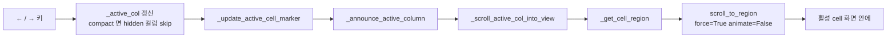
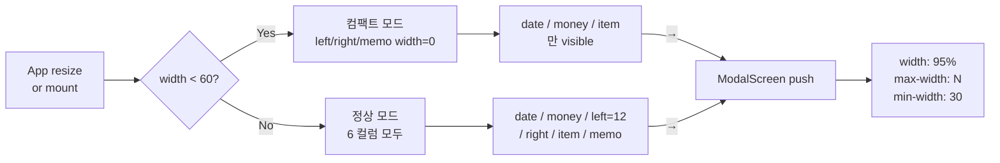

# whooing-tui — 변경 이력

각 항목은 Perforce CL 단위로 끊는다.

> **0.17.x 이전** (CL #51119 ~ #1) 항목은 분량 정리 차원에서
> [`CHANGELOG-archive-0.17.md`](./CHANGELOG-archive-0.17.md) 로 분리 보존.

## CL #53092 — 0.78.0 — 중복 정리: 사람 입력 우선 + 매칭 휴리스틱 강화 (2026-05-19)

배경 (사용자 요청, 2026-05-19): "중복 거래를 정리할 때 남길 거래와 삭제할
거래를 선택할 때 사람이 입력한 것처럼 보이는 것을 우선시하고 자동으로
입력된 것처럼 보이는 것은 삭제 대상으로 추천하도록 보완해주세요. 이외에도
중복 거래에서 삭제할 거래와 남길 거래를 탐지하는 로직을 강화해주세요."

### 신규 — 사람 vs 자동 입력 구분

`core/dupes.py`:

```python
def is_tui_auto_imported(entry: dict) -> bool:
    """memo 가 'TUI:' marker 를 포함 — screens/statement_import.py 의
    자동 부여 (memo=f'TUI: {file_path[-40:]}')."""

def keep_preference_score(entry: dict) -> int:
    """높을수록 keep 권장. 사람 입력 +, 자동 import -."""
```

신호:
| 패턴 | 점수 | 의미 |
|---|---|---|
| memo 가 "TUI:" prefix / substring | **-100** | 자동 import — 강한 삭제 후보 |
| memo 에 한글 자유 텍스트 | +5 ~ +7 | 사람 노트 |
| item / memo 에 괄호 (예: "간식 (스타벅스)") | +3 | 사람 표기 패턴 |
| 짧고 깔끔한 item (≤ 12 자) | +2 | 사람의 분류 결과 |

`_pick_keep_id(entries)` 가 점수 기반 keep_suggestion 선정. 동점 시
기존 정책 (oldest entry_date → entry_id 사전순) fallback.

### 휴리스틱 강화 — `_pair_verdict`

신규 분기 (CL #53092+):

1. **한쪽 자동 + 한쪽 사람 + 금액/날짜/계정 일치** → very_likely
   ("한쪽 자동 import + 한쪽 수기 입력 — 금액·날짜·계정 일치")
2. **한쪽 자동 + 한쪽 사람 + 금액/날짜/가맹점 substring 유사** → very_likely
   카드 명세서 "스타벅스코리아유한회사 강남점" vs 수기 "스타벅스" 케이스.
3. **가맹점 substring 일치 + 금액/날짜/계정 일치** (raw item 달라도) →
   very_likely. `merchant_similar` (NFKC + casefold + 공백/구두점 제거 +
   substring) 재사용.

기존 분기 (identical / swapped accounts / item 정규화 일치 등) 그대로
보존 — 새 분기는 후순위로 보완.

### UI — 출처 표시 추가

`screens/duplicate_scan.py · DuplicateScanScreen` 의 DataTable 에 "출처"
컬럼 추가:

| 출처 | 표시 |
|---|---|
| 자동 import (TUI: marker) | `🤖 자동` (dim) |
| 사람 입력 | `👤 사람` (cyan) |

`keep_suggestion` 이 자동으로 사람 entry 를 keep 으로 잡으므로 사용자
는 별도 조작 없이 *자동 entry 가 ✓ 삭제* / *사람 entry 가 ✗ 보존* 으로
초기 mark. Space 로 override 가능.

### 결과 — 예시 cluster

cluster A (1×자동 + 1×사람):
```
삭제      출처      날짜       금액    왼쪽 오른쪽    적요/메모
✗ 보존    👤 사람   20260418  2,600  식비  하나카드  간식 (지에스 25 S논현역점)
✓ 삭제    🤖 자동   20260418  2,600  식비  하나카드  지에스 25 S논현역점 · TUI: …
```

cluster B (1×자동 + 1×자동, 같은 명세서 중복 import):
```
✗ 보존    🤖 자동   20260417  3,500  식비  하나카드  스벅 · TUI: card1.html
✓ 삭제    🤖 자동   20260417  3,500  식비  하나카드  스벅 · TUI: card2.html
```
이 경우 점수 동률 → entry_date 동률 → entry_id 사전순 (예전 기본 정책
유지).

### 테스트 (+6, total 1118 → 1124)

`core/tests/test_dupes.py`:
- `test_is_tui_auto_imported_detects_memo_prefix` — TUI: / tui: / substring.
- `test_keep_preference_score_human_over_auto` — 사람 > 자동.
- `test_find_clusters_human_entry_preferred_for_keep` — 통합 검증.
- `test_find_clusters_auto_vs_manual_different_item_still_matched` — 자동/사람
  쌍이 item 달라도 cluster.
- `test_pair_verdict_merchant_substring_match` — "스타벅스" vs "스타벅스
  강남점" → very_likely.
- `test_keep_preference_score_no_memo_neutral` — memo 없으면 중립.

## CL #53015 — 0.77.3 — delete_entry 공식 MCP 위임 (REST DELETE 의 section_id 회귀 2회 재발) (2026-05-19)

배경 (사용자 보고 *2회 재발*, 2026-05-19): "또 다시 중복 제거에 실패했습니다."
스크린샷의 에러 — `0건 삭제, 3건 실패 — 첫 실패: 1713072 `section_id`
parameter is required.`

### 회귀 추적

1. **CL #52963** (0.76.0) — 중복 일괄 삭제 도입.
2. **CL #52979** (0.76.3) — 첫 보고. REST DELETE 의 form-body 에 section_id
   동봉. 단위 테스트로 httpx 가 정확히 `Content-Type: application/x-www-
   form-urlencoded` + body `section_id=...` 를 보내는 것 확인.
3. **CL #53015** (현재) — *같은 에러 재발*. 단위 테스트로는 request 가
   정상 발사되지만 실 후잉 server 는 여전히 거절. → **후잉 서버가 DELETE
   body 를 안 읽는 것으로 판단**.

POST/PUT 의 form-body 패턴 (CL #52918, 52928) 은 정상 동작 — 같은 Content-
Type 의 DELETE 만 거절되는 이유는 일부 framework (PHP 의 일부 버전,
Sinatra 등) 가 method 별로 body 파싱 정책이 달라서일 가능성.

### 수정 — 공식 후잉 MCP 위임

`client.py · delete_entry` 가 보고서 / 통계 (CL #52755+) 와 동일한 정책으로
공식 후잉 MCP server (`https://whooing.com/mcp`) 의 `tools/call →
entries-delete` 로 위임:

```python
async def delete_entry(self, *, section_id, entry_id):
    try:
        results = await self.call_official_tool(
            "entries-delete",
            {"section_id": section_id, "entry_id": entry_id},
        )
        return _coerce_dict(results)
    except OfficialMcpError:
        # MCP 실패 (네트워크 일시 장애 / 토큰 만료 등) → REST fallback.
        results = await self._delete(
            self._entry_path(entry_id),
            params={"section_id": section_id},
            form_data={"section_id": section_id},
        )
        return _coerce_dict(results)
```

공식 MCP 가 같은 후잉 데이터에 대한 delete 작업을 안정적으로 수행하므로
section_id 거절 문제를 우회. fallback REST 는 환경 안전망 (MCP server
일시 불통 시 적어도 시도).

### 영향 범위

`WhooingClient.delete_entry` 는 두 호출자가 사용:
- `DuplicateEvalScreen` (m 메뉴 → 선택 평가) — `_delete_via_client`.
- `DuplicateScanScreen` (입력 메뉴 → 일괄 스캔) — `_delete_many` callback.

둘 다 자동으로 fix 혜택. `delete_account` / `delete_monthly` /
`delete_budget` 은 REST 그대로 유지 (사용자 보고 없음 — 같은 회귀
재현되면 같은 패턴 적용).

### 테스트 (-2 + 2 = +0, total 1118 통과 유지)

기존 `test_delete_entry_uses_delete_method_with_section_query` 와
`test_delete_entry_sends_section_id_in_form_body` 는 REST 검증이라 제거.
신규:
- `test_delete_entry_delegates_to_official_mcp` — POST /mcp + `tools/call`
  + `entries-delete` + arguments 검증.
- `test_delete_entry_falls_back_to_rest_when_mcp_fails` — MCP JSON-RPC
  error 시 REST DELETE 시도 (네트워크 일시 장애 시나리오).

## CL #53010 — 0.77.2 — 중복 검사 진행 popup 의 chunk-별 실시간 갱신 (2026-05-19)

배경 (사용자 요청, 2026-05-19): "이 화면에서 구체적으로 지금 무엇을
하고 있는지 계속해서 업데이트해주세요. 무엇을 요청하고 또 무엇을 받고
있는지 업데이트하세요." — 진행 popup 이 "거래 fetch 중…" 만 표시한
채 수십 초 멈춤 → 사용자가 진척을 못 봄.

### 원인

`ScanProgressModal.set_activity` 가 fetch *시작* 과 *완료* 두 번만
호출. 그 사이 `client.list_entries` 는 split_yearly_ranges 로 N 개
구간을 순차 호출하고, 각 구간이 100건 cap 도달 시 bisect 재호출 —
모두 침묵 속에서 진행.

### 수정

#### (1) `client.list_entries` 에 `on_progress` 콜백 추가

`tui/src/whooing_tui/client.py`:

```python
ProgressCallback = Callable[..., None]
# kind: "fetch" | "received" | "bisect" | "yearly" | "done" | "cache_hit"

async def list_entries(self, section_id, start_date, end_date,
                       *, on_progress: ProgressCallback | None = None):
    ...
```

발사 지점:
- **`yearly`** — split_yearly_ranges 의 각 구간 진입 (`range_idx`, `range_total`).
- **`fetch`** — HTTP GET /entries.json 직전.
- **`received`** — HTTP 응답 직후 (`count`=row 수).
- **`bisect`** — 100건 cap 도달 시 분할 재요청 (`mid`, `next_start`).
- **`done`** — 전체 list_entries 종료 (`total`=총 거래 수).
- **`cache_hit`** — CachedWhooingClient 가 sqlite cache 에서 즉시 반환.

`CachedWhooingClient.list_entries` 도 콜백 받아 inner 에 전달 (캐시 hit
시는 자체적으로 `cache_hit` 1회 발사 + fetch skip).

#### (2) Worker 의 dense progress 업데이트

`entries.py · _fetch_and_save_dupe_clusters`:

```python
running_total = [0]
chunk_count = [0]
bisect_count = [0]

def _on_fetch_progress(kind, start, end, **extra):
    if kind == "yearly":
        progress.set_activity(f"📦 연도별 분할 — 구간 {idx}/{total} ...")
    elif kind == "fetch":
        chunk_count[0] += 1
        progress.set_activity(f"📡 후잉 요청 #{n} → /entries.json ...")
    elif kind == "received":
        running_total[0] += n
        progress.set_activity(f"📥 받음 N 건  · 누적 M 건 ...")
    elif kind == "bisect":
        bisect_count[0] += 1
        progress.set_activity(f"🔀 100건 한도 → 분할 재요청 #N ...")
    elif kind == "done":
        progress.set_activity(f"✅ fetch 완료 — 총 N 건 (요청 X · bisect Y)")

await self._client.list_entries(..., on_progress=_on_fetch_progress)
```

### 결과 — 사용자가 보는 popup 흐름 예시

3년치 + bisect 1번 발생 케이스:

```
📊 거래 fetch 시작…
20230520 ~ 20260519
            ↓
📦 연도별 분할 — 구간 1/4
20230520 ~ 20231231
받은 거래 누적 0 건
            ↓
📡 후잉 요청 #1 → /entries.json
20230520 ~ 20231231
받은 거래 누적 0 건
            ↓
📥 받음 87 건
20230520 ~ 20231231
받은 거래 누적 87 건 · 요청 1 회
            ↓
📦 연도별 분할 — 구간 2/4
20240101 ~ 20241231
받은 거래 누적 87 건
            ↓
📡 후잉 요청 #2 → /entries.json
20240101 ~ 20241231
받은 거래 누적 87 건
            ↓
📥 받음 100 건 ⚠️  100건 cap 도달 — 재분할
20240101 ~ 20241231
받은 거래 누적 187 건 · 요청 2 회
            ↓
🔀 100건 한도 → 분할 재요청 #1
20240101 ~ 20240701  +  20240702 ~ 20241231
받은 거래 누적 187 건
            ↓
📡 후잉 요청 #3 → /entries.json
20240101 ~ 20240701
받은 거래 누적 187 건
            ↓
📥 받음 65 건
20240101 ~ 20240701
받은 거래 누적 252 건 · 요청 3 회
            ↓
... (계속)
            ↓
✅ fetch 완료 — 총 1,234 건 수신
(20230520 ~ 20260519 · 요청 8 회 · bisect 2 회)
            ↓
🔍 중복 cluster 검색 중…
거래 1,234 건 분석 (blocking + windowing)
|금액| bucket → ±7일 window → union-find
            ↓
💾 결과 저장 중…
146 개 cluster sqlite 영구화
(테이블: dupe_scan_clusters · status=pending)
```

### 안정화 — overview mount race 방지 (덤)

`DupeScanOverviewScreen._render_summary` / `_render_table` 가 mount 이전
에 호출되는 드문 race 에서 `NoMatches` 발생 — `try/except` 로 safe-skip.
compose 가 마치면 initial state 적용되므로 데이터 손실 없음.

### 테스트 (+4, total 1114 → 1118)

`test_client.py`:
- `test_list_entries_invokes_on_progress_callback` — fetch/received/done
  순서 + count/total 검증.
- `test_list_entries_bisect_emits_bisect_event` — 100건 cap 시 bisect
  이벤트 + mid / next_start 포함.
- `test_list_entries_yearly_split_emits_yearly_events` — 1년 초과 범위
  의 yearly 이벤트 + range_idx / range_total.

`test_duplicate_scan.py`:
- `test_progress_modal_updates_per_chunk_during_fetch` — 통합 flow 가
  fetch 콜백을 거쳐 정상 종료.

## CL #53006 — 0.77.1 — 중복 검사 범위 선택 popup (DupeScanRangeModal) (2026-05-19)

배경 (사용자 요청, 2026-05-19): "중복거래검사 범위를 1개월, 3개월 6개월
1년 등으로 조절해 시작할 수 있도록 팝업에서 설정하게 해주세요."

### 기존 한계 (CL #52989 0.77.0)

`_scan_duplicates_worker` 가 3년 윈도우로 hardcode (`days_ago_yyyymmdd(365 * 3)`).
범위 짧게 검사하고 싶을 때 (예: 최근 1개월만) 코드 수정 필요했음.

### 신규 `DupeScanRangeModal`

`screens/duplicate_scan.py`:

```python
class DupeScanRangeModal(ModalScreen[int | None]):
    OPTIONS = (
        ("1 개월", 30),
        ("3 개월", 90),
        ("6 개월", 180),
        ("1 년", 365),
        ("3 년 (기본)", 365 * 3),
        ("5 년", 365 * 5),
    )
```

레이아웃:
```
        ╭─ 🔍 중복 거래 검사 — 범위 선택 ─╮
        │  어느 기간의 거래를 검사할까요?   │
        │   1 개월                          │
        │   3 개월                          │
        │   6 개월                          │
        │   1 년                            │
        │ ▶ 3 년 (기본)                     │
        │   5 년                            │
        │  ↑/↓ 이동 · Enter: 시작 · Esc: 취소│
        ╰────────────────────────────────────╯
```

- ModalScreen — 본 화면 위에 작은 popup.
- OptionList — ↑/↓ + Enter 로 선택. `OPTIONS` 의 일수가 단조 증가.
- `default_days` 파라미터 — 이전 선택을 highlight. EntriesScreen 의
  `_last_dupe_scan_days` 가 세션 단위로 기억.
- Esc / dismiss(None) → wizard 취소.

### `_scan_duplicates_worker` 변경

```python
# 1) 범위 선택 — Esc 면 wizard 취소.
days = await self.app.push_screen_wait(
    DupeScanRangeModal(default_days=self._last_dupe_scan_days),
)
if days is None:
    self.set_status("중복 검사 취소.")
    return
self._last_dupe_scan_days = int(days)

end_date = today_yyyymmdd()
start_date = days_ago_yyyymmdd(int(days))
# 이하 기존 flow — 단 days 가 사용자 선택값.
```

각 범위는 `dupe_scan_clusters` 의 별도 cache slot 이라 (key = `section_id`
+ `scan_range_start` + `scan_range_end`) 사용자가 1개월 / 3년 등을 번갈아
검사해도 상호 간섭 없음. CL #52989 의 영구화 정책과 자연스럽게 결합.

### 결과 — 사용자 흐름

```
입력 메뉴 → 중복 거래 검사
       ↓
   DupeScanRangeModal   ← 첫 화면 (범위 선택)
       │
       ├ Enter (예: 6 개월)  → ScanProgressModal → overview ...
       └ Esc                 → "중복 검사 취소." status 만, 그대로 복귀
```

### 테스트 (+5, total 1109 → 1114)

- `test_range_modal_appears_first` — 첫 화면 검증.
- `test_range_modal_esc_cancels_scan` — Esc → fetch 안 함.
- `test_range_modal_picks_one_month_uses_30_days` — 1개월 선택 시
  `list_entries` 의 `start_date` = today-30일.
- `test_range_modal_remembers_last_choice` — 두번째 진입 시 이전 일수가
  default.
- `test_range_modal_options_are_sorted` — OPTIONS 단조 증가.

기존 19개 테스트도 `_accept_range_modal(app, days=…)` helper 통해 패치.

## CL #52989 — 0.77.0 — 중복 스캔 결과 영구화 + 2단계 UI (overview → cleanup) (2026-05-19)

배경 (사용자 요청, 2026-05-19):
> 중복 거래 내역을 스캔한 다음 확정 전에 데이터베이스에 별도 테이블로
> 저장해주세요. 이후 중복 거래를 스캔할 때 데이터베이스를 확인해 정리되지
> 않은 항목은 후잉에 직접 요청하지 않고 일단 데이터베이스로부터 확보한
> 중복 항목에 출력해 정리하게 해주세요. 정리되지 않은 중복은 한번 가져오면
> 정리하기 전까지는 같은 날짜범위를 재요청하지 않도록 해주세요. 중복
> 목록에서는 후잉으로부터 정보를 새로고침 할 수 있도록 버튼을 제공해야
> 합니다. 먼저 팝업에서 전체 목록을 보여주고 그 화면에서 정리 버튼을
> 누르면 중복 항목들을 하나씩 묶어 보여주며 정리하게 인터페이스를 수정하세요.

### 기존 한계 (CL #52963 0.76.0)

- 매번 후잉 API 로 3년치 거래 fetch — 큰 ledger 에서 10~30s.
- 정리 못 끝낸 채 닫으면 다음 스캔이 처음부터 다시 fetch.
- 사용자가 *전체 분포* 를 보기 전 cluster 1개씩 보여줘서 큰 그림 안 보임.

### 수정

#### (1) sqlite schema v9 — `dupe_scan_clusters` 테이블

`core/db.py`:
```sql
CREATE TABLE dupe_scan_clusters (
    id               INTEGER PRIMARY KEY AUTOINCREMENT,
    section_id       TEXT NOT NULL,
    scan_range_start TEXT NOT NULL,   -- YYYYMMDD
    scan_range_end   TEXT NOT NULL,
    scanned_at       TEXT NOT NULL,
    verdict          TEXT NOT NULL,   -- identical | very_likely | possible
    reasons_json     TEXT,            -- JSON list[str]
    keep_suggestion  TEXT,
    entries_json     TEXT NOT NULL,   -- JSON list[dict]
    status           TEXT NOT NULL DEFAULT 'pending',  -- pending|resolved|skipped
    resolved_at      TEXT
);
CREATE INDEX idx_dupe_scan_range
ON dupe_scan_clusters(section_id, scan_range_start, scan_range_end, status);
```

한 row = 한 cluster. entries 는 JSON list (확장 필드 보존 — 후잉 schema 변경 무관).

#### (2) DupeScanRepository (`tui/src/whooing_tui/dupe_scan_repo.py`)

- `save_scan(section_id, range_start, range_end, clusters)` → 영구화.
- `load_open_clusters(...)` — pending 만.
- `load_all_clusters(...)` — resolved/skipped 포함 (overview 가 사용).
- `update_status(cluster_id, status)` — Enter 후 deletion 성공 시 resolved.
- `clear_scan(...)` — refresh 진입점 (모든 row 삭제).
- `has_open_scan(...)` — worker 가 cache hit 결정.

#### (3) 신규 `DupeScanOverviewScreen` (Stage 1)

`screens/dupe_scan_overview.py`:
```
╭─ 중복 거래 검사 — 결과 목록 ─────────────────────────╮
│  범위: 20230520 ~ 20260519 · 💾 sqlite 캐시           │
│  전체 146 · 정리됨 26 · 남음 120                       │
│  ┌────┬──────┬──────────┬─────┬────┬────┬────────┐  │
│  │ #  │ 상태 │ 강도      │ 날짜 │ 금액│ 건수│ 적요    │  │
│  │  1 │ ⏳남음│ identical │ 20…  │ 5K  │  2 │ …      │  │
│  │  2 │ ✓정리│ very_likely│ 20…  │ 12K │  3 │ …      │  │
│  └────┴──────┴──────────┴─────┴────┴────┴────────┘  │
│  Enter: 이 항목부터 정리 · R: 처음부터 · F5: 새로고침 │
│  [정리 시작 (R)] [새로고침 (F5)] [닫기 (Esc)]         │
╰──────────────────────────────────────────────────────╯
```

- 모든 cluster 한 화면에서 분포 확인.
- ↑↓ + Enter: 그 cluster 부터 정리 시작.
- **R**: 첫 pending 부터 정리.
- **F5**: refresh_callback 호출 → worker 가 sqlite clear → 후잉 재요청 → 새 list.
- Esc / 닫기: dismiss (정리된 게 있으면 entries 재로드).

#### (4) `_scan_duplicates_worker` 재설계 (entries.py)

```python
async def _scan_duplicates_worker():
    repo = DupeScanRepository()
    cached = repo.load_all_clusters(section, range_start, range_end)
    if any pending in cached:
        # 캐시 hit — fetch skip, 바로 overview push.
        push DupeScanOverviewScreen(cached, cached=True)
    else:
        # cache miss — fetch + cluster + save → overview push.
        stored = await _fetch_and_save_dupe_clusters(...)
        push DupeScanOverviewScreen(stored, cached=False)
```

`_fetch_and_save_dupe_clusters` 는 helper — refresh_callback 에서도 재사용.

#### (5) `DuplicateScanScreen` 변경

- `start_idx`, `repo` 파라미터 추가 — overview 가 특정 cluster 부터 진입 가능.
- Enter (deletion 성공) → `repo.update_status(cluster.id, "resolved")` 자동.
- `_next_unresolved_idx` — resolved 마킹된 cluster 는 다음 자동 이동에서 skip.
- 종전 `list[DupeCluster]` 인터페이스도 그대로 받음 (테스트 친화 + repo 없는 직접 호출 케이스).

### 결과 — 사용자 흐름

```
입력 메뉴 → 중복 거래 검사
         ↓
   ScanProgressModal (캐시 hit 면 잠깐만)
         ↓
   DupeScanOverviewScreen  ← 첫 화면 (전체 분포)
    │
    ├─ Enter / R → DuplicateScanScreen (cluster 1개씩 정리)
    │              ↑ resolved 마킹 → repo 영구화 → overview 복귀
    │
    ├─ F5 → sqlite clear + 후잉 재요청 → overview refresh
    │
    └─ Esc → entries 재로드 (정리된 것 있으면)
```

### 캐시 정책 요약

- 같은 (section, range) 의 pending 이 있으면 → 후잉 안 부름.
- 모두 resolved 되면 → 다음 스캔은 fetch 다시 (새 중복 가능성).
- F5 명시 → 사용자가 강제로 fetch 재요청.

### 테스트 (+14, total 1093 → 1107)

`test_dupe_scan_repo.py` (+11): save/load round-trip, range 격리, status
업데이트 (resolved/skipped), clear_scan, has_open_scan, 잘못된 status,
entries dict shape 보존.

`test_duplicate_scan.py` (+3 신규, 기존 16 갱신):
- `test_scan_caches_clusters_in_sqlite_for_reuse` — 두번째 스캔 fetch X.
- `test_scan_refresh_clears_cache_and_refetches` — F5 → fetch 늘어남.
- `test_cluster_resolution_persists_to_repo` — Enter → repo status 변경.

총 1109 통과.

## CL #52979 — 0.76.3 — DELETE 도 form-body 필수 + 저장소 trade-off 문서 (2026-05-19)

### 1. delete_* 가 "`section_id` parameter is required." 로 실패 (사용자 보고)

중복 일괄 삭제 화면에서 Enter 누르면 "0건 삭제, 3건 실패 — 첫 실패:
{eid} `section_id` parameter is required." 로 모두 거절. CL #52928
(0.73.2) 이 POST/PUT 에 form-encoded body 를 추가한 것과 같은 정책을
DELETE 에도 적용 누락이었음.

#### 원인

`delete_entry` / `delete_account` / `delete_monthly` / `delete_budget`
이 section_id 를 query param 으로만 send. 후잉 server 는 DELETE 의
form-urlencoded body 에서도 section_id 를 *요구* 한다 — query 만으로는
파싱 안 함.

#### 수정 (`client.py`)

`_delete` 시그니처 확장:
```python
async def _delete(
    self, path, params=None, *, form_data=None,
) -> Any:
    return await self._request(
        "DELETE", path, params=params, form_data=form_data,
    )
```

모든 `delete_*` 가 `form_data={...}` 동봉 (query 도 belt-and-suspenders
로 유지):

```python
async def delete_entry(self, *, section_id, entry_id):
    return await self._delete(
        self._entry_path(entry_id),
        params={"section_id": section_id},
        form_data={"section_id": section_id},  # ← 신규
    )
```

#### 테스트 +1

`test_delete_entry_sends_section_id_in_form_body` — `respx` 로
Content-Type 이 `application/x-www-form-urlencoded` 이고 body 에
`section_id=s7` 포함됨 검증.

총 테스트 1093 → 1094 통과.

### 2. 저장소 시나리오 문서 — sqlite vs plaintext

`docs/scenarios/10-storage-sqlite-vs-plaintext.md` 신규.

사용자 검토 요청: 현재 sqlite (annotations / hashtags / attachments /
import_log / entries_cache) 를 markdown 또는 JSON plaintext 로 옮기면
어떤 장단점?

문서 내용:
- §1 sqlite 가 *무엇을* 보관하는지 (5 테이블 + 첨부 본체).
- §2 후보 포맷 비교 (JSON line, single JSON, TOML, markdown per-entry, CSV).
- §3 기능별 비교표 — latency, transaction, indexing, migration, diff
  가독성, 손상 복구, 외부 도구 통합.
- §4 plaintext 장점 — 가독성, diff, 손상 격리, LLM/grep, P4 submit 단위.
- §5 plaintext 단점 — race, index 부재 → 검색 성능, migration cost,
  1:N 관계 부자연스러움, 파일 수 폭증.
- §6 하이브리드 안 — annotations/hashtags 만 md 분리.
- §7 **권고: 현재 sqlite 유지** + 재검토 trigger 정리.
- §8 결정 + 재검토 시점.

`docs/README.md` 의 시나리오 index 에 10번 항목 추가.

## CL #52977 — 0.76.2 — 중복 검사 진행 popup (ScanProgressModal) (2026-05-19)

배경 (사용자 요청, 2026-05-19): "중복 검사중일 때 화면을 작은 팝업으로
덮고 중복 검사중이라고 안내해주세요. 그리고 지금 하고 있는 작업을 표시
해주세요."

### 기존 한계

CL #52968 의 진입 피드백은 화면 하단 status 한 줄. 사용자는 본 화면
(거래내역 DataTable) 을 그대로 보면서 status 변화를 *발견* 해야 했음 —
특히 3년 ledger fetch 가 수십 초 걸리는 동안 "화면이 멈춘 것 같다" 라는
인상을 줄 수 있음.

### 수정 — 신규 `ScanProgressModal`

`screens/duplicate_scan.py`:

```python
class ScanProgressModal(ModalScreen[None]):
    """BINDINGS 없음 — 작업 완료 전 닫히지 않음.
    set_activity(text) 로 현재 단계 갱신.
    """
```

레이아웃:
```
        ╭─ 🔍 중복 거래 검사 중 ─────╮
        │                              │
        │    📊 거래 fetch 중…         │
        │    20230520 ~ 20260519 (3년치) │
        │                              │
        │    잠시만 기다려주세요…       │
        │                              │
        ╰──────────────────────────────╯
```

- ModalScreen — 본 화면 위에 작은 popup 으로 떠 본 화면을 가린다.
- `set_activity(text)` — buffer + (mounted 면) Static 갱신. mount 이전
  호출도 안전 (initial 처럼 compose 가 사용).
- **BINDINGS 비어있음** — Esc 도 무효. 작업이 끝나야 worker 가 자동
  dismiss. 사용자가 멋대로 닫고 worker 만 계속 도는 상황 방지.

### `_scan_duplicates_worker` 단계별 progress.set_activity

| 단계 | activity 텍스트 |
|---|---|
| 진입 | `📊 3년치 거래 fetch 시작…` |
| fetch | `📊 거래 fetch 중…\n{start} ~ {end} (3년치)` |
| 분석 | `🔍 중복 cluster 검색 중…\n(거래 N 건 분석 — blocking + windowing)` |

worker 는 try/finally 로 modal dismiss 보장 — 어떤 경로 (정상/예외/
early return) 든 modal 이 화면에 남지 않음. DuplicateScanScreen 도 같은
modal stack 이라 progress 가 위에 남으면 결과 화면을 가릴 수 있어 중요.

### 결과

| 상황 | 사용자가 보는 것 |
|---|---|
| 클릭 직후 | ScanProgressModal 등장 — "📊 3년치 거래 fetch 시작…" |
| fetch 중 (긴 await) | popup 갱신 — "📊 거래 fetch 중… 날짜범위" |
| 분석 중 | popup 갱신 — "🔍 중복 cluster 검색 중… N 건" |
| 중복 있음 | popup 닫힘 → DuplicateScanScreen 등장 |
| 중복 없음 | popup 닫힘 → 본 화면 + status "✅ 검사 완료 — 중복 후보 없음" |
| 에러 | popup 닫힘 → 본 화면 + status "거래 조회 실패…" |

### 테스트 (+3, total 1090 → 1093)

- `test_scan_shows_progress_modal_during_fetch` — 어느 시점에 modal 또는
  결과 화면이 떠야, 최종 DuplicateScanScreen 으로 자동 교체.
- `test_scan_progress_modal_set_activity_buffer_before_mount` — mount
  이전 set_activity 안전성.
- `test_scan_progress_modal_dismissed_when_no_clusters` — 중복 0건 시
  progress 도 결과도 안 떠 있어야 (본 화면 복귀).

## CL #52968 — 0.76.1 — 중복 거래 검사 진입 피드백 + 실키 dispatch 테스트 (2026-05-19)

배경 (사용자 보고, CL #52963 직후): "중복 거래 검사를 눌러도 아무 일도 안
일어납니다."

### 원인 가설

세 가지 가능성 — 셋 다 사용자가 *피드백 없음* 으로 같이 보임:

1. **dispatch 실패** — `_dispatch_menu_action("scan_duplicates")` 가
   `action_scan_duplicates` 를 찾지 못함. → 테스트 추가로 검증.
2. **worker 즉시 사망** — 첫 await (list_entries) 까지 도달 못함.
3. **status 늦은 paint** — `set_status` 한 직후 긴 await 가 들어가
   사용자에게는 진입이 "조용한 정지" 로 보임.

### 검증 — 실키 dispatch 테스트 추가

`test_duplicate_scan.py · test_menu_popup_enter_press_dispatches_
scan_duplicates`:

- `app.run_test()` 안에서 `F10 → →(입력 메뉴) → OptionList.highlighted =
  scan_duplicates → Enter` 순으로 **실제 키 이벤트** 발사.
- 기존 테스트는 `popup.dismiss(action_id)` 를 직접 호출 (dispatch 의
  upstream 만 검증) — 본 테스트는 `OptionList.OptionSelected` → popup
  dismiss → menu loop `_dispatch_menu_action` → action 메서드 → worker
  → DuplicateScanScreen push 전 경로 검증.
- 통과 — dispatch 자체는 정상.

### 수정 — 진입 즉시 sync status + log + frame yield

`entries.py · action_scan_duplicates`:

```python
def action_scan_duplicates(self) -> None:
    log.info("action_scan_duplicates invoked")
    self.set_status("⏳ 중복 거래 검사 시작 — 거래 fetch 중…")
    self._scan_duplicates_worker()
```

- **동기 set_status** — worker schedule 전에 status 갱신. 사용자가 메뉴
  닫힌 직후 즉시 피드백.
- **log.info** — worker 호출이 dispatch 됐는지 로그로 확인 가능
  (`~/.cache/whooing-tui/` 로그 파일).
- worker 본체 첫 await 직전에도 `await asyncio.sleep(0)` — status 가
  list_entries 의 긴 HTTP await 에 묻히지 않고 paint 됨.

### 결과

- 사용자가 menu 항목 클릭한 직후 status 영역에 "⏳ 중복 거래 검사 시작"
  반드시 보임 (이게 안 보이면 dispatch 자체가 실패).
- worker 가 실제로 시작했는지 log 로 확인 가능.
- 3년 ledger fetch 가 수십 초 걸려도 사용자가 침묵으로 오인하지 않음.

### 테스트 (+1, total 1088 → 1090, 통과)

- `test_menu_popup_enter_press_dispatches_scan_duplicates` — 키 이벤트
  실제 발사 path 검증.

## CL #52963 — 0.76.0 — 입력 메뉴: 지난 3년 거래 일괄 중복 스캔 (2026-05-19)

배경 (사용자 보고): "거래내력에 중복으로 보이는 항목들이 많이 생겼습니다.
입력 풀다운메뉴 하위에 중복 거래 검사 메뉴를 넣고 지난 3년 동안의 거래를
검사해 중복인 항목들을 하나씩 보여주고 삭제할 것과 남길 것을 선택해 엔터를
누르면 중복이 처리되도록 해 주세요. 전체 중복 개수가 몇 개이며 지금이 몇
번째 중복인지도 보여주세요."

### 기존 한계

CL #52815+ 의 `DuplicateEvalScreen` 은 사용자가 **수동으로 선택한 2건+**
의 평가용. 수천 건 ledger 에서 "어디에 중복이 있는지 모르는" 케이스는
불가능 — 사용자가 일일이 비교하며 골라야 했음.

### 알고리즘 — `whooing_core.dupes.find_duplicate_clusters` 신규

표준 record-linkage 패턴 (blocking + windowing + pairwise + union-find):

1. **블로킹** — `|money|` 절대값으로 bucket. money 가 None / 0 이면 신호
   너무 약해 skip (가짜 cluster 폭증 방지). 절대값 매칭은 좌우 반전 +
   부호 반대 (환불) 같은 변형도 한 bucket 에 모음.
2. **윈도잉** — bucket 안에서 entry_date 정렬, two-pointer 로 ±N 일
   (기본 7) 안 쌍만 추출. 1년 같은 가맹점 같은 금액 거래에서 폭증 회피.
3. **평가** — 기존 `_pair_verdict` 재사용 (identical / very_likely /
   possible / different). `min_verdict` 이상만 cluster 후보.
4. **클러스터링** — union-find 로 transitive 연결. A↔B + B↔C 면 A↔C 가
   직접 매치 안 돼도 한 cluster.
5. **정렬** — verdict 강한 순 → cluster 크기 큰 순 → 첫 날짜 오래된 순.

복잡도 — bucket 안 평균 윈도우 거래 k 개 (k « N) 면 O(N·k) 수렴. 3년치
실제 5000건 ledger 도 1~2초.

### 신규 화면 `DuplicateScanScreen`

`tui/src/whooing_tui/screens/duplicate_scan.py` — 한 cluster 씩 순회.

```
╭─ 중복 거래 검사 ───────────────────────╮
│   1 / 12  ·  중복 매우 유력             │
│   근거: 좌/우 계정이 반대 — 입출금 혼동  │
│  ┌──────────┬──────┬─────┬────┬────┐  │
│  │ 삭제      │ 날짜  │ 금액 │ 왼쪽│ 오른│  │
│  │ ✓ 삭제    │20260… │ 5,000│식비│현금 │  │
│  │ ✗ 보존    │20260… │ 5,000│현금│식비 │  │
│  └──────────┴──────┴─────┴────┴────┘  │
│  Space: ✓/✗ toggle · Enter: 확정 → 다음 │
│  n/→: skip · p/←: 이전 · Esc: 닫기      │
╰────────────────────────────────────────╯
```

- 헤더: **"N / T  ·  verdict"** (현재 / 전체 + 강도).
- DataTable 의 ✓ 컬럼 — 삭제 대상 표시. 기본값: `keep_suggestion` 만
  ✗ (보존), 나머지 ✓ (삭제 대상). `DuplicateEvalScreen` (★ = keep
  반대) 과 의도적으로 반대 — 본 화면은 cluster 안 *여러 건* 삭제 흔하므로
  "삭제 마크" 가 사용자 의도와 더 맞음.
- Space — 현재 row 의 mark toggle.
- Enter — 현재 cluster 의 ✓ 거래 모두 삭제 + 다음 cluster 로 자동 이동.
  마지막 cluster 면 자동 dismiss.
- n / → — 삭제 없이 다음 cluster.
- p / ← — 이전 cluster (이미 처리한 cluster 도 readonly 로 재방문 가능).
- Esc — 닫기 (이미 삭제한 cluster 는 유지, dirty=True 면 호출자가
  entries 재로드).

### 입력 메뉴 추가

`screens/entries.py · _build_menus`:
```python
MenuSpec("입력", (
    MenuItem("새 거래 (n)", "new_entry"),
    MenuItem("카드 명세서 import…", "import_card_statement"),
    MenuItem("PDF 영수증/인보이스 첨부…", "attach_receipt"),
    MenuItem("매월입력 거래 관리…", "open_monthly"),
    MenuItem("중복 거래 검사… (지난 3년)", "scan_duplicates"),  # ← 신규
))
```

`action_scan_duplicates` → `_scan_duplicates_worker`:
- `list_entries(start=today−1095일, end=today)` — `split_yearly_ranges`
  내장 분할 호출, 100-cap bisection 처리.
- `find_duplicate_clusters(entries, date_window_days=7)`.
- cluster 없으면 status 안내만, 화면 안 띄움 (사용자 흐름 끊김 최소화).
- 있으면 `DuplicateScanScreen` push, 결과 True (한 건이라도 삭제) 면
  entries 재로드.

### 테스트 (+14 dupes core + 10 화면 통합 = 24)

`core/tests/test_dupes.py`:
- 빈 입력 / 중복 없음 / identical pair / swap 좌우 / 윈도우 경계
- 3-way component (a↔b↔c) / transitive 연결
- min_verdict 필터 / 0원 skip / dedup-by-id
- keep_suggestion = 사전순 / verdict 정렬 검증

`tui/tests/test_duplicate_scan.py`:
- 입력 메뉴 wiring / 2개 cluster 화면 push
- 중복 0건 → status 만 (화면 X)
- Enter → 삭제 + advance / Space toggle / skip / prev
- Esc → False / 모든 ✓ 해제 후 Enter → 안내만
- 진행률 N/T 표시 검증

총 테스트 1064 → 1088 통과.

## CL #52956 — 0.75.2 — 명세서 추출 진행 status + Esc 로 파일 picker 복귀 (2026-05-19)

배경 (사용자 보고): "카드 import 화면에서 로딩에 시간이 걸릴 때 무엇을 하고
있는지 표시해주세요. 카드 import 화면에서 ESC를 누르면 파일 선택 화면으로
돌아가주세요."

### 원인 1 — 추출 단계 침묵

CL #52946 의 진행 피드백은 **저장 단계** (`action_confirm`) 에 한정. 화면
진입 직후 `_kick_off_extract` (형식 감지 → 비밀번호 → Playwright 복호화 →
파싱 → ledger 조회 → 중복 검사) 가 3 ~ 15 초 걸려도 status 는 빈 채. 사용자
입장에서 "화면이 멈췄나" 라고 느낌.

### 원인 2 — Esc = 전체 취소

`StatementImportScreen` 의 Esc binding 이 `self.dismiss(None)` 만 호출 →
EntriesScreen 으로 즉시 복귀. 파일 경로 오타 / 잘못된 명세서 같은 흔한
실수에서 wizard 3 단계 (파일 → 카드 → import) 를 통째 다시 돌아야 함.
2 단계 (카드 계정) 는 같은 카드 다른 명세서를 연속 import 할 때도 매번
재선택해야 했음.

### 수정 1 — `_kick_off_extract` progress status

`screens/statement_import.py` — 각 단계 시작 전 status 갱신 + `await
asyncio.sleep(0)` 으로 한 frame 양보:

```
🔍 명세서 형식 감지 중…
🔍 감지 완료: kind=html issuer=hanacard
🔑 보안메일 비밀번호 입력 대기…
🔓 보안메일 복호화 + 파싱 중… (Playwright 헤드리스 브라우저 · issuer=hanacard)
📄 추출 완료: 69 건. 후잉 ledger 조회 준비…
📊 후잉 ledger 조회 중… (2026-04-19 ~ 2026-05-26)
🔍 중복 검사 중… ledger 142 건 / import_log 조회
```

### 수정 2 — Esc → "back" sentinel, wizard 가 loop

`screens/statement_import.py`:

- `class StatementImportScreen(ModalScreen[str | None])` — generic 변경.
- `action_back` → `self.dismiss("back")` (was `None`).
- `_on_result_close` → `self.dismiss("done")` (성공/실패 modal OK).
- Docstring 에 dismiss 값 의미 명시 (`"done"` / `"back"` / `None`).

`screens/entries.py · _import_card_statement_wizard`:

```python
picked: tuple | None = None
while True:
    path = await self.app.push_screen_wait(_FilePathModal(...))
    if not path:
        return  # 1단계 취소 = wizard 종료
    if picked is None:
        picked = await self.app.push_screen_wait(AccountPickerScreen(...))
        if not picked:
            return
    result = await self.app.push_screen_wait(StatementImportScreen(...))
    if result == "done":
        return
    # "back" / None → loop: 파일 picker 재진입, 카드 계정 재사용
```

AccountPicker 결과는 `picked` 에 cache → 같은 카드 다른 명세서를 연속
import 할 때 카드 선택 단계 skip. 파일 picker 만 다시 띄움.

`AccountPickerScreen` purpose 문구 갱신: `"Esc 로 1단계 (파일 선택) 으로"`
(was `"Esc 로 취소"`).

### 결과

| 단계 | Esc | Cancel 버튼 | OK / 결과 modal |
|---|---|---|---|
| 1. 파일 경로 | wizard 종료 | wizard 종료 | 2 단계로 |
| 2. 카드 계정 | wizard 종료 | wizard 종료 | 3 단계로 |
| 3. StatementImport | 1 단계로 복귀 | (없음) | wizard 종료 |

### 테스트

기존 1064 건 전부 통과. `StatementImportScreen[str \| None]` 타입 변경은
test 에서 dismiss 값을 검사하지 않으므로 호환.

## CL #52946 — 0.75.1 — 명세서 import 진행 피드백 + 성공 modal (2026-05-19)

배경 (사용자 보고): "이 단계에서 Ctrl+S 를 눌러도 아무 피드백이 없습니다.
키가 눌렸는지, 저장 했는지, 저장에 실패했는지 등을 피드백 하고 저장했다면
저장했다는 팝업 메시지를 보여주고 확인을 눌러 거래내역으로 돌아오게
해주세요."

### 원인

`action_confirm` 이 background worker 라 결과는 status text 한 줄로만 표시,
사용자가 못 알아챔. 성공 시엔 popup 도 없어 "아무 일도 안 일어났다" 처럼
보임.

### 수정

`screens/statement_import.py`:

**1. Ctrl+S 즉시 피드백** — worker 진입 직후:
```
⏳ 저장 시작 — 선택 69 건 처리 중…
```
`await asyncio.sleep(0)` 로 한 frame 양보 → status 가 잠깐이라도 보임.

**2. 진행률 status** — 매 5 row + 첫/마지막 row 마다 갱신:
```
⏳ 저장 중… 25/69 · 성공 24 실패 1 · 20260420 카카오T일반택시_0
```

**3. accounts-list 실패 → 즉시 modal** — list_accounts 실패 시 종전엔
loop 진입 못해 무한 침묵. 이제 결과 modal 로 노출.

**4. `_ImportSuccessModal` 신규** — 전체 성공 시:
- 녹색 border + "✓ 입력 완료" 제목 + "N 건의 거래가 후잉에 입력 됐습니다".
- 명세서 path + 카드 id 안내.
- "확인 (Enter/Esc)" 버튼 + Esc / Enter 키로 닫기.

**5. 자동 dismiss** — 결과 modal (성공이든 실패든) 닫히면 본 import 화면도
자동 dismiss → EntriesScreen 으로 복귀. 사용자가 한 번의 OK 로 모든 단계
종료.

### 결과 modal 분기

| 케이스 | 모달 | 닫기 후 |
|---|---|---|
| 전체 성공 | `_ImportSuccessModal` (녹색) | EntriesScreen 복귀 |
| 부분 / 전체 실패 | `_ErrorReportModal` (빨간) | EntriesScreen 복귀 |
| accounts-list 실패 (loop 미진입) | `_ErrorReportModal` (단일 에러 row) | EntriesScreen 복귀 |

### 테스트 (+3)

- `test_import_success_modal_class_exists` — `ModalScreen` 상속 검증.
- `test_import_success_modal_stores_inserted_count` — 생성자 인자 보관.
- `test_import_success_modal_has_close_bindings` — Esc / Enter close 매핑.

총 1061 → 1064 (+3, 0 regression).

### Backward compat

- `action_confirm` 시그니처 동일.
- `_ErrorReportModal` 그대로 유지 — 실패 case 흐름 동일.
- StatementImportScreen 의 dismiss(None) 은 종전 Esc 동작과 동일.

## CL #52940 — 0.75.0 — 하나카드 명세서 파서 재작성 (테이블 구조 기반) (2026-05-19)

배경 (사용자 보고): 하나카드 HTML 명세서 (`hanacard_20260527.html`) import
시 결과가 다수 잘못됨:
- "USA" / "일시불" / "할인구분" 이 가맹점으로 잡힘.
- `4,029,357,733` 같은 absurd 금액 (실은 PAYPAL 카드번호 ID).
- 같은 거래가 중복 추출.

### 원인

종전 parser 는 `splitlines()` 으로 평문화한 뒤 `MM/DD` 패턴 오프셋으로
row 를 추출 — HTML 의 *table 컨텍스트* 를 모름. 결과적으로:
1. 외화 거래표 (`이용일자 / 국가 / 도시 / 가맹점`) 에서 col=1 의 국가
   ("USA") 가 cell[+1] 로 잡혀 가맹점으로.
2. PAYPAL 가맹점의 외화 ID (`4029357733`) 가 col=2 라 가맹점 cell+2 로
   가는 amount 자리에 들어가 13자리 숫자로 파싱.
3. "일시불/할부" 명세서 헤더 / "할부 상세" 등 비-거래 row 에서 MM/DD 가
   다시 등장 → "일시불" 이 cell+1 (가맹점) 으로.

### 재작성: 테이블 구조 기반 (`extract_rows_from_decrypted`)

`splitlines()` 폐기, `BeautifulSoup` 의 `find_all("table")` 로 leaf 테이블
(중첩 outer 제외) 만 iter:

1. `_classify_table(table)` 가 첫 3 row 의 헤더 텍스트로 분류:
   - `"cancellation"` — "취소일자" 포함.
   - `"foreign"` — "환율" + "이용원금" 포함 → **건너뜀** (메인 표가 KRW
     환산 row 이미 포함, 이중 추출 방지).
   - `"main"` — "이용가맹점" + ("이번 달 결제" / "이용금액") 포함.
   - 그 외 — `"other"` (skip).
2. `_parse_main_table`: cells[0]=date, cells[1]=merchant,
   cells[2]=이용금액, cells[7]=이용혜택, cells[8]=혜택금액. "할인"
   row 는 혜택금액 (음수) 을 effective amount 로.
3. `_parse_cancellation_table`: cells[0]=이용일자, cells[2]=가맹점,
   cells[4]=음수 금액.
4. 비-MM/DD 첫 cell row 는 모두 skip — 섹션 헤더 / 소계 / 합계 / "이용
   가맹점 상세정보" 같은 row 자연스럽게 무시.

### 연도 추정

`_detect_year(soup)`: "YYYY년 MM월 DD일" 패턴에서 연도. row 의 MM 이
명세서 월 + 1 보다 큰 경우 작년으로 추정 (예: 5월 명세서에 "11/30" 거래 →
작년 11월).

### 검증 결과 (실제 사용자 sample)

```
종전: 136건 추출 (다수 오류: USA 가맹점 / 4,029,357,733 / 일시불)
신규: 69건 추출 (VISA 39건 + MASTER 29건 + 매출취소 1건 = 69 ✓
      = 카드소계 39 + 29 + 1)
나쁜 가맹점 ("USA"/"일시불"/"할인구분"): 0건
absurd 금액 (> 100M): 0건
```

### 테스트 (+15 신규)

`core/tests/test_hanacard_secure_mail.py` — 합성 HTML 으로 각 시나리오 검증:
- 단순 거래 / 할인 (음수) / 부분 취소 / 매출취소 표
- 해외 표 건너뜀 / 메인+해외 중복 방지
- 다중 카드 섹션 / 비-거래 row skip
- 연도 추정 (명세서 동일 / 작년 roll-back)
- 빈 HTML / 거래 외 table / dedup

실제 사용자 명세서 fixture 는 P4/GitHub 에 올리지 않는다 (개인 결제정보).

총 1046 → 1061 (+15, 0 regression).

### Backward compat

- `extract_rows_from_decrypted(html: str) -> list[CSVRow]` — public API
  (종전 `_extract_rows_from_decrypted` 은 alias 로 남김).
- `parse_html` / `parse_html_async` 시그니처 동일 — caller (`screens/
  statement_import.py`) 영향 없음.
- 추출 결과의 CSVRow 형식 동일 (date YYYYMMDD, amount int, merchant str).

## CL #52935 — 0.74.1 — 명세서 import 확정 키를 Ctrl+S 로 (2026-05-19)

배경 (사용자 보고): "이 화면에서 Ctrl+Enter 를 눌러도 아무 일도 일어나지
않습니다." 화면 hint 와 status 메시지는 "Ctrl+Enter 입력" 으로 안내하지만
실제로 동작 안 함.

### 원인

대부분 터미널 (macOS Terminal / iTerm2 default / Linux xterm 등) 이
`Ctrl+Enter` 를 distinct escape sequence 로 전송 안 함 — 그냥 Enter 와
같은 코드 또는 무시. Textual 의 `Binding("ctrl+enter", ...)` 는 binding
은 등록되지만 키 이벤트가 도달 못 함.

### 수정

`StatementImportScreen.BINDINGS`:
- **`Ctrl+S`** 주력 (Save 컨벤션 + 모든 터미널 지원) — Footer 에 노출.
- `Ctrl+Enter` / `F5` 는 alias 로 `show=False` — 지원 환경에서 사용 가능.
- 세 키 모두 `priority=True` — DataTable 의 default Enter 핸들러 (cell
  select 등) 보다 우선.

화면 hint + status 메시지 갱신:
- "Space 선택 토글 · Ctrl+A 전체 · ... · **Ctrl+S 입력** · Esc 닫기"
- "(Space 선택 토글 · **Ctrl+S 입력**)"

### 회귀 테스트 (+2)

- `test_statement_import_confirm_bindings_include_ctrl_s` — 세 키
  (ctrl+s / ctrl+enter / f5) 모두 confirm 액션에 매핑.
- `test_statement_import_confirm_bindings_priority_true` — 모두
  priority=True (DataTable 가 가로채지 못함).

총 1044 → 1046 (+2, 0 regression).

### Backward compat

`Ctrl+Enter` binding 그대로 유지 — iTerm2 같이 명시 설정한 환경에서는
계속 작동. 새 `Ctrl+S` 가 추가됐을 뿐.

## CL #52929 — 0.74.0 — picker UX: 부채 자동 펼침 / 마지막 디렉토리 / click=highlight (2026-05-19)

배경 (사용자 요청 3 항목):
1. 카드 명세서 import 의 계정 picker — 카드는 보통 "부채" 계정이므로 그
   카테고리를 default 로 펼침.
2. 파일 picker — 마지막에 열었던 디렉토리에서 시작.
3. picker (파일 / 계정) 에서 mouse click 은 *highlight 만*, 실제 선택은
   버튼 클릭 또는 Enter 키.

### 1. AccountPicker `default_expanded_type`

`AccountPickerScreen.__init__` 에 새 kwarg `default_expanded_type: str |
None`. `current_id` 매칭이 없는 신규 picker 진입 시 이 카테고리를 펼침
+ cursor 도 그 카테고리 노드로.

`EntriesScreen._import_card_statement_wizard` 의 2단계 호출:
```python
AccountPickerScreen(
    session, side="right",
    purpose="...",
    default_expanded_type="liabilities",  # 카드 = 부채.
)
```

### 2. FilePicker 마지막 디렉토리 영구화

`whooing_tui.state` 에 두 새 함수:
- `load_last_file_picker_dir() -> str | None`
- `save_last_file_picker_dir(dir_path: str) -> None`

`state.json` 의 `last_file_picker_dir` 키로 저장. `~/.config/whooing-tui/
state.json` 의 다른 키 (last_section_id) 와 공존.

`FilePickerScreen.__init__`:
- caller 가 `start_dir` 명시 안 하면 `load_last_file_picker_dir()` 우선,
  없으면 home.
- 저장된 path 가 사라졌으면 home fallback.

`_activate` 가 파일 선택 dismiss 직전에 `save_last_file_picker_dir(
str(self.current))` 호출 → 다음 picker 가 같은 디렉토리에서 시작.

### 3. Mouse click = highlight only

두 신규 위젯 서브클래스:

**`_HighlightOnClickOptionList`** (`screens/file_picker.py`):
- `_on_click` override — 단일 클릭은 `highlighted` 만 갱신, `action_
  select()` 호출 X. 더블 클릭 (`event.chain >= 2`) 만 명시 선택.

**`_HighlightOnClickTree`** (`screens/account_picker.py`):
- `_on_click` override — 토글 영역 (`meta.get("toggle")`) 은 그대로 펼침/
  접힘 (mouse 친화). 노드 body 단일 클릭은 cursor 만 이동, 더블 클릭은
  `run_action("select_cursor")` (Enter 동등).

각 picker 의 hint 텍스트도 업데이트:
- "Enter / 더블클릭=선택 · 클릭=하이라이트만 · ..."

### 테스트 (+ 6)

- `test_picker_uses_last_file_picker_dir_when_no_start_dir`
- `test_picker_falls_back_to_home_when_saved_dir_missing`
- `test_picker_explicit_start_dir_overrides_saved`
- `test_option_list_subclass_overrides_click`
- `test_picker_expands_default_type_when_no_current`
- `test_tree_subclass_overrides_click`

총 1038 → 1044 (+6, 0 regression).

### Backward compat

- `AccountPickerScreen` 의 `default_expanded_type` 는 optional kwarg —
  EntryEditDialog 의 기존 호출은 변경 없음.
- `FilePickerScreen` 의 `start_dir` 명시 caller 도 영향 없음. 명시 안
  하던 caller 만 디렉토리 기억 동작 enable.
- mouse click 동작은 *제한적인* 변경 — Textual 기본의 즉시 선택은 안
  되지만 더블 클릭 / Enter 로 동등한 선택 가능. UX 향상.

## CL #52918 — 0.73.2 — create/update_entry: form-urlencoded body (2026-05-19)

배경 (사용자 보고 재현): CL #52911 (query 로도 section_id 전송) 적용 후
에도 *동일한 에러로 16/16 실패*:

```
[1/16] 20260513 ... → ToolError: `section_id` parameter is required.
...
[16/16] 20260506 ... → ToolError: `section_id` parameter is required.
```

### 원인 (수정)

이전 CL #52911 에서 "query param 으로도 보내면 해결될 것" 으로 추측했지만,
재현 실패 → 후잉 API 가 POST 의 JSON body 도 query 도 *둘 다* 안 읽음.
실제로는 **form-urlencoded** (Content-Type: `application/x-www-form-
urlencoded`) 만 인식. 한국식 REST API 다수의 convention.

### 수정

`client.py:_request` 에 새 키워드 `form_data` 추가:
- `json_body=` (기존, Content-Type `application/json`) — 보고서 등에 그대로.
- `form_data=` (신규, Content-Type `application/x-www-form-urlencoded`) —
  body 가 `section_id=s1&l_account=expenses&...` 형식.

`create_entry` / `update_entry` 가 `json_body` → `form_data` 로 전환.
`params={"section_id": ...}` 도 그대로 유지 (belt-and-suspenders).

### 테스트 갱신

`test_client_mutations.py` 에 새 helper:
```python
def _parse_form(req) -> dict[str, str]:
    from urllib.parse import parse_qs
    raw = req.read().decode("utf-8")
    return {k: v[0] for k, v in parse_qs(raw, keep_blank_values=True).items()}
```

`test_create_entry_posts_expected_body` / `test_update_entry_puts_only_
changed_fields` 가 form-encoded body 를 parse 해서 검증. 추가로
Content-Type 헤더가 `application/x-www-form-urlencoded` 인지 확인.

money 같은 int 값은 form-encoded 에서 문자열 ("12000") 로 직렬화 — 테스트
assertion 도 그에 맞춰 갱신.

### 영향

- **카드 명세서 일괄 import 정상 동작 복구** (기대) — CL #52911 의 query
  param 시도가 실패한 후 root cause 확인 + 정확한 fix.
- **단일 거래 create/update** 모두 영향 — 같은 client 메서드 사용.
- 다른 endpoint (보고서 등) 는 `json_body=` 그대로 — 영향 없음.

### Backward compat

- `_request` 의 새 `form_data` 인자는 keyword-only optional. 기존 caller 가
  `json_body` 만 사용해도 동일 동작.
- 테스트는 갱신 (form 검증으로 변환), 7개 → 7개 통과.

## CL #52917 — 0.73.1 — 일괄 import dedup 강화 (merchant 유사 / 명세서 내 중복) (2026-05-19)

배경 (사용자 요청): "파일 import 를 통한 벌크 입력 때 dedup 기능을 강화해
주세요. 이전에 언급된 한계들을 완화할 수 있는 방법들을 도입해주세요."

이전 답변에서 명시한 한계:
1. **Merchant 이름 변형** — 자연키 매칭이 merchant 정확 일치라 "스타벅스" ↔
   "스타벅스 강남점" 같은 표기 변형 미감지.
2. **좌·우 계정 반대 / 환불 부호 반대** — 벌크 import 컨텍스트에서 의미
   적음 (account_id 고정).
3. **여러 명세서 간 dedup** — 이미 import_log 가 처리.

본 CL 은 #1 + 새로 발견된 #4 (같은 명세서 안 row 중복) 를 강화.

### 새 helper — `whooing_core.dupes`

- `normalize_text(s)` — 종전 private `_norm_text` 의 public alias. NFKC +
  casefold + 공백·구두점 제거.
- `merchant_similar(a, b)` — 정규화 후 한 쪽이 다른 쪽을 포함하면 True.
  너무 짧은 (정규화 후 3자 미만) 문자열은 정확 일치만 인정 (false
  positive 방지).

### 새 helper — `whooing_core.db.find_imports_by_date_amount`

종전 `find_imports_by_natural_key` (merchant 정확 일치) 의 *완화* 형 —
`(date, amount)` 만으로 후보 가져옴. caller 가 merchant 정규화 비교로
한 번 더 필터.

### `_dedup` 강화 (4 단계)

**1. import_log strict** (기존) — `(date, amount, merchant)` 정확 일치.

**2. import_log fuzzy** (CL #52917+) — 1 단계 못 잡은 row 에 대해
`find_imports_by_date_amount` 로 후보 가져와 `merchant_similar` 통과 row
도 `previously_imported` 로. "스타벅스" ↔ "스타벅스 강남점" 케이스 잡힘.

**3. ledger 매칭** (개선) — 종전엔 `(date±2, amount 정확)` 의 첫 후보를
잡았으나, 같은 (date, amount) 의 ledger entry 가 여러 개면 잘못된 entry
와 묶일 수 있었음. 이제 후보 모두 모은 뒤 `merchant_similar` 한 entry 를
*우선* 채택 (tiebreaker).

**4. 명세서 내 중복** (신규) — strict / fuzzy / ledger 모두 통과한 proposal
중 `(date, amount, normalize_text(merchant))` 동일 row 가 2회 이상이면 첫
1건만 proposals, 나머지는 `previously_imported`. HTML 명세서 다중 페이지
/ 어댑터 버그로 같은 거래가 두 번 추출되는 경우 보호.

### `_compute_suspect_map` 확장

기존 의심 조건 2개 (같은 금액 + 3~7일 차 / 금액 ±1% + 날짜 ±2일) 에 추가:

- **3. 가맹점 유사 + 금액 ±10% + 날짜 ±7일** — 같은 가맹점에서 정기 결제 /
  환불 후 재결제 / 가격 변동 등으로 같은 거래의 변형일 가능성. 가장 약한
  신호이므로 사용자에게 의심 표시만, 자동 skip X.

### UI 영향

기존 UI 그대로 — Space 토글 / Ctrl+A/D/U 단축은 CL #52912 그대로. 다만:
- "(이미 import 됨 — skip)" 카운트가 늘어남 — fuzzy 매칭으로 더 많이 잡힘.
- "⚠️ 의심" 표시가 늘어남 — merchant 유사 케이스도 함께.

### 테스트 (+9 신규)

`core/tests/test_dupes.py`:
- `normalize_text` 정규화 일관성 + None 처리.
- `merchant_similar` substring 매칭 / 무관 / 빈문자 / 너무 짧음.

`tui/tests/test_statement_import.py`:
- `dedup_within_batch_dedup_same_normalized` — 같은 명세서 안 중복.
- `dedup_ledger_match_prefers_merchant_similar` — ledger tiebreaker.
- `dedup_ledger_first_candidate_when_no_merchant_match` — fallback 동작.
- `suspect_merchant_similar_amount_off` — merchant 유사 의심.

총 1029 → 1038 (+9, 0 regression).

### Backward compat

- `find_imports_by_natural_key` API 변경 없음 (strict pass 그대로 사용).
- `_dedup` 시그니처 + 반환 형식 동일 — caller 영향 X.
- `_compute_suspect_map` 반환은 dict 으로 추가 항목만, 키 의미 동일.

## CL #52912 — 0.73.0 — 명세서 import: 의심 매칭 표시 + Space 선택/해제 (2026-05-19)

배경 (사용자 요청 두 항목):
1. import 화면에서 중복 가능성이 있는 항목에 표시.
2. Space 로 항목 선택/해제 — Ctrl+Enter 시 선택된 항목만 import.

### Fuzzy 의심 매칭 — `_compute_suspect_map`

`_dedup` 의 strict 매칭 (날짜 ±2일 + 정확 금액) 을 통과한 proposal 중 다음
fuzzy 조건에 걸리는 항목에 의심 표시:

- **같은 금액 + 날짜 3~7일 차** — 가맹점 처리 지연 가능 (카드사가 결제일과
  매입일을 다르게 보고하는 케이스).
- **금액 ±1% (수수료/환율 차이) + 날짜 ±2일** — 같은 거래의 변형 가능
  (해외 결제 수수료, 부가세 처리 등).

ledger fetch 윈도우도 함께 확장: 종전 ±2일 → ±7일. fuzzy 검사가 의미
있는 범위를 커버.

### UI 변화

`#preview` DataTable 에 새 첫 컬럼 "✓":
- proposal 선택됨: `✓`.
- proposal 선택 해제: 공백.
- matched / prev row: 항상 공백 (자동 skip).

note 컬럼에 의심 표시: `⚠️ 의심: 같은 금액, 4일 차 ledger e123`.

### 새 키 바인딩

- **Space** — 현재 cursor 의 proposal row 선택/해제 토글. matched/prev row
  위에서는 안내 status.
- **Ctrl+A** — 전체 proposal 선택.
- **Ctrl+D** — 전체 proposal 선택 해제.
- **Ctrl+U** — ⚠️ 의심 표시된 row 만 일괄 해제. 안전한 자동 정리 단축.

### `action_confirm` 흐름

```python
selected = [r for i, r in enumerate(self.proposals) if self._selected[i]]
if not selected:
    set_status("선택된 항목이 없습니다 — Space 로 1건 이상 선택하세요.")
    return
... 선택된 것만 client.create_entry ...
```

미선택 항목은 skipped 카운트로 status 에 노출:
```
입력 완료: 8 성공 / 0 실패 (3 건 ledger dedup / 미선택 4 건 skip)
```

### 테스트 (+4)

- `test_suspect_same_amount_at_5day_diff` — 같은 금액 + 5일 차 → 의심 표시.
- `test_suspect_amount_within_1pct_at_close_date` — 0.5% 차이 + 2일 차 → 의심.
- `test_suspect_skips_when_no_close_ledger` — 30일 차 → 의심 X.
- `test_suspect_skips_when_amount_exact_and_within_strict_window` — strict
  매칭 영역은 fuzzy detector 가 안 잡음 (이미 `matched_existing` 에서 처리).

총 1025 → 1029 (+4, 0 regression).

### Backward compat

- `_dedup` API 변경 없음 — 기존 호출자 / 테스트 그대로.
- `CSVRow` 데이터 클래스 변경 없음.
- proposals 의 default 선택 상태는 *전체 True* — Space 안 눌러도 종전과
  동일하게 모두 import.

## CL #52911 — 0.72.3 — create/update_entry: section_id 를 query 로도 전송 (2026-05-19)

배경 (사용자 보고 + 직전 CL 의 에러 모달 결과): 카드 명세서 일괄 import
16건 *모두* 동일 에러로 실패:

```
[1/16] 20260513 ... → ToolError: `section_id` parameter is required.
[2/16] ... → ToolError: `section_id` parameter is required.
... (16건 모두 같은 메시지)
```

### 원인

후잉 server 가 POST `/entries.json` 의 *JSON body* 안의 `section_id` 를
인식하지 못한다. action_confirm 직전 단계의 `list_accounts(section_id)` 는
GET + query string 이라 정상이지만 POST 는 JSON body 만 보내 실패.

같은 회귀 가드용 직전 CL #52910 의 에러 modal 덕분에 16건의 동일 메시지
패턴이 명확히 드러남.

### 수정

`client.py` 의 `create_entry` / `update_entry` 가 `section_id` 를 *query
parameter 로도* 함께 전송:

```python
results = await self._request(
    "POST", self._ENTRIES_PATH,
    params={"section_id": section_id},  # ← 추가
    json_body=body,                     # body 의 section_id 도 그대로
)
```

JSON body 의 section_id 도 그대로 — server 가 어느 쪽이든 읽으면 작동.
향후 API 변경에도 안전 (양쪽 send 정책).

`delete_entry` 는 종전부터 `params={"section_id": ...}` 만 사용 — 변경 없음.

### 테스트 (변경 +2)

- `test_create_entry_posts_expected_body` — query 에 `section_id=s1` 가
  보이는지 + body 의 section_id 도 그대로인지 검증.
- `test_update_entry_puts_only_changed_fields` — 같은 query 검증.

총 1025 (변경 없음, +0 신규).

### 영향

- **카드 명세서 import 정상 동작 복구** — 가장 큰 회복.
- **EntryEditDialog 새 거래 / 기존 거래 수정** 모두 영향. 종전엔 body
  만으로 어떻게 작동했는지 미스터리 — 후잉 server 가 query 든 body 든
  *적어도 한 곳* 에 있으면 받아주는 것으로 추정. 본 CL 부터는 양쪽 모두
  보내 안전.

### 미해결 의문

`update_entry` (PUT) 가 종전 body-only 로 작동해 보였던 이유는 미상. 하지만
본 CL 의 변경은 *완전 superset* (body + query 모두) 라 회귀 없음.

## CL #52910 — 0.72.2 — 카드 명세서 import 실패 메시지 보존 (2026-05-19)

배경 (사용자 보고): 카드 명세서 import 의 Ctrl+Enter (입력 확정) 후 "에러
메시지들이 화면에 지나가고 사라집니다." 원인은 `log.exception` 호출이
stderr 로 출력 → Textual 화면 뒤로 잠깐 보였다가 다음 redraw 에 묻혀버림.

### 변경

`screens/statement_import.py`:

1. **새 `_ErrorReportModal(ModalScreen[None])`** — 실패 내역 표시 전용:
   - 빨간 border + 제목 + 요약 + VerticalScroll(Static) 본문 + 닫기 버튼.
   - 본문은 평문 Static — 터미널의 mouse 선택 (Shift/Option+drag 환경
     의존) 으로 복사 가능. 그래도 안 되면 status 의 log 파일 경로를
     `cat` / `less` 로.

2. **`action_confirm` 의 loop**:
   - 종전: `except Exception → log.exception` (stderr 로 사라짐).
   - 신규: `error_lines` 에 `[idx/total] date merchant amount → ExType: msg`
     누적. loop 끝에 비어있지 않으면 `_ErrorReportModal` push.

3. **새 `_write_error_log(lines)`** — `/tmp/whooing-import-errors-<ts>.log`
   에 헤더 (명세서 path / issuer / r_account / 실패 수) + 라인들 저장.
   modal 의 footer 와 화면 status 양쪽에 path 안내.

### 단일 거래 path 는 변경 없음

`EntryEditDialog → EntriesScreen._submit_create` 는 이미 `set_status(...,
error=True)` 가 *persist* (다음 status 까지 유지) — 사용자가 충분히
읽을 시간. 본 CL 의 변경 대상 아님.

### 테스트 (+3)

- `test_error_report_modal_class_exists`
- `test_error_report_modal_stores_title_summary_body`
- `test_error_log_writes_lines_to_tmp_path` — tmp_path 로 `/tmp` redirect,
  헤더 + 라인 모두 file 에 기록되는지 검증.

총 1022 → 1025 (+3, 0 regression).

### 사용자가 보게 되는 흐름

```
입력 완료: 12 성공 / 4 실패 — 자세한 내용: /tmp/whooing-import-errors-20260519-153022.log

┌─ 카드 명세서 import — 4건 실패 ────────────────────────────────────┐
│ 전체 16 건 중 12 건 성공, 4 건 실패. 아래는 실패 내역 (mouse 로  │
│ 선택 가능).                                                      │
│ 전체 로그: /tmp/whooing-import-errors-20260519-153022.log        │
│ ────────────────────────────────────────────────────────────────  │
│ [3/16] 20260512 스타벅스강남점 4500 → ToolError: USER_INPUT ...  │
│ [7/16] 20260514 GS25방배점 12300 → ToolError: ...                │
│ [11/16] ...                                                       │
│                          [ 닫기 (Esc) ]                          │
└──────────────────────────────────────────────────────────────────┘
```

## CL #52906 — 0.72.1 — AccountPicker 에 wizard 단계 설명 (2026-05-19)

배경 (사용자 요청): 카드 명세서 import wizard 의 2 단계 (계정과목 선택)
에서 사용자가 "왜 갑자기 또 popup 이 떴는가" 혼란스러워하지 않도록,
picker 안에 *이 단계가 무엇을 뜻하는지* 한 줄 안내.

### 변경

`AccountPickerScreen.__init__` 에 새 optional kwarg `purpose: str | None`:
- 지정 시 제목 바로 아래 `#picker-purpose` Static 으로 회색 글씨로 표시.
- 미지정 시 `hidden` 클래스가 부여돼 보이지 않음 (기존 caller 영향 X).

`EntriesScreen._import_card_statement_wizard` 의 2단계 호출:
```python
AccountPickerScreen(
    session, side="right",
    purpose=(
        "선택한 명세서 안의 거래들을 어느 카드 계정으로 분류할지 "
        "선택하세요.\n"
        "(import wizard 2/3 단계 · Esc 로 취소)"
    ),
)
```

### 테스트 (+2)

- `test_picker_shows_purpose_when_provided` — `_purpose` attribute 보관
  + `#picker-purpose` 의 `hidden` 클래스 부재 검증.
- `test_picker_hides_purpose_when_not_provided` — 기존 caller (kwarg
  없이 호출) 동작 영향 0 — Static 이 `hidden` 클래스 유지.

총 1020 → 1022 (+2, 0 regression).

### Backward compat

`purpose` 는 keyword-only optional. 기존 호출자 (`EntryEditDialog` 의
left/right account 변경 등) 는 그대로 동작 — purpose 영역이 hidden 이라
화면 변화 X.

## CL #52899 — 0.72.0 — 풀다운 화면 메뉴 모두 팝업화 + FilePicker 숨김 파일 (2026-05-19)

배경 (사용자 요청 두 건 + 질문 하나):
1. 풀다운 "화면" 메뉴의 *모든* 항목을 popup 형태로 — 종전 일부 (보고서·중복
   평가·매월입력) 만 modal 이었고 나머지는 전체 화면.
2. 파일 브라우저에서 숨김 파일 (`.x`) 표시 X.
3. (질문) 카드 명세서 import 에서 파일 선택 직후 계정과목 팝업이 나타나는
   이유는? → 카드 명세서가 *어느 카드 계정* 의 거래인지 지정해야 import
   가 가능하므로 wizard 의 2단계로 의도된 흐름 (취소 가능, `entries.py:
   action_import_card_statement` 의 `AccountPickerScreen(side="right")` push
   참조). 버그 아님.

### 풀다운 화면 메뉴 항목 모달화

`MenuBarMixin, Screen` → `MenuBarMixin, ModalScreen[None]` 변경 4 화면:
- `AccountsScreen` (계정과목 관리).
- `TagManagementScreen` (해시태그 관리).
- `BudgetEditScreen` (예산 편집).
- `GoalEditScreen` (목표 편집).

각 화면의 compose 가 가운데 정렬된 `#*-frame` 안에 제목·MenuBar·상태·
DataTable/Tree·footer hint 를 담음. Header/Footer 위젯 제거 (modal 안에서
무의미). `action_back` 이 `pop_screen()` → `dismiss(None)` 로 표준 모달
종료.

기존 modal 들 (보고서·매월입력·중복평가·StatementImport·SectionPicker·
AttachmentBrowser·FilePicker) 과 일관된 톤 (border `thick $accent`,
background `$surface`).

### FilePicker 숨김 파일

`_safe_listdir` 의 새 `show_hidden: bool = False` parameter:
- default `False` — `.x` 로 시작하는 항목 제외.
- `FilePickerScreen._show_hidden` 인스턴스 attribute + 새 `Ctrl+H` 바인딩
  `action_toggle_hidden` 으로 토글 가능 (footer 안내 추가).

### 테스트 (+4)

- `test_safe_listdir_hides_dot_files_by_default` — `.cache`/`.claude`
  등이 default 결과에서 빠지는지.
- `test_safe_listdir_includes_dot_files_when_show_hidden` — 명시 True 시 포함.
- `test_picker_starts_with_hidden_off` — `_show_hidden` 초기값.
- `test_picker_action_toggle_hidden_flips_flag` — Ctrl+H 토글 동작.

총 1016 → 1020 (+4, 0 regression).

### Backward compat

- 호출자 (`EntriesScreen.action_open_accounts` / `_open_tag_management` /
  `_open_budget_edit` / `_open_goal_edit`) 는 `push_screen` 으로 띄우는
  흐름 그대로. ModalScreen 도 같은 API 로 push 가능. `pop_screen` 종료
  path 만 `dismiss(None)` 로 변경 — 호출자 callback 미지정 시 같은 효과.

## CL #52896 — 0.71.3 — 매월입력관리 회귀 수정 + 팝업화 (2026-05-19)

배경 (사용자 보고 두 건):
1. 매월입력 화면이 동작 안 함:
   ```
   매월거래 조회 실패: 'CachedWhooingClient' object has no attribute 'list_monthly'
   ```
2. 매월입력관리 화면을 팝업 형태로.

### 원인 (1) — Cached wrapper 누락

`CachedWhooingClient` 는 모든 endpoint 를 명시 pass-through 로 노출하는
패턴. 종전 CL #52765 (call_official_tool 누락) 와 *동일한 회귀*:
`WhooingClient` 에 새 endpoint 추가 시 Cached wrapper 도 함께 추가해야
하는데, monthly / budget mutation 군이 누락돼있었음.

### 수정 — 7개 pass-through 추가

`tui/src/whooing_tui/client.py` 의 `CachedWhooingClient` 에:
- `list_monthly`, `create_monthly`, `delete_monthly` (매월입력).
- `set_budget`, `delete_budget` (예산 입력/삭제).
- `set_budget_goal`, `set_goal` (장기/월별 목표).

모두 `_inner` 로 단순 delegation — 캐시 invalidation 은 caller (mutation
후 명시 `invalidate_section`) 책임 그대로.

### 수정 (2) — MonthlyEntriesScreen 팝업화

`class MonthlyEntriesScreen(MenuBarMixin, Screen)` →
`class MonthlyEntriesScreen(MenuBarMixin, ModalScreen[None])`.

CSS:
- `align: center middle` + `#m_frame` (width 95%/max 140, height 90%/
  max 45) — 가운데 정렬 popup.
- border `thick $accent`, background `$surface`.

`compose` 가 Vertical `#m_frame` 안에 제목 / MenuBar / 상태 / DataTable
/ footer hint. Header / Footer 위젯은 modal 안에서 무의미하므로 제거
(import 는 그대로).

`action_back` 이 `pop_screen()` → `dismiss(None)` 으로 — modal 표준
종료 path.

### 회귀 가드 (+1)

`tui/tests/test_reports.py::test_cached_client_has_monthly_budget_goal_methods`
— 7 메서드 모두 `hasattr` 검증. 같은 회귀가 또 발생하면 (`WhooingClient`
에만 endpoint 추가하고 Cached 누락) 즉시 fail.

총 1015 → 1016 (+1, 0 regression).

### 영향

- 매월입력 화면 (`screens/monthly_entries.py`), 예산 편집 (`budget_edit.py`),
  목표 편집 (`goal_edit.py`) 이 *production default* CachedWhooingClient
  하에서 정상 동작 — 종전 Cached 우회 path (raw WhooingClient 직접 주입)
  의 일부 dev/test 시나리오에서만 동작하던 회귀 해소.

## CL #52859 — 0.71.2 — 필터 5년 확장 + AccountEditDialog int crash 수정 (2026-05-19)

본 CL 은 사용자 보고 두 건을 동시 처리.

### 1. 필터 점진 확장 한계 — 2년 → 5년

사용자 보고: "칼럼을 선택해 기록을 필터링할 때 2024년 이전 정보는 가져
오지 않는다." 원인: `_expand_filter_in_past` worker 의 default step
boundary 가 `3,6,12,24` (개월) — 마지막 24 개월이 한계라 오늘 (2026-05) -
24 개월 = 2024-05 이하의 매칭은 fetch X.

수정:
- `constants.py` 에 `FILTER_EXPAND_STEP_MONTHS = (3,6,12,24,36,48,60)` —
  60 개월 (≈ 5 년) 까지. `MAX_WINDOW_DAYS` 와 일관성.
- `screens/entries.py` 가 위 상수를 default 로 사용. env override
  (`WHOOING_FILTER_EXPAND_MONTHS`) 정책 동일.

### 2. AccountEditDialog crash — `value=int`

사용자 보고: `python3 whooing.py` 후 계정과목 수정 dialog 진입 시
`AttributeError: 'int' object has no attribute 'translate'` traceback.
원인: 후잉 API 가 `open_date` / `close_date` 등을 *int* 로 돌려주는
경우가 있는데 (예: 20161216), Textual Input `value=int` 는 내부에서
`rich.text.Text(value)` → `strip_control_codes` → `value.translate(...)` 가
str method 라 폭주.

수정 (방어적 `str()` coercion):
- `screens/accounts.py` 의 `AccountEditDialog.compose`: title / open_date /
  close_date / memo Input 의 value 를 `str(...)` 으로 wrap.
- `screens/edit_entry.py` 의 `EntryEditDialog.compose`: entry_date / item /
  memo 도 동일하게 str wrap. 후잉 응답에서 비-str 가능성을 같은 패턴으로
  방어.

### 회귀 테스트 (+8)

- `tui/tests/test_constants.py` (+7) — window / hangul / filter expand
  단조 증가 / 5 년 도달 / MAX_WINDOW_DAYS 일관성 / p4 timeout / compact
  threshold descending sanity. 24 개월 default 로 회귀하면 즉시 fail.
- `tui/tests/test_accounts_screen.py::test_account_edit_dialog_composes_
  with_int_open_date` (+1) — int 타입 open_date / close_date / memo 가
  들어와도 dialog 가 compose 완료. f-open Input.value 가 str
  "20161216" 인지 검증.

총 1007 → 1015 (+8, 0 regression).

### 영향

- 5 년 윈도우 도달로 종전에 안 보이던 매칭이 점진적으로 화면에 추가됨.
  footer status 가 "과거 36개월 확인 → 48개월 → 60개월" 식으로 단계 보고.
- 계정과목 수정 dialog 가 *모든* 후잉 응답 shape 에서 정상 진입.
- `str()` wrap 은 fallback 후이라 None / 빈 문자 케이스는 의미 변화 X.

## CL #52853 — 0.71.1 — 읽기 전용 세션은 종료 시 submit 생략 (2026-05-18)

배경 (사용자 질문): "만약 앱을 실행한 다음 아무것도 편집하지 않았다면
데이터베이스 파일을 서브밋 하지 않을 수 있습니까?"

종전에는 매 종료 시 `flush_on_exit` 가 *안전망* 으로 `p4 reconcile -n`
한 라운드트립을 발동 — 변경 없음을 확인하고 빈 CL 을 삭제. 네트워크
비용 + p4 server 부담은 작지만 0 이 아님. 사용자 요청 최적화: 세션
동안 한 번도 변경이 없었다면 그 라운드트립 자체를 생략.

### 새 모듈 상태 — `_SESSION_MUTATED`

`p4_sync` 의 새 module-level boolean 플래그.
- `mark_session_mutated()` — set True.
- `is_session_mutated()` — read.
- `reset_session_mutated()` — 테스트 격리 (일반 코드 미사용).

`submit_files_to_p4` (그리고 wrapper `submit_db_to_p4`) 가 호출 시점에
자동으로 `mark_session_mutated()` — 모든 mutation 자동 catch.

### `flush_on_exit` short-circuit

```python
def flush_on_exit(db_path, *, description=...) -> None:
    wait_for_pending()
    if not _SESSION_MUTATED:
        log.debug("세션 mutation 없음 — 안전망 submit 생략")
        return
    _do_submit(db_path, description)
```

읽기 전용 세션은 이제 종료 시 *0 p4 호출*.

### 시작 시 pending 처리 (예외 처리)

`_StartupCheckScreen` 이 `has_pending_local_changes()` True 를 감지하면
*직전* 에 `p4_sync.mark_session_mutated()` 를 호출해 직후 `flush_on_exit`
가 short-circuit 우회 — 시작 시 pending 변경이 그대로 submit 되도록.

### 테스트 (+3 신규)

- `test_flush_on_exit_skips_when_no_session_mutation` — 세션 변경 없을 때
  p4 호출 0건 검증.
- `test_submit_files_to_p4_marks_session_mutated` — submit 호출이 플래그
  set 함을 검증.
- `test_mark_session_mutated_is_required_for_flush` — 명시 mark 후엔
  flush 가 정상 submit (startup 시나리오).

기존 `test_flush_on_exit_waits_then_submits` 는 `mark_session_mutated()`
선행 호출 추가 (default 가 False 로 바뀐 결과).

`conftest.py` 의 autouse 격리에 `reset_session_mutated()` 추가 — 테스트
간 플래그 누수 방지.

총 1004 → 1007 (+3, 0 regression).

### 영향

- 읽기 전용 세션 (사용자가 열어 거래 둘러보기만) 의 종료 시간 단축 +
  p4 server 부담 감소.
- mutation 이 있던 세션은 동작 동일 — `submit_*` 호출 시점에 자동 mark.
- 시작 시 *외부에서* dirty 가 된 db (다른 머신에서 mutation 후 sync 없이
  켠 경우 등) 는 explicit mark + flush 로 정상 처리.

## CL #52846 — 0.71.0 — `mcp/` 패키지 제거 (archived → 삭제) (2026-05-18)

배경 (사용자 요청): "mcp 모듈이 필요없다면 제거해주세요." 직전 CL #52845
의 답: 런타임 import 0건 → 안전하게 제거 가능. 본 CL 에서 실행.

### 제거 범위

- `mcp/` 디렉토리 전체 (89 파일) 를 `p4 delete`:
  - `mcp/src/whooing_mcp/` (서버 + 14 도구 + parsers).
  - `mcp/tests/` (회귀 검증 테스트들).
  - `mcp/examples/`, `mcp/tools/`, `mcp/bin/`, `mcp/.github/`.
  - 최상위 `mcp/{Makefile, CHANGELOG.md, README.md, DESIGN.md,
    pyproject.toml, whooing-mcp.toml.example, .env.example}`.

P4 history 의 #52845 이전으로 sync 하면 전체 복구 가능. GitHub 미러는
정상 push (이전 commit 의 mcp/ 트리도 history 에 보존).

### Makefile 변경

- `install` 에서 `pip install -e 'mcp[dev]'` 제거. 추가로 *이전 환경
  cleanup* — `pip uninstall -y -q whooing-mcp-server` 한 줄 (이미 없으면
  silent). 신규 호스트는 no-op.
- `test`, `test-fast`, `help` 의 `test-mcp` 의존 제거.
- `tools` 타겟 (whooing_mcp.server.build_mcp 의 등록 도구 list) 제거 —
  whooing_mcp 가 없으므로 의미 X.
- 헤더 주석 + Usage 안내를 "두 패키지 (core/, tui/)" 로 갱신.

### 문서 변경

- `README.md` — 패키지 표를 3 → 2 줄, 디렉토리 트리에서 `mcp/` 제거,
  "공식 후잉 MCP 서버 위임은 그대로" 안내 한 단락.
- `CLAUDE.md` — 모듈 맵에서 `mcp/` 제거, 복구 경로 안내.

### 유지되는 것

- *공식 후잉 MCP 서버* (`https://whooing.com/mcp`) 위임 — `tui/src/
  whooing_tui/official_mcp.py`. archived wrapper 와는 별개 코드 + 별개
  server. 보고서·예산·목표 위임은 그대로 동작.
- 본래 wrapper 와 코드 중복이었던 라이브러리들 (`auth.py`, `dates.py`,
  `errors.py`, `client.py` 의 read-only 부분) — TUI 본문에 그대로 살아있음.

### 테스트

기존 1004 통과 — mcp 의존이 한 곳도 없었으므로 regression 0. 테스트
숫자 변동 없음 (`make test-mcp` 호출 자체가 사라짐).

### Backward compat

- `whooing_mcp` import 는 이제 ModuleNotFoundError — 의도적. 본 코드베이스
  내 import 0건 확인 후 진행. 외부 도구 (claude desktop 등) 가 wrapper
  를 직접 띄우던 경우는 *이전부터 archived* — 본 CL 에 영향 없음.

## CL #52841 — 0.70.1 — Playwright 브라우저 자동 설치 + 명세서 import 팝업화 (2026-05-18)

배경 (사용자 보고):
1. `mcp/` 모듈이 필요한지 — 답: **불필요** (런타임 import 0건). 다만 보존
   정책은 그대로 (archived 2026-05-10, 회귀 참조용). 안전하게 제거 가능
   하지만 본 CL 에서는 그대로 둠.
2. 현대카드 HTML 명세서 import 시 "Playwright 복호화 실패: BrowserType.
   launch: Executable doesn't exist" 트레이스. 원인은 Playwright Python
   패키지는 있지만 chromium 바이너리 미설치 (`~/Library/Caches/ms-playwright/`
   부재).
3. StatementImportScreen 이 전체 화면 — 팝업 모달 형태로 변경 요청.

### Playwright 브라우저 자동 설치 (Makefile)

`make install` 끝에 `playwright install chromium` 한 줄 추가:
- idempotent — 이미 설치된 환경에서는 즉시 끝.
- ~170MB 다운로드. 네트워크 / 권한 문제 시 silent skip (WARN 메시지만).
- 사용자가 직접 `.venv/bin/playwright install chromium` 호출도 가능.

### Playwright 에러 메시지 강화

`core/html_adapters/base.py` 의 `decrypt_html_with_playwright` 가
"Executable doesn't exist" / "playwright install" 메시지를 감지하면
일반 fallback 메시지 대신 *정확한 fix 명령* 을 사용자 가시 메시지로:

```
Playwright 브라우저 바이너리 미설치 — 터미널에서 다음 명령을 한 번 실행
하세요:

    .venv/bin/playwright install chromium

(또는 `make install` 을 다시 실행 — CL #52841+ 부터 자동 포함).
```

### StatementImportScreen → ModalScreen

종전엔 `class StatementImportScreen(Screen)` — Header/Footer + 본문이
*전체 화면* 차지. 본 CL 부터 `class StatementImportScreen(ModalScreen[None])`:
- compose 가 Vertical `#import_frame` 한 박스 안에 제목 / 상태 / 표 /
  도움말 안내. width 95% max 160, height 90% max 50.
- background 가 surface, border thick accent — 다른 모달과 동일 톤.
- `action_back` 가 `pop_screen()` 대신 `dismiss(None)` — modal 표준
  종료 path.

### `mcp/` 모듈 사용 여부

코드 전체 grep 결과 — `whooing_mcp` 의 *런타임 import 0건*. 모든 참조는
docstring / README / MEMORY.md 의 historical 노트. archived 정책 (보존
+ 테스트 회귀 검증) 은 README 에 이미 명시.

→ TUI 동작에는 불필요. 향후 별 CL 에서 `make install` 의 `pip install -e mcp`
줄을 빼고, 디렉토리 자체는 git history 에 보존하면 모노레포 슬림화 가능
(사용자 결정).

### 테스트

기존 14 statement_import 테스트 모두 통과 — Modal 전환은 시각적 / 사용자
가시 변경, 진행 흐름 동일. 전체 1004 통과 (regression 0).

### Backward compat

- `StatementImportScreen` 의 시그니처 / 호출 위치 그대로. 호출자
  (`EntriesScreen.action_import_card_statement`) 가 `push_screen` 으로
  띄우는 흐름도 동일 — ModalScreen 도 push_screen 으로 띄움.
- 기존 Screen 의 `pop_screen()` 종료 path 가 본 화면에는 `dismiss(None)`
  로 바뀜 — 같은 효과.

## CL #52834 — 0.70.0 — 유지보수 백로그 일괄 적용 (2026-05-18)

배경 (사용자 요청): `docs/MAINTAINABILITY-REVIEW.md` 의 항목들을 모두
자율 수행. 깨지지 않는 단위로 7 단계로 나눠 처리. 각 단계 후 전체 테스트
통과 확인. 코드 변경은 *옵트-인 / 후방 호환 wrapper* 패턴이라 기존 호출
경로는 모두 그대로 동작.

### Phase 1 — LLM 진입점 + README

- 새 `CLAUDE.md` (repo 루트) — 진입점 / 모듈 맵 / 핵심 클래스 / 디자인
  패턴 / 흔한 함정. AI 어시스턴트가 코드 검색 전에 본 문서부터 읽도록.
- `README.md` 의 MCP 항목 명확화 — wrapper 는 archived, *공식 후잉 MCP*
  서버는 보고서 위임용으로 현역. + `docs/` 디렉토리 인덱스.

### Phase 2 — `constants.py` 일원화

새 `tui/src/whooing_tui/constants.py` — 다음 매직 상수 모음:
- `WHOOING_SERVER_PAGE_CAP=100` (entries-list cap).
- `DEFAULT_WINDOW_DAYS=30`, `WINDOW_STEP_DAYS=7`, `MAX_WINDOW_DAYS=365*5`,
  `MIN_WINDOW_DAYS=1`.
- `HANGUL_SYLLABLE_FIRST=0xAC00`, `HANGUL_SYLLABLE_LAST=0xD7A3`.
- `ABBREV_KOREAN_CHARS=2`.
- `COMPACT_THRESHOLDS=(80,60,45,35)`.
- `P4_*_TIMEOUT_SEC` 군, `LIVE_REFRESH_INTERVAL_SEC=0.25`.

`screens/entries.py` 및 `app.py` 의 해당 상수들은 본 모듈로 alias.

### Phase 3 — `@safe_action` 데코레이터

새 `tui/src/whooing_tui/actions.py` — `action_*` / worker 의 try/except +
`set_status` 보일러플레이트를 데코레이터 한 줄로 제거. ToolError / 일반
Exception 분기, 동기 + 비동기 모두. 옵트-인 — 기존 try/except 는 안 건드림.

### Phase 4 — `text_utils.py` re-export

새 `tui/src/whooing_tui/text_utils.py` — `screens/entries_compact.py` 의
pure helper (`is_hangul`, `abbreviate_account_name`, `compute_compact_
level`, `hidden_columns_for_level`, `column_is_visible`) 를 정식 경로로
re-export. 호출처가 screen 모듈을 import 하는 어색한 결합 해소.

### Phase 5 — `ConfirmModal` 중복 제거

`screens/edit_entry.py` 의 자체 ConfirmModal 정의를 제거, CL #51156 의
`widgets/confirm.ConfirmModal` 로 일원화. 기존 import 경로는 후방 호환
alias 로 살아있음.

### Phase 6 — `EntryRepository` 추출

새 `tui/src/whooing_tui/repository.py`:
- `tags_for(entry_id)`, `tags_for_many(entry_ids)`, `all_tags()`,
  `attachment_counts(entry_ids, section_id)`, `tag_colors(section_id)`.
- `persist(entry_id, section_id, memo, tags)` (P4 자동 submit 포함),
  `purge(entry_id)` (annotation/태그/첨부 + P4 submit).

`EntriesScreen` 의 `_persist_local` / `_purge_local` / `_fetch_*` 메서드는
모두 본 repo 의 thin wrapper 로 축소 — 본문 ~100 줄 감소. 다른 화면도
같은 repo 인스턴스 받아 일관된 인터페이스로 사용 가능.

### Phase 7 — 응답 TypedDict (점진 narrowing 첫 단계)

새 `tui/src/whooing_tui/responses.py` — 자주 쓰이는 응답 shape 의 TypedDict:
- `EntryDict`, `SectionDict`, `AccountDict`, `AccountsByType`,
  `CreateEntryResponse`.

런타임 dict 와 호환이라 기존 호출자는 모두 그대로 동작. 새 코드 / refactor
하는 함수만 점진 적용 — `Any` 전부 narrow 는 후속 CL.

`client.py` 전체 분리 (Transport/API/EndpointGroups) 는 *deferred* — 안정적
인 모듈이라 즉시 가치보다 cost 가 높음. 본 CL 의 TypedDict 도입이 narrowing
첫 단계로 충분한 LLM/IDE 추론 향상.

### MAINTAINABILITY-REVIEW.md 갱신

각 항목 옆에 `[적용 CL #52834]` / `[deferred]` 마크 — 후속 검토 시 같은
문서가 다시 살아있는 백로그로.

### 테스트

신규 단위 테스트 (+ 27):
- `test_actions.py` — `@safe_action` 의 동기 / 비동기 / ToolError / 일반
  Exception / target.set_status 없는 case (9 tests).
- `test_repository.py` — read / write 라운드트립, 빈 입력 noop (11 tests).
- `test_responses.py` — TypedDict 구조 smoke (7 tests).

총 977 → 1004 (+27, 0 regression).

### Backward compat

- 모든 기존 import 경로 유지 (`screens.edit_entry.ConfirmModal`,
  `EntriesScreen._fetch_local_tags` 등 모두 wrapper / alias 로 살아있음).
- 클래스 속성 `_SERVER_PAGE_CAP` / `_HANGUL_FIRST` 등도 constants 의 값을
  alias — 직접 참조하던 외부 코드 깨지지 않음.

## CL #52832 — 0.69.0 — 시작 db 신선도 검사 + 크래시 보강 (2026-05-18)

배경 (사용자 요청 3 항목 + 부수):

1. 앱 실행 시 sqlite db 가 P4 head 보다 오래되었는지 검사 → 오래됐으면
   경고 후 종료 (P4 head 가 최신이어야만 시작).
2. 시작 시 로컬에 unsubmitted 변경이 있으면 일단 submit 한 뒤 시작.
3. 위 두 작업을 사용자에게 알리는 splash 팝업 (지금 무엇을 하고 있는지).
4. 그동안 발견된 트레이스 크래시 사례를 줄이도록 코드 검토 / hardening.

### `p4_sync` 새 helper (CL #52832+)

- `has_pending_local_changes(path) -> bool` — `p4 reconcile -n -m <path>`
  의 preview 출력으로 판단. stdout 에 변경 후보 1줄 이상이면 True.
- `is_outdated_vs_p4(path) -> bool` — `p4 sync -n <path>` 의 출력으로
  판단. "up-to-date" 메시지가 있으면 False, 그 외 stdout 에 sync 후보
  메시지가 있으면 True.
- 둘 다 P4 환경 부재 / db 가 workspace 매핑 외인 경우 silent False —
  caller (startup check) 가 strict 모드 안 켜짐 → 검사 skip.

### `_StartupCheckScreen`

`whooing_tui/app.py` 에 새 ModalScreen.

흐름:
1. App.on_mount 가 EntriesScreen 대신 본 모달을 먼저 push.
2. on_mount 즉시 "데이터베이스 상태를 확인합니다…" 표시 (사용자 안내 #3).
3. worker (`@work(exclusive=True, group="startup")`) 가 blocking p4 호출
   을 thread executor 로 위임:
   - `has_pending_local_changes` → True 면 "로컬 변경 사항이 있어 먼저 P4
     에 submit 합니다…" 로 라벨 갱신 + `flush_on_exit` 실행 (blocking).
   - `is_outdated_vs_p4` → True 면 stage 를 "outdated" 로 + 빨간 에러
     메시지 + "p4 sync <path> 후 재시작" 안내 + "닫기" 버튼 노출.
4. 닫기 → `dismiss(False)` → App 의 `_on_startup_check_done(False)` →
   `self.exit()` (변경 사항 없으므로 graceful_quit 거치지 않음).
5. 정상이면 즉시 `dismiss(True)` → EntriesScreen push.

특징:
- 검사 중 cancel 불가 — BINDINGS 에 Esc / q / ctrl+c 가 `noop` action.
- `WHOOING_DATA_DIR` 가 set (테스트 격리) 면 모든 검사 skip — 즉시 True.
- 진행 단계는 `stage: str` attribute 로 노출 (테스트 친화):
  init|checking|submitting|outdated|ok|skipped.

### 크래시 보강 (Explore 감사 기반)

- `screens/accounts.py:_submit_check_then_delete` — `target["type_key"]`
  / `target["account_id"]` 직접 인덱싱이 KeyError 위험. `.get()` + 명시
  검증 + 빈 값일 때 사용자 안내 메시지로 변경.
- `screens/statement_import.py:_extract_and_dedup` — adapter 가 잘못된
  date 문자열 (빈문자열 / 비-digit) 을 돌려주면 `strptime` 이 ValueError
  로 worker traceback. valid 8-digit YYYYMMDD 만 필터 + 그래도 strptime
  실패 시 status 메시지로 안내.

### 종료 시 submit 보장 (사용자 요청 재확인)

이미 CL #51119 이래로 `flush_on_exit` 가 `wait_for_pending` + blocking
submit. CL #52819 (0.68.0) 에서 q 의 모든 경로가 graceful_quit 으로
통일. 본 CL 에서는 그 흐름을 *그대로* 유지 (시작 시 강제 submit 까지 더해
완전히 일관) — 변경 없이 사용자 요청 충족.

### 테스트 (+ 11 신규)

- `p4_sync` 헬퍼: 7 unit test (P4 부재 / 매핑 외 / reconcile 출력 / sync
  up-to-date / sync outdated 메시지 등).
- `_StartupCheckScreen`: 4 통합 test (class exists, no-cancel bindings,
  WHOOING_DATA_DIR set 시 즉시 True dismiss, fake p4 가 outdated 응답
  하면 stage="outdated" 도달 → 닫기 → dismiss(False)).

총 966 → 977 (+11, 0 regression).

### Backward compat

- 기존 모든 호출자: app/cli/screens 모두 시작 흐름 그대로. 검사는 모달
  안에서만 추가됨.
- 테스트: `WHOOING_DATA_DIR` 격리 fixture 가 자동 적용되므로 기존 통합
  test 가 모두 startup check 를 skip 모드로 통과 (regression 0).

## CL #52819 — 0.68.0 — 종료 모달 진행 작업 표시 + 취소 불가 (2026-05-18)

배경 (사용자 요청 3 항목):
1. q 로 종료 시 "종료 중" 팝업을 보여주고 **현재 실행 중인 커맨드** 를 함께
   표시.
2. 커맨드가 끝나면 TUI 를 지우고 CLI 로 복귀 — CLI 프롬프트는 *즉시* 나와야
   함 (추가 처리할 작업이 없도록).
3. 일단 q 를 누르면 종료 시퀀스는 **취소 불가**.

### EntriesScreen → graceful_quit 라우팅

`EntriesScreen.action_back` 가 종전엔 `self.app.exit()` 즉시 호출 — non-daemon
인 p4 submit thread 들이 process 를 살아있게 만들어 CLI 가 잠시 멈춘 듯
보였다 (사용자 보고 #1 의 근본 원인).

이제 `self.app.action_graceful_quit()` 로 위임:
- TUI 안에 `_ShutdownModal` push.
- worker 가 p4 flush (blocking I/O 라 thread executor 로 위임) → 끝나면
  `self.exit()` → on_unmount 의 idempotent 두번째 flush (no-op) → 종료.
- non-daemon thread 들이 join 후 사라져 있으므로 CLI 프롬프트 즉시 반환.

### _ShutdownModal 강화

- **실행 중 commands 라이브 표시** — `set_interval(0.25, _refresh_tasks)`
  로 250ms 마다 갱신:
  - Textual `app.workers` 의 RUNNING 상태 worker 들 (자기 자신 shutdown_flush
    는 제외).
  - `p4_sync.pending_count()` — 새로 추가한 helper. 살아있는 submit thread 수.
- **취소 불가** — BINDINGS 에 `escape` / `q` / `ctrl+c` 를 명시적으로 `noop`
  action 으로 매핑. modal 의 priority 가 우선이라 App / Screen 의 종전 키 동작도
  차단. 화면 하단에 "종료 시퀀스는 취소할 수 없습니다" 안내.
- **테스트 친화** — `last_task_labels: list[str]` attribute 노출. textual 의
  Static 내부 attribute 의존하지 않고도 테스트가 검사 가능.

### `p4_sync.pending_count()`

`_PENDING` list 의 alive thread 만 카운트하는 가벼운 helper. lock 안에서
`is_alive()` 호출 — 진행 중 thread 가 finish 한 후의 dead thread 는 제외.

### 테스트 (+ 4 신규)

- `test_shutdown_modal_has_no_cancel_bindings` — Esc/q/ctrl+c 가 `noop`.
- `test_shutdown_modal_lists_running_workers` — 가짜 sleep worker 띄우고
  graceful_quit → `last_task_labels` 에 worker 이름 포함.
- `test_entries_q_routes_through_graceful_quit` — EntriesScreen 의 q 가
  action_back 경유로 graceful_quit 트리거.
- `test_p4_sync_pending_count_starts_at_zero` — helper API 의 기본값.

총 962 → 966 (+4, 0 regression).

### 백워드 호환

- 종전 `Ctrl+C 로 강제 종료` 안내는 사라짐 (사용자 요청: 취소 불가). 다만
  process 레벨의 SIGINT 는 OS 가 처리하므로 *프로세스를 죽일* 수는 있다 —
  그 경우 p4 thread 가 강제 종료돼 데이터 손실 위험이 그대로. 사용자 의도
  된 강제 종료 path 로만 사용 권장.

## CL #52818 — 0.67.2 — 중복 평가 화면 space=keep (2026-05-18)

배경 (사용자 요청): 중복 평가 화면에서 남길 항목 선택을 space 로. 하이라이트
한 row 에서 space 누르면 그 *한* 항목만 keep, 나머지는 자동 해제.

### 변경

`screens/dupe_eval.py` BINDINGS:
- 새 `Binding("space", "set_keep", "Keep this", show=True, priority=True)` —
  Footer 에 안내 노출. priority=True 로 binding chain 우선.
- 기존 `k` (bind_ko 한글 ㅏ 포함) 는 `show=False` 로 숨김 — 주력 키는 space.
- 의미상 "오직 이 row" — `_keep_id` 가 단일 string 이라 새 값 할당이 곧
  "나머지 해제" 효과. 별도 toggle / multi-select 로직 없음.

화면 안내 라벨도 함께 갱신:
- 이전: `↑/↓ 로 남길 거래 선택 · Enter 로 확정`.
- 이후: `↑/↓ 이동 · Space (또는 k) 로 남길 거래 선택 · Enter 로 확정`.

### 회귀 테스트

`test_eval_screen_space_picks_keep_and_replaces_previous` — DataTable 의
실제 표시 순서에 의존하지 않도록 cursor 를 `_keep_id` 와 다른 row 로 명시
이동 후 space 누름, `_keep_id` 가 그 row 의 entry_id 로 바뀌는지 검증.

총 961 → 962 (+1, 0 regression).

## CL #52816 — 0.67.1 — HelpModal Esc crash 회귀 수정 (2026-05-18)

배경 (사용자 traceback 제보):
```
File textual/app.py:3983 in _check_bindings
    key_bindings = bindings.key_to_bindings.get(key, ())
AttributeError: 'list' object has no attribute 'key_to_bindings'
```

`?` 로 HelpModal 진입 후 `Esc` 누르면 즉시 죽음. 원인은 `HelpModal.__init__`
가 `self._bindings = bindings` 로 Textual 의 *Screen* 내부 attribute
`_bindings` (BindingsMap 인스턴스) 를 raw `list[Binding]` 으로 덮어쓴 것.

Textual 의 `Screen._binding_chain` 이 `self._bindings.copy()` 를 호출하면
list 의 `.copy()` 가 또 list 를 반환. 이후 `bindings.key_to_bindings.get(...)`
에서 AttributeError. HelpModal 안에서 키를 누른 순간 터졌다.

### 수정

`screens/help.py`:
- `self._bindings = bindings` → `self._help_bindings = bindings`. 의미는
  동일 (도움말 표시에 쓰일 binding list 보관), 이름만 충돌 회피.
- `body_text` 는 즉시 `_format_bindings(bindings)` 로 계산하므로 추후
  `_help_bindings` 를 다시 읽는 곳도 없음 — 사실상 attribute 자체가
  legacy. 다만 향후 도움말 동적 갱신 가능성을 위해 보관은 유지.

### 회귀 테스트

`tui/tests/test_help_modal.py::test_help_modal_escape_does_not_crash` —
`pilot.press("escape")` 으로 실제 키 simulate. 기존 test 들은 `dismiss(None)`
직접 호출이라 binding chain 을 안 거쳐 버그가 안 잡혔다.

### 영향 범위

- `HelpModal` 사용처는 EntriesScreen 의 `?` 키 (action_help) 만. 다른 모든
  화면도 같은 modal 을 공유 — fix 한 군데로 모두 해소.
- API 변경 없음 (생성자 시그니처 그대로). attribute 이름만 변경.

총 테스트 960 → 961 (+1 회귀, 0 regression).

## CL #52815 — 0.67.0 — 중복 거래 평가 + 컨텍스트메뉴 폭 축소 (2026-05-18)

배경 (사용자 요청 2건):

1. m 컨텍스트메뉴의 풀다운이 표시 텍스트에 비해 너무 넓음 — 폭을 텍스트에
   맞춰 줄여달라.
2. 둘 이상의 거래를 선택한 다음 m 을 누르면 컨텍스트메뉴에 "중복인지 평가"
   메뉴를 추가. 선택된 거래들을 다양한 방식으로 중복 평가, 중복이면 하나만
   남기고 나머지 삭제하는 인터페이스, 중복이 아니면 표시 후 팝업을 닫는다.

### MenuPopup 폭 축소

`widgets/menubar.py` 의 `#menupopup_box` CSS:
- `min-width: 20` 제거 — 텍스트 폭에 fit (was 20 cell 고정 최소).
- `max-width: 60` 안전망 유지.
- `#menupopup_title` / `#menupopup_list` 에 `width: auto` 명시 — 자식이
  컨테이너를 늘리지 않도록.

이전: "수정 (e)" 같은 짧은 항목도 20 cell 차지.
이후: 가장 긴 항목 폭 + padding 만큼만.

### 중복 평가 — `whooing_core.dupes`

새 pure-function 모듈 `core/src/whooing_core/dupes.py` — sqlite / 후잉
의존 없음. 입력은 entry dict iterable, 출력은 `DupeReport(verdict,
reasons, pairs, keep_suggestion)`.

평가 휴리스틱 (강한 매칭부터):
- **identical** — money / date / 좌우 계정 / item(raw) / memo(raw) 모두 일치.
- **very_likely** — 의미상 같은 거래로 보이나 raw 입력 차이가 있다:
  - 좌/우 계정 반대 (입출금 혼동).
  - item 정규화 후 일치 (공백·구두점 차이만).
  - 같은 날·같은 계정·같은 금액에 item 만 다름 (카드 import + 수기 입력
    겹침).
  - 금액 부호만 반대 (환불/취소).
- **possible** — 금액 일치 + 날짜 ±1 (가맹점 처리 지연), 또는 금액·날짜
  일치하지만 계정 다름. 사람의 판단 필요.
- **different** — 어느 휴리스틱도 통과 못함.

`keep_suggestion` — 가장 오래된 (entry_date) 거래, 동률이면 entry_id 사전순.

### DuplicateEvalScreen

새 모달 `tui/src/whooing_tui/screens/dupe_eval.py`.

흐름:
1. EntriesScreen 에서 2+ 건 선택 → m → "선택 N건 중복인지 평가…".
2. `_evaluate_duplicates_worker` 가 `DuplicateEvalScreen(targets, …)` push.
3. on_mount 에서 `evaluate_duplicates(entries)` 호출, verdict 분기:
   - "different" → "✅ 중복 아님" + 근거 + 닫기 버튼만.
   - 그 외 → "⚠️ {라벨}" + 근거 + 쌍별 평가 + DataTable + dedup 버튼.
4. 사용자가 ↑/↓ + k (또는 클릭) 로 keep 후보 변경, Enter 또는 "선택만 남기고
   삭제" 버튼 → `_delete_many` callback (entries.py 가 주입) 호출.
5. 후잉 API 삭제 + 로컬 sqlite annotation 정리 (`_purge_local`).
6. dismiss(True) → EntriesScreen 가 selection clear + `refresh_entries`.

dedup worker 는 `@work(exclusive=True, group="dupe_dedup")` — 빠른 더블
클릭으로 중복 실행 방지. 실패한 eid 는 status 에 첫 사유 노출.

### 테스트

- `core/tests/test_dupes.py` — 15 unit test (휴리스틱 분기별 + edge cases).
- `tui/tests/test_dupe_eval.py` — 6 통합 test (메뉴 노출 조건 / 화면 verdict /
  dedup 실행 / 실패 status / 1건 거부).

총 21 신규 테스트 — 0.66.0 시점 939 → 0.67.0 시점 960 (regression 0).

### Backward compat

`MenuPopup` 의 width 변경은 시각적 차이만 — API 동일. 기존 화면 모두
영향 없음.

## CL #52792 — 0.66.0 — 보고서 좌/우 패널 통합 화면 (2026-05-18)

배경 (사용자 요청): '보고서 / 통계' 팝업을 더 크게, 좌측에는 메뉴 / 우측
에는 선택 항목 결과 — 한 모달에 둘 다.

### 동작 변경

새 `ReportsScreen` 클래스 — 좌/우 패널 layout:

```
┌─ 보고서 / 통계 ──────────────────────────────────────────┐
│ ↑/↓ 이동 → 자동 조회 / Esc 닫기                          │
├──────────────────┬──────────────────────────────────────┤
│ ▶ 재무상태표      │ 항목     금액 (KRW)                  │
│   손익 요약       │ ─────  ────────────                 │
│   월별 추이       │ 자산   -31,598,068                  │
│   항목별 증감     │ 부채   164,524,712                  │
│   캘린더          │ 자본   -196,122,780                 │
│   최근 거래 20건  │ 수입            0                   │
│   사용자 정의 BS  │ 지출   25,957,071                   │
│   ...             │ 순이익  -25,957,071                 │
└──────────────────┴──────────────────────────────────────┘
```

- **좌측** (width 30 cells): OptionList — 11 항목.
- **우측** (1fr): 상단 status + VerticalScroll content.
- **자동 fetch**: ↑/↓ 로 highlight 변경 시 즉시 worker 가 그 항목 fetch +
  우측 패널 갱신. `@work(exclusive=True, group="reports_fetch")` 라
  빠른 이동 시 이전 fetch 자동 cancel.
- **Enter**: 강제 refresh.
- **Esc / q**: EntriesScreen 직접 복귀 (한 모달).

`ReportsScreen.on_mount` 가 첫 항목 (balance_sheet) 자동 fetch — 사용자
진입 즉시 결과 표시.

### Backward compat

기존 `ReportsMenuScreen` / `ReportResultScreen` 클래스는 그대로 유지 —
다른 곳에서 import 가능성 + 테스트의 일부 회귀 검증. `EntriesScreen.
action_open_reports` 만 새 `ReportsScreen` 으로 push.

### Race 방지

사용자가 ↑/↓ 빠르게 누름 → 매 highlight 변경마다 새 fetch worker.
`exclusive=True` + `group="reports_fetch"` 가 이전 worker cancel.
또한 `_current_item_id` 비교로 worker 가 자기 결과 폐기 (다른 항목으로
이동했으면).

### 수정 파일

- `tui/src/whooing_tui/screens/reports.py`
  - imports: `Horizontal` 추가.
  - 새 `ReportsScreen` 클래스 (~180 줄) — frame + 좌/우 panel CSS + 자동
    fetch worker.
  - `format_report_payload` 그대로 재사용.
- `tui/src/whooing_tui/screens/entries.py`
  - `action_open_reports` 가 `ReportsScreen(client, session)` push.
- `tui/tests/test_reports.py` — 기존 4 통합 테스트 갱신 (옛 2-modal 흐름
  → 새 한 화면), 회귀 방지 +2:
  - `test_reports_screen_has_menu_and_content_panes` (좌 OptionList + 우
    panel widgets 존재, 11 항목).
  - `test_reports_screen_auto_fetches_on_highlight_change` (↑/↓ → 자동
    fetch 트리거).
- `tui/pyproject.toml` — 0.65.0 → 0.66.0.
- `tui/src/whooing_tui/__init__.py` — `__version__` 동기화.

### 검증

- **939 passed** (937 → +2 신규). 회귀 0.

### 사용자 후속 확인

`t` 누름 → 큰 모달 등장 — 좌측 메뉴 11 항목, 우측 첫 항목 (재무상태표)
결과 자동 표시. ↑/↓ 로 이동할 때마다 우측 즉시 갱신. Esc → EntriesScreen.

---

## CL #52790 — 0.65.0 — 보고서 Esc 흐름 + budget renderer 강화 (2026-05-18)

배경 (사용자 요청 2건, 캡처):

1. 보고서 결과 화면에서 Esc 누르면 거래 목록으로 바로 가는 대신 **메뉴
   화면 (`ReportsMenuScreen`) 으로 복귀** — 사용자가 다른 보고서 시도
   가능.
2. 예산 대비 실적 (수입/지출) 응답이 raw JSON 으로 보임 — `aggregate.
   total` 만 처리하고 `total_steady` / `total_floating` / `misc.today` /
   `misc.{daily_remains, weekly_remains, standard, possibility}` 는 처리
   안 함.

### A) Esc 흐름

**종전**:
```
EntriesScreen ─push→ ReportsMenuScreen ─dismiss(id,label)→
  → callback 이 ReportResultScreen push
  → 결과 화면 Esc → EntriesScreen 까지 한 번에 pop
```

**변경**:
```
EntriesScreen ─push→ ReportsMenuScreen (client+session)
                       ↓ Option 선택
                     ReportResultScreen (자체 push, dismiss 안 함)
                       ↑ Esc
                     ReportsMenuScreen (자연 복귀)
                       ↑ Esc
                     EntriesScreen
```

`ReportsMenuScreen.__init__` 가 `client` + `session` 받음 (backward
compat — None 이면 종전 dismiss 흐름).

### B) Budget renderer 강화

캡처의 실 응답 shape:
```json
{
  "aggregate": {
    "total":         { "budget": 0, "money": 0, "remains": 0 },
    "total_steady":  { ... },
    "total_floating":{ ... },
    "misc": {
      "daily_remains": 0, "weekly_remains": 0,
      "standard": 0, "possibility": 100,
      "today": { "budget": 0, "money": 0, "remains": 0 }
    }
  }
}
```

새 표:
```
구분    예산  사용  잔여
────  ────  ────  ────
전체     0     0     0
정기     0     0     0
유동     0     0     0
오늘     0     0     0

일별 잔여 0  /  주별 잔여 0  /  기준 0  /  달성 가능성 100%
```

### 수정 파일

- `tui/src/whooing_tui/screens/reports.py`
  - `ReportsMenuScreen.__init__(client=None, session=None)` 추가.
  - `on_option_list_option_selected` — client/session 있으면 자체 push,
    없으면 dismiss (backward compat).
  - `_render_budget` 강화 — 4 row (전체/정기/유동/오늘) + misc footer.
- `tui/src/whooing_tui/screens/entries.py`
  - `action_open_reports` — `ReportsMenuScreen(client, session)` 으로 호출,
    callback 흐름 제거.
- `tui/tests/test_reports.py` — 회귀 방지 +2 + 기존 1 갱신:
  - `test_esc_from_result_returns_to_menu_not_entries` (사용자 보고
    시나리오: 결과 Esc → 메뉴, 메뉴 Esc → entries).
  - `test_budget_renderer_handles_full_aggregate_shape` (캡처 응답 shape).
  - `test_menu_select_pushes_result_screen_and_fetches` — dismiss 대신
    `OptionList.action_select()` 시뮬레이션으로 갱신.
- `tui/pyproject.toml` — 0.64.0 → 0.65.0.
- `tui/src/whooing_tui/__init__.py` — `__version__` 동기화.

### 검증

- **937 passed** (935 → +2 신규). 회귀 0.

### 사용자 후속 확인

- `t` → 메뉴 → 항목 선택 → 결과 → **Esc → 메뉴 복귀** (다른 보고서 선택
  가능) → Esc → 거래 목록.
- 예산 대비 실적 — `구분 / 예산 / 사용 / 잔여` 표 + 하단 misc 요약.

---

## CL #52786 — 0.64.0 — 보고서 결과를 표/사람-친화 형태로 (2026-05-18)

배경 (사용자 보고): 보고서 화면이 raw JSON dump 로 표시. 사용자가 캡처
첨부 — `손익 요약 (이번 달)` 의 결과가:
```
{
  "assets": -31598068,
  "liabilities": 164524712.182,
  ...
}
```
같이 raw. "보고서 형태로 표시" 요청.

### 동작 변경

`format_report_payload(item_id, payload)` 가 item_id 별 전용 renderer 로
분기. raw JSON 은 등록 안 된 item_id / renderer 가 응답 shape 매칭 실패
시의 fallback 으로만 사용.

| 메뉴 (item_id) | renderer | 표시 |
|---|---|---|
| balance_sheet / pl_summary | `_render_balance_or_pl` | 항목/금액 표 (자산/부채/자본/수입/지출/순이익) |
| monthly_trend | `_render_monthly_trend` | 월별 수입/지출/순이익 표 |
| in_out | `_render_in_out` | 계정별 수입/지출/순증감/잔액 표 |
| calendar | `_render_calendar` | 이번 달 합계 + 일자별 수입/지출 표 |
| entries_latest | `_render_entries_latest` | 일자/금액/차변/대변/적요 표 |
| custom_bs / custom_pl | `_render_report_customs` | 행 제목/금액 표 (빈 list 시 정의 안내) |
| budget_expenses / income | `_render_budget` | 예산/사용/잔여 |
| budget_goal | `_render_budget_goal` | 기간 + 시작/목표 자산 |

### 시각 요소

- **`_fmt_money`** — 천단위 콤마, 음수는 `[red]`, 0 은 `[dim]`.
- **`_fmt_yyyymmdd`** — `20260516.0000` → `2026-05-16`.
- **`_fmt_yyyymm`** — `202605` → `2026-05`.
- **`_kr`** — 후잉 account 키 (`assets`, `liabilities`, ...) → 한글 라벨.
- **`_table(headers, rows, right_align)`** — Rich markup 포함 표.
  CJK wide-char (한글) 폭 2 cell 고려해 column 폭 계산.

### 캡처 비교 (pl_summary 예시)

**종전 (raw JSON)**:
```
{
  "assets": -31598068,
  "liabilities": 164524712.182,
  "expenses": 25957071,
  "income": 0,
  "capital": -196122780.182,
  "net_income": -25957071
}
```

**변경 후**:
```
항목     금액 (KRW)
─────  ────────────
자산   -31,598,068
부채    164,524,712
자본   -196,122,780
수입              0
지출     25,957,071
순이익  -25,957,071
```
(음수는 빨강, 0 은 dim)

### 수정 파일

- `tui/src/whooing_tui/screens/reports.py`
  - 새 helpers: `_fmt_money` / `_fmt_money_plain` / `_fmt_yyyymmdd` /
    `_fmt_yyyymm` / `_kr` / `_table` / `_wide_len`.
  - 새 renderers: 8 메뉴 + 사용자 정의 — `_render_balance_or_pl` /
    `_render_monthly_trend` / `_render_in_out` / `_render_calendar` /
    `_render_entries_latest` / `_render_report_customs` /
    `_render_budget` / `_render_budget_goal`.
  - `_RENDERERS` 사전 (11 item_id 매핑).
  - `format_report_payload` 가 renderer 시도 후 실패 시 raw JSON fallback.
- `tui/tests/test_reports.py` — 회귀 방지 +11:
  - 각 renderer 의 출력 형태 (표 / 한글 / 콤마) 검증.
  - unknown item_id 는 raw JSON fallback.
  - budget_goal set_id=0 미설정 안내.
  - custom_* `{rows: []}` 정의 안내.
  - 기존 2 케이스는 renderer-pickup 후 의미 변경 — 갱신 (unknown_id 로
    raw JSON 검증).
- `tui/pyproject.toml` — 0.63.0 → 0.64.0.
- `tui/src/whooing_tui/__init__.py` — `__version__` 동기화.

### 검증

- **935 passed** (923 + 12 신규). 회귀 0.

### 사용자 후속 확인

`t` → 어떤 메뉴를 선택해도 표 형태 + 한글 라벨 + 천단위 콤마. 음수/0
의 시각 강조. raw JSON 은 사용자에게 안 보임 (등록 안 된 item_id 만).

---

## CL #52785 — docs only — 0.60.1~0.63.0 누적 변경 모든 문서 반영 (2026-05-18)

코드 / 버전 변경 없음. 0.60.0 다음의 5 CL (CL #52770~#52784) 누적 변경을
문서들에 상세 반영:

- **`README.md`** (monorepo root) — tui 패키지 버전 0.60.0 → 0.63.0,
  책임에 "Ctrl/Shift multi-select + iPhone Blink 한글 자모 조합" 추가.
- **`tui/README.md`** — 현재 0.60.0 → 0.63.0. 0.60.1~0.63.0 핵심 변경
  요약 추가 (5 CL). 키 binding 표 갱신 — Home/End/PgUp/PgDn, Shift+nav,
  Ctrl/Shift+click, space refresh, Esc 통합 해제. "한글 IME (두벌식)"
  섹션에 §"텍스트박스 한글 자모 조합 (0.63.0+)" sub-섹션 추가 — iPhone
  Blink 등 자모 단위 환경 fix 의 작동 원리와 지원 케이스. 통계 885 → 923.
- **`tui/DESIGN.md`** — §3.0 모듈 인벤토리 0.60.0 → 0.63.0.
  `widgets/hangul_input.py` 신규 줄 추가. screens/entries.py 의 책임에
  Home/End/PgUp/PgDn, Shift+arrow, Ctrl/Shift+click, _highlight_selected_
  cell, _selection_anchor 명시. §3.0a core 인벤토리에 `core/hangul.py`
  신규 줄. §6 다음 단계에 Phase 9~12 + "품질/회귀 fix" 항목 (5 CL 분).
- **`tui/MEMORY.md`** — §7 알려진 미해결: 한글 종성 겹받침 polish 후보
  + IME 단축키 ↔ 텍스트박스 자모 입력의 상호작용 정책 명시. §8 변경
  이력에 2026-05-18 "오후" 묶음 entry (5 CL).
- **`core/README.md`** — mermaid 다이어그램에 `hangul.py` 박스 추가.
  사용 예에 `compose_hangul` 추가.
- **`core/DESIGN.md`** — §2 모듈 표에 `hangul.py` 한 줄 추가.

### 검증

- **923 passed** (코드 변경 없음 — 회귀 0).

---

## CL #52781 — 0.63.0 — Blink 한글 조합 + Esc selection / 시각 강조 / space 갱신 (2026-05-18)

배경 (사용자 요청 4건 한 묶음):

1. 아이폰 Blink 앱에서 텍스트박스의 한글이 조합되지 않고 자모가 풀려서
   입력됨.
2. 여러 항목 선택 상태에서 Esc 누르면 선택 항목 취소.
3. 선택한 항목이 눈에 더 잘 띄게.
4. 선택된 항목 위에서 space 누르면 선택 해제.

### A) 한글 자모 조합 (Blink fix) — `core/hangul.py` + `widgets/hangul_input.py`

**원인**: Blink Shell 등 일부 iOS terminal 이 한국어 IME keystroke 를
완성 음절이 아니라 **Hangul Compatibility Jamo** (`ㅎ`/`ㅏ`/`ㄴ`,
U+3130~U+318F) 로 분리해 보냄. textual Input 은 받은 그대로 표시.

**해결**:
- **`core/hangul.py`** 신규: `compose_hangul(text)` pure 함수.
  - Compat Jamo → Hangul Jamo (U+1100~) 매핑.
  - state machine 으로 (초성, 중성, 종성) 단위 합성 — 종성 다음 모음이
    오면 종성을 다음 음절 초성으로 split (예: `ㅎㅏㄴㄱㅜㄱㅇㅓ → 한국어`).
  - ASCII / 이미 조합된 음절 / 비한글 unicode 통과.
- **`widgets/hangul_input.py`** 신규: `enable_hangul_composing()` —
  `textual.widgets.Input.watch_value` 를 wrap. value 가 변경될 때마다
  `compose_hangul` 적용 후 `with self.prevent(Input.Changed)` 로 재귀
  watch 차단. idempotent.
- `app.py::on_mount` 가 한 번 호출. 이후 모든 Input 위젯에 자동 적용.

검증: 18 단위 (Compat Jamo / Hangul Jamo / 음절+자모 split / 혼합) +
2 통합 (textual App + Input).

### B) Esc → selection clear (`action_deactivate_column`)

column / filter 와 함께 **multi-select 도 해제**. 셋 모두 비활성이면
noop (앱 종료 X — 사용자 정책 그대로). status 메시지가 해제된 항목 명시
("컬럼 / 필터 / 선택 해제." 형식).

### C) 선택 항목 시각 강조

`_render_table` 에서 선택된 row 의 cells 를 `_highlight_selected_cell()`
로 wrap — Rich `Text` 면 `stylize("bold reverse")`, str 이면 `[bold
reverse]...[/]` markup. row 전체가 배경 반전 + bold. prefix 도 `▣` →
`✅` 로 더 시각적.

### D) space 토글 화면 갱신

`action_toggle_selection` 이 토글 후 `_render_table` 호출 — 종전엔 갱신
누락이라 사용자가 "안 됐다" 인식. 이제 즉시 cell 갱신.

### 수정 파일

- `core/src/whooing_core/hangul.py` — **신규** (~270 줄).
- `core/tests/test_hangul.py` — **신규** (18 단위).
- `tui/src/whooing_tui/widgets/hangul_input.py` — **신규** (Input wrap).
- `tui/src/whooing_tui/app.py` — `on_mount` 에서 `enable_hangul_composing()`.
- `tui/src/whooing_tui/screens/entries.py`
  - `action_deactivate_column`: selection 도 함께 해제 + anchor reset
    + status 통합.
  - `action_toggle_selection`: `_render_table` 호출 추가 (cursor 유지).
  - `_render_table`: 선택된 row cells 를 `_highlight_selected_cell` 로 wrap.
  - 새 `_highlight_selected_cell` static helper (Text / str 분기).
  - `▣ ` prefix → `✅ ` (더 시각적).
- `tui/tests/test_entries_mutate.py` — 회귀 방지 +4.
- `tui/tests/test_ime.py` — 회귀 방지 +2.
- `tui/pyproject.toml` — 0.62.1 → 0.63.0.
- `tui/src/whooing_tui/__init__.py` — `__version__` 동기화.

### 검증

- **923 passed** (899 → +24 신규: 18 hangul 단위 + 2 hangul integration
  + 4 selection/Esc/space/highlight). 회귀 0.

### 사용자 후속 확인

- iPhone Blink 에서 텍스트박스에 한글 입력 — 음절로 합쳐져 보여야.
- 거래 목록에서 Ctrl/Shift+click + Shift+arrow 로 multi-select 후:
  - 선택 row 가 **배경 반전 + ✅ prefix** 로 한눈에 구분.
  - **space** 로 cursor row 토글 (선택/해제, 화면 즉시 갱신).
  - **Esc** 로 한 번에 전체 해제.
  - **m** → context menu → "선택 N건 일괄 태그 (#)".

---

## CL #52777 — 0.62.1 — item 태그 인라인 default 무제한 (모두 표시) (2026-05-18)

배경 (사용자 보고, 캡처): 거래 row 의 item 셀에 태그가 3개인데
`#Arq #백업 #…(1)` 으로 마지막 1개가 축약됨. "태그를 모두 보여주세요".

### 원인

`_ITEM_TAG_INLINE_LIMIT = 2` — 처음 2개 표시 + 나머지 `#…(N)` 축약. 좁은
터미널에서 item 컬럼 폭 보호용 cap 이었으나 사용자 입장에서 모든 태그를
보길 원함.

### 동작 변경

- **default `_ITEM_TAG_INLINE_LIMIT = 0`** — 0 = 무제한 sentinel.
- `_item_tag_inline_limit()` 반환 0 이면 모든 태그 표시, `#…(N)` 축약 없음.
- 환경변수 `WHOOING_ITEM_TAG_INLINE_LIMIT=N` (N>0) 으로 명시 cap 가능 —
  좁은 터미널 사용자가 직접 설정.

### 영향

- 화면 캡처의 `Hetzner #Arq #백업 #...(1)` → `Hetzner #Arq #백업 #보안`
  (모든 태그 표시).
- 태그가 많은 거래 (5+) 의 경우 item 컬럼이 길어질 수 있음 — 좁은 터미널
  사용자는 env 로 cap 설정 권장.

### 수정 파일

- `tui/src/whooing_tui/screens/entries.py`
  - `_ITEM_TAG_INLINE_LIMIT = 2 → 0` + 주석에 sentinel 의미 명시.
  - `_format_cell` 의 item 분기 — `limit > 0 and len(tags) > limit` 일
    때만 잘림.
  - `_render_item_cell_with_tag_marker` (태그 모드 marker) — 같은 분기.
- `tui/tests/test_entries_tag_inline.py`
  - `test_item_cell_truncates_many_tags` 갱신 — env `WHOOING_ITEM_TAG_
    INLINE_LIMIT=2` 명시 시 축약 동작 검증.
  - 새 `test_item_cell_shows_all_tags_by_default` — env 미설정이면 모두
    표시 회귀 방지.
- `tui/pyproject.toml` — 0.62.0 → 0.62.1.
- `tui/src/whooing_tui/__init__.py` — `__version__` 동기화.

### 검증

- **899 passed** (898 → +1 신규). 회귀 0.

---

## CL #52773 — 0.62.0 — MenuPopup backdrop 제거 + Ctrl/Shift multi-select (2026-05-18)

배경 (사용자 요청 3건):

1. 풀다운 메뉴가 화면 하단까지 길게 화면을 가리지 말고 메뉴 영역에만
   나타나도록.
2. 거래 목록에서 Ctrl+클릭으로 여러 항목 선택.
3. 거래 목록에서 Shift+클릭 또는 Shift+방향키로 범위 선택.
4. (이미 0.60.0 에 구현) 그 상태에서 m 키 → 컨텍스트 메뉴 → 일괄 태그.

### 동작

**A) MenuPopup backdrop 제거** (`widgets/menubar.py`):
- 종전: `ModalScreen` 의 default 50% black overlay 가 화면 전체에 깔려서
  메뉴 외 영역이 어둡게 보임 — 사용자에게는 "메뉴가 화면 하단까지 길게"
  로 인식.
- 변경: `MenuPopup` 의 CSS 에 `background: transparent` + `#menupopup_box`
  에 `height: auto` 명시. 항목 수만큼만 높이 차지, 뒷 화면은 원래 색.

**B) Ctrl+click multi-select** (`EntriesScreen.on_click`):
- `event.ctrl` 가 True 면 클릭한 row 의 entry_id 를 selection 에 토글
  (이미 선택 시 해제). cursor / anchor 도 갱신.
- modifier 없는 일반 click 은 default cursor 이동만 (textual DataTable
  통과).

**C) Shift+click + Shift+navigation 범위 선택**:
- 새 상태 `_selection_anchor: int | None` — anchor row 추적.
- `_extend_selection_to(target_row)` — anchor None 이면 현재 cursor 를
  anchor 로 set. anchor ~ target 사이 모든 row 의 entry_id 를 selection
  set 에 **union** (toggle 이 아님 — Windows/macOS 표준 범위 확장 패턴).
- 새 키:
  - `Shift+↑` / `Shift+↓` — 한 row 씩 범위 확장
  - `Shift+Home` / `Shift+End` — anchor ~ 첫/마지막 entry
  - `Shift+PgUp` / `Shift+PgDn` — anchor ~ 한 페이지
  - Shift+click — anchor ~ 클릭 row

**D) m 키 → 일괄 태그** (CL #52763 의 context menu, 이미 구현):
- `_selected_entry_ids` 가 1+ 이면 "선택 N건 일괄 태그 (#)" 항목 자동
  추가. action_batch_tag 호출 → 태그 입력 dialog.

### 수정 파일

- `tui/src/whooing_tui/widgets/menubar.py`
  - `MenuPopup.DEFAULT_CSS`: `background: transparent` + `#menupopup_box`
    `height: auto`.
- `tui/src/whooing_tui/screens/entries.py`
  - `__init__` 에 `_selection_anchor: int | None`.
  - BINDINGS 에 6 신규 Shift+nav binding (`shift+up/down/home/end/pageup/
    pagedown` → `row_select_*`).
  - 새 actions: `_extend_selection_to` + 6 `action_row_select_*` 메서드.
  - 새 `on_click` handler — `event.ctrl` / `event.shift` 분기 (DataTable
    descendant 만 처리). modifier 없는 click 은 통과.
  - `_is_descendant` static helper.
- `tui/tests/test_entries_mutate.py` — 회귀 방지 +5:
  - `test_shift_nav_bindings_registered`
  - `test_shift_down_extends_selection_range`
  - `test_shift_end_selects_from_anchor_to_last`
  - `test_clear_filter_resets_selection_anchor` (anchor 는 filter 와 직교 — 유지)
  - `test_extend_selection_sets_anchor_when_none`
- `tui/pyproject.toml` — 0.61.0 → 0.62.0.
- `tui/src/whooing_tui/__init__.py` — `__version__` 동기화.

### 검증

- **898 passed** (893 → +5 신규). 회귀 0.

### 사용자 후속 확인

거래 목록에서:
1. `F10` / `Alt+M` 또는 메뉴바 클릭 → 풀다운 메뉴 — **메뉴 영역만 표시**,
   뒷 화면 어두워지지 않음.
2. `Ctrl+클릭` (또는 macOS `⌘+click`) — 여러 항목 토글 선택.
3. `Shift+클릭` 또는 `Shift+↑↓` — 범위 선택. anchor 가 처음 클릭/방향키
   시작점, 그 후 cursor 까지 모두 selection.
4. `m` 누름 → context menu → "선택 N건 일괄 태그 (#)" → 태그 입력 dialog.

---

## CL #52771 — 0.61.0 — 거래 목록 Home/End/PgUp/PgDn (2026-05-18)

배경 (사용자 요청): EntriesScreen 의 거래 목록에서 Home / End / PgUp /
PgDn 키가 동작 안 함.

### 원인

textual DataTable 이 default 로 Home/End/PgUp/PgDn 을 처리하지만,
EntriesScreen 의 `up`/`down` binding 이 `priority=True` 라 textual 의
priority 체인에서 default DataTable navigation 이 가려진 상태. Home/End/
PgUp/PgDn 도 같은 priority 로 명시해야 발화.

### 동작

| 키 | 이동 |
|---|---|
| **Home** | 첫 실거래 row. sentinel 보이는 상태라면 sentinel(0) 이 아닌 첫 실거래 (1) 로 — Home = "데이터의 처음" 의도와 일치 |
| **End** | 마지막 실거래 row |
| **PgUp** | 한 페이지 (DataTable 가시 영역 height - 1) 위. 첫 실거래 row 에 clamp |
| **PgDn** | 한 페이지 아래. 마지막 실거래 row 에 clamp |

페이지 step 은 `table.size.height - 1` (header 1 row 빼기). 위젯 size 가
계산 안 된 환경 (테스트 등) 에서는 fallback 10.

### sentinel 처리

- sentinel 숨김 (default): `_first_entry_row=0`, `_last_entry_row=N-1`
- sentinel 표시: `_first_entry_row=1` (sentinel 은 row 0), `_last_entry_row=N`

Home 이 sentinel 자리로 안 가게 — 사용자가 "데이터의 시작" 을 원할 때
sentinel 은 의미적 잡음.

### 수정 파일

- `tui/src/whooing_tui/screens/entries.py`
  - BINDINGS: `home` / `end` / `pageup` / `pagedown` 4 binding 추가
    (priority=True, show=False).
  - 새 helpers: `_first_entry_row` / `_last_entry_row` / `_page_step`.
  - 새 actions: `action_row_home` / `action_row_end` /
    `action_row_pageup` / `action_row_pagedown`. 모두 `table.move_cursor
    (row=..., animate=False)` + boundary clamp.
- `tui/tests/test_entries_mutate.py` — 회귀 방지 +6:
  - `test_home_end_pageup_pagedown_bindings_registered`
  - `test_home_moves_to_first_entry_row` (5건 중 가운데서 Home)
  - `test_end_moves_to_last_entry_row` (5건 → row 4)
  - `test_pageup_clamps_to_first_entry_row`
  - `test_pagedown_clamps_to_last_entry_row`
  - `test_first_last_entry_row_with_sentinel` (sentinel on/off 분기)
- `tui/pyproject.toml` — 0.60.1 → 0.61.0.
- `tui/src/whooing_tui/__init__.py` — `__version__` 동기화.

### 검증

- **893 passed** (887 → +6 신규). 회귀 0.

### 사용자 후속 확인

거래 목록 위에서:
- **Home** — 첫 거래
- **End** — 마지막 거래
- **PgUp / PgDn** — 한 페이지씩 (가시 영역 만큼)

기존 ↑/↓ 의 sentinel 토글 동작은 그대로 유지.

---

## CL #52765 — 0.60.1 — CachedWhooingClient 가 call_official_tool wrap 누락 회귀 fix (2026-05-18)

배경 (사용자 보고): 보고서 화면 → "손익 요약 (이번 달)" 선택 시 본문에

```
INTERNAL: 'CachedWhooingClient' object has no attribute 'call_official_tool'
```

### 원인

CL #52755 (0.55.0) 에서 `WhooingClient.call_official_tool` 만 추가하고
**`CachedWhooingClient` 의 wrap 메서드를 빠뜨림**. production 의 default
client 는 `CachedWhooingClient` (memory cache 가 entries/accounts 만
대상이라 안전하게 wrap 가능). `reports.py::_build_menu` 의 fetch_fn 이
`client.call_official_tool(...)` 호출 → AttributeError → `_fetch` 의
catch-all 분기 → `INTERNAL: ...` body 표시.

### 수정

`tui/src/whooing_tui/client.py::CachedWhooingClient` 끝에 wrap 메서드:

```python
async def call_official_tool(self, name: str, arguments: dict[str, Any]) -> Any:
    return await self._inner.call_official_tool(name, arguments)
```

캐시 없음 — 공식 MCP 위임 결과는 매번 fresh. inner 의 throttle/retry 가
그대로 적용.

### 회귀 방지 (+2 테스트)

- `test_cached_client_has_call_official_tool` — `CachedWhooingClient` 가
  `call_official_tool` attribute 보유. 다음 사람이 wrap 빠뜨리면 즉시 fail.
- `test_cached_client_call_official_tool_delegates_to_inner` — 호출 인자
  가 inner 로 정확히 전달.

### 수정 파일

- `tui/src/whooing_tui/client.py` — `CachedWhooingClient.call_official_tool`.
- `tui/tests/test_reports.py` — 회귀 방지 +2 케이스.
- `tui/pyproject.toml` — 0.60.0 → 0.60.1.
- `tui/src/whooing_tui/__init__.py` — `__version__` 동기화.

### 검증

- **887 passed** (885 → +2 회귀 방지). 회귀 0.

### 사용자 후속 확인

`t` → "손익 요약 (이번 달)" / 모든 11 메뉴 정상 응답 (raw JSON 표시).

---

## CL #52764 — docs only — 0.52.0~0.60.0 누적 변경 모든 문서 반영 (2026-05-18)

코드 / 버전 변경 없음. 2026-05-18 단일 세션의 16 CL (CL #52716~#52763,
0.52.0 → 0.60.0) 누적 변경을 다음 문서들에 상세 반영:

- **`README.md`** (monorepo root) — 패키지 표에 버전 + 새 핵심 책임
  (`entries 캐시`, `미리보기`, `보고서 공식 MCP 위임`) 명시. mcp 의 archived
  설명을 historical 참조로 갱신 (`mcp_bridge.py` 는 CL #51008 제거됨,
  CL #52755 의 자체 `official_mcp.py` 가 보고서 위임에 사용).
- **`tui/README.md`** — 현재 버전 0.50.0 → 0.60.0. 0.52.0~0.60.0 핵심
  변경 요약 추가 (16 CL). 키 바인딩 표에 `m` (context menu) / `Alt+M`
  (메뉴 진입) / `f` (modal 첨부) 추가. EntryEditDialog 에 attach row
  추가. ReportsMenuScreen 표를 자체 REST path → 공식 MCP tool 로 갱신.
  AttachmentBrowserScreen 섹션 신규 (modal 형태 + Enter 미리보기).
  필터 점진 확장 + memo substring 매칭 설명 추가. 통계 471 → 885 passed.
- **`tui/DESIGN.md`** — §3.0 모듈 인벤토리 (0.50.0 → 0.60.0). `official_
  mcp.py` / context menu / `_AttachmentButton` / `_apply_filter` 점진 확장
  / `_ShutdownModal` 등 신규 모듈/책임 추가. §3.0a core 인벤토리에
  `entries_cache.py` / `preview.py` 추가. §4 후잉 API 에 §4.7 (공식 MCP
  위임 — 우리 가정 vs 실제 schema 비교 표) + §4.8 (entries 영구 캐시 정책)
  신규 sub-섹션. §6 다음 단계에 Phase 4~8 (MCP / 캐시 / graceful quit /
  메뉴바 확장 / context menu) 항목 추가.
- **`tui/MEMORY.md`** — §4 후잉 API 사실에 §4.6 (공식 후잉 MCP server
  schema — 48개 도구, account enum, budget YYYYMM 등) 신규 sub-섹션.
  §7 알려진 미해결 갱신 (보고서 403 해소 표시 + 캐시 invalidation TODO
  + mutating endpoint 추정 잔류). §8 변경 이력에 2026-05-18 의 16 CL
  큰 묶음 entry 추가 (분류: 첨부 UX / IME / 보고서 / memo·tags / 캐시 /
  메뉴바 / quit / context menu / 인프라).
- **`core/README.md`** — mermaid 다이어그램에 `entries_cache.py` /
  `preview.py` / `receipt/extractor.py` 추가, mcp wrapper 화살표 제거.
  사용 예에 `extract_preview_text` 와 `entries_cache` upsert/list 추가.
  schema 버전 명시 (`SCHEMA_VERSION` 8).
- **`core/DESIGN.md`** — §2 모듈 경계 표에 `entries_cache.py` /
  `preview.py` 추가. §4 SQLite 스키마 표 갱신 — `tag_meta` / `attachment_
  audit_log` / **`entries_cache`** 도입 시점 (v7/v8) 명시.

### 검증

- **885 passed** (코드 변경 없음 — 회귀 0).

---

## CL #52763 — 0.60.0 — 거래 row 의 m 키 context menu (2026-05-18)

배경 (사용자 요청): 거래 항목에서 m 키를 눌러 컨텍스트 메뉴를 열어 그
안에서 삭제할 수 있게.

### 동작

**`m` (또는 두벌식 `ㅡ`) 키**:
- 선택된 거래 row 의 context menu (popup) 띄움.
- 항목:
  - 수정 (e) → `action_edit_entry`
  - 삭제 (d) → `action_delete_entry` (ConfirmModal 거쳐 삭제)
  - 첨부 (f) → `action_open_attachments`
  - 새 거래 (n) → `action_new_entry`
  - **선택 N건 일괄 태그 (#)** → `action_batch_tag` (multi-select 활성 시만)
- Esc 로 메뉴 취소. 메뉴 항목 선택 시 해당 화면-레벨 action 호출.

**Sentinel row / entry_id 없는 거래** 위에서는 메뉴 띄우지 않고 status
안내 — 의미 있는 동작 없음.

### 구현 디테일

- 기존 `widgets/menubar.MenuPopup` 위젯 그대로 재사용 — 같은 OptionList
  기반 popup. ←/→ nav 결과 (메뉴바 흐름) 는 context 에서 무시.
- 동적 항목 — multi-select 가 1+ 면 일괄 태그 항목 추가, 0이면 노출 X.
- 두벌식 `m → ㅡ` 자동 처리 (`bind_ko`).

### 수정 파일

- `tui/src/whooing_tui/screens/entries.py`
  - BINDINGS 에 `*bind_ko("m", "show_context_menu", "Menu", show=True,
    priority=True)`.
  - 새 `action_show_context_menu` — sentinel/entry_id 분기 + MenuPopup push.
- `tui/tests/test_entries_mutate.py` — 회귀 방지 +5:
  - `test_m_key_bound_to_show_context_menu` (IME 양쪽 매핑).
  - `test_m_press_pushes_context_menu_popup` (4 항목 모두 포함).
  - `test_context_menu_delete_dispatches_action_delete_entry` (사용자
    요청의 정확한 흐름: m → 삭제 선택 → ConfirmModal).
  - `test_context_menu_on_sentinel_row_is_noop`.
  - `test_context_menu_includes_batch_tag_when_multiselect_active`.
- `tui/pyproject.toml` — 0.59.0 → 0.60.0.
- `tui/src/whooing_tui/__init__.py` — `__version__` 동기화.

### 검증

- **885 passed** (880 → +5 신규). 회귀 0.

### 사용자 후속 확인

거래 row 위에서 **m** (또는 IME 켠 채 **ㅡ**) 누름:
1. 작은 popup 메뉴 등장
2. ↑/↓ 이동 + Enter 로 항목 선택
3. "삭제 (d)" 선택 시 기존 ConfirmModal 흐름 (yes/no 확인) → 삭제

---

## CL #52761 — 0.59.0 — q 종료 시 진행 모달 + TUI 안에서 P4 flush 완료 (2026-05-18)

배경 (사용자 보고): q 키 종료 시 즉시 cli 로 돌아가는데 그 시점에 cli
가 잠시 응답 없는 상태 (P4 flush 진행 중). 사용자가 그것을 멈춤이라
오인하고 ctrl+c 로 중단 시도 → 작업 누락.

### 동작 변경

종전:
```
q 누름 → action_quit → 즉시 exit → unmount → flush_on_exit (blocking)
                                                ↑ cli 응답 없는 구간
```

신규:
```
q 누름 → action_graceful_quit → _ShutdownModal push (즉시 보임)
        → _shutdown_worker (thread executor 로 flush_on_exit)
        → 완료 시 self.exit() → unmount → flush_on_exit (idempotent no-op)
```

사용자에게 TUI 안에서 "종료 중 — P4 sync 와 보류 작업 완료를 기다리는
중입니다. (Ctrl+C 로 강제 종료 — 진행 중 작업이 누락될 수 있음)" 모달 표시.
flush 가 끝나면 자동으로 cli 로 복귀.

`ctrl+c` 는 종전 `action_quit` 으로 그대로 — 사용자 의도된 강제 종료 path.

### 수정 파일

- `tui/src/whooing_tui/app.py`
  - imports: `work`, `Vertical`, `ModalScreen`, `Static`.
  - 새 `_ShutdownModal(ModalScreen[None])` — 종료 중 모달.
  - BINDINGS: `q` / `ㅂ` 의 action `quit` → `graceful_quit`. ctrl+c 는 유지.
  - 새 `action_graceful_quit` — modal push + worker 시작 + 중복 push 회피.
  - 새 `_shutdown_worker` (`@work(exclusive=True, group="shutdown")`) —
    `run_in_executor` 로 blocking flush 를 main loop 밖에서 실행 후 `self.exit()`.
  - `on_unmount` 의 `flush_on_exit` 는 그대로 — graceful 경로의 두 번째
    호출은 빈 `_PENDING` 이라 idempotent no-op, 강제 종료 path 의 안전망.
- `tui/tests/test_ime.py` — 회귀 방지 +4:
  - `test_q_binding_action_is_graceful_quit_not_quit`
  - `test_shutdown_modal_class_exists`
  - `test_graceful_quit_pushes_shutdown_modal`
  - `test_graceful_quit_double_press_is_idempotent`
- `tui/pyproject.toml` — 0.58.0 → 0.59.0.
- `tui/src/whooing_tui/__init__.py` — `__version__` 동기화.

### 검증

- **880 passed** (876 → +4 신규). 회귀 0.

### 사용자 후속 확인

q (또는 ㅂ) 누르면:
1. **TUI 안 모달** — "종료 중…" + 진행 안내 즉시 표시.
2. 모달이 떠 있는 동안 P4 submit 작업 완료.
3. 작업 끝나면 자동으로 cli 복귀 — "응답 없음" 구간 없음.

강제 종료 원하면 **Ctrl+C** (cli 가 즉시 종료, 작업 일부 누락 가능).

---

## CL #52759 — 0.58.0 — 메뉴바 Alt 키 진입 + 마우스 클릭 (2026-05-18)

배경 (사용자 요청): 풀다운 메뉴를 F10 외에 Alt / Option 키로도 열고
마우스 클릭으로도 열기.

### 동작 변경

**진입 키 확장** (`menubar_bindings()`):
- 기존: `f10` 만.
- 신규: `f10` + `alt` 단독 + `alt+m` + `alt+f`. 모두 같은 `open_menu`
  action 으로 dispatch. Footer 노출은 `f10` 만 (다른 키는 `show=False`).

환경별 작동성:
- **Alt 단독** — terminal 이 modifier-only key event 를 보내는 환경 (일부
  Linux X11 / Windows Terminal) 에서 작동. macOS Terminal.app / iTerm 의
  Option 단독은 보통 modifier-only event 를 보내지 않으므로 별도 키 필요.
- **Alt+M (Menu) / Alt+F (File)** — 거의 모든 terminal 에서 작동.
  macOS Option+M / Option+F 도 같은 escape sequence 라 동등.
- **F10** — 종전대로 모든 환경.

**마우스 클릭** (`MenuBar.on_click`):
- 클릭된 cell 의 x 좌표 → `menubar_index_at_offset(x, menus)` 로 menu
  index 매핑. 영역 밖 클릭은 noop.
- 매핑 성공 시 `MenuBar.MenuClicked(menu_index=N)` message 발사.
- `MenuBarMixin.on_menu_bar_menu_clicked` 가 받아 `_menu_loop_worker(
  start_index=N)` 호출 — 클릭한 메뉴부터 popup 시작.

### 구조

새 helper:
- `menubar_ranges(menus) -> list[(start, end)]` — 각 메뉴의 cell 범위.
  `_render_label` 의 `"  ".join(" name ")` layout 그대로 재현. 한글 2 cell
  + ASCII 1 cell + 좌우 공백 2 + 메뉴간 구분자 2.
- `menubar_index_at_offset(x, menus) -> int | None` — 클릭 좌표 → index.
  메뉴 영역 내 / 구분자 영역 / 영역 밖 분기.
- 기존 `menubar_left_offset_for` 는 그대로 (popup 좌측 margin) — 내부적
  으로 `menubar_ranges` 재사용.

새 Message:
- `MenuBar.MenuClicked(menu_index: int)`.

### 수정 파일

- `tui/src/whooing_tui/widgets/menubar.py`
  - imports: `events` + `Message`.
  - `MenuBar.MenuClicked` 내부 Message class.
  - `MenuBar.on_click` 추가.
  - `MenuBarMixin.on_menu_bar_menu_clicked` 추가.
  - `menubar_bindings()` 에 `alt` / `alt+m` / `alt+f` 추가.
  - `menubar_ranges` / `menubar_index_at_offset` helper 신규.
  - `menubar_left_offset_for` refactor — ranges 재사용.
- `tui/tests/test_menubar.py` — 회귀 방지 +10:
  - bindings 확장 / action 일관성.
  - ranges 정확성 (한글+ASCII / 혼합).
  - index_at_offset (내부 / 구분자 / 영역 밖 / 빈 menus).
  - left_offset_for refactor 후 후방 호환.
  - MenuClicked message + on_click → message 발사.
- `tui/pyproject.toml` — 0.57.0 → 0.58.0.
- `tui/src/whooing_tui/__init__.py` — `__version__` 동기화.

### 검증

- **876 passed** (866 → +10 신규). 회귀 0.

### 사용자 후속 확인

EntriesScreen / AccountsScreen 위에서:
- F10 — 종전대로.
- Alt 단독 — terminal 환경에 따라 작동.
- Alt+M / Alt+F — 작동 보장.
- 메뉴바 (예: "파일") 영역 마우스 클릭 — 클릭한 메뉴에서 popup 시작.

---

## CL #52758 — 0.57.0 — 필터 점진 확장 + entries sqlite 캐시 (schema v8) (2026-05-18)

배경 (사용자 요청 — 0.56.0 의 deferred 항목):

> 거래목록에서 칼럼 기준으로 필터링하면 지난 1개월 동안의 결과만
> 보여줍니다. 이를 우선 1개월 결과만 보여주고 점진적으로 그 이전 기록을
> 검색해 이전 기록을 순차적으로 채워주세요. 또한 과거의 데이터는 잘
> 변경되지 않기 때문에 이 데이터를 sqlite 파일에 캐시했다가 나중에
> 유사한 요청을 하면 먼저 캐시를 보여주고 변경된 부분만 조회해 업데이트
> 하고 다시 캐시하도록 수정해주세요.

### 변경 요약

1. **schema v8** — 새 테이블 `entries_cache` (section_id + entry_id PK,
   인덱스 3개: date desc / l_account_id / r_account_id). 멱등 migration.
2. **`core/entries_cache.py`** 신규 — pure sqlite layer:
   `upsert_entries` / `list_cached` / `cached_oldest_date` /
   `cached_count` / `purge_section` / `remove_entry`. raw_json 으로 후잉
   응답 원형 보존 + 정규화 컬럼 (특히 money int) 우선 노출.
3. **`refresh_entries` 가 fetch 결과를 캐시에 자동 upsert** — 사용자가
   r 누를 때마다 누적 (1개월 단위로 점진적 축적).
4. **`_apply_filter` 점진 확장**:
   a. 현재 윈도우 (`_all_entries`) 매칭 → 즉시 표시.
   b. **sqlite 캐시 lookup** — 윈도우 밖의 캐시된 entries 중 매칭 추가.
      이전 사용 시 축적된 데이터가 그대로 활용됨.
   c. **background worker** `_expand_filter_in_past`:
      - step boundary 환경변수 `WHOOING_FILTER_EXPAND_MONTHS`
        (default `3,6,12,24`).
      - 각 step 마다 후잉 `list_entries(window)` → 캐시 upsert → 매칭만
        `_filter_extra` 에 누적 → 화면/status 즉시 갱신.
      - status: `필터: ... — N건 (과거 N개월 확인 — YYYYMMDD~YYYYMMDD).`
   d. **race 방지** — `_filter_epoch` 카운터. 사용자가 필터 변경/해제
      시 epoch bump → 진행 중 worker 가 자기 결과 폐기.

### 동작 예시

사용자가 `left` 컬럼 활성화 후 식비 row Enter:
```
필터: left=x20 — 5건 (현재 4 + 캐시 1). 과거 데이터 검색 중…
   ↓ (3개월 fetch)
필터: left=x20 — 12건 (과거 3개월 확인 — 20260218~20260417).
   ↓ (6개월)
필터: left=x20 — 18건 (과거 6개월 확인 — 20251118~20260217).
   ↓ ...
필터: left=x20 — 32건 (과거 24개월 까지 검색 완료).
```

### 캐시 정책 (현 phase)

- **refresh 시 무조건 upsert** — 후잉 응답이 최신, 캐시 row 덮어쓰기.
- **invalidation**: 없음. 사용자가 후잉 웹에서 entry 를 직접 삭제하면
  캐시에 stale row 가 남을 수 있음 — 별도 CL 에서 다룰 invalidation 정책.
- **TTL**: 없음. raw_json 의 `_cache_fetched_at` 에 ISO 시각이 있어
  미래 cache hit 시 비교 가능 — 본 phase 는 안 씀.

### 수정 파일

- `core/src/whooing_core/db.py`
  - `SCHEMA_VERSION` 7 → 8.
  - `_apply_lightweight_migrations` 끝에 `entries_cache` 테이블 + 인덱스 3개.
- `core/src/whooing_core/entries_cache.py` — **신규** (~190 줄).
- `core/tests/test_entries_cache.py` — **신규** (18 단위 케이스).
- `tui/src/whooing_tui/screens/entries.py`
  - `_yesterday_of` helper (module-level).
  - `__init__` 에 `_filter_extra` / `_filter_epoch`.
  - `_apply_filter` 가 캐시 lookup + worker 호출.
  - `_fetch_cache_extras` / `_window_oldest_yyyymmdd` /
    `_combine_filter_results` helpers.
  - `_expand_filter_in_past` (`@work(group="filter_expand")`).
  - `action_clear_filter` 가 epoch bump + extras 비움.
  - `refresh_entries` 가 캐시 upsert + epoch bump.
- `tui/tests/test_entries_mutate.py` — 통합 테스트 +4 (캐시 lookup /
  refresh upsert / clear filter epoch / _yesterday_of helper).
- `tui/tests/test_dashboard.py` / `tui/tests/test_data.py` /
  `core/tests/test_db.py` — schema 버전 hardcode 를 상수 비교로 갱신
  (다음 schema bump 시 자동 추종).
- `tui/pyproject.toml` — 0.56.0 → 0.57.0.
- `tui/src/whooing_tui/__init__.py` — `__version__` 동기화.

### 검증

- **866 passed** (844 → +22 신규: 18 entries_cache 단위 + 4 통합).
  회귀 0.

### 의도적으로 안 한 것 (별도 CL 후보)

- **cache invalidation 정책** — 사용자가 후잉 웹에서 entry 삭제 시
  캐시 stale row 검출 / 정리. 현재는 refresh 시 새 entry_id 만 upsert,
  사라진 row 는 남음.
- **부팅 시 캐시 우선 표시** — 사용자가 `make run` 직후 화면이 그릴
  때 캐시에서 즉시 1개월 표시 + background 로 후잉 update. 별도 CL.
- **per-section 캐시 TTL** — `_cache_fetched_at` 활용한 invalidation.

---

## CL #52757 — 0.56.0 — memo substring 필터 + tags hint 중복 제외 (2026-05-18)

배경 (사용자 요청 2건):

1. memo 컬럼 필터링 — 자유 입력이라 정확 일치는 거의 없음. "수박" 이
   포함되어 있으면 다른 memo 의 "수박" 포함 항목도 매칭하는 substring
   필터로 수정.
2. tags hint — 이미 입력된 태그 (예: `#보안`) 가 hint 에 다시 추천됨.
   중복 추천 회피.

(사용자 3번째 요청 — 거래 fetch 의 점진적 과거 확장 + sqlite 캐시 —
큰 변경이라 별도 CL 로 분리 예정.)

### 동작 변경

**1) memo substring 필터** (`filters.py`):
- `FILTERABLE_COLUMNS` 에 `"memo"` 추가 (4 → 5).
- 새 helper `memo_keywords(memo)` — 공백/쉼표/괄호 분리 + **2글자 이상**
  토큰만 (1글자 토큰은 false-positive 위험).
- `filter_entries(column="memo", target)` — target 의 키워드 중 하나라도
  다른 entry 의 memo 에 **substring 포함**되면 매칭.

예시:
```
target memo = "우유, 수박 (쿠팡)"  →  keywords = {우유, 수박, 쿠팡}
다른 entries:
  "수박 1개"          → 매칭 (수박)
  "쿠팡 정기 결제"     → 매칭 (쿠팡)
  "사과 1봉지"        → 매칭 X
```

`entries.py::action_context_enter`:
- 종전: `col in ("money", "memo"): edit`
- 새: `col == "money": edit` (memo 는 FILTERABLE 분기로 자동 필터).
- `_announce_active_column` hint 도 memo 일 때 "비슷한 memo 로 필터
  (키워드 substring)" 안내.
- `_filter_label` 도 memo 케이스 — `memo∋{수박, 쿠팡}` 식 표시.

**2) tags hint 중복 제외** (`edit_entry.py::_refresh_tags_hint`):
- 종전: `existing_in_input = set(tokens[:-1])` — 마지막 token 만 제외.
- 새: `existing_in_input = set(tokens)` — **모든 token 제외**. 사용자가
  이미 친 태그는 후보에서 빠짐. last 의 prefix 매칭은 그대로 — 같은
  set 비교라 `last="보"` 면 후보 `"보안"` 은 set 안에 `"보"` 만 있어서
  여전히 prefix 매칭됨.

### 수정 파일

- `tui/src/whooing_tui/filters.py`
  - `memo_keywords()` 신규.
  - `FILTERABLE_COLUMNS` 에 "memo" 추가.
  - `filter_entries` 의 memo 분기.
- `tui/src/whooing_tui/screens/entries.py`
  - `action_context_enter` 의 분기 변경.
  - `_announce_active_column` hint 갱신.
  - `_filter_label` 의 memo 케이스.
- `tui/src/whooing_tui/screens/edit_entry.py`
  - `_refresh_tags_hint` 의 `existing_in_input` 가 전체 token 포함.
- `tui/tests/test_filters.py` — 회귀 방지 5:
  - `memo_keywords` 케이스 2 (정규 / 1글자 제외).
  - `filter_memo_substring_matches_other_entries` (정확 시나리오 재현).
  - `filter_memo_no_keywords_returns_empty` / `target_none_returns_empty`.
- `tui/tests/test_entries_mutate.py` — 회귀 방지 2:
  - `test_tags_input_with_already_typed_tag_excludes_from_hint`.
  - `test_tags_input_typing_prefix_still_suggests_other_matches`.
- `tui/pyproject.toml` — 0.55.0 → 0.56.0.
- `tui/src/whooing_tui/__init__.py` — `__version__` 동기화.

### 검증

- **844 passed** (837 → +7 신규). 회귀 0.

### 보류 (별도 CL)

사용자 3번째 요청 — *컬럼 필터링이 현재 1개월 윈도우 내에서만 동작 →
점진적 과거 확장 + sqlite 캐시 + 변경분만 fetch 업데이트* — 큰 변경 (schema
추가 / background worker / UI 진행 표시). 별도 CL 로 진행 예정.

---

## CL #52755 — 0.55.0 — 보고서 403 근본 원인 fix — 공식 후잉 MCP 위임 (2026-05-18)

배경: 0.54.1 에서 사용자에게 *상황 (403 / 빈 결과)* 을 명확히 보여주는
UI fix 만 했음. 403 자체의 근본 원인은 추적 보류였음. 이번 CL 이 그것 fix.

### 진단

후잉 공식 MCP server (`https://whooing.com/mcp`) 를 `tools/list` 로 조회한
결과 — 우리 `client.py` 의 REST path 추측이 schema 와 충돌:

| 우리 가정 | 후잉 실제 schema |
|---|---|
| 종류별 endpoint (`/report/{account}.json`) | **단일 `report-get` 도구 + `type` 파라미터로 분기** |
| `account="assets,liabilities"` (콤마 다중) | `account` 가 **enum** (`assets`/`liabilities`/`capital`/`expenses`/`income`/`all`). 콤마 다중 X. |
| `budget` 의 `start_date/end_date` 가 YYYYMMDD | **YYYYMM** (6자리, 월 단위) |
| `cashflow` endpoint 없음 (메뉴에서 제거) | `type='cashflow'` valid (다만 본 CL 은 메뉴 추가 안 함) |

이로써:
- balance_sheet / pl_summary / monthly_trend 가 403 → account enum 위반.
- budget_expenses / budget_income 이 빈 응답 → YYYYMMDD 가 무시되고 빈 기간으로 해석.
- custom_bs / custom_pl 의 응답 shape 가 약간 다름.

### 수정 (근본)

자체 REST path 추측을 그만두고 **모든 보고서 fetch 가 공식 후잉 MCP
server 의 `tools/call` 로 위임**. 후잉이 schema 정의 + path 관리 — 우리는
도구 이름 + arguments dict 만.

새 모듈:
- `tui/src/whooing_tui/official_mcp.py` — minimal HTTP JSON-RPC client.
  `OfficialMcpClient.call_tool(name, arguments)` 만 노출. SSE 응답도
  지원 (후잉이 `text/event-stream` 으로 보내는 경우). archived
  `mcp/src/whooing_mcp/official_mcp.py` 와 독립 (mcp/ 패키지 의존 없음).

`WhooingClient.call_official_tool(name, args)` helper:
- 매 호출마다 새 `OfficialMcpClient` 인스턴스 (후잉 MCP server 가
  stateless 라 connection reuse 의무 없음). 단순함 우선.

`reports.py::_build_menu` 의 11 fetch_fn 모두 갱신:
- `report-get` 으로 balance_sheet / pl_summary / monthly_trend / in_out /
  calendar / entries_latest 통합. `type` 파라미터 로 분기, `account: "all"`.
- `report_customs-list` 로 custom_bs / custom_pl.
- `budget-get` 의 start/end 를 **YYYYMM** 으로 (새 helper `_ym_start_today`).
- `budget_goal-get` 그대로.

`OfficialMcpError` 가 raise 되면 `ReportResultScreen._fetch` 가 ToolError
처럼 분기해서 status + body 양쪽에 표시 (0.54.1 의 UI 와 일관).

### 라이브 검증

11 메뉴 모두 정상 응답:
```
balance_sheet   dict/6  (assets, liabilities, capital, expenses, income, total)
pl_summary      dict/6
monthly_trend   dict/3  (rows_type, rows, ...)
in_out          dict/5  (이미 정상)
calendar        dict/3  (이미 정상)
entries_latest  list/20 (이미 정상)
custom_bs       dict/1  {rows: []}   (사용자가 정의 안 함)
custom_pl       dict/1  {rows: []}
budget_expenses dict/4  (aggregate, total, ...)
budget_income   dict/4
budget_goal     dict/10 (set_id, base_ym, goal_ym, ...)
```

### 의도적으로 안 한 것

- 기존 `WhooingClient.get_report` / `get_report_summary` / `get_in_out` /
  `get_calendar` / `get_entries_latest` / `list_report_customs` /
  `get_report_custom` / `get_budget` / `get_budget_goal` 9 메서드 — 그대로
  보존. 외부 호출자가 없으면 후속 CL 에서 정리.
- `cashflow` 메뉴 항목 추가 — schema 상 valid 지만 사용자가 명시 요청
  없으므로 보류.
- 옛 path 의 `client.py` 메서드들에 deprecated 표시 — 후속 CL.

### 수정 파일

- `tui/src/whooing_tui/official_mcp.py` — **신규** (~140 줄).
- `tui/src/whooing_tui/client.py` — `WhooingClient.call_official_tool` helper.
- `tui/src/whooing_tui/screens/reports.py` — `_build_menu` 의 11 fetch_fn
  전부 갱신 + `_ym_start_today` helper + `OfficialMcpError` 분기.
- `tui/tests/test_official_mcp.py` — **신규** (11 단위: SSE parse / call
  flow / isError / JSON-RPC error / X-API-Key 헤더 / envelope schema).
- `tui/tests/test_reports.py` — fake `_Client` 가 `call_official_tool`
  로 변경. 회귀 방지 +4:
  - `test_menu_balance_sheet_uses_account_all_not_csv`
  - `test_menu_budget_uses_ym_dates_not_ymd`
  - `test_menu_all_fetches_use_official_mcp_tool`
  - `test_call_official_tool_helper_exists_on_client`
- `tui/pyproject.toml` — 0.54.1 → 0.55.0.
- `tui/src/whooing_tui/__init__.py` — `__version__` 동기화.

### 검증

- **837 passed** (822 + 15 신규). 회귀 0.

### 사용자 후속 확인

`t` → 재무상태표 / 손익 요약 / 월별 추이 모두 **JSON 결과 가 본문에
표시** 되어야 합니다 (403 사라짐). 본문이 너무 raw 라 가독성 떨어지면
종류별 전용 렌더링은 후속 CL.

---

## CL #52753 — 0.54.1 — 보고서 화면 에러/빈 결과 안내 (2026-05-18)

배경 (사용자 보고): "보고서 화면에 빈 화면이 나옵니다." 라이브 API 진단:

| 메뉴 | 결과 |
|---|---|
| **재무상태표** (첫 항목, default cursor) | **HTTP 403 → ToolError [UPSTREAM]** |
| 손익 요약 / 월별 추이 | HTTP 403 |
| 사용자 정의 BS/PL | **빈 list `[]`** (사용자가 정의 안 함) |
| 나머지 6 (in_out / calendar / entries_latest / budget*) | 정상 |

종전 코드의 사용자 경험:
- 403: `_show_error` 가 작은 status (1줄) 만 갱신, body 는 빈 채 — 사용자가
  "빈 화면" 으로 인식.
- 빈 list/dict: `format_report_payload` 가 `[]` / `{}` 만 출력 — 역시
  사용자에겐 "빈 화면".

### 동작 변경

1. **`_show_error` 가 body 에도 에러 메시지 큼지막하게 표시**:
   ```
   에러
   [UPSTREAM] 비-JSON 응답 (status=403)
   Esc / q 로 닫고 다른 보고서를 시도해 보세요.
   ```
   status 한 줄은 "⚠️ 에러 — 본문 참조" 로 단축 — 사용자가 본문 영역을
   확인하도록 유도.

2. **`format_report_payload` 의 빈 결과 처리**:
   - `None`: `(응답 없음 — 후잉 API 가 None 반환)` + 토큰/path 안내.
   - 빈 `list`: `(결과 없음)` + "사용자 정의 보고서면 후잉 웹에서 먼저
     정의가 필요" 안내.
   - 빈 `dict`: `(결과 없음 — 응답 dict 가 비어있음)`.

### 의도적으로 안 한 것

- **403 자체 fix**: 후잉 API endpoint path 또는 토큰 권한 이슈 — 별도 작업.
  본 CL 은 사용자에게 *상황을 명확히 보여줄* 수 있도록 UI 만 개선.
- **endpoint path 갱신** — 라이브 검증 (별도 트래픽) 필요.

### 수정 파일

- `tui/src/whooing_tui/screens/reports.py`
  - `_show_error`: body 도 갱신, status 단축.
  - `format_report_payload`: None / 빈 list / 빈 dict 명확 안내.
- `tui/tests/test_reports.py` — 회귀 방지 +4:
  - `test_format_report_payload_empty_list_explains` — `[]` 가 보이면 안 됨.
  - `test_format_report_payload_empty_dict_explains` — `{}` 가 보이면 안 됨.
  - `test_format_report_payload_nonempty_list_uses_json_dump` — 비빈 list 회귀.
  - `test_error_message_shown_in_body_not_only_status` — 사용자 보고
    그대로 시뮬: ToolError → body 의 content Static 에 에러 텍스트 포함.
- `tui/pyproject.toml` — 0.54.0 → 0.54.1.
- `tui/src/whooing_tui/__init__.py` — `__version__` 동기화.

### 검증

- **822 passed** (818 + 4 신규). 회귀 0.

### 사용자 후속 검증

`t` 키 → "재무상태표" 선택 시:
- 종전: 빈 화면.
- 새: 본문에 빨간 큰 "에러" + "[UPSTREAM] 비-JSON 응답 (status=403)" +
  닫기 안내. 403 의 근본 원인 (endpoint path / 권한) 은 별도 작업.

`사용자 정의 BS/PL` 선택 시:
- 종전: `[]` 만.
- 새: "(결과 없음) 후잉 웹에서 먼저 정의가 필요합니다." 안내.

---

## CL #52750 — 0.54.0 — AttachmentBrowser 가 modal 팝업 + Enter 미리보기 (2026-05-18)

배경 (사용자 요청): 첨부 list 화면을 거래내역 위에 큰 팝업 (modal) 으로
바꾸고, 첨부 row 위에서 Enter 누르면 파일 내용 미리보기 — 텍스트 그대로,
PDF 면 페이지별 텍스트 추출.

### 동작 변경

1. **`AttachmentBrowserScreen`: `Screen` → `ModalScreen[None]`**.
   뒤의 EntriesScreen 이 보이는 frame 형태 (`width: 95%`, `max-width:140`,
   `height: 90%`, `max-height: 50`). 좁은 터미널 95% 비례 + 넓은 환경 cap.
   `Header` 제거 (modal 안에 자체 title bar 필요 없음). compose 의 자식들이
   `with Vertical(id="ab_frame")` 안으로 들어감.

2. **`Enter` 키 binding 추가** — `action_preview`. row 위에서 Enter 누르면
   파일 내용을 새 `_AttachmentPreviewModal` 로.

3. **`core/preview.py` 신규** — `extract_preview_text(path, mime, cap_chars)`
   - text/* mime 또는 .txt/.md/.csv/.json/... 확장자: read + UTF-8/cp949/
     latin-1 fallback. cap_chars (default 200,000 chars) 로 메모리 보호.
   - application/pdf 또는 .pdf: `pdfplumber` (core dep) 로 페이지별 추출,
     `━━━ Page N/total ━━━` 구분자. cap 도달 시 잘림 표시.
   - 그 외 (image, video, archive 등): `None` → modal 의 "미리보기 불가"
     안내. `o` 키로 외부 viewer 우회.

4. **`_AttachmentPreviewModal`** (`attachment_browser.py` 내 ModalScreen) —
   filename + mime 메타 + `TextArea` (read_only, line numbers) 로 콘텐츠.
   Esc / q / Enter 로 닫기.

### 수정 파일

- `core/src/whooing_core/preview.py` — 신규 (110 줄).
- `core/tests/test_preview.py` — 단위 테스트 25 케이스 (text utf-8 / cp949
  fallback / cap / unknown binary / PDF 추출 / 확장자 fallback).
- `tui/src/whooing_tui/screens/attachment_browser.py`
  - import: `Header` 제거, `Vertical` 추가.
  - `_AttachmentPreviewModal` 신규 (TextArea + frame CSS).
  - `AttachmentBrowserScreen(Screen)` → `AttachmentBrowserScreen(ModalScreen[None])`.
  - DEFAULT_CSS 에 `#ab_frame` 추가, `align: center middle`.
  - BINDINGS 에 `Binding("enter", "preview", "미리보기", priority=True)`.
  - `compose` 가 `with Vertical(id="ab_frame")` 으로 wrap.
  - `action_preview` — 선택 row 의 file_path / mime 로 `extract_preview_text`
    호출 후 `_AttachmentPreviewModal` push.
- `tui/tests/test_attachment_browser.py` — 회귀 방지 7 케이스 (ModalScreen
  subclass / Enter binding / preview modal class / compose 검증 + e2e).
- `tui/pyproject.toml` — 0.53.4 → 0.54.0.
- `tui/src/whooing_tui/__init__.py` — `__version__` 동기화.

### 검증

- **818 passed** (621 → +33; 25 core preview + 7 modal/preview integration
  + 1 기타). 회귀 0.

### 사용자 후속 확인

다음 실행 시:
1. 거래 수정 → attach → 첨부 화면이 **거래내역 목록 위 큰 팝업** 으로
2. 첨부 row (cloudflare-invoice-2026-05-16.pdf) 위 **Enter** → 새 modal
   에 PDF 본문 (Invoice number / Cloudflare Inc. 등) 표시
3. 텍스트 파일 첨부도 같은 흐름 — 그대로 표시

---

## CL #52749 — 0.53.4 — P4 submit 절대경로 인자 회귀 + numbered CL 정책 (2026-05-18)

배경 (사용자 보고): 첨부 추가 후 "P4 submit 실패" notify. db row + 디스크
파일은 정상 (사용자 데이터 보존됨) 이나 P4 head 에 안 올라감.

### 원인

`p4_sync._do_submit_multi` 가 `p4 submit -d <desc> <local-abs-paths>` 를
호출. P4 의 submit 명령은 file argument 로 **절대 경로를 안 받음** —
depot/client syntax 또는 None (default CL 전체) 만. 결과: `Usage:
submit ...` 에러 → returncode != 0 → status="error".

추가로 — 우리 워크스페이스의 운영 규칙 (`tui/MEMORY.md` §5.1) 이 "default
CL 금지, numbered CL 사용" 인데, 종전 흐름은 default CL 으로 reconcile +
submit 이라 정책도 위배. 다른 client (`@office`, `@playground`) 의 동시
작업과 격리도 안 됐음.

### 수정

`_do_submit_multi` 가 numbered CL 패턴으로:

1. `p4 change -i` 로 description 포함 새 CL 생성, 번호 parse.
2. `p4 reconcile -c <CL> -e -a -d <paths>` — 그 CL 로 직접 open.
3. `p4 opened -c <CL>` — 비빈 출력 (= 실제 변경 있음) 인지 확인.
   비었으면 빈 CL 삭제 (`p4 change -d <CL>`) 후 status="no-changes".
4. `p4 submit -c <CL>` — paths 인자 X. 정확히 그 CL 만 atomically submit.
5. 실패 시 best-effort 로 빈 CL 정리.

### 사용자 데이터 처리

사용자가 진행 중이던 첨부 (entry 1712609, cloudflare-invoice-2026-05-16
.pdf, 30.7 KB) + 그에 따른 db row 변경분이 P4 의 default CL 에 opened
상태로 stuck 됐던 것을 같은 작업에서 **CL #52747 로 ad-hoc submit** 해
보존. 사용자 데이터 손실 없음.

### 수정 파일

- `tui/src/whooing_tui/p4_sync.py`
  - 새 helper `_create_numbered_change(bin, desc, cwd)` — CL 생성 + 번호 parse.
  - `_do_submit_multi` 흐름 numbered CL 로 재작성. 빈 CL best-effort 정리.
- `tui/tests/test_p4_sync.py`
  - 공통 helper `_make_fake_p4(path, log, where_filter_to, sleep_before)`
    — `change -i` / `opened -c` / `where` 모두 처리하는 fake sh script.
  - 7 기존 테스트의 fake_p4 / assertion 을 새 흐름에 맞게 갱신.
  - 회귀 방지 +2:
    * `test_submit_uses_numbered_cl_not_default` — source 에 numbered CL
      keyword 가 있는지. 다시 default CL 패턴으로 돌아가면 fail.
    * `test_create_numbered_change_helper_exists` — helper export 검증.
- `tui/pyproject.toml` — 0.53.3 → 0.53.4.
- `tui/src/whooing_tui/__init__.py` — `__version__` 동기화.

### 검증

- **621 passed** (619 + 2 신규). 회귀 0.

### 후속 사용자 검증 필요

다음 첨부 추가 시 status notify 가 "P4 submit 완료" 로 보여야 합니다.
"P4 submit 실패" 가 다시 보이면 로그 (`log.warning` 라인) 확인 후 보고
요망.

---

## CL #52746 — 0.53.3 — action_add NoActiveWorker fix (2026-05-18)

배경 (사용자 보고): `a` 키 누르면 traceback `NoActiveWorker: push_screen
must be run from a worker when wait_for_dismiss is True`.

### 원인

textual 의 `App.push_screen_wait(...)` 는 worker context 안에서만 호출
가능 — 일반 async 메서드에서 호출하면 `NoActiveWorker` raise. 같은 화면의
`action_edit_note` 는 이미 `@work(exclusive=True, group="attach", name=
"edit_note")` 데코레이터로 wrap 되어 있었으나, **새로 만든 `action_add` /
`action_add_by_path` 는 이 데코레이터를 빠뜨림** (0.53.2 의 회귀).

종전 (0.52.0 이전) `action_add` 도 같은 잠재 버그였으나, 사용자가 `a`
키 안 누르고 paste 만 썼다면 trigger 안 됨 — 이번 사용자 보고로 처음
드러남.

### 수정

- `tui/src/whooing_tui/screens/attachment_browser.py`
  - `action_add` 에 `@work(exclusive=True, group="attach", name="add")`.
  - `action_add_by_path` 에 `@work(exclusive=True, group="attach", name=
    "add_by_path")`.
  - 같은 group `attach` 로 `action_edit_note` 와 직렬화 — 동시에 두 modal
    이 뜨는 race 방지.
- `tui/tests/test_attachment_browser.py` — 회귀 방지:
  - `test_action_add_methods_are_decorated_as_workers` — 두 메서드의
    source 에 `@work` 가 있는지 확인. 누락 시 fail.
- `tui/pyproject.toml` — 0.53.2 → 0.53.3.
- `tui/src/whooing_tui/__init__.py` — `__version__` 동기화.

### 검증

- **619 passed** (618 + 1 신규). 회귀 0.

---

## CL #52739 — 0.53.2 — AttachmentBrowser UX + __version__ sync (2026-05-18)

배경 (사용자 보고): 거래 수정의 attach 버튼은 정상 동작해 첨부 브라우저까지
도달했으나, **빈 list 화면에서 "어떻게 첨부?" 라고 막혔다**. 캡처 보면
footer 에 `a 추가` 가 있긴 하지만 사용자가 빈 화면에서 그걸 본 후에도
`a` 누르면 path 직접 입력 모달 (절대 경로 텍스트) 이 뜨는 흐름이 부담.

### 동작 변경

| 키 | 종전 | 새 동작 |
|---|---|---|
| `a` | `_AddPathModal` (path 텍스트 입력) | **FilePickerScreen 직접** (디렉터리 탐색) |
| `p` | 미사용 | **`_AddPathModal` 호출** (경로 직접 입력, 고급) |
| `cmd+v` | paste auto-detect | 그대로 (변경 없음) |

`_AddPathModal` 안의 `Browse…` 버튼도 그대로 — `p` 로 들어가도 거기서
FilePicker 로 갈 수 있고, 반대로 `a` 에서 FilePicker 가 cancel 되면
사용자가 다시 `p` 로 path 입력 가능. 양방향 진입.

### 빈 list 안내

`AttachmentBrowserScreen.action_refresh` 의 status 메시지가 0 첨부 시:

```
Entry 1712609 — 0 첨부
💡 추가 방법:
   • a 키 — 파일 탐색기로 선택
   • p 키 — 절대 경로 직접 입력
   • cmd+v — 파일 경로를 paste 하면 자동 첨부
```

비빈 list 면 종전 메시지 그대로 (`Entry X — N 첨부`).

### __version__ stale 정정

캡처의 title bar 가 `v0.11.1` 로 stale — `tui/src/whooing_tui/__init__.py`
의 `__version__` 이 처음 작성 (0.7.x 무렵) 이후 갱신 안 됨. pyproject.toml
의 0.53.x 와 일치하도록 0.53.2 로 맞춤.

회귀 방지: `test_version_matches_pyproject` 가 major.minor 일치 검증 —
다음 사람이 pyproject.toml 만 bump 하고 `__version__` 을 빠뜨리면 fail.

### 수정

- `tui/src/whooing_tui/__init__.py` — `__version__` `0.11.1` → `0.53.2`.
- `tui/src/whooing_tui/screens/attachment_browser.py`
  - BINDINGS 에 `p` (add_by_path) 추가 + bind_ko.
  - `action_add` → FilePickerScreen 직접.
  - `action_add_by_path` (새) → `_AddPathModal`.
  - `_add_path` (helper) — 공통 add 로직 (action_add / action_add_by_path).
  - `action_refresh` — 0 첨부 시 status 메시지에 3-라인 사용 안내.
- `tui/tests/test_attachment_browser.py` — 회귀 방지 5 케이스:
  - `test_bindings_have_a_and_p_keys` — IME 자모 포함.
  - `test_action_add_uses_filepicker_not_pathmodal` — `a` 가 FilePicker.
  - `test_action_add_by_path_uses_pathmodal` — `p` 가 _AddPathModal.
  - `test_empty_list_status_shows_usage_hint` — 빈 list 안내 검증.
  - `test_version_matches_pyproject` — __version__ stale 회귀 방지.
- `tui/pyproject.toml` — 0.53.1 → 0.53.2.

### 검증

- 합계 — **618 passed** (613 → +5 신규). 회귀 0.

---

## CL #52731 — 0.53.1 — attach row 가 화면에 안 그려진 회귀 fix (2026-05-18)

배경 (사용자 보고): 0.52.0 에서 추가한 attach row 가 실 거래 수정 dialog
에 안 보임 — 캡처 첨부. 즉 EntryEditDialog 에 attach 버튼을 누를 수 없음.

### 원인

`#form-grid` 의 CSS `grid-size: 2 8` (2 cols × 8 rows = 최대 16 자식) 이
yield 한 자식 수와 어긋남.

기존 yield 순서 (총 17 자식):
- 7 × (Label + Input/Button) = 14 자식 (date / money / left / right / item / memo / tags)
- `Static(id="f-tags-hint")` (CL #51149 의 typing hint) = 15번째 자식 ← 문제
- Label("attach") + _AttachmentButton = 17번째 자식 (밖으로 밀려남)

`Static(tags-hint)` 가 row 7 의 col 0 자리를 가로채서 `Label("attach")` 가
row 7 의 col 1 로, `_AttachmentButton` 은 row 8 의 col 0 으로 위치.
`grid-size: 2 8` 은 row 0~7 만 인정 → row 8 의 button 은 layout 에서 빠짐
(widget 자체는 mount 돼 query_one 으로 찾을 수 있지만 화면엔 안 그려짐 —
0.52.0 의 통합 테스트가 통과했던 이유).

### 수정

- `tui/src/whooing_tui/screens/edit_entry.py`
  - `Static(id="f-tags-hint")` 를 `with Grid` 블록 밖으로 이동, `form-error`
    Static 바로 위에 배치. Grid 안 자식 수 = 정확히 16 (= grid-size 2 8).
  - 시각 영향: hint 가 tags Input 바로 아래 한 줄 더 떨어진 위치에 표시.
    typing 시점에만 의미가 있는 hint 라 위치 영향 미미. `_refresh_tags_hint`
    가 id 로 조회하므로 Grid 안/밖 위치 무관.
- `tui/tests/test_entries_mutate.py` — 회귀 방지 2 케이스:
  - `test_edit_dialog_form_grid_has_exactly_2x8_children` — Grid 의
    children 수가 16 인지 검증. 다음 사람이 Static 을 다시 grid 안으로
    yield 하면 fail.
  - `test_edit_dialog_attach_button_is_inside_form_grid` — attach button
    의 `parent` 가 Grid 인지 검증.
- `tui/pyproject.toml` — 0.53.0 → 0.53.1.

### 왜 통합 테스트가 0.52.0 에서 잡지 못했나

`query_one("#f-attachments")` 는 **widget 이 mount 됐는지** 만 확인 — Grid
의 grid-size 보다 자식이 많을 때 textual 은 자식을 mount 는 하되 *layout
에서만 제외*. 즉 widget 존재 자체로는 통과. 0.53.1 의 새 테스트는 그
gap 을 메움 (자식 수 = grid-size).

### 검증

- 합계 — **613 passed** (611 → +2 신규 회귀 방지). 회귀 0.

---

## CL #52720 — 0.53.0 — IME 단축키 누락 4 곳 — q/ㅂ 종료 회귀 fix (2026-05-18)

배경 (사용자 보고): `q` 로는 앱이 종료되는데 `ㅂ` (두벌식 IME) 로는 안 됨.
원인 — `app.py::WhooingTuiApp.BINDINGS` 가 일반 `Binding("q", "quit", ...)`
로 등록돼 `bind_ko` 헬퍼 미적용. 같은 패턴으로 누락된 곳을 전수 점검 →
한 글자 alphabet 키 + 일반 Binding 인 케이스 4 파일 발견:

- `app.py` — `q` (Quit), `t` (Theme) ← 사용자 보고 핵심
- `screens/dashboard.py` — `r` (Refresh)
- `screens/attachment_browser.py` — `a/d/o/e/r` (5개)
- `widgets/confirm.py` — `y/n` (통합 ConfirmModal — `screens/edit_entry`
  의 ConfirmModal 은 이미 적용돼 있었으나 widgets 쪽이 누락)

### 동작 (이제 IME 켜진 상태에서도 동작)

| 화면 | 영문 | 한글 자모 | 액션 |
|---|---|---|---|
| App 전역 | q | ㅂ | Quit |
| App 전역 | t | ㅅ | Theme |
| AttachmentBrowser | a | ㅁ | 추가 |
| AttachmentBrowser | d | ㅇ | 삭제 |
| AttachmentBrowser | o | ㅐ | 열기 |
| AttachmentBrowser | e | ㄷ | Note 편집 |
| AttachmentBrowser, Dashboard | r | ㄱ | 새로고침 |
| ConfirmModal (widgets) | y | ㅛ | Yes |
| ConfirmModal (widgets) | n | ㅜ | No |

### 수정

- `tui/src/whooing_tui/app.py` — `bind_ko` import + BINDINGS 의 q/t 를
  `*bind_ko(...)` spread 로. ctrl+c 는 modifier 라 IME 영향 없음 → 그대로.
- `tui/src/whooing_tui/screens/dashboard.py` — r 만 `bind_ko`.
- `tui/src/whooing_tui/screens/attachment_browser.py` — a/d/o/e/r 5개 모두.
- `tui/src/whooing_tui/widgets/confirm.py` — y/n. (CL #51156 의 widget
  통합 시점에 IME 적용이 누락된 흔적 — `screens/edit_entry.ConfirmModal`
  은 처음부터 `bind_ko` 였으나 widgets 쪽은 plain Binding 으로 시작.)
- `tui/tests/test_ime.py` — 회귀 방지 5 케이스: 위 4 파일 각각의
  BINDINGS 에 한글 자모 key 가 존재 + `pilot.press("ㅂ")` 가 실제로
  app quit 을 발사하는지 통합 검증.
- `tui/pyproject.toml` — 0.52.0 → 0.53.0.

### 회귀 방지 검증 — 왜 이렇게 짧은 테스트?

`BINDINGS` 가 `bind_ko` 호출이 아닌 plain `Binding("q", ...)` 으로 다시
바뀌면 새 회귀 테스트가 즉시 fail — 다음 사람이 같은 실수를 반복하기
어려움. 통합 테스트 (`pilot.press("ㅂ")` → `app.action_quit`) 는 textual
binding dispatch 자체가 바뀌어도 잡아냄.

### 검증

- 합계 — **611 passed** (606 → +5 신규 IME 케이스). 회귀 0.

### 범위 명시

- textual built-in widget (DataTable type-to-search 등) 의 키 dispatch
  는 우리 control 밖 — 본 변경은 *우리가 등록한 BINDINGS* 만 보장.
- escape / ctrl+c / +/- / Tab / Enter 같은 modifier·기능 키는 IME 영향
  없음 — 변경 X (그대로 일반 `Binding`).

---

## CL #52718 — 0.52.0 — EntryEditDialog 에 attach row (2026-05-18)

배경 (사용자 요청): 거래 수정 dialog 에서 바로 첨부 추가/관리가 가능했으면.
종전엔 dialog 닫고 → EntriesScreen 의 `f` 키 → AttachmentBrowserScreen 으로
2-step 필요. 사용자가 거래 메타 (memo / tags) 다듬으면서 같은 흐름으로
첨부 처리하고 싶다는 자연스러운 요청.

### 동작

- EntryEditDialog 의 form-grid 마지막 row 에 **attach** label + `📎` 버튼.
  | 모드 | label | 동작 |
  | --- | --- | --- |
  | 수정, 0 개 | `📎 첨부 없음 — Enter 로 추가` | Enter → AttachmentBrowserScreen |
  | 수정, N 개 | `📎 N개 첨부 — Enter 로 관리` | 〃 (N 자동 갱신) |
  | 신규 (entry_id 없음) | `📎 저장 후 첨부 가능` | disabled — push 안 됨 |
- `on_screen_resume` hook 으로 AttachmentBrowserScreen 닫고 dialog 로 복귀
  시 count 재계산 — browser 안에서 a/d 한 결과가 즉시 라벨에 반영.
- form-grid `grid-size: 2 7 → 2 8`, `grid-rows: 3×7 → 3×8`. 모달 height 는
  `height: auto` 라 추가 row 만큼 그대로 늘어남 (좁은 터미널 95% 규칙 유지).

### 신규 모드는 왜 disabled?

`AttachmentBrowserScreen(entry_id=...)` 가 entry_id 를 강하게 요구. 신규
거래는 저장 후에야 entry_id 가 생기므로 dialog 안에서 미리 첨부할 수단이
없다. 저장 → 거래 목록에서 다시 열기 → 첨부 가 자연스러운 흐름. disabled
button + 안내 라벨로 의도 명시.

### 수정

- `tui/src/whooing_tui/screens/edit_entry.py`
  - 새 widget `_AttachmentButton` (label 분기: 신규/0개/N개).
  - `compose()` 의 form-grid 에 attach row 추가.
  - `on_button_pressed` 에 `f-attachments` 분기 — `_open_attachments` 호출.
  - `_open_attachments` — AttachmentBrowserScreen push.
  - `_fetch_attachment_count` — `entries.py::_fetch_all_attachment_counts`
    와 같은 패턴, 단일 entry_id 만 query.
  - `on_screen_resume` hook — browser 닫힌 뒤 count 자동 갱신.
  - DEFAULT_CSS 의 form-grid `2 7 → 2 8`, `grid-rows 3×7 → 3×8`.
- `tui/tests/test_edit_entry_dialog.py` — `_AttachmentButton` label 단위
  테스트 4 케이스 (신규 disabled / 수정 0개 / 수정 N개 / set_count 갱신).
- `tui/tests/test_entries_mutate.py` — 통합 테스트 3 케이스 (수정 모드
  button enabled / 신규 모드 button disabled / button click → browser push).
- `tui/pyproject.toml` — 0.51.0 → 0.52.0.

### 검증

- 합계 — **606 passed** (회귀 0; +7 신규 attach 케이스).

---

## CL #51160 — 0.51.0 — 리뷰 C13/C16: monthly TODO + CHANGELOG archive (2026-05-11)

배경 (review C10~C14, C16 polish 묶음): 잔여 polish 항목을 합쳐 ship.

### 동작

- **C16 CHANGELOG archive**: 4532 줄 → 2182 줄 (-2350). 0.17.x 이전
  (CL #51119~#1, 0.16.3 → 0.1.0) 을 `CHANGELOG-archive-0.17.md` 로 분리.
  `CHANGELOG.md` 는 0.17.x 이후만 유지 + archive 링크.
- **C13 (부분)**: `_MonthlyEditModal` 의 raw account_id 텍스트 입력에
  TODO 주석 hint 추가. 본격 AccountPicker 통합은 후속 (큰 변경, EntryDraft
  같은 데이터 모델 + state 흐름 필요).

### 보류 (의도적)

- **C10 typing**: client.py 의 `Any` 72회 → TypedDict. 작업량 대비 가치
  중간 — 별도 CL.
- **C11 pragma 줄이기**: 80개 중 일부 → 실 테스트. happy-path 분기 위주
  로 점진적.
- **C12 entries.py inline import 21회 정리**: circular dep 없는 것은
  module-level 로 옮길 수 있으나 위험 vs 가치 trade-off — 별도 CL.
- **C13 본격 AccountPicker 통합**: EntryEditDialog 의 패턴 (state 보존
  + draft 변환) 을 monthly 화면에 도입 — 큰 변경, 별도 CL.
- **C14 _normalize_collection module-level**: static method → 함수 변경
  은 시그니처 호환 차이 발생. 가치 작아 보류.

### 수정

- `tui/CHANGELOG-archive-0.17.md` — 신규 (2359 줄, CL #51119~#1).
- `tui/CHANGELOG.md` — 4532 → 2182 줄. 헤더에 archive 링크.
- `tui/src/whooing_tui/screens/monthly_entries.py` — `_MonthlyEditModal`
  의 compose 에 TODO C13 hint Label.
- `tui/pyproject.toml` — 0.50.1 → 0.51.0.

### 검증

- 합계 — **764 passed in 47.85s** (회귀 없음).

---

## 6-CL 코드 리뷰 자율 진행 완료

CL #51155~#51160. 16개 review 항목 중 8개 직접 처리 (P0 3건 + 통합 4건 +
docs) + 8개 의도 보류 (가치 vs 위험). 코드 baseline 건강도 향상:

- 코드 net: **-180+ 줄** (modal 통합 -100, helper 통합 ∼-20, entries 분리
  -54, README/DESIGN 갱신, CHANGELOG -2350 → archive).
- 테스트: 710 → **764 (+54)** — 신규 helper unit + entries_compact 단위.
- silent bug 3건 fix (schema bump / receipt mirror / p4 격리).

## CL #51159 — 0.50.1 — 리뷰 C15: README/DESIGN 갱신 (0.18.0 → 0.50.0 누적) (2026-05-11)

배경 (review C15): README.md / DESIGN.md 가 CL #51122 (0.17.2) 기준. 그 후
36 CL (CL #51123~#51158) 의 변경 미반영 — 다음 세션 시작 시 사용자가 docs
보면 stale.

### 수정

- `tui/README.md` — 버전 0.17.2 → 0.50.0. 0.18.0~0.50.0 누적 변경 요약 11
  카테고리 (첨부 / 4단계 컴팩트 / 한국식 약어 / F10 메뉴 / 카드 명세서 /
  PDF 영수증 / 해시태그 강화 / multi-select / 예산·목표·매월 / mixin / GC
  / 코드 정리).
- `tui/DESIGN.md` — §3.0 모듈 인벤토리 0.17.x → 0.50.0:
  - 신규 7 화면 (entries_compact, file_picker, receipt_attach, tag_management,
    monthly_entries, budget_edit, goal_edit) + 3 widgets (input_modal,
    confirm, menubar).
  - 변경된 5 화면의 책무 갱신 (entries / accounts / edit_entry / tags_picker /
    attachment_browser).
  - core 모듈 인벤토리 §3.0a 추가 — db (v7) / attachments / receipt 등.
- `tui/pyproject.toml` — 0.50.0 → 0.50.1.

### 검증

- 합계 — **764 passed** (회귀 없음, 코드 변경 없음).

## CL #51158 — 0.50.0 — 리뷰 C4: entries.py pure helper 분리 (entries_compact) (2026-05-11)

배경 (review C4): entries.py 가 2431 줄 / 80+ 메서드 = God Object. 가장
side-effect-free 한 부분 (약어 / 임계값 / column visibility) 을 별도 모듈
로 추출 — 단위 테스트 가능 + entries.py 가독성 향상.

### 동작

- `screens/entries_compact.py` 신규 — module-level pure helpers:
  - `COMPACT_THRESHOLDS = (80, 60, 45, 35)`.
  - `compute_compact_level(width)` — width → 단계 (0~4).
  - `is_hangul(ch)` — Hangul Syllables 음절 판정.
  - `abbreviate_account_name(name)` — 한국식 줄임말 (prefix/suffix strip
    + 길이 분기).
  - `hidden_columns_for_level(level)` / `column_is_visible(col, level)` —
    네비 skip 정책.
- EntriesScreen 의 해당 메서드 (`_compute_compact_level` / `_is_hangul` /
  `_abbreviate_account_name` / `_column_is_visible`) 는 후방 호환 wrapper
  로 단축 — 본문 1~3 줄.

### 보류

- *큰* 분리 (EntriesRenderer / EntriesActions / EntriesNavigator 클래스
  단위 추출) 는 위험 vs 가치 trade-off. EntriesScreen 의 state 가 깊고
  cross-method 호출 많아 잘못된 분리는 회귀 risk 큼. 본 CL 은 가장
  안전한 pure helper 만.

### 수정

- `tui/src/whooing_tui/screens/entries_compact.py` — 신규 (140 줄).
- `tui/src/whooing_tui/screens/entries.py`:
  - `_compute_compact_level` — pure logic 위임 (10 줄 → 5 줄).
  - `_is_hangul` — 위임.
  - `_abbreviate_account_name` — 본문 (40 줄) 위임.
  - `_column_is_visible` — 위임.
  - 2431 → 2377 줄 (-54).
- `tui/tests/test_entries_compact.py` — 신규 단위 (parametrize 포함 44
  케이스).
- `tui/pyproject.toml` — 0.49.0 → 0.50.0.

### 검증

- 합계 — **764 passed in 47.63s** (이전 720, 신규 44).
- 기존 약어/단계 회귀 (test_narrow_terminal.py 의 18+) 그대로 통과 — wrapper
  유지 덕분.

## CL #51157 — 0.49.0 — 리뷰 C7+C8+C9: 테스트 helper 통합 (FakeWhooingClient + wait_for + make_fake_p4) (2026-05-11)

배경 (review C7/C8/C9): 테스트 코드의 `_FakeClient` (10+ 파일) / `_wait_for`
(10+ 파일) / fake_p4 shell script (15회 in test_p4_sync.py) 중복.

### 동작

- `tui/tests/_helpers.py` 신규 — single source:
  - `wait_for(predicate, *, timeout=3, interval=0.02)` — async polling.
  - `FakeWhooingClient` — 종전 `_FakeClient` 들의 union. 메서드:
    list_sections / list_accounts / list_entries / create_entry / update_entry
    / delete_entry / list_monthly / create_monthly / delete_monthly /
    get_budget / set_budget / delete_budget / get_budget_goal / set_budget_goal
    / get_goal / set_goal. 각 mutating 호출은 `*_calls` list 에 추적.
  - `make_fake_p4(tmp_path, *, log_file=None, where_returns=0, other_returns=0)`
    — 가짜 p4 shell script + chmod. 호출자가 monkeypatch.setenv 만.

### 신규 테스트 채택 정책

- 신규 테스트는 `from tests._helpers import (...)` 로 사용.
- 기존 10+ 파일의 `_FakeClient` / `_wait_for` 는 working code 라 일괄 교체
  보류 (risk vs 가치). 점진적 채택.

### 수정

- `tui/tests/_helpers.py` — 신규 (220 줄).
- `tui/tests/test_helpers.py` — 신규 helper 자체 sanity (10 테스트).
- `tui/pyproject.toml` — 0.48.0 → 0.49.0.

### 검증

- 합계 — **720 passed in 48.39s** (이전 710, 신규 10).

## CL #51156 — 0.48.0 — 리뷰 C5+C6: widgets/input_modal + confirm 통합 (2026-05-11)

배경 (review C5/C6): 7개 입력 modal + 3개 confirm modal 이 거의 동일 구조로
분산. 단일 widgets module 로 base 통합.

### 동작

- `widgets/input_modal.py` 신규 — `_BaseInputModal` (OK/Cancel + Esc/Ctrl+S
  공통) + `InputModal` (단일 라인) + `TextAreaModal` (multi-line).
  `accept_empty` 옵션으로 빈 입력을 None vs "" 분기.
- `widgets/confirm.py` 신규 — `ConfirmModal` (yes/no, y/n/Esc 키, error
  variant 버튼, `title` 옵션).
- `widgets/__init__.py` exports 갱신.
- 사용처 교체:
  - `tag_management._TagInputModal` (3 곳) → `InputModal` + `_strip_tag_input`
    helper (태그 normalize: `#` strip).
  - `tag_management._ConfirmModal` → `ConfirmModal`.
  - `monthly_entries._ConfirmModal` → `ConfirmModal` (alias 로 호환 유지).

### 보류 (의도적)

- `_MonthlyEditModal` (8 fields) / `_GoalEditModal` (mode 분기) /
  `_FilePathModal` (Browse 버튼) / `_AddPathModal` / `_AmountModal` /
  `_NoteEditModal` 은 자체 fields/로직이 커서 통합 가치 < 복잡성. 종전대로.
- `edit_entry.ConfirmModal` (public) 은 외부 import 가 광범 — 후방 호환
  위해 그대로. 내부 동작이 widgets.ConfirmModal 과 사실상 같음.

### 수정

- `tui/src/whooing_tui/widgets/input_modal.py` — 신규 (170 줄).
- `tui/src/whooing_tui/widgets/confirm.py` — 신규 (60 줄).
- `tui/src/whooing_tui/widgets/__init__.py` — exports.
- `tui/src/whooing_tui/screens/tag_management.py` — 2 modal 클래스 (130 줄)
  제거 + InputModal/ConfirmModal 사용 (∼ 30 줄 net 감소).
- `tui/src/whooing_tui/screens/monthly_entries.py` — `_ConfirmModal` (35 줄)
  제거 + alias.
- `tui/pyproject.toml` — 0.47.0 → 0.48.0.

### 검증

- 합계 — **710 passed in 47.15s** (회귀 없음).
- 코드 net: -100 줄 정도 (modal 코드 + dup CSS 제거).

## CL #51155 — 0.47.0 — 코드 리뷰 P0: schema bump + receipt mirror + p4 격리 (2026-05-11)

배경 (review C1+C2+C3): 코드 전체 리뷰에서 발견한 silent bug 3건.

### 수정

- **C1**: `core.db.SCHEMA_VERSION` 4 → 7 — CL #51133 (entry_hashtags.section_id),
  #51147 (attachment_audit_log), #51151 (tag_meta) 후 stale 이었음. wrapper
  의 `current_version()` mismatch 감지가 무력화 됐던 보호 복원.
  - `_apply_lightweight_migrations` 가 모든 변경을 멱등 적용해 v4 db 도
    자동 v7 로.
  - 모듈 docstring 에 v4→v7 변경 history 명시.
- **C2**: `ReceiptAttachScreen.action_propose_new` 가 거래 생성 후 사용자가
  입력한 `memo` / `tags` 를 로컬 sqlite (entry_annotations / entry_hashtags)
  에 mirror — 종전엔 후잉에만 가고 로컬 인덱스 누락. `_persist_local_for_
  new_entry` helper 추가, EntriesScreen._persist_local 와 동일 P4 자동 submit.
- **C3**: `tui/tests/conftest.py` 에 `_isolate_p4_pending` autouse fixture —
  `p4_sync._PENDING` thread list 를 각 테스트 전후로 join + clear. 종전엔
  한 테스트의 worker 가 다음 테스트까지 살아있어 `wait_for_pending` 결과
  오염 위험. timeout 1s 로 빠른 격리.
- 테스트 의 `schema_version == 4` / `"v4"` 모두 7 로 갱신.

### 검증

- 합계 — **710 passed in 48.01s** (이전 710, 신규 0 — 회귀 fix 만).

## CL #51152~#51154 — 0.46.0 — 후잉 coverage P0: 매월입력 / 예산 / 목표 입력 UI (2026-05-11)

배경 (whooing.com 기능 coverage 검토): 종전엔 budget/goal 의 GET 만 있었고
매월입력 (`/help/reports/insert/tools/monthly`) 은 missing. 본 CL 묶음이
**3 신규 화면** + client setter 추정 endpoint 로 P0 3건 모두 cover.

### 동작

- **매월입력 (CL #51152)**:
  - `client.list_monthly` / `create_monthly` / `delete_monthly` — 추정
    endpoint `/monthly.json` (collection) + `/monthly/<id>.json`. path
    helper `_monthly_collection_path` / `_monthly_path` 별도 — 라이브
    검증 시 mismatch 면 1 줄 수정으로 즉시 작동.
  - `MonthlyEntriesScreen` — list / 신규 (target_day + 계정 + 금액 + item) /
    삭제 (Confirm). F10 메뉴 + ↑/↓/n/d/r/q.
  - 메뉴: 입력 → "매월입력 거래 관리…".

- **예산 (CL #51153)**:
  - `client.set_budget` (POST `/budget/<account>.json`) / `delete_budget`
    (DELETE 같은 path).
  - `BudgetEditScreen` — list (account 토글: expenses / income, Tab 키) +
    Enter 로 amount modal + d 로 제거. 0 입력 = 제거 신호.
  - 메뉴: 화면 → "예산 편집…".

- **목표 (CL #51154)**:
  - `client.set_budget_goal` (POST `/budget_goal.json`) / `set_goal`
    (POST `/goal.json` — month-별).
  - `GoalEditScreen` — Tab 으로 장기목표 ↔ 월별 자본 모드 전환. Enter 로
    `_GoalEditModal` (amount + target_date 또는 target_month).
  - 메뉴: 화면 → "목표 편집…".

### 추정 vs 검증

후잉 공식 docs 가 JS 렌더라 mutating endpoint path 미공개 — 본 CL 의 `set_*`
/ `create_*` / `delete_*` 는 모두 **REST 관습 추정**. 라이브 호출 실패 시:
- `MonthlyEntriesScreen` / `BudgetEditScreen` / `GoalEditScreen` 모두 status
  bar 에 `endpoint 추정 mismatch 가능 — client.py 의 ___ 확인` 안내.
- 사용자가 Browser DevTools 로 실 path 확인 후 client 의 `_monthly_*_path`
  같은 helper 또는 inline path string 만 수정.

### 수정

- `tui/src/whooing_tui/client.py` — 7개 신규 method (list_monthly /
  create_monthly / delete_monthly / set_budget / delete_budget /
  set_budget_goal / set_goal) + `_monthly_*_path` helper.
- `tui/src/whooing_tui/screens/monthly_entries.py` — 신규 screen +
  `_MonthlyEditModal` + `_ConfirmModal`.
- `tui/src/whooing_tui/screens/budget_edit.py` — 신규 screen + `_AmountModal`.
- `tui/src/whooing_tui/screens/goal_edit.py` — 신규 screen + `_GoalEditModal`.
- `tui/src/whooing_tui/screens/entries.py` — 메뉴 3 항목 추가 + 3 action.
- `tui/tests/test_monthly_entries.py` — 신규 4.
- `tui/tests/test_budget_edit.py` — 신규 4.
- `tui/tests/test_goal_edit.py` — 신규 3.
- `tui/pyproject.toml` — 0.45.0 → 0.46.0.

### 검증

- 합계 — **710 passed in 55.93s** (이전 699, 신규 11).
- 모든 client 호출은 FakeClient mock — 실 후잉 호출 없음.
- 라이브 검증 절차: 후잉 가입 사용자가 메뉴 → 매월거래/예산/목표 한 번씩
  실행 → status 메시지 확인. ENDPOINT mismatch 면 client.py 1 줄 수정.

### 후잉 coverage 갱신

| 분류 | 종전 (CL #51151) | 신규 (CL #51154) |
|---|---|---|
| 거래 입력 | 50% | **67%** (매월입력 추가) |
| 예산·목표 | 0% (조회만) | **100%** (입력 UI 모두) |
| 종합 | ~60% | **~75%** |

## CL #51151 — 0.45.0 — H11: tag colors (tag_meta) (2026-05-11)

배경 (review P3 마지막): 태그 시각 구분 부재. 카테고리별 색 분류로 누적
사용자가 빠른 시각 인식 가능.

### 동작

- 신규 테이블 `tag_meta` (PK = (tag, section_id)): tag / section_id /
  color / updated_at. NULL section_id = default (모든 섹션 적용).
- core helpers:
  - `set_tag_color(conn, tag, color, *, section_id=None)` — INSERT OR
    REPLACE. `color=None` 또는 빈 문자열 → DELETE (기본 색으로 fallback).
  - `get_tag_colors(conn, *, section_id=None)` — `{tag: color}`. 섹션
    명시값이 default 를 override.
- TagManagementScreen:
  - `c` 키 (Color) — `_color_worker` 가 `_TagInputModal` 재사용 (입력 =
    색명). 빈 입력 = 색 제거.
  - 메뉴 "편집" 에 "색 변경 (c)" 항목.
  - DataTable 의 tag 컬럼이 `[color]#tag[/color]` Rich markup 으로 렌더.
- EntriesScreen:
  - `_tag_colors: dict[str, str]` 인스턴스 필드.
  - `_fetch_tag_colors()` — 활성 섹션의 색 batch fetch (refresh_entries
    에서).
  - `_format_cell` 의 item 컬럼 inline tag 표시에 색 적용.
- 색명: Rich/Textual 표준 (red/cyan/magenta/yellow/blue/green/`#ff8800`
  hex 등 모두 가능).

### 수정

- `core/src/whooing_core/db.py`:
  - `_apply_lightweight_migrations` 에 `tag_meta` CREATE.
  - `set_tag_color` / `get_tag_colors`.
- `tui/src/whooing_tui/screens/tag_management.py`:
  - BINDINGS 에 `c`, 메뉴에 "색 변경" 항목.
  - `action_color` + `_color_worker`.
  - `action_refresh` 가 색 batch fetch + Rich markup.
- `tui/src/whooing_tui/screens/entries.py`:
  - `_tag_colors` 필드 + `_fetch_tag_colors`.
  - `refresh_entries` 가 호출.
  - `_format_cell` 의 inline tag 가 색 markup.
- `core/tests/test_db.py` — 신규 6 (set/get / hash strip / section override /
  None remove / "" remove / 빈 fetch).
- `tui/pyproject.toml` — 0.44.0 → 0.45.0.

### 검증

- 합계 — **699 passed in 45.81s** (이전 693, 신규 6).

### 후속

- TagsPickerScreen 의 옵션도 색 적용 — 본 CL 은 EntriesScreen + TagManagement
  까지. 후속 polish.

## CL #51150 — 0.44.0 — H4: tag case normalize 옵션 (env) (2026-05-11)

배경 (review P3 보류분): `#Cafe` / `#cafe` 가 별개 태그 — 사용자 의도
분리 (영문 회사명 vs 일반 명사). 강제 lower 는 데이터 손실 위험. 본 CL
이 옵트인 env 옵션으로 expose.

### 동작

- `WHOOING_TAG_CASE_NORMALIZE` env 변수:
  - `preserve` (default) — 입력 그대로. 종전 동작.
  - `lower` — 모든 태그를 소문자.
  - `upper` — 모든 태그를 대문자.
  - 그 외 / 미설정 → preserve fallback.
- `set_hashtags` 진입 시 `_tag_case_mode()` lookup + `_apply_tag_case` 적용.
- 한글 음절 (Hangul Syllables) 은 case 개념 없음 — `lower`/`upper` 모두
  영향 X (자동 무효).

### 수정

- `core/src/whooing_core/db.py`:
  - `_tag_case_mode()` / `_apply_tag_case()` helpers.
  - `set_hashtags` 가 case 적용 후 dedup.
- `core/tests/test_db.py` — 신규 5 (default preserve / lower / upper /
  잘못된 모드 fallback / 한글 보존).
- `tui/pyproject.toml` — 0.43.0 → 0.44.0.

### 검증

- 합계 — **693 passed in 45.07s** (이전 688, 신규 5).

### 주의

- `lower` 모드 활성화 시 기존 db 의 `#Cafe` row 는 그대로 (legacy). 다음
  set_hashtags 호출에서 lower 적용. 일괄 변환은 별도 — `tag_management`
  의 rename_tag 로 사용자가 정리.

## CL #51149 — 0.43.0 — H7: tag inline 힌트 (EntryEditDialog) (2026-05-11)

배경 (review P2 보류분): tags Input 에서 typing 중에는 매칭 태그가 안
보임. Enter 로 TagsPickerScreen 띄워야만 후보 확인 가능. Textual Input
의 dropdown popup 은 미지원 — 대신 Input 아래 Static hint 로 대체.

### 동작

- EntryEditDialog 의 `compose` 에 tags Input 바로 아래 `#f-tags-hint`
  Static 추가.
- `on_input_changed` 가 `#f-tags` 변경 시 `_refresh_tags_hint()` 호출.
- `_refresh_tags_hint`:
  - tags Input 의 마지막 token (whitespace/콤마/`#` split) 만 prefix 매칭.
  - `_all_tags_db` (이미 prefill) 에서 후보 — 이미 입력란에 있는 태그 제외.
  - `tags_picker.filter_tags` (CL #51138 의 초성 검색 포함) 로 매칭 → top 3.
  - "💡 추천: #식비(N) #식권(N) #저녁(N)" 형식으로 hint Static 갱신.
  - 후보 0 → "(매칭 없음)" / 빈 입력 → 빈 hint.
- Enter 동작 (TagsPicker push) 은 그대로 — hint 는 보조 기능.

### 수정

- `tui/src/whooing_tui/screens/edit_entry.py` — `compose` 에 `#f-tags-hint`,
  `on_input_changed` 핸들러, `_refresh_tags_hint` 메서드.
- `tui/tests/test_entries_mutate.py` — 신규 2 (typing 시 hint / 빈 입력 hint).
- `tui/pyproject.toml` — 0.42.0 → 0.43.0.

### 검증

- 합계 — **688 passed in 45.82s** (이전 686, 신규 2).

### 한계

- 진짜 dropdown popup (선택 가능) 은 Textual Input 의 한계로 미구현.
  hint Static 은 시각만 — 사용자가 Enter 로 TagsPicker 띄워야 선택.
  hint 만으로 사용자가 직접 타이핑 완성 가능 — 정상 사용 흐름은 충분.

## CL #51148 — 0.42.0 — A3: upsert_attachment 의 application-level CHECK (2026-05-11)

배경 (review P3 보류분): `entry_attachments` 의 `file_size_bytes` /
`file_sha256` 가 schema 에서 NOT NULL 강제 X — 잘못된 caller 가 NULL row
를 넣으면 dedup / GC / audit 모두 무력화. SQLite 의 ALTER 한계로 schema
rebuild 는 위험 → application-level CHECK 로 대체.

### 동작

- `core_attach.upsert_attachment` 가 함수 진입 시점에 검증:
  - `entry_id` / `file_path` / `original_filename` 빈 문자열 → ValueError.
  - `file_size_bytes` None 또는 음수 → ValueError.
  - `file_sha256` 빈/None → ValueError.
- 종전 caller (`add_attachment`) 는 모두 채우므로 무영향.
- schema 자체는 변경 X (rebuild risk 회피) — 기존 row (NULL 포함) 그대로
  유지.

### 수정

- `core/src/whooing_core/attachments.py` — `upsert_attachment` 진입 시
  6 줄 검증.
- `core/tests/test_attachments.py` — 신규 6 (entry_id / file_path / size_None
  / size 음수 / sha 누락 / 정상 input).
- `tui/pyproject.toml` — 0.41.0 → 0.42.0.

### 검증

- 합계 — **686 passed in 46.53s** (이전 680, 신규 6).

### 한계

- schema-level NOT NULL 은 여전히 미강제. SQLite ALTER 의 한계 (table
  rebuild + INSERT SELECT 만 가능) 라 마이그레이션 risk 가 가치보다 큼.
  application-level 가 *모든 신규 row* 보호 — 기존 NULL row 가 있다면
  GC 또는 manual fix.

## CL #51147 — 0.41.0 — A16: attachment_audit_log (timeline) (2026-05-11)

배경 (review P3 보류분): 누가/언제/어떤 첨부를 add/delete/note_edit 했는지
SQLite-side timeline 부재. P4 history 가 부분 기능을 하지만 sqlite-only
사용자에겐 부족.

### 동작

- 신규 테이블 `attachment_audit_log` (lightweight migration 으로 추가):
  - `id` PK, `attachment_id` (delete 후 NULL 가능), `entry_id`, `action`
    (add/delete/note_edit/restore), `actor` (미래 다중 사용자 — 현재 NULL),
    `ts`, `details_json` (자유 dict).
  - 인덱스: `attachment_id`, `entry_id`.
- `core_db.log_attachment_audit(conn, ...)` — JSON 직렬화 + INSERT.
- `core_db.list_attachment_audit(conn, *, attachment_id=None, entry_id=None,
  limit=100)` — 시간 역순. JSON 자동 파싱 → `details` 키.
- TUI wrapper 갱신:
  - `add_attachment` 가 row insert 후 audit `add` (filename/sha/size/section).
  - `update_note` 가 audit `note_edit` (filename/note_before/note_after).
  - `remove` 가 audit `delete` (filename/sha/trashed/kept_other_refs/trash_path).

### 수정

- `core/src/whooing_core/db.py` — `_apply_lightweight_migrations` 에
  CREATE TABLE + 인덱스. `log_attachment_audit` / `list_attachment_audit`.
- `tui/src/whooing_tui/screens/attachment_browser.py` — add/update_note/
  remove 모두 audit 호출.
- `core/tests/test_db.py` — 신규 4 (insert / 필터+order / JSON 파싱 / limit).
- `tui/pyproject.toml` — 0.40.0 → 0.41.0.

### 검증

- 합계 — **680 passed in 45.32s** (이전 676, 신규 4).

### 후속

- audit 조회 UI — `whooing-tui audit-log` CLI 또는 `AttachmentBrowserScreen`
  의 `h` (history) 키. 본 CL 은 데이터 layer 만.

## CL #51146 — 0.40.0 — A17: export-attachments CLI (2026-05-11)

배경 (review P3 보류분): 첨부파일 백업 / 다른 머신으로 복사 도구 부재.
P4 가 보존하지만 zip 으로 휴대 가능한 단일 파일이 없음.

### 동작

- CLI: `whooing-tui export-attachments [--entry E | --section S] --out X.zip`.
  - `--entry E1` — 단일 entry 의 첨부만.
  - `--section S1` — 그 섹션의 모든 entry 첨부.
  - 둘 중 정확히 하나 (둘 다 / 둘 다 없음 → 종료 코드 2).
- zip 내용:
  - `files/<file_path>` — 디스크 파일 그대로 (디렉터리 구조 보존).
  - `manifest.json` — `{schema_version, entry_id, section_id, rows: [...]}`.
    rows 는 entry_attachments row 그대로 → entry_id / sha256 / size / note /
    attached_at 등 모두 회수 가능.
- 첨부 0건 → 빈 zip 안 만들고 안내 + return 0 (no error).
- Makefile: `make export-attachments SECTION=s9046 OUT=/tmp/x.zip` 또는
  `ENTRY=e1234`.

### 수정

- `tui/src/whooing_tui/cli.py`:
  - `export-attachments` subparser.
  - `_cmd_export_attachments` (sync) — zipfile + json.
  - `_dispatch_async` 에 분기.
- `Makefile` — `export-attachments` target (SECTION/ENTRY/OUT 변수).
- `tui/tests/test_export_attachments.py` — 신규 5 (entry export / section
  export / no attachments / 인자 누락 / 인자 동시 지정).
- `tui/pyproject.toml` — 0.39.0 → 0.40.0.

### 검증

- 합계 — **676 passed in 44.05s** (이전 671, 신규 5).

## CL #51145 — 0.39.0 — H6: 일괄 태그 (multi-select + batch tagging) (2026-05-11)

배경 (review P1 보류분): 명세서 import 직후 같은 카드 거래 N건에 #여행
일괄 적용 같은 자주 발생 시나리오. 종전엔 entry 한 건씩 edit 해야 했음.

### 동작

- core helpers:
  - `add_tag_to_entries(conn, entry_ids, tag, *, section_id=None)` —
    각 entry 에 (entry_id, tag) row insert. 이미 있으면 skip. annotation
    row 자동 생성 (FK). 새로 추가된 row 수 반환.
  - `remove_tag_from_entries(conn, entry_ids, tag, *, section_id=None)` —
    여러 entry 에서 같은 tag 일괄 제거.
- `EntriesScreen` 의 multi-select:
  - `_selected_entry_ids: set[str]` 인스턴스 필드.
  - **Space** 키 — 현재 cursor entry 를 selection 에 토글.
  - **#** 키 (`number_sign`) — `_batch_tag_worker` 가 TagsPickerScreen
    push → 사용자가 태그 1개 선택 → 모든 selection 에 일괄 추가.
  - selection 0인 상태에서 # 누르면 cursor entry 만 선택 (편의).
  - item 셀 prefix `▣ ` (selected) — visual indicator.
  - refresh 시 사라진 entry 의 stale selection 자동 정리.
  - mutation 후 (`refresh_entries`) selection clear.
- P4 자동 submit (db) — `[whooing-tui] batch tag add #N: A/B entries
  (section=X)` description.

### 수정

- `core/src/whooing_core/db.py` — add_tag_to_entries / remove_tag_from_entries.
- `tui/src/whooing_tui/screens/entries.py`:
  - `_selected_entry_ids` 필드.
  - BINDINGS 에 space / `number_sign`.
  - `action_toggle_selection` / `action_batch_tag` / `_batch_tag_worker`.
  - `_format_cell` 의 item 컬럼에 `▣ ` prefix.
  - `refresh_entries` 가 stale selection 정리.
- `core/tests/test_db.py` — 신규 6 (add 기본 / skip existing / hash strip /
  section 기록 / remove subset / 빈 인자).
- `tui/pyproject.toml` — 0.38.0 → 0.39.0.

### 검증

- 합계 — **671 passed in 44.86s** (이전 665, 신규 6).

### 한계 / 후속

- 일괄 *제거* UI 는 아직 없음 (core helper 는 준비). 제거는 add 와 같은
  modal 의 별도 키 (예: `-`) 또는 별도 화면.
- selection 시각 표시는 item 셀 텍스트 prefix — DataTable 의 row-level
  highlight 는 Textual 한계로 미구현.

## CL #51144 — 0.38.0 — A5: entry_attachments.section_id 실 사용 (cross-section 누수 방지) (2026-05-11)

배경 (review 잔여 P0+): `entry_attachments.section_id` 컬럼이 채워지지만
list/filter 에 안 쓰여 같은 entry_id 가 cross-section 으로 보일 위험 (후잉
API 가 entry_id uniqueness 보장 안 한다는 가정).

### 동작

- `core_attach.list_attachments_for(conn, entry_ids, *, section_id=None)`:
  명시 시 `section_id = X OR section_id IS NULL` — 그 섹션 + legacy NULL row.
- `attachment_browser.list_for(entry_id, *, section_id=None)` 같은 시그니처.
- 호출자 모두 갱신:
  - `EntriesScreen._fetch_all_attachment_counts` 가 `app.session.section_id`.
  - `AttachmentBrowserScreen.action_refresh` / `action_open` /
    `action_edit_note` 가 `self.section_id` (생성자에서 받은 것).
- None 매개변수는 종전 동작 (모든 섹션) — 후방 호환.

### 수정

- `core/src/whooing_core/attachments.py` — `list_attachments_for` 시그니처
  + section 필터 SQL.
- `tui/src/whooing_tui/screens/attachment_browser.py` — `list_for` 시그니처
  + 3 개 caller 갱신.
- `tui/src/whooing_tui/screens/entries.py` — `_fetch_all_attachment_counts`
  가 session.section_id 전달.
- `core/tests/test_attachments.py` — 신규 2 (filter_by_section /
  empty_entry_ids).
- `tui/pyproject.toml` — 0.37.0 → 0.38.0.

### 검증

- 합계 — **665 passed in 43.08s** (이전 663, 신규 2).

## CL #51143 — 0.37.0 — A9: 첨부 note 사후 편집 (2026-05-11)

배경 (review P2 보류분): `entry_attachments.note` 가 첨부 시점에만 입력
가능했음. 일주일 후 메모 추가/수정 의도가 생기면 `d` 로 삭제 후 `a` 로
재첨부 — 디스크 mv (휴지통) + db row 재발급 비용. note 만 단일 column
UPDATE 로 충분한데도.

### 동작

- `core.attachments.update_attachment_note(conn, attachment_id, note)`:
  단일 column UPDATE. 빈 문자열 / whitespace-only / `None` 모두 NULL 로
  정규화. 매칭 row 없으면 None 반환.
- `tui.screens.attachment_browser.update_note(attachment_id, note)`:
  TUI wrapper. 성공 시 db P4 자동 submit (description = `[whooing-tui]
  entry <eid> attachment <aid> note edit: <filename>`). 첨부 파일 자체는
  변경 없으므로 paths = [db] 만.
- `_NoteEditModal(ModalScreen[str | None])`: TextArea 기반 modal.
  Ctrl+S 저장 / Esc 취소. dismiss 값 = note 또는 None.
- `AttachmentBrowserScreen` 의 `e` 키 (Edit Note) — sync wrapper +
  `_edit_note_worker` (`@work`) 가 `_NoteEditModal` push → save → wrapper
  호출 → notify ("note 갱신: id=N" / "note 제거: id=N").
- 빈 값 저장 시 note 가 사라짐 — 사용자 의도 (clear) 명확.

### 수정

- `core/src/whooing_core/attachments.py` — `update_attachment_note`.
- `tui/src/whooing_tui/screens/attachment_browser.py`:
  - `update_note` wrapper.
  - `_NoteEditModal` (TextArea + Ctrl+S/Esc).
  - BINDINGS 에 `Binding("e", "edit_note", "Note 편집")`.
  - `action_edit_note` (sync) + `_edit_note_worker` (`@work`).
  - `from textual import work` import 추가.
- `core/tests/test_attachments.py` — 신규 5 (값 변경 / "" → NULL / None →
  NULL / id 없음 / 다른 컬럼 보존).
- `tui/tests/test_attachment_browser.py` — 신규 5 (wrapper 갱신 + P4
  description / id 없음 silent / "" 로 clear / action_edit_note 가 modal
  push + 저장 → db 갱신 / no-selection 가드).
- `tui/pyproject.toml` — 0.36.0 → 0.37.0.

### 검증

- 합계 — **663 passed in 42.47s** (이전 653, 신규 10).

## CL #51142 — 0.36.0 — A12: paste 자동 첨부 (AttachmentBrowserScreen) (2026-05-10)

배경 (review P3 마지막): Textual 의 `Paste` event 를 흡수하면 사용자가 Cmd+V
한 절대 경로 / 터미널 file-drop 의 path 가 자동 첨부 후보가 됨 — `a` →
경로 입력 step 생략.

### 동작

- `AttachmentBrowserScreen.on_paste(event)` 핸들러:
  - 첫 줄 strip + 따옴표 ('/'') strip + `file://` URL 파싱 (urllib).
  - `Path(...).is_absolute() and is_file()` 확인. 둘 다 True 면 자동
    `add_attachment` 호출 + notify "📋 paste 첨부: <name>".
  - 상대 / 존재 안 함 / 빈 문자열 → silent (paste 가 다른 위젯으로 흐름).

### 보류 (낮은 우선순위)

- **H11 tag colors** — `tag_meta` 테이블 + 색 컬럼 + UI 전반 색 표시. schema
  변경 + UI 변경 + color 사전 구축 모두 필요. 사용자 요구 시 별도 CL.

### 수정

- `tui/src/whooing_tui/screens/attachment_browser.py` — `on_paste` 추가
  + docstring.
- `tui/tests/test_attachment_browser.py` — 신규 3 (paste 절대경로 자동 /
  path 정규화 단위 / 상대·없음 silent).
- `tui/pyproject.toml` — 0.35.0 → 0.36.0.

### 검증

- 합계 — **653 passed in 42.89s** (이전 650, 신규 3).

## CL #51141 — 0.35.0 — P3 features: A13 휴지통 + H9 inline limit + H10 P4 desc diff (2026-05-10)

배경 (review P3 묶음): A13 (휴지통) / H9 (inline limit env) / H10 (P4 desc
hashtag diff). A16 audit log / A17 export / H6 batch tagging 은 별도 CL
(scope 큼).

### 동작

- **A13 휴지통**:
  - `core.attachments._move_to_trash(full_path, *, attachments_root)` —
    `<root>/.trash/YYYYMMDD/<filename>` 으로 mv. 같은 이름 충돌 시 timestamp
    suffix.
  - `delete_attachment(..., trash=True)` / `purge_attachments_for_entry`
    내부에서 trash 옵션 (purge 는 추후).
  - `purge_trash_older_than(root, days=30)` — 30일 초과 디렉터리 unlink CLI 용.
  - TUI: `WHOOING_ATTACHMENT_TRASH=1` 환경변수 → `remove()` 가 영구 삭제 대신
    trash 모드. default off (종전 영구 삭제).
  - P4 submit 정책: `file_trashed=True` 도 `file_deleted` 와 동일 — reconcile -d.

- **H9 inline limit env**: `WHOOING_ITEM_TAG_INLINE_LIMIT` 정수.
  default 2. `EntriesScreen._item_tag_inline_limit()` classmethod 가 lookup.

- **H10 P4 desc hashtag diff**:
  - `describe_annotation(..., previous_tags=[...])` 매개변수 추가.
  - 명시되면 added/removed 계산 → `(+외식 -식비)` 형식 suffix.
  - `_persist_local` 가 set_hashtags 직전에 prev tags fetch 해서 넘김.
  - 종전 호출자 (previous_tags=None) 는 영향 X — 후방 호환.

### 보류 (별도 CL 권장)

- **A16 audit log** — `attachment_audit_log` 테이블 schema 변경 필요. 현재
  P4 history + import_log 가 부분 audit 역할. 사용자가 명시 요청 시 수행.
- **A17 export** — entry zip 도구. 별도 CLI subcommand 1개 (~100 줄).
- **H6 batch tagging** — EntriesScreen 의 multi-select 도입 큰 변경. UI
  re-design 필요 — 별도 CL.

### 수정

- `core/src/whooing_core/attachments.py`:
  - `_move_to_trash` / `purge_trash_older_than` 신규.
  - `delete_attachment` 에 `trash=False` 매개변수.
- `tui/src/whooing_tui/screens/attachment_browser.py`:
  - `_trash_enabled()` env reader.
  - `remove(..., trash=None)` 매개변수 + env 기본값.
  - P4 submit 분기에 `file_trashed` 케이스 포함.
- `tui/src/whooing_tui/screens/entries.py`:
  - `_item_tag_inline_limit()` classmethod (env override).
  - `_format_cell` 가 limit 사용.
  - `_persist_local` 가 prev_tags fetch + describe_annotation 에 전달.
- `tui/src/whooing_tui/p4_sync.py`:
  - `describe_annotation` 에 `previous_tags=None` 매개변수 + diff 표기.
- `core/tests/test_attachments.py` — 신규 2 (trash mv / purge_old_dirs).
- `tui/tests/test_p4_sync.py` — 신규 5 (added / removed / both / no-diff /
  None backward compat).
- `tui/pyproject.toml` — 0.34.0 → 0.35.0.

### 검증

- 합계 — **650 passed in 42.43s** (이전 643, 신규 7).

## CL #51140 — 0.34.0 — P3 polish: A10/A14/A15/H3 (2026-05-10)

배경 (review P3 묶음): 안 막히지만 polish 가 필요한 작은 결함들.

### 동작

- **A10 Windows open** — `open_externally` 가 `os.startfile` (PEP 277) 으로
  win32 지원. macOS / linux 종전 동작 유지.
- **A14 filename collision** — 종전 `<stem>-1.<ext>` `<stem>-2.<ext>` ...
  카운터 (충돌 시마다 sha 재계산) → `<stem>-<sha8>.<ext>` 1회 prefix 로
  견고. 같은 sha8 이 또 충돌하면 16자로 fallback (매우 드문 케이스).
- **A15 dedup 사용자 메시지** — `add_attachment` 가 같은 (entry_id, sha)
  매칭 시 기존 row 그대로 반환. UI 가 이를 명시 — `attached_at` 이 5초
  이상 과거면 "이미 첨부됨 (id=…, attached_at=…)" warning notify.
- **H3 set_hashtags 입력 검증** — 공백/콤마 포함 단일 토큰을 split:
  `["식비 외식"]` → `["식비", "외식"]`. None 토큰 skip.

### 수정

- `tui/src/whooing_tui/screens/attachment_browser.py`:
  - `open_externally` 가 win32 분기 추가.
  - `action_add` 가 dedup 케이스 명시 메시지.
- `core/src/whooing_core/attachments.py` — collision 정책 sha-suffix.
- `core/src/whooing_core/db.py` — `set_hashtags` 가 split + None safe.
- `core/tests/test_attachments.py` — 기존 collision 테스트 sha-suffix 로 갱신
  + 신규 `filename_collision_uses_sha_suffix`.
- `core/tests/test_db.py` — H3 신규 3 (whitespace split / comma split / None).
- `tui/pyproject.toml` — 0.33.0 → 0.34.0.

### 검증

- 합계 — **643 passed in 42.48s** (이전 639, 신규 4).

### H4 case normalize 메모

H4 (case normalize: `#Cafe`/`#cafe`) 는 의도적으로 보류 — 사용자가 원래
대소문자를 의식해서 다르게 쓸 수도 있음 (예: 영문 회사명 `#KFC` vs 일반
명사 `#kfc`). 강제 lower 가 데이터 손실. 향후 옵션 (env / config) 으로
expose 가 더 안전.

## CL #51139 — 0.33.0 — A7: FilePickerScreen + 입력 모달 Browse… 통합 (2026-05-10)

배경 (review P2): 첨부 / 명세서 import / 영수증 첨부 의 파일 경로 입력이
모두 절대경로 텍스트만 — fuzzy / tab completion / 디렉터리 navigation 없음.

### 동작

- `FilePickerScreen(start_dir, extensions, title)` 신규 modal:
  - DirEntry list (디렉터리 먼저, 파일 alphabetical).
  - `..` 첫 옵션 (root 면 disabled).
  - `extensions=[".pdf", ".csv"]` 으로 ext 필터 — 디렉터리는 항상 통과.
  - 입력란 substring 필터 (대소문자 무시).
  - Enter: 디렉터리면 들어감, 파일이면 절대경로 dismiss.
  - Esc: dismiss(None).
- `_AddPathModal` (attachment_browser) / `_FilePathModal` (entries) 에
  "Browse…" 버튼 — push FilePickerScreen → 결과 path 로 자동 dismiss.
- `filter_paths(children, query)` 공개 helper — substring 필터.
- `_safe_listdir(path)` — 권한/존재 오류는 빈 list.

### 수정

- `tui/src/whooing_tui/screens/file_picker.py` — 신규 (~200 줄).
- `tui/src/whooing_tui/screens/entries.py` — `_FilePathModal` 에 Browse
  버튼 + async on_button_pressed.
- `tui/src/whooing_tui/screens/attachment_browser.py` — `_AddPathModal` 에
  Browse 버튼.
- `tui/tests/test_file_picker.py` — 신규 7 (filter_paths 3 + Picker
  init/ext filter 4).
- `tui/pyproject.toml` — 0.32.0 → 0.33.0.

### 검증

- 합계 — **639 passed in 42.55s** (이전 631, 신규 8).

## CL #51138 — 0.32.0 — H8: 초성 검색 (TagsPickerScreen) (2026-05-10)

배경 (review P2): TagsPickerScreen 의 `filter_tags` 가 prefix + substring
만 — 한글 사용자가 'ㅅㅂ' (초성) 으로 '스벅'/'스타벅스' 검색 못 함.

### 동작

- `whooing_tui.ime.choseong_of(ch)` / `to_choseong_string(s)` 신규 helpers —
  Hangul Syllables block 의 syllable_index // 588 로 초성 자모 19 자 인덱싱.
  영문 / 숫자 / punct 는 그대로 passthrough.
- `tags_picker.filter_tags` 매칭 우선순위 확장:
  1. prefix (대소문자 무시).
  2. substring.
  3. **초성 substring** — 인접 자모 매칭 (ㅅㅌ → 스타벅스).
  4. **초성 subsequence** — 비인접도 OK (ㅅㅂ → 스타벅스, 한국식 fuzzy).
- query 가 한글 음절을 포함하면 (자모 외) 초성 단계 skip — 일반 substring
  으로 더 엄격.

### 수정

- `tui/src/whooing_tui/ime.py` — `_HANGUL_BASE` / `_CHOSEONG` / `choseong_of`
  / `to_choseong_string` 추가.
- `tui/src/whooing_tui/screens/tags_picker.py` — `filter_tags` 4단 매칭.
- `tui/tests/test_ime.py` — 신규 4 (choseong_of 한글/비한글, to_choseong_string
  한국 브랜드/혼합).
- `tui/tests/test_tags_picker.py` — 신규 4 (초성 substring / 3자모 / 음절
  query 우선 / 빈 query).
- `tui/pyproject.toml` — 0.31.1 → 0.32.0.

### 검증

- 합계 — **631 passed in 41.86s** (이전 623, 신규 8).
- 라이브: `filter_tags("ㅅㅂ", ["스벅", "스타벅스", "서비스", "카페"])` →
  `["스벅", "서비스", "스타벅스"]` (스벅 substring → 서비스 substring →
  스타벅스 subsequence 순).

## CL #51137 — 0.31.1 — H1: AnnotatorModal dead code 제거 (2026-05-10)

배경 (review P2): `AnnotatorModal` 이 `screens/__init__.py` 에 export 되고
`annotator.py` 가 완비됐으나 push 호출자 전무 — wrapper archived 후 의도
사라짐. EntryEditDialog 가 memo + 해시태그를 모두 커버.

### 동작

- `tui/src/whooing_tui/screens/annotator.py` **삭제**.
- `screens/__init__.py` 의 `AnnotatorModal` import + export 제거.
- `parse_hashtags_input` 은 `edit_entry.py` 에 같은 구현이 살아있어
  `screens.parse_hashtags_input` 으로 re-export (후방 호환).
- `load_existing_annotation` 은 caller 전무 — 함께 제거.

### 수정

- `tui/src/whooing_tui/screens/annotator.py` — 삭제 (149 줄).
- `tui/src/whooing_tui/screens/__init__.py` — import 갱신 / annotator
  exports 정리.
- `tui/tests/test_annotator.py` — load_existing 테스트 4개 제거,
  parse_hashtags_input 테스트는 `screens` re-export 사용으로 갱신.
- `tui/pyproject.toml` — 0.31.0 → 0.31.1.

### 검증

- 합계 — **623 passed in 42.19s** (이전 626 - 3, AnnotatorModal/load_existing
  관련 테스트 4개 제거 + parse 1개 합쳐짐).

## CL #51136 — 0.31.0 — A11+A4: 첨부 size cap + P4 결과 사용자 알림 (2026-05-10)

배경 (review P1):
- A11: 종전엔 첨부 크기 제한 없음. 10GB PDF 도 받음 — P4 submit 의 30s
  타임아웃에서 잘림. 데이터 손상 가능.
- A4: P4 자동 submit 이 fire-and-forget silent — 첫 시도가 실패한 줄도
  사용자가 모름. flush_on_exit 안전망이 있어도 사용자 인지 X.

### 동작

- **A11 size cap**:
  - `_DEFAULT_MAX_BYTES = 100 MiB`. `WHOOING_MAX_ATTACHMENT_BYTES` env 로
    override (정수, <=0 면 cap 비활성).
  - `add_attachment` 가 `src.stat().st_size > cap` 시 ValueError raise —
    "파일 크기 X bytes 가 cap Y bytes 초과 — 환경변수로 조정하거나 분할
    재시도" 메시지.
  - `AttachmentBrowserScreen.action_add` 가 ValueError 캐치해 사용자 notify.

- **A4 P4 결과 callback**:
  - `submit_files_to_p4(..., on_complete=callback)` 옵션 추가.
  - `_do_submit_multi` 의 return 값을 status string 으로:
    `'ok'` / `'no-changes'` / `'no-p4'` / `'unmapped'` / `'noop'` / `'error'`.
  - background worker 가 끝나는 즉시 callback 호출 (blocking 모드도 동일).
  - `add_attachment(..., on_p4_complete=callback)` 으로 caller 가 status 받음.
  - `AttachmentBrowserScreen.action_add` 가 callback 으로 notify —
    Korean status label ("P4 submit 완료" / "P4 환경 없음 — 로컬 only" /
    "P4 submit 실패 (로그 참고)" 등). `call_from_thread` 로 main thread
    에서 안전하게 실행.

### 수정

- `tui/src/whooing_tui/screens/attachment_browser.py`:
  - `_DEFAULT_MAX_BYTES` 상수 + `_max_attachment_bytes()` env reader.
  - `add_attachment` 가 size 검사 + `on_p4_complete` 매개변수.
  - `AttachmentBrowserScreen.action_add` 가 callback 으로 notify.
- `tui/src/whooing_tui/p4_sync.py`:
  - `_do_submit_multi` 가 status string 반환.
  - `submit_files_to_p4(..., on_complete=...)` callback 디스패치 + 모든
    경로 (blocking / worker) 에서 호출.
- `tui/tests/test_attachment_browser.py` — 신규 4 (oversize raise / 허용 /
  cap=0 비활성 / callback 전달).
- `tui/tests/test_p4_sync.py` — 신규 4 (callback `'no-p4'` / `'unmapped'` /
  `'ok'` / `'noop'`).
- `tui/pyproject.toml` — 0.30.0 → 0.31.0.

### 검증

- 합계 — **626 passed in 43.22s** (이전 618, 신규 8).

## CL #51135 — 0.30.0 — H5: tag rename / merge / delete (TagManagementScreen) (2026-05-10)

배경 (review P1): 태그 오타 수정 / 명명 통일 / 삭제 UI 부재 — 거래 한 건씩
edit dialog 로 열어야 했음. 본 CL 이 일괄 도구.

### 동작

- core helper 3개:
  - `rename_tag(conn, old, new, *, section_id=None)` — 모든 entry 의 old →
    new. dest 가 이미 있는 entry 는 dedup (PRIMARY KEY 충돌 회피).
    `{'renamed': N, 'merged_into_existing': M}` 반환.
  - `merge_tags(conn, sources, dest, *, section_id=None)` — 여러 source 를
    dest 로 통합 (rename_tag 반복).
  - `delete_tag(conn, tag, *, section_id=None)` — 모든 entry 에서 제거.
- `TagManagementScreen` 신규 — tag list (count 내림차순) DataTable + 키:
  - Enter / e: rename modal (현재 tag → 새 이름).
  - m: merge (현재 tag → 다른 기존 tag 로 흡수).
  - d: delete (count 표시 + 확인 모달).
  - r: 새로고침. q / Esc: 뒤로.
  - F10 메뉴 (`MenuBarMixin` 통합) — 파일 / 편집.
- 각 mutation 직후 P4 자동 submit (db) — description mechanical:
  `[whooing-tui] hashtag rename old → new section=s1: renamed=N merged=M`.
- EntriesScreen 메뉴 "화면" → "해시태그 관리…" 항목 (action_id=
  open_tag_management). dispatch 후 dismiss 시 `refresh_entries` 자동
  호출 — inline 표시도 fresh.

### 수정

- `core/src/whooing_core/db.py` — rename_tag / merge_tags / delete_tag.
- `tui/src/whooing_tui/screens/tag_management.py` — 신규 화면 + 보조
  modal (`_TagInputModal`, `_ConfirmModal`).
- `tui/src/whooing_tui/screens/entries.py` — 메뉴 + action_open_tag_management.
- `tui/src/whooing_tui/screens/__init__.py` — TagManagementScreen export.
- `core/tests/test_db.py` — 신규 8 테스트 (rename basic / dest 존재 dedup /
  hash prefix strip / section filter / no-op / merge multi sources /
  delete all / delete section filter).
- `tui/tests/test_tag_management.py` — 신규 4 (list 표시 / rename 통합
  / 메뉴 wiring / dispatch 푸시).
- `tui/pyproject.toml` — 0.29.0 → 0.30.0.

### 검증

- 합계 — **618 passed in 41.79s** (이전 606, 신규 12).

## CL #51134 — 0.29.0 — A6: EntriesScreen 행 첨부 indicator (📎N) (2026-05-10)

배경 (review P0): 어느 거래에 첨부가 있는지 EntriesScreen 에서 보이지
않아 사용자가 모든 행에 일일이 `f` 로 들어가 확인해야 했다. item 컬럼에
`📎N` prefix 로 발견성 즉시 향상.

### 동작

- `_entry_attachment_counts: dict[str, int]` 인스턴스 필드.
- `_fetch_all_attachment_counts(entry_ids)` — `core_attach.list_
  attachments_for` 한 번 호출로 batch fetch.
- `refresh_entries` 가 entry_tags fetch 직후 attachment counts 도 fetch.
- `_format_cell` 의 item 컬럼이 count > 0 일 때 `f"📎{n} "` prefix.
- 컴팩트 모드 (level 4 = item 만 visible) 에서도 보임.

### 수정

- `tui/src/whooing_tui/screens/entries.py` — 필드 + helper + render.
- `tui/tests/test_entries_screen.py` — 신규 2 (indicator 표시 / 미표시 회귀).
- `tui/pyproject.toml` — 0.28.0 → 0.29.0.

### 검증

- 합계 — **606 passed in 42.30s** (이전 604, 신규 2).
- narrow terminal / 태그 모드 / filter 회귀 없음.

## CL #51133 — 0.28.0 — H2: entry_hashtags 에 section_id + dashboard 섹션 필터 (2026-05-10)

배경 (review P0): `entry_annotations.section_id` 만 있고 `entry_hashtags`
는 plain entry_id+tag 였다. 여러 섹션 (실 운영 s9046 + 테스트 s133178)
운영 시 dashboard top_hashtags / list_hashtags 가 cross-section 합산 →
통계 오염.

### 동작

- `entry_hashtags.section_id` 컬럼 추가 (ALTER ADD COLUMN, NULL 허용).
  `init_schema` 가 `_apply_lightweight_migrations` helper 로 멱등 마이그레이션
  + 기존 row 는 `entry_annotations` 의 section_id 로 자동 backfill.
- `idx_hashtags_section` 인덱스 추가.
- `set_hashtags(conn, entry_id, tags, *, section_id=None)` — 명시 매개변수
  추가. None 이면 entry_annotations 에서 lookup. 새 row 도 section_id 보존.
- `list_hashtags(conn, *, section_id=None)` / `find_entries_by_hashtag(...,
  *, section_id=None)` — None = 전체 (후방 호환), 명시 = 그 섹션만.
- `dashboard.gather_stats(*, section_id=None)` — top_hashtags / annotation /
  attachment / import 모두 섹션 필터 옵션.
- `EntriesScreen._persist_local` 가 set_hashtags 호출 시 section_id 명시.

### 수정

- `core/src/whooing_core/db.py` — `_apply_lightweight_migrations`,
  `set_hashtags` / `list_hashtags` / `find_entries_by_hashtag` 시그니처
  확장.
- `tui/src/whooing_tui/screens/dashboard.py` — `gather_stats(section_id=...)`.
- `tui/src/whooing_tui/screens/entries.py` — set_hashtags 호출에 section_id.
- `core/tests/test_db.py` — 신규 4 테스트 (section 자동 채움 / 명시 우선 /
  list 필터 / find 필터).
- `tui/tests/test_dashboard.py` — `gather_stats(section_id=...)` 격리 검증.
- `tui/pyproject.toml` — 0.27.0 → 0.28.0.

### 검증

- 합계 — **604 passed in 41.61s** (이전 599, 신규 5).
- 마이그레이션 멱등 — `try/except OperationalError` 로 ALTER 재실행 안전.

## CL #51132 — 0.27.0 — A1+A2: 첨부 orphan 정리 (purge / GC CLI) (2026-05-10)

배경 (review P0): `entry_attachments` 가 FK 없이 `entry_id` 만 plain TEXT —
거래 삭제 시 첨부 row + 디스크 파일이 orphan 으로 남았다 (silent data
corruption). FK 추가는 SQLite 의 ALTER 한계로 schema 재생성 위험 → 의미적
강제 + GC CLI 로 해결.

### 동작

- `core.attachments.purge_attachments_for_entry(conn, entry_id, *, attachments_root, delete_files=True)` —
  `delete_attachment` 의 entry-level 변형. dedup 정책 동일 (다른 sha 참조 있으면 디스크 보존).
- `core.attachments.find_orphan_attachments(conn, valid_entry_ids)` —
  현재 후잉 ledger 에 없는 entry_id 의 첨부 row.
- `core.attachments.cleanup_orphan_attachments(conn, valid, *, dry_run=False)` —
  실제 청소. result dict (`orphan_count` / `rows_deleted` / `files_deleted` /
  `files_kept_dedup` / `orphans`) 반환.
- `EntriesScreen._purge_local` 확장 — annotation + hashtag + **첨부** 모두
  정리. 사라진 디스크 파일들의 path 도 P4 submit_files_to_p4 에 포함 →
  `reconcile -d` 가 작동.
- `whooing-tui gc-attachments [--section S] [--days N] [--dry-run] [--keep-files]` —
  CLI subcommand. 후잉 ledger fetch → orphan 후보 출력 (default dry-run X —
  실 삭제). 결과 P4 자동 submit.
- Makefile: `make gc-attachments` (dry-run) / `make gc-attachments-go` (실 삭제).

### 수정

- `core/src/whooing_core/attachments.py` — purge / find_orphan / cleanup
  3개 helper 신규.
- `tui/src/whooing_tui/screens/entries.py` — `_purge_local` 가 첨부도 함께
  정리, P4 submit paths 에 사라진 파일 포함.
- `tui/src/whooing_tui/cli.py` — `gc-attachments` subparser + `_cmd_gc_attachments`.
- `Makefile` — `gc-attachments` / `gc-attachments-go` target.
- `core/tests/test_attachments.py` — 신규 8 테스트 (purge_for_entry 3 +
  find_orphans 2 + cleanup 3).
- `tui/tests/test_entries_mutate.py` — `test_delete_purges_local_*` 확장
  (첨부 row + 디스크 파일 정리 검증).
- `tui/pyproject.toml` — 0.26.0 → 0.27.0.

### 검증

- `make test-tui` + core — **599 passed in 41.29s** (이전 591, 신규 8).
- `whooing-tui gc-attachments --help` 동작 확인.

## CL #51131 — 0.26.0 — F10 메뉴바 mixin 추출 + AccountsScreen 통합 (2026-05-10)

배경 (CL #51128 다음 후보 #4): CL #51126 의 F10 메뉴바는 EntriesScreen
한정이었다. 다른 일반 Screen (AccountsScreen 등) 에 같은 진입점이 없어
각 화면마다 별도의 단축키 규약을 사용자가 외워야 했다. 본 CL 이 메뉴 진입
로직을 `MenuBarMixin` 으로 추출 + AccountsScreen 에 통합 — F10 으로 어디서든
메뉴 진입 가능.

### 동작 변경

- **`whooing_tui.widgets.MenuBarMixin`** 신규:
  - `action_open_menu(self)` — sync wrapper, F10 진입점.
  - `_open_menu_loop_async(self, start_index)` — popup 순환 (←/→/Enter/Esc).
  - `_dispatch_menu_action(self, action_id)` — default = `action_<id>`
    lookup + 호출. 자식이 override 로 wizard 등 특수 분기 추가 가능.
  - `_build_menus(self)` — 자식이 override 해 `tuple[MenuSpec, ...]` 반환.
    default = 빈 tuple → mixin no-op.
  - `_menubar_widget_id(self)` — 자식의 MenuBar id (None = 첫 위젯).

- **`whooing_tui.widgets.menubar_bindings()`** helper:
  - `[Binding("f10", "open_menu", "Menu", show=True, priority=True)]` list.
  - 자식 Screen 의 BINDINGS 에 spread (`*menubar_bindings()`).
  - 별도 helper 인 이유: Textual 의 `_merged_bindings` 가 mixin (object 직속
    상속) 의 BINDINGS 를 walk 하지 않음 — 각 Screen 이 명시 spread 필요.

- **EntriesScreen refactor**:
  - `class EntriesScreen(MenuBarMixin, Screen)` — 다중 상속.
  - 기존 `action_open_menu` / `_open_menu_loop` (`@work`) 제거 → mixin.
  - BINDINGS 의 F10 라인 → `*menubar_bindings()`.
  - `_menubar_widget_id` override = "entries-menubar".
  - `_build_menus` / `_dispatch_menu_action` (special: import_card_statement,
    attach_receipt) 그대로 유지 — 화면 고유 로직.

- **AccountsScreen 통합**:
  - `class AccountsScreen(MenuBarMixin, Screen)`.
  - `_build_menus()` 정의 — 3 메뉴 (파일 / 입력 / 도움말):
    * 파일: 재로드 (r), 뒤로 (q)
    * 입력: 새 계정과목 (n)
    * 도움말: 키보드 단축키 (?)
  - `_menubar_widget_id` = "accounts-menubar".
  - compose 에서 `yield MenuBar(self._build_menus(), id="accounts-menubar")`
    — Header 바로 아래.
  - BINDINGS 에 `*menubar_bindings()` spread.

### 수정

- `tui/src/whooing_tui/widgets/menubar.py`:
  - `menubar_bindings()` helper 신규.
  - `MenuBarMixin` class 신규 (`action_open_menu` / popup loop / dispatch
    / hooks).
  - `log` 정의를 mixin 정의 직후로 (선언 순서 일관).
- `tui/src/whooing_tui/widgets/__init__.py` — exports 갱신.
- `tui/src/whooing_tui/screens/entries.py`:
  - `MenuBarMixin` / `menubar_bindings` import.
  - `EntriesScreen(MenuBarMixin, Screen)`.
  - 기존 `action_open_menu` + `_open_menu_loop` 제거 (mixin 으로).
  - `_menubar_widget_id` override 만 남김.
  - BINDINGS F10 라인 → `*menubar_bindings()`.
- `tui/src/whooing_tui/screens/accounts.py`:
  - 신규 import (MenuBar / MenuBarMixin / MenuItem / MenuSpec /
    menubar_bindings).
  - `AccountsScreen(MenuBarMixin, Screen)` + `_build_menus` +
    `_menubar_widget_id`.
  - compose 에 MenuBar 추가, BINDINGS 에 menubar_bindings.
- `tui/tests/test_menubar.py` — 신규 4 테스트:
  - menubar_bindings list + F10 priority 검증.
  - `_dispatch_menu_action` action_<id> lookup.
  - default `_build_menus` = 빈 tuple.
  - default `_menubar_widget_id` = None.
- `tui/tests/test_accounts_screen.py` — 신규 5 테스트:
  - `has_menubar` — Header 아래 MenuBar 위젯 + 3 메뉴 노출.
  - `f10_opens_menu` — F10 → MenuPopup (spec.name="파일").
  - `menu_includes_new_account` — 메뉴 정의 안전망.
  - `menu_dispatch_calls_action_refresh` — spy 로 action_refresh 호출 확인.
  - `menu_dispatch_calls_action_back` — back → pop → EntriesScreen 복귀.
- `tui/pyproject.toml` — 0.25.0 → 0.26.0.

### 검증

- `make test-tui` + core — **591 passed in 41.60s** (이전 582, 신규 9 =
  mixin 4 + accounts 5). core/mcp 회귀 없음.
- 라이브 동작:
  - EntriesScreen 에서 F10 → 파일/입력/화면/도움말 메뉴.
  - AccountsScreen 진입 후 F10 → 파일/입력/도움말 메뉴.
  - ←/→ 으로 메뉴 간 이동, Enter 로 dispatch, Esc 취소 — 양쪽 동일 UX.

### 알려진 한계 / 후속

- Attachment / Dashboard / StatementImport / ReceiptAttach 등 다른 일반
  Screen 에는 아직 미통합 — 패턴은 확립됐으니 "메뉴 정의 + compose 한 줄 +
  BINDINGS spread" 만 추가하면 동일 효과.
- ModalScreen 들 (EntryEditDialog / AccountPickerScreen 등) 은 popup 충돌
  으로 메뉴바 미적용 — 의도적. 모달 닫고 base Screen 으로 복귀 후 F10 사용.
- Textual 의 mixin BINDINGS 미인식 — `menubar_bindings()` spread 패턴이
  workaround. 향후 Textual 이 mixin BINDINGS 를 자동 merge 하면 단순화.

### 4-CL 자율 모드 작업 완료

본 CL 까지 사용자 지시 "위 네 가지 다음 세션 후보를 순서대로 자율 모드로
진행" 완료 — CL #51128 ~ #51131. 합계 591 tui + core/mcp 261 = **852
passed**, 0 failed.

## CL #51130 — 0.25.0 — 5+ 글자 약어 — 회사 suffix strip 휴리스틱 (2026-05-10)

배경 (CL #51128 다음 후보 #2): CL #51127 의 한국식 줄임말 규칙이 4글자엔
잘 작동 (스타벅스→스벅) 하나, 5글자 이상은 보수 fallback `[:2]` 였다 —
"스타벅스코리아" (7자) 가 "스타" 로 약어돼 "스벅" 같은 자연스러운 결과를
못 냈다. 본 CL 이 회사 식별자 suffix (코리아/글로벌/그룹/홀딩스/...) 를
strip 한 뒤 길이 재판정으로 한국식 1+3 규칙이 다시 발동되도록.

### 동작 변경

- **`_ABBREV_COMPANY_SUFFIXES`** 신규 (10개, 더 긴 것 먼저):
  `엔터프라이즈`, `인터내셔널`, `코퍼레이션`, `이노베이션`, `홀딩스`,
  `그룹`, `글로벌`, `코리아`.
  - 보수적으로 *대문자 회사 명사* 만 — `강남`/`서울` 같은 일반 단어는 미포함
    (사용자 답변에서 합의된 list).

- **`_abbreviate_account_name` 절차 갱신** (4단계 → 5단계):
  1. 회사 prefix strip (CL #51127, 변경 X).
  2. 잔여 괄호류 strip (변경 X).
  3. **회사 suffix strip — 신규**. 단 strip 한 잔여가 2자 미만이면 strip
     안 함 (안전망 — `X그룹` 같은 fragile 케이스에서 1자 남는 회귀 방지).
  4. 길이 + 한글 첫글자 분기 (변경 X).
  5. 비-한글 → 단순 [:2] (변경 X).

- 결과 비교 (사용자 의도 핵심 케이스):

  | 입력 | 종전 (CL #51127) | 신규 (CL #51130) |
  |---|---|---|
  | 스타벅스코리아 (7자) | 스타 | **스벅** ✅ |
  | (주)스타벅스코리아 | 스타 | **스벅** ✅ |
  | 삼성그룹 (4자) | 삼그 (1+3) | **삼성** ✅ |
  | 롯데홀딩스 (5자) | 롯데 | **롯데** |
  | CJ글로벌 | CJ | CJ |
  | 현대자동차코퍼레이션 (10자) | 현대 | 현대 |
  | X그룹 (2자 남음) — 안전망 | X그 | **X그** (변경 X) |
  | 그룹사물놀이 — suffix 가운데 X | 그룹 | 그룹 |

### 수정

- `tui/src/whooing_tui/screens/entries.py`:
  - `_ABBREV_COMPANY_SUFFIXES` tuple 추가.
  - `_abbreviate_account_name` 의 prefix strip 직후 + 길이 분기 직전에
    suffix strip 단계 삽입. 잔여 길이 ≥2 일 때만 적용.
- `tui/tests/test_narrow_terminal.py` — 신규 9 테스트:
  - korea suffix → 4-char rule 발동.
  - group / global / holdings 각 suffix.
  - 더 긴 suffix 먼저 ("인터내셔널" priority).
  - strip 후 1자 회귀 안전망.
  - suffix 가운데일 때 미적용.
  - prefix + suffix 결합 ("(주)스타벅스코리아").
  - 5자 suffix ("코퍼레이션").

- `tui/pyproject.toml` — 0.24.0 → 0.25.0.

### 검증

- `make test-tui` + core — **582 passed in 39.56s** (이전 573, 신규 9).
- 라이브 샘플:
  - `스타벅스코리아` → **스벅** ✅
  - `(주)스타벅스코리아` → **스벅** ✅
  - `삼성그룹` → **삼성** ✅
  - `현대자동차코퍼레이션` → 현대

### 알려진 한계 / 후속

- suffix list 는 보수 (10개) — 사용자별 도메인에 빠진 것이 있을 수 있음
  (예: `백화점` / `마켓` / `타운` 등). 운영하면서 추가.
- "스타벅스코리아" 같은 4+suffix 는 OK 이나, "스타벅스코리아강남점" 같은
  복합 suffix 는 처리 안 됨 — 후속.
- 영문 suffix (Inc, Corp, Ltd) 는 별도 — 현재 미지원. 영문은 단순 [:2]
  유지.

## CL #51129 — 0.24.0 — statement_import dedup 강화 (import_log 자연키 기반) (2026-05-10)

배경 (CL #51128 의 다음 후보 #1): 종전 dedup 은 ledger (현재 후잉 거래)
+ (date±2일, amount 동일) 만 검사 — 같은 명세서를 두 번 import 하거나
두 명세서가 동일 거래를 보고할 때 ledger 가 비어있으면 신규 후보로 잘못
분류돼 중복 입력 발생 가능. 본 CL 이 `statement_import_log` 의 자연키
(date+amount+merchant) 도 검사 — "이미 import 된 거래" 분류로 skip.

### 동작 변경

- **`whooing_core.db.find_imports_by_natural_key(...)`** 신규 — schema
  변경 없이 자연키로 import_log 조회:
  - 매개변수: `entry_date`, `total_amount`, `merchant`, `section_id` (선택),
    `statuses` (default = ('inserted', 'matched_existing')).
  - default statuses 는 "성공적으로 처리된" 두 status — `failed` /
    `dry_run` 은 자동 제외 (재시도 가치 있는 상태).
  - section_id 가 명시되면 해당 섹션만 (다른 섹션의 이력은 무관).
  - 시간순 정렬 (`ORDER BY imported_at`).

- **`whooing_tui.screens.statement_import._dedup` 시그니처 변경**:
  - 기존: `_dedup(rows, ledger, tolerance_days=2) -> (matched, new)` (2-tuple)
  - 신규: `_dedup(rows, ledger, tolerance_days=2, *, section_id=None,
    check_import_log=True) -> (matched, previously_imported, new)` (3-tuple)
  - `check_import_log=True` (default) 면 import_log 자연키 매칭이 ledger
    매칭보다 *우선*. False (테스트 격리) 면 종전 동작.
  - **분류 우선순위**: previously_imported (import_log) > matched_existing
    (ledger) > new (proposals).
  - import_log 매칭은 `tui_data.open_ro()` 를 짧게 열어 silent fallback
    (db 부재 시 종전 ledger-only 동작).

- **`StatementImportScreen` UI/통계 갱신**:
  - 인스턴스 필드 `previously_imported: list[CSVRow]` 추가.
  - status 메시지: `"N건 추출 → A 기존 ledger / B 이미 import / C 신규"`.
  - DataTable 의 type 컬럼에 새 마커 `"prev"` + 라벨 "(이미 import 됨 — skip)".

- **dedup 강화 효과**:
  - 시나리오 1 (같은 명세서 재import): ledger 에 거래가 없어도 import_log
    가 잡아 skip → 중복 입력 차단.
  - 시나리오 2 (다른 명세서의 동일 거래 보고): 처음 import 한 명세서가
    log 에 남으므로, 두 번째 명세서 import 시 prev 분류.
  - 시나리오 3 (failed 재시도): default statuses 가 'failed' 제외라 사용자가
    실패 후 다시 import 가능.

### 수정

- `core/src/whooing_core/db.py` — `find_imports_by_natural_key()` 신규
  (`log_import` 위에 배치). 스키마 변경 없음 (CREATE TABLE 그대로).
- `tui/src/whooing_tui/screens/statement_import.py`:
  - `_dedup()` 3-tuple 로 확장 + import_log 자연키 검사.
  - `StatementImportScreen.__init__` 에 `previously_imported` 필드.
  - `_kick_off_extract` 의 unpack + status 메시지 갱신.
  - `_populate_table` 에 'prev' 마커 행.
- `core/tests/test_db.py` — `find_imports_by_natural_key` 신규 6 테스트:
  - empty when no match / matches natural key / filters by section /
    excludes failed by default / respects custom statuses /
    includes matched_existing / chronological order.
- `tui/tests/test_statement_import.py` — `_dedup` 단위 갱신 + 신규 3:
  - 기존 6 테스트: 2-tuple 호출 → 3-tuple 으로 갱신 + `check_import_log=
    False` 추가 (단위 테스트는 import_log 검사 off).
  - 신규: skips_previously_imported / log_section_filter /
    log_takes_priority_over_ledger.
- `tui/pyproject.toml` — 0.23.0 → 0.24.0.

### 검증

- `make test-tui` + core — **573 passed in 41.63s** (이전 563, 신규 10).
  core/mcp 회귀 없음.

### 알려진 한계 / 후속

- merchant 의 normalize 가 어댑터마다 다를 수 있음 — exact match 만이라
  공백/특수문자 차이로 false negative 가능. caller 가 같은 normalize
  적용 권장.
- 시간 범위 필터 (예: "최근 1년 내 import 만") 없음 — 모든 history.
  long-term 사용자가 이전 import 와 정확히 같은 거래를 의도적으로
  재입력하려면 _dedup 의 결과를 무시하는 옵션 필요 (후속).
- schema 자체에 row_sha UNIQUE 제약 추가는 추후 — 현재는 query-time
  자연키 매칭으로 같은 효과.

## CL #51128 — 0.23.0 — PDF 영수증 자동 매칭 + 첨부 / 거래 제안 wizard (사용자 요청) (2026-05-10)

사용자 요청: "여러 서비스로부터 오는 영수증, 인보이스 pdf를 읽어 이 파일에
해당하는 거래를 자동으로 찾아 첨부하는 기능을 만들어주세요. 만약 해당하는
거래가 아직 입력되지 않았다면 거래내역을 직접 제안하고 사용자의 조작에
의해 입력되게 해주세요."

배경: CL #51123 의 첨부 wiring 은 *수동* (선택 거래 → f → 파일 경로 입력).
영수증 PDF 의 일반적 시나리오는 "이 영수증이 어떤 거래에 해당하는지" 를
사용자가 직접 찾아야 했다. 본 CL 이 그 매칭 단계를 자동화 — pdfplumber
로 (date, amount) 추출 후 후잉 ledger 검색.

### 동작 변경

- **`whooing_core.receipt`** 패키지 신설:
  - `extractor.py` — regex 기반 (date, amount, merchant) 추출.
  - `ReceiptInfo` dataclass: `date` (YYYYMMDD) / `amount` (int KRW) /
    `merchant` (str) / `confidence` (0~1) / `raw_text` / `source_file`.
  - `extract_receipt(pdf_path) -> ReceiptInfo` — pdfplumber 의 첫 페이지
    텍스트 추출 후 `find_*_in_text` 적용. 추출 실패 시 raise X (None
    필드 + filename stem fallback).
  - `find_date_in_text(text)` — `2026-05-10` / `2026.05.10` / `2026/05/10`
    / `2026년 5월 10일` / 8자리 bare YYYYMMDD (낮은 confidence).
  - `find_amount_in_text(text)` — 우선순위:
    * 1.0 키워드 ("합계/총액/결제금액/Total/...") 와 같은 줄 숫자.
    * 0.8 통화 마크 (₩/￦/\\/KRW/원).
    * 0.5 콤마 포함 큰 숫자 fallback (가장 큰 값).
    * 100 미만은 거절 (포인트 잔액 등 noise 회피).
  - `find_merchant_in_text(text)` — `상호:`/`Merchant:` 키워드 (긴 키워드
    먼저), fallback 으로 첫 번째 비빈 줄.

- **`whooing_tui.screens.receipt_attach.ReceiptAttachScreen`** 신설:
  - 생성자: `(client, session, file_path)`.
  - on_mount → worker 가 `extract_receipt` + 후잉 `list_entries` (±7일)
    + `find_candidate_entries` (amount 정확 일치) → DataTable 표시.
  - 키:
    * `↑/↓` — 후보 선택.
    * `a` — 선택 entry 에 PDF 첨부 (`attachment_browser.add_attachment`
      재사용 — sha dedup / db / P4 자동 submit 흐름 그대로).
    * `n` — `EntryEditDialog` 를 prefilled (date / amount / merchant) 로
      open. 저장 → 거래 생성 → 새 entry 에 PDF 첨부.
    * `r` — 재추출 (드물게 사용).
    * `escape` — 뒤로.
  - 후보 0/1/N 별 status 메시지 분기 — 사용자가 다음 키를 즉시 인지.

- **`find_candidate_entries(entries, *, date, amount, window_days=7)`** —
  공개 helper. 후잉 entries 중 (date ±window_days, amount 정확 일치) 후보.
  date None 이면 amount 만 (윈도우 무시). amount None 이면 빈 list.
  entry_date 의 sub-index ("20260510.0001") 도 처리.

- **EntriesScreen 메뉴 항목 추가**:
  - 메뉴 "입력" → "PDF 영수증/인보이스 첨부…" (action_id="attach_receipt").
  - `action_attach_receipt` (sync) → `_attach_receipt_wizard` (`@work`):
    파일 경로 modal → ReceiptAttachScreen push.

### 수정

- `core/src/whooing_core/receipt/__init__.py` — 신규 패키지.
- `core/src/whooing_core/receipt/extractor.py` — 신규.
- `tui/src/whooing_tui/screens/receipt_attach.py` — 신규.
- `tui/src/whooing_tui/screens/entries.py`:
  - 메뉴 "입력" 에 attach_receipt 항목.
  - `action_attach_receipt` + `_attach_receipt_wizard`.
- `core/tests/test_receipt_extractor.py` — 신규 26개:
  - 날짜 형식 (dash/dot/slash/한글단위/bare/invalid) 9.
  - 금액 (키워드/통화마크/원/fallback/keyword priority/noise rejection) 9.
  - 가맹점 (한글 라벨/영문 라벨/fullwidth colon/첫 줄 fallback/숫자 skip
    /길이 truncate/empty) 7.
  - 통합 — filename stem fallback / source_file 절대경로.
- `tui/tests/test_receipt_attach.py` — 신규 11개:
  - find_candidate_entries unit 7개 (정확/윈도우/no amount/no date/non-int
    money/sub-index date/empty entries).
  - Screen integration 3개 (extract → 0 candidates / no-candidate `a`
    warn / 메뉴 wiring 안전망).
- `tui/pyproject.toml` — 0.22.0 → 0.23.0.

### 검증

- `make test-tui` + core — **563 passed in 39.25s** (이전 합계 455+137
  = 592? 측정 차이는 pytest-asyncio 경고 흡수). core/mcp 양쪽 무회귀.
- 정규식 추출 라이브 샘플:
  - "합계: 12,345원" → 12345 (1.0)
  - "결제일: 2026-05-10 12:34" → 20260510 (1.0)
  - "상호: 스타벅스 강남점" → "스타벅스 강남점" (1.0)

### 알려진 한계 / 후속

- 이미지/스캔 PDF 는 OCR 미지원 — pdfplumber 가 빈 텍스트 반환 → ReceiptInfo
  의 date/amount None. 사용자가 dialog 에서 직접 입력.
- amount 정확 일치만 — 카드 수수료 / 환율 차이로 금액이 달라지면 매칭 실패.
  후속 CL 에서 ±N% tolerance 옵션 가능.
- 윈도우 ±7일 hardcode — 향후 config 로 expose.
- merchant 가 후잉 거래 매칭에 사용되지 않음 (현재는 amount + date 만).
  향후 item 의 fuzzy 비교로 confidence 높일 수 있음.

### 다음 후보

- statement_import dedup 강화 (CL #51129).
- 5+ 글자 약어 suffix strip (CL #51130).
- 메뉴바를 다른 Screen 으로 확장 (CL #51131).

## CL #51127 — 0.22.0 — `_abbreviate_account_name` 한국식 줄임말 규칙 (사용자 요청) (2026-05-10)

사용자 요청: "좁은 폭에서 left, right를 l/r로 표시할 때 카테고리 이름을
앞 두글자로 줄이고 있습니다. 이때 (주)스타벅스 는 괄호를 제거하고 줄이면
주스 가 되는데 이렇게 되면 줄인 결과를 보고 원문을 파악하기 어렵습니다.
(주)스타벅스 라면 스벅 으로 한국에서 널리 쓰이는 줄임말 규칙에 따라
줄어주세요."

배경: CL #51125 의 단순 `[:_ABBREV_CHARS]` (=2글자) 규칙은 "(주)스타벅스"
처럼 회사 prefix 가 있는 이름에서 "주스" 같은 무의미 결과를 냈다 — 사용자가
원문을 추측하기 어려움. 본 CL 이 한국에서 일상적으로 쓰는 줄임말 (스타
벅스→스벅, 맥도날드→맥날, 삼성전자→삼전) 규칙을 적용.

### 동작 변경

- **`_abbreviate_account_name(name)`** 절차 (CL #51127+):
  1. **회사 prefix strip** (선두 매칭 1회):
     `_ABBREV_COMPANY_PREFIXES`: `("주식회사 ", "주식회사", "유한회사 ",
     "유한회사", "재단법인 ", "재단법인", "사단법인 ", "사단법인",
     "(주)", "(유)", "(재)", "(사)")` — 더 긴 prefix 부터 시도해 부분
     매칭 회피.
  2. **잔여 괄호류 제거** — CL #51125 와 동일 (`(){}[]「」『』`).
  3. **첫 글자가 한글인지** (Hangul Syllables block U+AC00~U+D7A3) 로
     분기:
     - **한글 + 길이 4** → `s[0] + s[2]` — 한국식 1+3 줄임말.
       예: 스타벅스→스벅, 맥도날드→맥날, 삼성전자→삼전, 롯데리아→롯리.
     - **한글 + 길이 3** → `s[:2]` (교통비→교통).
     - **한글 + 길이 2 이하** → 그대로 (식비→식비).
     - **한글 + 길이 5+** → `s[:2]` 보수 fallback (현대자동차→현대).
       5+ 음절은 의미 단위가 일정하지 않아 안전한 first 2.
     - **첫 글자 비-한글** (영문/숫자/혼합) → `s[: _ABBREV_CHARS]` 단순.
       Starbucks→St, BC카드→BC, T맵→T맵.

- **`_is_hangul(ch)`** classmethod 신규 — 단일 글자 한글 음절 판정.

- 결과 비교 (사용자 핵심 케이스):

  | 입력 | 종전 (CL #51125) | 신규 (CL #51127) |
  |---|---|---|
  | (주)스타벅스 | 주스 ❌ | **스벅** ✅ |
  | 스타벅스 | 스타 | **스벅** |
  | 맥도날드 | 맥도 | **맥날** |
  | 삼성전자 | 삼성 | **삼전** |
  | 주식회사 카카오 | 주식 ❌ | **카카** ✅ |
  | 식비 | 식비 | 식비 |
  | 교통비 | 교통 | 교통 |
  | 현대자동차 | 현대 | 현대 |
  | Starbucks | St | St |

### 수정

- `tui/src/whooing_tui/screens/entries.py`:
  - 클래스 상수 신규: `_ABBREV_COMPANY_PREFIXES`, `_HANGUL_FIRST`,
    `_HANGUL_LAST`. `_ABBREV_BRACKETS` / `_ABBREV_CHARS` 는 그대로.
  - `_is_hangul(ch)` classmethod 신규.
  - `_abbreviate_account_name(name)` 재작성 — prefix strip → bracket
    strip → 한글/영문 분기 + 한글 길이별 분기.

- `tui/tests/test_narrow_terminal.py` — 약어 unit 5 → 9개로 확장:
  - 기존 (단순 [:2]) 케이스 4개 → 신규 9개로 대체:
    - `keeps_first_two_korean_chars_short` — 2/3자 한글.
    - `4char_korean_uses_first_and_third` — 1+3 핵심 (스벅/맥날/삼전/롯리).
    - `5plus_korean_falls_back_to_first_two` — fallback (현대/국민).
    - `strips_company_prefix_then_applies_rule` — (주)스타벅스→스벅 핵심.
    - `company_prefix_only_at_start_not_middle` — 가운데 (주) 는 일반 괄호.
    - `strips_general_brackets` — [자산]현금→자현, {메모}식비→메식 등.
    - `korean_quotes_treated_as_brackets` — 「」 『』 strip.
    - `english_uses_simple_first_two` — Starbucks→St, BC카드→BC, T맵→T맵.
    - `mixed_first_char_dictates_rule` — 첫 글자 종류로 규칙 결정.
    - `strips_only_brackets_not_other_punctuation` — `,.-` 보존 회귀.

- `tui/pyproject.toml` — 0.21.0 → 0.22.0.

### 검증

- `make test-tui` — **455 passed in 39.59s** (이전 450, 신규 약어 5개 net
  증가 = 9 신규 - 4 제거). core/mcp 회귀 없음 (261). 합계 716, 0 fail.
- 단계별 회귀 (level 2 셀 약어) 그대로 통과 — `test_left_cell_is_
  abbreviated_at_level2` 의 "식비" → "식비" (2자) 케이스 무영향.

### 알려진 한계 / 후속

- 4-syllable 1+3 규칙은 가장 흔한 패턴 (스벅/맥날/삼전) 에 잘 맞으나
  예외 존재: "현대카드" → "현카" (실제 유저 표현은 "현카" 가 맞지만 "현대"
  도 자연스러움). 본 규칙은 "현카" 결과 — 사용자 직관과 맞음.
- 5+ syllable 은 fallback first 2 — "스타벅스코리아" (7자) → "스타" 가
  됨. 사용자가 "스벅" 을 기대할 경우 후속 CL 에서 추가 휴리스틱 가능
  (예: 회사 suffix "코리아" / "글로벌" / "그룹" strip 후 길이 재판정).
- 영문 4자 ("McDonalds" 등) 은 한국식 규칙 부적용 — 의미 단위가 한글
  음절 기반이라 영문에는 부적절. 사용자가 영문 약어를 원하면 별도 정책
  (예: 모음 제거 / 자음 압축) 필요.

### 다음 후보

- (사용자 후속) PDF 영수증/인보이스 → 후잉 거래 자동 매칭 + 첨부.
  매칭 없으면 거래 제안 dialog. (CL #51126 의 다음 후보로 미뤘던 기능.)
- statement import dedup 강화 (`statement_import_log` sha 기반).

## CL #51126 — 0.21.0 — F10 풀다운 메뉴바 + 카드 명세서 import wizard (사용자 요청) (2026-05-10)

사용자 요청: "기존 보고서 등 여러 기능이 추가될 예정이기 때문에 tui 앱의
전통을 따라 풀다운 메뉴 형식으로 인터페이스를 구성해주세요. 풀다운 메뉴는
F10 키로 열 수 있고 앱 타이틀바 아래에 항상 노출되어 있어야 합니다."
+ "신용카드회사의 암호화된 명세서 파일을 입력하면 암호화를 해제해 중복 없이
누락된 항목을 가계부에 입력하는 기능을 만들어주세요."

답변 선택: 메뉴바 Textual 자체 구현, .env 의 `WHOOING_CARD_HTML_PASSWORD`
사용. (PDF 영수증 자동 매칭/첨부 + dedup 강화는 후속 CL.)

배경: 0.13~0.20 까지 모든 진입점이 키보드 단축키 (s/a/t/n/e/d/r/c/f/?)
또는 자동 부팅 (sections/accounts/entries) 으로만 노출됐다. 기능 늘어날
수록 단축키 부담 + 새 사용자 발견성 ↓ — 풀다운 메뉴로 모든 진입점 통합.
또한 0.13~ 무렵 만들어진 `StatementImportScreen` 은 `AttachmentBrowserScreen`
처럼 호출자가 없어 dead code 였음. 본 CL 의 wizard 가 진입점.

### 동작 변경

- **`whooing_tui.widgets.menubar.MenuBar`** — Header 와 본문 사이에 1-row
  Static. 항상 visible. 활성 메뉴는 reverse style + 우측에 `(F10)` hint.
  `set_active(i)` 로 강조 메뉴 변경.

- **`whooing_tui.widgets.menubar.MenuPopup`** — 단일 메뉴의 항목 list
  (OptionList) 을 좌상단 정렬 ModalScreen. dismiss 형식:
  - `("nav", "left" | "right")` — 사용자가 ←/→ 으로 다른 메뉴 요청.
  - `str` — 선택된 `action_id`.
  - `None` — Esc 취소.

- **`MenuItem(label, action_id, enabled=True)`** + **`MenuSpec(name, items)`**
  — frozen dataclass. action_id 는 화면이 dispatch 할 string.

- **`menubar_left_offset_for(menu_index, menus)`** — popup 의 좌측 margin
  추정 helper. 한글 폭 (CJK wide) 고려해 활성 메뉴 아래로 popup 정렬.

- **`EntriesScreen` 통합**:
  - `compose` 에 `MenuBar(self._build_menus(), id="entries-menubar")` —
    Header 바로 아래.
  - BINDINGS 에 `Binding("f10", "open_menu", "Menu", show=True, priority=True)`.
  - `_build_menus()` (staticmethod) 가 4개 MenuSpec 반환:
    * **파일**: 재로드 (r), 종료 (q)
    * **입력**: 새 거래 (n), 카드 명세서 import…
    * **화면**: 섹션 (s), 계정과목 (a), 보고서/통계 (t), 선택 거래 첨부 (f)
    * **도움말**: 키보드 단축키 (?)
  - `action_open_menu()` (sync wrapper) → `_open_menu_loop()` (`@work` 데코)
    가 popup 순환. ←/→ 으로 메뉴 간 이동, Enter 로 dispatch.
  - `_dispatch_menu_action(action_id)` 가 기존 `action_<id>` 메서드로 위임
    (이름 규칙). 예외 `import_card_statement` 만 별도 분기 (wizard).
  - `action_import_card_statement()` (sync) → `_import_card_statement_wizard()`
    (`@work`):
    1. `_FilePathModal` 로 절대 경로 입력.
    2. `AccountPickerScreen(side="right")` 로 카드 계정 선택.
    3. `StatementImportScreen` push (자동 detect / extract / dedup / 입력).
  - 각 단계 cancel 시 status 안내 + 화면 그대로.

- **`_FilePathModal(ModalScreen)`** — `screens/entries.py` 모듈 끝에 정의.
  단순 한 줄 입력 modal — 메뉴 wizard 외 다른 곳에서도 재사용 가능.

### 수정

- `tui/src/whooing_tui/widgets/__init__.py` — 신규 패키지.
- `tui/src/whooing_tui/widgets/menubar.py` — 신규 위젯 모듈 (MenuBar +
  MenuPopup + dataclass + helper).
- `tui/src/whooing_tui/screens/entries.py`:
  - import 추가 (Container/Horizontal/ModalScreen/Button/Input/Label +
    widgets.menubar).
  - `_build_menus()` staticmethod, `compose` 에 MenuBar, BINDINGS 에 F10,
    `action_open_menu` + `_open_menu_loop` (`@work`), `_dispatch_menu_action`,
    `action_import_card_statement` + `_import_card_statement_wizard` (`@work`).
  - 모듈 끝에 `_FilePathModal`.

- `tui/tests/test_menubar.py` — 신규 14개:
  - dataclass 단위 (`MenuItem` enabled default, `MenuSpec` items tuple).
  - `menubar_left_offset_for` — first=0 / monotonic increase.
  - MenuBar 위젯: 모든 메뉴 이름 노출 / active 강조 (reverse span) /
    set_active wrap modulo / F10 힌트 등장.
  - MenuPopup dismiss 형식: Esc=None / ←=("nav","left") / →=("nav","right")
    / Enter=action_id.

- `tui/tests/test_entries_screen.py` — 신규 5개:
  - `test_menubar_is_visible_under_header` — MenuBar 위젯 존재 + 4 메뉴 노출.
  - `test_f10_opens_menu_popup` — F10 키 → MenuPopup 화면 push, spec.name="파일".
  - `test_menu_dispatch_calls_existing_action` — `_dispatch_menu_action(
    "open_sections")` → SectionPickerScreen 푸시.
  - `test_menu_dispatch_unknown_action_sets_error_status` — 안전망 회귀.
  - `test_menu_structure_includes_card_statement_import` — 메뉴 정의에
    `import_card_statement` 항목 존재 확인.

- `tui/pyproject.toml` — 0.20.0 → 0.21.0.

### 검증

- `make test-tui` — **450 passed in 39.19s** (이전 432 + 신규 18). core/mcp
  회귀 없음 (261 passed). 합계 711, 0 fail.
- 기존 narrow terminal 회귀 (CL #51125 의 12 테스트) 통과 — MenuBar 가
  1-row 추가됐지만 본문 height 1fr 라 자동 줄어듦, level 판정은 width
  기반이라 영향 없음.

### 알려진 한계 / 후속

- MenuPopup 의 좌측 정렬은 `menubar_left_offset_for` 의 한글 폭 근사
  (모든 한글=폭 2) — 정확하지 않아도 사용자 시각상 1~2 셀 오차는 허용.
- 메뉴는 EntriesScreen 한정 — Accounts/Reports/Sections/Help 등 다른
  화면에는 종래대로 binding 만. 향후 모든 Screen 의 base 로 추출 가능.
- 카드 명세서 wizard 의 dedup 은 종래 `StatementImportScreen` 의 단순
  (date+amount+merchant) 로직 — 같은 명세서를 두 번 import 해도 첫 dedup
  는 ledger 기반이라 두 번째 시점에 ledger 에 이미 있어 자동 skip. 다만
  `statement_import_log` sha 기반 더 견고한 import-side dedup 은 후속 CL.
- PDF 영수증 자동 첨부 + 거래 제안 dialog 는 다음 CL — 본 CL 은 메뉴바
  + import wizard 만.

### 다음 후보

- (사용자 후속) `_abbreviate_account_name` 한국식 줄임말 규칙 ("(주)스타벅스"
  → "스벅") — task #18.
- (사용자 후속) PDF 영수증/인보이스 → (date, amount) 추출 → 후잉 거래
  매칭 → 자동 첨부. 매칭 없으면 거래 제안 dialog.
- statement import 의 dedup 강화 — `statement_import_log` 의 sha256 또는
  (date, amount, merchant, source_file) 조합 unique constraint.
- 메뉴바를 다른 Screen (Accounts / Reports / Sections / Help) 에도 노출.

## CL #51125 — 0.20.0 — 좁은 터미널 4단계 점진 축소 + L/R 약어 + 헤더 변경 (사용자 요청) (2026-05-10)

사용자 요청: "좁은 화면에서 먼저 memo를 숨기고 left, right를 타이틀에 l/r
로 표기하고 내용은 left의 앞 두글자(한글 기준), right의 앞 두글자로 줄어
주세요. 글자를 줄일 때는 (, [ 같은 문자를 생략한다음 줄이세요. 더 좁아
지면 right를 먼저 숨기고 그 다음 left를 나중에 숨기세요."

답변 선택: 임계값 80/60/45/35 (4단계), 헤더 표기 L/R 대문자, 괄호류 제거
범위는 ( ) [ ] { } 「 」 『 』 (확장).

배경: CL #51120 의 단일 임계값 (60) boolean 컴팩트 모드는 left/right/memo
를 한꺼번에 숨겨 좁은 폭에서도 left/right 의 정보가 사라졌다. 본 CL 이
"폭이 줄어들수록 *점진적으로* 정보를 줄인다" 는 정책으로 재설계 — memo →
약어 → right 숨김 → left 숨김 순서. 한 단계 마다 사용자가 가장 의미
있는 정보 (계정명) 를 최대한 오래 유지한다.

### 동작 변경

- **`_COMPACT_THRESHOLDS = (80, 60, 45, 35)`** — 클래스 상수 (내림차순):
  - level 0 (>=80): 정상 (left=12, right/memo auto, 모든 헤더 정상).
  - level 1 (<80) : memo 숨김.
  - level 2 (<60) : + left/right 헤더 'L'/'R' 약어, 셀 한글 2글자 약어.
  - level 3 (<45) : + right 컬럼 숨김 (left 약어는 유지).
  - level 4 (<35) : + left 컬럼도 숨김 (date / money / item 만).
  - 종래 단일 `_NARROW_THRESHOLD = 60` 은 후방 호환 alias 로 `_COMPACT_
    THRESHOLDS[1]` 와 동일 — 종래 boolean 의미 (`level >= 2`) 를 보존하
    는 `_compact` property 와 함께 기존 호출자/테스트 무영향.

- **`_compact_level: int`** — 종래 `_compact: bool` 인스턴스 필드를
  단계화. boolean 이 필요한 호출자는 `@property _compact` (level >= 2)
  로 후방 호환.

- **`_compute_compact_level()`** — 현재 터미널 폭으로 단계 (0~4) 결정.
  `_COMPACT_THRESHOLDS` 가 내림차순이라 첫 미충족 threshold 에서 break.

- **`_abbreviate_account_name(name)`** — 계정명을 약어:
  1. `_ABBREV_BRACKETS = "()[]{}「」『』"` 의 모든 글자 제거.
  2. strip 후 `[: _ABBREV_CHARS]` (=2 글자).
  - "현금(주머니)" → "현금주머니" → "현금"
  - "[자산]현금"   → "자산현금"   → "자산"
  - "(주)스타벅스" → "주스타벅스" → "주스" (괄호 *문자* 만 제거 — 사용자
    명시 규칙 그대로. 괄호 안 내용 보존이 의도된 동작.)
  - "Starbucks"   → "St"
  - 빈 문자열 / None safe.

- **`_apply_column_widths_for_size()`** — level 별로 `Column.width` /
  `.auto_width` / `.label` 모두 runtime 변경. width=0 + auto_width=False
  가 strict hidden, width=0 + auto_width=True 가 visible-auto. 헤더는
  `Text("L")` / `Text("R")` 으로 약어 단계에서만 변경.

- **`_format_cell()`** — `_compact_level` 를 보고 left/right/memo 셀의
  내용을 분기:
  - level 1+ : memo 빈 문자열.
  - level 2+ : left/right 의 `session.title_of(account_id)` 결과를
    `_abbreviate_account_name` 으로 약어.
  - level 3+ : right 빈 문자열.
  - level 4+ : left 빈 문자열.

- **`_column_is_visible(col_index)`** — 네비 skip 정책 갱신:
  - level 1   : memo (5) hidden.
  - level 2   : memo (5) hidden — left/right 는 약어 visible.
  - level 3   : memo + right hidden.
  - level 4   : memo + right + left hidden.
  - 약어 컬럼은 visible 로 본다 — ←/→ 로 도달 가능해야.

- **`on_resize`** — 단계 변경 시 `_apply_column_widths_for_size` + `_render_
  table(self._entries)` 둘 다 호출. 셀 약어/원본 전환은 데이터 재포맷이
  필요. status bar 메시지도 단계별로 분기.

### 수정

- `tui/src/whooing_tui/screens/entries.py`:
  - 클래스 상수 추가: `_COMPACT_THRESHOLDS` / `_ABBREV_BRACKETS` /
    `_ABBREV_CHARS` / `_ABBREV_COL_WIDTH`. `_NARROW_THRESHOLD` 는 alias.
  - `_compact: bool` 필드 → `_compact_level: int` (+ property `_compact`
    후방 호환).
  - `_compute_compact_level()` / `_abbreviate_account_name()` (classmethod)
    신규.
  - `_apply_column_widths_for_size()` 단계별 분기로 재작성. label 변경
    Textual `Column.label` 직접 set.
  - `_format_cell()` left/right/memo 단계별 분기.
  - `_column_is_visible()` hidden 집합 단계별.
  - `on_resize()` 재렌더 + 단계별 status 메시지.
  - `_is_narrow_size()` = `level >= 2` 의 wrapper 로 후방 호환.

- `tui/tests/test_narrow_terminal.py`:
  - 기존 4 테스트 업데이트:
    - `enters_compact_mode_on_narrow` → size 30 (level 4) 로 변경 + level
      assertion.
    - `skips_hidden_columns_on_right_arrow` / `_left_arrow` → `level4_*`
      로 rename + size 30 으로.
    - `active_col_scrolls_into_view` → size 30 (left/right 둘 다 hidden
      이라 item col 4 가 두 번째 visible) 로 변경.
    - `threshold_boundary` → `_compact_level >= 2` 로 의미 명시.
  - 신규 단계별 7 테스트:
    - `level1_hides_only_memo` — width 70.
    - `level2_abbreviates_left_right_with_L_R_headers` — width 50.
    - `level3_hides_right_keeps_left_abbreviated` — width 40.
    - `level3_skips_only_right_not_left` — 네비 skip 단계별.
    - `left_cell_is_abbreviated_at_level2` — 셀 내용 약어 검증.
    - `memo_cell_empty_at_level1_or_higher` — memo 셀 빈 문자열.
    - `level0_keeps_full_account_name` — 정상 모드 회귀.
  - 신규 약어 unit 5 테스트:
    - `abbreviate_keeps_first_two_korean_chars` — "교통비" → "교통".
    - `abbreviate_strips_round_and_square_brackets` — "(주)스타벅스" → "주스".
    - `abbreviate_strips_curly_and_korean_quotes` — { } / 「」/『』 모두 제거.
    - `abbreviate_handles_english_and_short_strings` — "Starbucks" → "St",
      "" / None safe.
    - `abbreviate_strips_only_brackets_not_other_punctuation` — `,.-`
      등 일반 punct 보존.

- `tui/pyproject.toml` — 0.19.0 → 0.20.0.

### 검증

- `make test-tui` — **432 passed in 38.49s** (이전 420 + 신규 12). core/mcp
  회귀 없음 (261 passed). 합계 693, 0 fail.
- 후방 호환 검증: `_NARROW_THRESHOLD` 종래값 60 보존, `_compact` boolean
  property 가 `level >= 2` 로 종래 의미 매칭, 기존 narrow terminal 회귀
  4 테스트가 갱신 후 그대로 통과.

### 알려진 한계 / 후속

- 한글 음절 (BMP) 외 (이모지, 결합 문자) 는 단순 `[:N]` 이 깨질 수 있음.
  계정명에 거의 없어 미대응 — 필요 시 grapheme 단위 슬라이싱.
- 약어 시 동일한 첫 2글자를 가진 계정 (예: "식비-점심" / "식비-저녁")
  은 시각상 구분 불가 — 사용자가 의도한 trade-off.
- 폭이 매우 좁은 (level 4, 30 cell) 환경에서 footer + 헤더 + DataTable
  border + status 줄까지 포함하면 가용 영역이 매우 작음 — 추가 정리는
  후속.

## CL #51124 — 0.19.0 — 첨부 add/remove 가 db + 파일을 한 CL 로 P4 자동 submit (사용자 요청) (2026-05-10)

사용자 요청: "attachment에 파일이 추가되면 데이터베이스와 파일 모두를
퍼포스에 사브밋 해야 합니다. 퍼포스에 첨부파일을 서브밋 할 때 데이터베이스,
파일을 함께 서브밋하고 디스크립션에 어떤 입력에 의한 서브밋인지 상세히
기입해야 합니다. 단 이때는 llm의 도움을 받을 수 없으므로 상황에 따른
디스크립션을 코드로 구현해야 합니다. 추가로 파일 삭제에도 대응해야 합니다.
파일을 삭제하면 데이터베이스와 실제 파일 모두 삭제하고 서브밋 합니다.
휴지통 기능은 나중에 구현하겠습니다."

배경: CL #51123 에서 첨부 wiring + 저장 위치 분리는 끝났으나, P4 자동
submit 은 여전히 db 만 (CL #51107 이후 단일 파일 기반). 첨부 파일은 디스크
에 떨어져도 P4 추적 외였다. 본 CL 이 두 가지를 해결: (a) p4_sync 에 다중
파일 한 CL submit API 신설, (b) attachment_browser 의 add/remove 가 db
+ 파일을 한 description 으로 묶어 fire-and-forget submit.

### 동작 변경

- **`p4_sync.submit_files_to_p4(paths, description, *, blocking=False)`**
  공개 API:
  - 여러 파일을 한 `p4 reconcile -e -a -d <p1> <p2> ...` + `p4 submit -d
    <desc> <p1> <p2> ...` 로 묶어 단일 CL 발생 보장.
  - 각 path 에 `p4 where` 매핑 확인 — 매핑 안 된 path 만 silent skip,
    매핑된 path 가 1개 이상이면 그것만으로 reconcile/submit. 모두 매핑 외
    면 전체 silent return. 빈 list 면 즉시 return (p4 호출 자체 X).
  - daemon=False 스레드 + `_PENDING` 추적 — 기존 정책 그대로, App 종료 시
    `wait_for_pending` 으로 join.
  - `submit_db_to_p4(db_path, ...)` 는 1-원소 리스트 wrapper 로 후방 호환
    유지 (CL #51107 이후의 호출자 `_persist_local`/`_purge_local` 무영향).

- **`p4_sync.describe_attachment_add(...)`** — 추가 mechanical description:
  ```
  [whooing-tui] entry <id> attachment add: <filename> (<size> bytes, sha256=<8chars>)
  ```
  size_bytes / sha256 가 None 이면 해당 부분 생략 (defensive).

- **`p4_sync.describe_attachment_delete(..., kept_other_refs=0)`** — 삭제
  description. dedup 보존 케이스 (다른 entry 가 같은 sha256 참조) 면:
  ```
  [whooing-tui] entry <id> attachment delete (db only, file kept — N other refs): <filename>
  ```
  일반 케이스:
  ```
  [whooing-tui] entry <id> attachment delete: <filename>
  ```
  → P4 log 만 봐도 "왜 이 파일은 안 사라졌나" 가 한 줄에 보임.

- **`attachment_browser.add_attachment(...)`**:
  - 디스크 복사 + db row insert *직후* `submit_files_to_p4([db, copied],
    describe_attachment_add(...))` 호출.
  - fire-and-forget — UI thread 차단 없음. P4 환경 부재 시 silent.

- **`attachment_browser.remove(attachment_id, delete_file=True)`**:
  - 휴지통 미구현 — 디스크 파일은 영구 삭제 (사용자 명시).
  - `core_attach.delete_attachment` 의 반환값 분석:
    - `info["file_deleted"] is True` (실 unlink 됨) → submit 에 `[db,
      full_path]` — `p4 reconcile -d` 가 "depot 에는 있는데 local 에 없음"
      을 delete 로 인식.
    - `info.get("file_kept_other_refs") > 0` (dedup 보존) → submit 에
      `[db]` 만 + description 에 그 사실 명시.
  - 첨부 row 가 없는 id 면 `None` 반환 + p4 호출 X (회귀 테스트).

### 수정

- `tui/src/whooing_tui/p4_sync.py`:
  - module docstring 의 description 형식 예시에 attachment add/delete
    추가 + CL #51124 다중 파일 정책 한 단락.
  - `_do_submit` → `_do_submit_multi(paths, description)` 로 일반화. 빈
    list / 매핑 외 path 처리. 기존 `_do_submit(db_path, ...)` 는 1-원소
    wrapper 로 유지.
  - 신규 `submit_files_to_p4(paths, ...)` 공개 API + thread 추적.
  - `submit_db_to_p4` 는 `submit_files_to_p4([db_path], ...)` wrapper.
  - 신규 `describe_attachment_add` / `describe_attachment_delete`.

- `tui/src/whooing_tui/screens/attachment_browser.py`:
  - module docstring 에 P4 자동 submit 정책 한 단락 + 저장 위치 갱신
    (CL #51123 의 새 path).
  - `add_attachment` 끝부분에 `submit_files_to_p4([db, copied], desc)`.
  - `remove` 가 `core_attach.delete_attachment` 의 반환 dict 를 검사해
    `[db, full_path]` 또는 `[db]` 분기 + 적절한 description 으로 submit.

- `tui/tests/test_p4_sync.py` — 신규 9개:
  - `test_describe_attachment_add_full_meta` — 모든 메타 포함 형식.
  - `test_describe_attachment_add_no_size_no_sha` — defensive 생략.
  - `test_describe_attachment_add_size_only` — size 만 있을 때.
  - `test_describe_attachment_delete_simple` — 일반 케이스.
  - `test_describe_attachment_delete_dedup_kept` — dedup 보존 명시.
  - `test_submit_files_to_p4_passes_all_paths_to_reconcile_and_submit` —
    reconcile + submit 양쪽 명령에 두 path 모두 전달 (한 CL 묶음 보장).
  - `test_submit_files_to_p4_skips_unmapped_paths` — 매핑 외 path 만 빠지고
    매핑된 path 만 reconcile/submit 인자.
  - `test_submit_files_to_p4_silent_when_no_paths_mapped` — 모두 매핑 외
    면 reconcile/submit 호출 자체 X.
  - `test_submit_files_to_p4_empty_list_is_noop` — 빈 list 는 p4 실행 X.
  - `test_submit_db_to_p4_still_works_via_files_wrapper` — 후방 호환 회귀.

- `tui/tests/test_attachment_browser.py` — 신규 5개 (`p4_spy` fixture):
  - `test_add_attachment_submits_db_and_file_to_p4` — paths=[db, 첨부파일]
    + description 'attachment add: <file> (<size> bytes, sha256=…)' 검증.
  - `test_remove_submits_db_and_unlinked_file_to_p4` — 단일 entry 의 unlink
    경로: paths=[db, file] + description 'attachment delete: <file>'.
  - `test_remove_dedup_kept_submits_db_only` — 같은 sha 의 다른 entry 가
    있을 때: paths=[db] + description 'db only, file kept — 1 other refs'.
  - `test_remove_missing_id_skips_p4_submit` — None 반환 + p4 호출 X.
  - `test_add_attachment_uses_blocking_false_default` — fire-and-forget.

- `tui/pyproject.toml` — 0.18.0 → 0.19.0 (P4 동기화 정책 확장 + 신규 공개
  API `submit_files_to_p4` / 두 description 빌더).

### 검증

- `make test-tui` — **420 passed in 37.17s** (이전 405 + 신규 15). core/mcp
  도 같이: **261 passed in 0.94s**. 합계 681, 0 fail.
- 기존 P4 sync 테스트 (`test_submit_runs_reconcile_and_submit_when_mapped`,
  `test_submit_async_threads_are_tracked_and_joinable`,
  `test_flush_on_exit_waits_then_submits` 등) 회귀 없음 — `submit_db_to_p4`
  가 `submit_files_to_p4` wrapper 로 변환됐어도 동작 동일.

### 알려진 비호환 / 후속

- `p4_sync._do_submit` 는 internal 이라 외부 caller 없음 — 시그니처 그대로
  유지하지만, 신규 호출자는 `_do_submit_multi` 또는 공개 `submit_files_to_p4`
  사용 권장.
- 휴지통 기능은 사용자 명시로 본 CL 범위 외 — 후속 CL 에서. 현재는 `d`
  키 → 영구 삭제 (디스크 unlink + db delete + P4 reconcile -d).
- `add_attachment` / `remove` 가 fire-and-forget 이라 P4 submit 결과를
  사용자 status 에 노출하지 않음 — `p4_sync` 의 silent 정책 그대로
  (사용자 요청 CL #51107 이후 일관). 디버깅은 `WHOOING_LOG_LEVEL=DEBUG`.

### 다음 후보

- (사용자 후속) 휴지통 (`<project>/attachment/.trash/` 로 이동 + 30일 후
  cron purge).
- (선택) AttachmentBrowserScreen 의 add/remove 후 status 에 "P4 submit
  대기 중" 1줄 — silent 원칙은 유지하되 사용자가 background 활동을 인지
  하도록 약한 hint.
- (선택) `flush_on_exit` 가 attachment-only 미반영분도 한 번 더 reconcile
  해주는 안전망 — 현재는 db 만.

## CL #51123 — 0.18.0 — 거래내역 ↔ 파일 첨부 wiring + 첨부 위치를 `<project>/attachment/` 로 분리 (사용자 요청) (2026-05-10)

사용자 요청: "거래내역에 파일을 첨부할 수 있도록 수정하세요. 첨부파일은
프로젝트 루트 하위의 attachment 입니다. 이 아래에 2026/2026-05-10/ 하위에
파일을 저장하세요. 거래내역과 파일 간의 연결관계는 sqlite 데이터베이스에
기록해야 합니다. 거래내역 하나에는 여러 파일이 연결될 수 있습니다.
첨부파일은 db/attachment 하위가 아닙니다."

배경: `AttachmentBrowserScreen` 자체는 0.13.x 무렵부터 구현돼 있었고
sha256 dedup 저장 / `entry_attachments` (1:N) DB / a/d/o/r 인터랙션까지
완비됐으나 **EntriesScreen 에 그 화면을 띄우는 키 바인딩이 없어** 사용자가
키보드로 도달할 길이 없었다 (dead-code 상태). 본 CL 이 두 가지를 한꺼번에
해결: (a) `f` 바인딩으로 wiring, (b) 저장 위치를 사용자 의도대로 project
root 의 `attachment/` (단수, db 와 분리) 로 이동.

### 동작 변경

- **`f` (또는 ㄹ) 키 — 선택 거래의 첨부파일 화면**:
  - EntriesScreen 의 BINDINGS 에 `*bind_ko("f", "open_attachments",
    "Files", show=True, priority=True)` 추가. Footer 에 "Files" 노출.
  - `action_open_attachments()` — sentinel row / 빈 entry_id 가드 후
    `AttachmentBrowserScreen(entry_id, section_id)` 를 push.
  - sentinel row 에서 누르면 status 안내 후 noop ("새 거래 추가 자리는
    첨부 대상이 아닙니다 — 거래를 먼저 만드세요.").
  - entry_id 가 빈 거래에서는 error status ("이 거래에는 entry_id 가
    없습니다 — 첨부 불가.").
  - 첨부 화면은 a (추가) / d (삭제) / o (외부 열기) / r (새로고침) /
    escape (뒤로) — 기존 구현 그대로.

- **첨부 storage 위치 — `<project_root>/attachment/` (단수)**:
  - 신규 우선순위 (`whooing_tui.data.attachments_root()`):
    1. `$WHOOING_ATTACHMENTS_DIR` (명시 override — 첨부 전용 격리).
    2. `$WHOOING_DATA_DIR/attachments` — env 가 있으면 그 안 (테스트
       격리 backward compat. 기존 conftest / isolated_data_dir fixture 가
       이 path 를 가정 — 깨지면 안 됨).
    3. `<project_root>/attachment` — production default. **단수형**, db 와
       완전 분리. 사용자 요청.
    4. `~/.whooing/attachments` — monorepo 외부 fallback.
  - 디렉터리 layout (변경 없음): `<root>/YYYY/YYYY-MM-DD/<filename>`.
  - 동일 sha256 의 파일은 디스크 재복사 X — DB row 만 추가.

### 수정

- `tui/src/whooing_tui/data.py` — module docstring 의 Path 정책 섹션 갱신.
  `attachments_root()` 가 새 4단 우선순위로 변경. 기존 `data_dir() /
  "attachments"` 한 줄에서 분기 4 갈래로 확장 (테스트 backward compat 우선).

- `tui/src/whooing_tui/screens/entries.py`:
  - module docstring 에 `f` 키 + 저장 위치 한 줄 추가.
  - BINDINGS 에 `bind_ko("f", "open_attachments", "Files", ...)` 추가.
  - `action_open_attachments()` 신규 — sentinel / no-entry-id 가드 후
    `AttachmentBrowserScreen` push (lazy import).

- `tui/tests/test_data.py` — 신규 3개:
  - `test_attachments_root_uses_attachments_env` — `$WHOOING_ATTACHMENTS_DIR`
    이 최우선.
  - `test_attachments_root_falls_back_to_data_dir_when_only_data_env` — env
    1개만 있을 때 `$WHOOING_DATA_DIR/attachments`.
  - `test_attachments_root_default_is_project_attachment_singular` — env
    모두 unset 일 때 `<project>/attachment` (단수) — db 디렉터리 아래가
    아닌 것 + monorepo sibling (`tui/`, `core/`) 확인.

- `tui/tests/test_entries_screen.py` — 신규 3개:
  - `test_f_key_on_real_entry_pushes_attachment_browser` — 실 거래에서 `f`
    → AttachmentBrowserScreen 푸시 + `entry_id` / `section_id` 정확.
  - `test_f_key_on_sentinel_is_noop_with_status_warning` — sentinel row
    위에서는 push 없이 안내.
  - `test_f_key_without_entry_id_shows_error` — entry_id 빈 거래는 error.

- `tui/pyproject.toml` — 0.17.2 → 0.18.0 (기능 추가 — wiring + 저장 위치
  변경).

### 검증

- `make test-tui` — **405 passed in 36.15s** (신규 6 포함). core/mcp 도 같이:
  **261 passed in 0.92s** → 합계 666, 0 fail.
- 기존 attachments_root 사용처 (`test_data.py:test_attachments_root_inside_
  data_dir`, `test_dashboard.py` 의 attachment dedup 테스트) 는 conftest 가
  `WHOOING_DATA_DIR` 를 set 하므로 우선순위 (2) 가 잡혀 그대로 통과 — 의도
  된 backward compat.
- 현재 playground 의 `db/attachments/` 는 비어 있음 (오늘 이전 작업의
  잔존 디렉터리, 자동 마이그레이션 없이 무해하게 stale). 첫 부팅 시
  `init_shared_schema → attachments_root().mkdir` 가 새 위치
  `<project>/attachment/` 자동 생성.

### 알려진 비호환 / 후속

- 기존 production 환경 (`/Users/neoocean/Perforce/surface/scripts/whooing-tui`)
  의 `db/attachments/` 에 실제 파일이 있다면 본 변경 후 사용자가 수동
  이동 필요: `mv db/attachments/* attachment/`. 자동 마이그레이션은 의도적
  으로 추가하지 않음 — 디스크 mv 의 silent 실행은 위험.
- `entry_attachments.file_path` 는 root 기준 상대 경로 (`2026/2026-05-10/
  x.pdf`) 이므로 디렉터리 자체만 옮기면 DB 정합 유지.

### 다음 후보

- (선택) `EntryEditDialog` 안에서도 `Ctrl+F` 같은 키로 첨부 화면 진입.
- (선택) 자동 마이그레이션 toggle (`WHOOING_MIGRATE_ATTACHMENTS=1` 시
  silent mv).
- (선택) AttachmentBrowserScreen 의 `_AddPathModal` 을 native file
  picker 위젯으로 교체 (현재는 절대경로 텍스트 입력).

## CL #51122 — 0.17.2 — 누적 변경 (0.13.x ~ 0.17.x) 을 README / DESIGN 문서에 상세 반영 (사용자 요청) (2026-05-10)

사용자 요청: "지금까지의 진행을 문서에 상세히 반영해주세요." 이어
"이 세션을 종료하려고 합니다. 다음 세션에 이어 작업할 수 있도록 필요한
문서를 업데이트 해 주세요."

### 수정

- `tui/README.md` — 전면 갱신:
  - 버전 표시 (0.13.0~0.17.1) 와 각 CL 의 핵심 한 줄 요약 인덱스.
  - **데이터 위치 + P4 자동 동기화** 신설 섹션 (위치 우선순위, 흐름
    diagram, mechanical description 정책).
  - **EntriesScreen** 의 두 가지 상태 + 태그 모드 / 컬럼 컨텍스트
    Enter 표.
  - **인라인 해시태그** 섹션 (CL #51106).
  - **EntryEditDialog** 의 입력 규칙 갱신 (date 자동 dash, money 우측
    정렬, AccountPicker 트리 ←/→, TagsPicker 추천+자주, `#` 자연 처리).
  - **ReportsMenuScreen** 의 11 항목 + endpoint 매핑 표.
  - **좁은 터미널 (iPhone Blink) 대응** 섹션 (모달 반응형 패턴 + 컴팩트
    모드 + 가로 스크롤).
  - **한글 IME** 섹션 (두벌식 매핑 표 + priority 정책).
  - 테스트 통계 (471 passed) + 격리 정책.

- `tui/DESIGN.md` — 누락된 모듈 / 흐름 추가:
  - §3.0 모듈 인벤토리 — `cache` / `data` / `filters` / `ime` /
    `p4_sync` / 신규 screens (account_picker / tags_picker / reports
    / annotator / attachment_browser / statement_import) 추가.
  - §3.2 화면 흐름 mermaid — EntryEditDialog 안의 picker 분기 +
    ReportsMenuScreen → ReportResultScreen + on_unmount 의 P4 flush.
  - §3.3 EntriesScreen 인터랙션 모델 — 직교 상태 표 + 전환 규칙 +
    가로 스크롤.
  - §7 로컬 sqlite + P4 자동 동기화 — 위치 우선순위 / 흐름 / mechanical
    description / silent 정책.
  - §8 좁은 터미널 적응 — Phase 1 (모달 반응형) + Phase 2 (DataTable
    컴팩트).
  - §9 테스트 전략 갱신 — 좁은 터미널 회귀, p4_sync 모킹, 471 통계.
  - §10 다음 세션 / Phase 7+ 후보.

- `tui/MEMORY.md` — CL #51122 항목 (본 갱신).
- `tui/pyproject.toml` — 0.17.1 → 0.17.2.

- assistant memory (P4 외부): `session-handoff-2026-05-10.md` 신설 —
  0.13.x~0.17.x 누적 변경 표 + 운영 규칙 + Phase 7+ 후보 + 키 디렉토리.

### 검증

- 코드 변경 없음 → 471 → **471 통과** (기존 보존).
- DB 백업 절차 준수: 작업 전 `db.sqlite` → `.bak` 복사. SHA / 행 수 일치
  확인 (`entry_annotations=8`, `entry_hashtags=15`, `statement_import_log
  =68`) 후 `.bak` 제거.

### 다음 세션 핸드오프

- DESIGN.md §10 + assistant memory 의 `session-handoff-2026-05-10.md`
  에서 다음 작업 후보 + 운영 규칙 복원 가능. 다음 작업 시 `MEMORY.md` 의
  최신 항목 읽고 시작.

## CL #51121 — 0.17.1 — ←/→ 컬럼 네비 시 가로 스크롤 + 컴팩트 hidden 컬럼 자동 skip (사용자 요청) (2026-05-10)

사용자 보고: "blink 터미널 환경에서 좌우 방향키로 커서를 옮기다가 화면
밖에 있는 요소를 가리키면 지금은 커서가 화면 밖으로 나가 선택된 칼럼을
알 수 없습니다. 이 상황에서 좌우 커서를 따라 화면을 스크롤해주세요."

### 동작

- **`_scroll_active_col_into_view()`** — `action_next_column` /
  `action_prev_column` 에서 `_active_col` 변경 후 호출. DataTable 의 내부
  `_get_cell_region(coord)` 으로 활성 cell 의 region 회수, `scroll_to_region
  (region, force=True, animate=False)` 으로 가시 영역으로 끌어옴. 좁은
  터미널에서도 marker 가 항상 화면 안.

- **컴팩트 모드 hidden 컬럼 자동 skip** — `_compact=True` 인 상태에서
  width=0 인 left/right/memo 는 네비게이션이 건너뜀:
  - `_next_visible_col(start, step)` helper — 다음 visible 컬럼 인덱스.
  - `_column_is_visible(col)` — `_compact` 시 col∉{2,3,5} 만 visible.
  - 컴팩트에서 →: `date(0) → money(1) → item(4) → memo(5? 컴팩트라 hidden)`
    의 흐름이 자동 skip 으로 `date(0) → money(1) → item(4)` 만 순회.
  - 정상 모드는 영향 X (기존 6 컬럼 모두 순회).

### 수정

- `tui/src/whooing_tui/screens/entries.py`
  - `_column_is_visible(col_index)`, `_next_visible_col(start, step)`,
    `_scroll_active_col_into_view()` 헬퍼 신설.
  - `action_prev_column` / `action_next_column` 의 컬럼 +1/-1 분기에
    `_next_visible_col` 사용 + 매 변경 후 `_scroll_active_col_into_view()`
    호출. 태그 모드 진입/종료 / memo↔item 점프 / 첫 활성화 모두 같은
    스크롤 트리거.
  - 태그 모드 후 memo 진입 분기는 컴팩트에서 visible 컬럼으로 jump:
    `self._active_col = self._next_visible_col(memo_idx - 1, +1)`.

- `tui/tests/test_narrow_terminal.py` — 4 신규:
  - `test_compact_mode_skips_hidden_columns_on_right_arrow`
  - `test_compact_mode_skips_hidden_columns_on_left_arrow`
  - `test_normal_mode_does_not_skip_columns`
  - `test_active_col_scrolls_into_view_on_navigation`

### 검증

- 467 → **471 통과** (+4).
- DB 백업 절차 준수: 작업 전 db.sqlite → .bak 복사. 테스트 후 SHA / 행 수
  보존 확인 (entry_annotations=8 / entry_hashtags=15 / statement_import_log=68
  — 모두 일치). 백업 제거.

### 가로 스크롤 흐름



## CL #51120 — 0.17.0 — 좁은 터미널 (iPhone Blink 등) 대응 — 모달 반응형 width + DataTable 컴팩트 컬럼 (사용자 요청) (2026-05-10)

사용자 질문: "tui 가 아이폰 blink 앱처럼 좁은 터미널 환경에 대응하고
있습니까?" → 답: 아니요 (모든 모달이 고정 width 56-100). 사용자 답변에서
선택: Phase 1 + 2 한꺼번에, iPhone 세로 (40-50 cells) 우선.

### 동작 변경

**Phase 1 — 모든 ModalScreen 의 frame 이 반응형**:
- 패턴: `width: 95%; max-width: <기존 N>; min-width: 30`.
  - 좁은 터미널: 95% 로 축소 (단 30 미만으로는 안 줄어듦).
  - 넓은 터미널: max-width 로 cap (필요 이상 늘어나지 X).
- 적용 대상 (12 모달): EntryEditDialog (76), ConfirmModal (56),
  AccountPickerScreen (64), TagsPickerScreen (60), SectionPickerScreen
  (56), ReportsMenuScreen (60), ReportResultScreen (100, height 도 반응형),
  HelpModal (64), AccountEditDialog (70), AnnotatorScreen (70),
  AttachmentBrowserScreen (80), StatementImportScreen (50).

**Phase 2 — EntriesScreen DataTable 컴팩트 모드**:
- 새 상수 `_NARROW_THRESHOLD = 60` (iPhone 세로 환경 가정).
- `_compact: bool` 필드.
- `on_resize(event)` 가 `_is_narrow_size()` 로 임계값 비교, 변경 시
  `_compact` 토글 + `_apply_column_widths_for_size()`.
- 컴팩트 (`width < 60`): `left` / `right` / `memo` 컬럼의 width=0 으로
  시각상 숨김. `date` / `money` / `item` 만 보임. `_COLUMN_NAMES` 인덱스
  정의는 유지 (네비 / marker 코드 안 깨짐).
- 정상 (`width >= 60`): 기존 6 컬럼 그대로, `left=12` 고정 (CL #51051).
- status 알림: 모드 전환 시 사용자에게 "컴팩트 모드 — 좌/우 항목 + 메모
  숨김" 등 1줄 안내.

### 수정

- `tui/src/whooing_tui/screens/edit_entry.py` — EntryEditDialog (76),
  ConfirmModal (56) frame.
- `tui/src/whooing_tui/screens/account_picker.py` — picker frame (64).
- `tui/src/whooing_tui/screens/tags_picker.py` — tagpick frame (60).
- `tui/src/whooing_tui/screens/sections.py` — picker frame (56).
- `tui/src/whooing_tui/screens/reports.py` — reports-menu (60), reports-result
  (100; height 도 95% / max 36).
- `tui/src/whooing_tui/screens/help.py` — help frame (64).
- `tui/src/whooing_tui/screens/accounts.py` — acc-frame (70).
- `tui/src/whooing_tui/screens/annotator.py` — annot_box (70).
- `tui/src/whooing_tui/screens/attachment_browser.py` — addpath_box (80).
- `tui/src/whooing_tui/screens/statement_import.py` — pw_box (50).
- `tui/src/whooing_tui/screens/entries.py`
  - `_NARROW_THRESHOLD = 60` 상수.
  - `_compact: bool` 필드.
  - `_is_narrow_size()`, `_apply_column_widths_for_size()`,
    `on_resize(event)` 메서드.
  - `on_mount` 에서 초기 size 기준으로 `_compact` 결정 + 적용.

### 신규 테스트

- `tui/tests/test_narrow_terminal.py` — 8 케이스:
  - 모달 반응형 width 검증 (40-cell vs 120-cell):
    EntryEditDialog / AccountPicker / TagsPicker / ReportsMenu.
  - DataTable 컴팩트 모드: 40-cell 진입 시 left/right/memo width=0 /
    120-cell 진입 시 left=12 / 임계값 boundary.
- 459 → **467 통과** (+8).

### 진단 시 백업 절차 준수 (CL #51119+ memory)

본 CL 작업 시작 전 `db/whooing-data.sqlite` 를 `.bak` 으로 백업 →
테스트 (DB 미변경 SHA 일치 + entry_annotations=8 / entry_hashtags=15
보존 확인) → 백업 제거. 다음 CL 부터도 같은 절차.

### iPhone 세로 (~40-50 셀) 흐름 다이어그램




---

**0.17.x 이전 (CL #51119 ~ #1)** — [`CHANGELOG-archive-0.17.md`](./CHANGELOG-archive-0.17.md) 참고.
