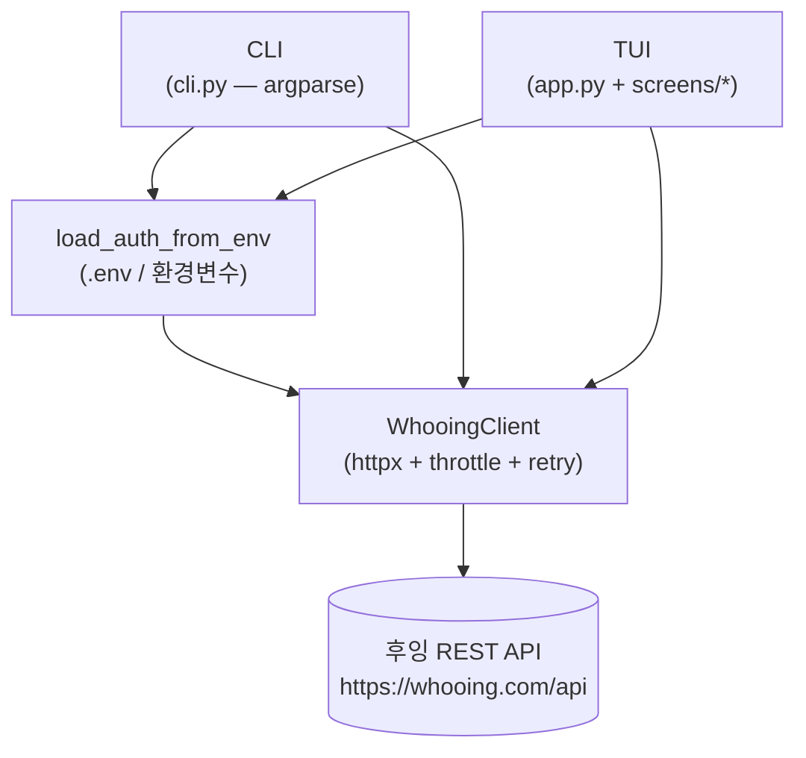
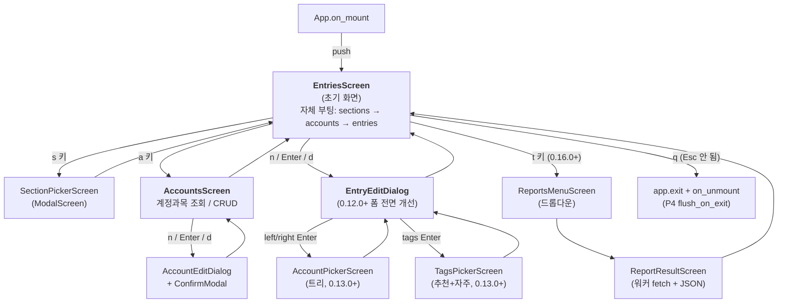
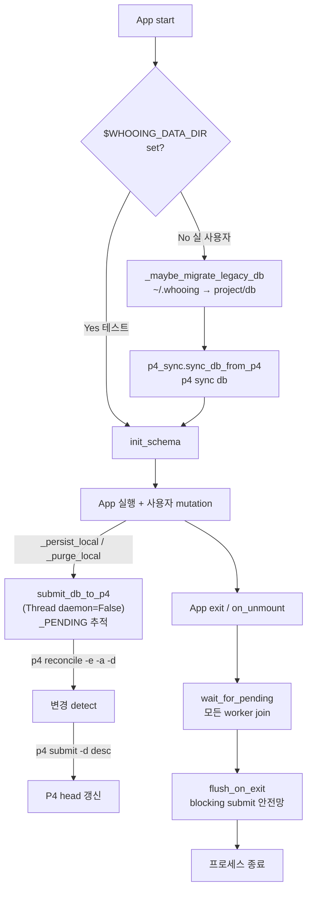

# whooing-tui — 설계 노트

> 이 문서는 **현재 구조** 와 **다음 단계의 의도** 를 적어둔다. 코드와 문서가
> 어긋나면 코드가 진실이고, 이 문서는 그 진실의 *왜* 를 보존한다.

> **다이어그램 가이드라인**: 박스/화살표 구조의 다이어그램은 모두
> [mermaid](https://mermaid.js.org/) 로 작성한다 (ASCII art 금지). 단,
> 단순한 listing (디렉토리 트리, 파일 목록) 은 markdown 표로 — 머메이드
> 변환이 가독성을 떨어트리는 경우.

## 1. 목적과 범위

후잉 가계부를 터미널에서 다룬다. 같은 워크스페이스의
`whooing-mcp-server-wrapper` 가 **LLM 호스트(Claude Desktop / Code)** 를
대상으로 하는 반면, 본 도구는 **사람이 직접 키보드로** 가계부를 다룰 때를
위한 것이다. 두 도구는 서로 직교한다 — 같은 후잉 REST API 를 같은 인증
규칙으로 두드린다.

## 2. 다른 도구와의 관계

```mermaid
flowchart TB
    API[("같은 후잉 REST API<br/>+ 동일 토큰 규칙")]
    API --> TUI["<b>whooing-tui</b><br/>(사람·터미널)"]
    API -.archived 2026-05-10.-> WRAPPER["<b>whooing-mcp-server-wrapper</b><br/>monorepo의 mcp/ 에 보존<br/>(LLM·MCP, archived)"]
    API --> OFFICIAL["<b>whooing.com 공식 MCP</b><br/>(LLM·MCP, 외부)"]
    TUI -. mcp_bridge.py (deprecated) .-> WRAPPER
```

본래 핵심 라이브러리(REST 클라이언트·인증·날짜·에러 매핑) 는 **TUI 와
wrapper 가 의도적으로 코드 중복** 으로 공유하기 위해 만들어졌다. 한 패키지로
묶지 않은 이유 (당시):

- wrapper 는 `mcp>=1.0` / `playwright` / `pdfplumber` 등 무거운 의존성을
  싣는다. TUI 사용자는 이걸 받을 이유가 없다.
- wrapper 의 `tools/`, `parsers/` 는 LLM 도구 정의에 묶여 TUI 와는
  결합이 다르다.
- 한 쪽 변경이 다른 쪽을 깨지 않도록 분리.

**wrapper 종료 (archived 2026-05-10) 후 현재**: 라이브러리 중복은 그대로
유지 — 표면이 작고 안정 (auth/dates/errors 각 100줄 안팎) 해서 추출 비용
이득이 적고, 미래 새 도구 합류 가능성에 대한 옵션 가치 보존.

## 3. 아키텍처

### 3.0 모듈 인벤토리 (0.17.x)

| 모듈 | 책무 |
| --- | --- |
| `__init__.py` | 버전 |
| `__main__.py` | 엔트리: `python -m whooing_tui` |
| `cli.py` | argparse + 헤드리스 서브커맨드 dispatch |
| `auth.py` | `WhooingAuth` — 토큰 헤더 + 마스크 |
| `client.py` | httpx 기반 후잉 REST 클라이언트 + `CachedWhooingClient` |
| `config.py` | TOML config 로더 |
| `dates.py` | KST YYYYMMDD/YYYYMM 유틸 + 1년 분할 |
| `errors.py` | HTTP → `ToolError` 매핑 + secret 마스크 |
| `models.py` | Pydantic `Section` / `Account` / `Entry` / `ToolError` |
| `state.py` | `SessionState` (활성 섹션 + 계정 캐시 + 양방향 인덱스) |
| `cache.py` | `CacheStore` — sqlite 기반 accounts/entries 캐시 (Phase 3) |
| `data.py` | 로컬 sqlite + 첨부 storage 위치 + 마이그레이션 + P4 sync hook |
| `filters.py` | column-별 필터 술어 (date/left/right/item) |
| `ime.py` | 한글 ↔ 영문 두벌식 매핑 + `bind_ko` 헬퍼 |
| `p4_sync.py` | **P4 자동 동기화** (0.15.0+, CL #51114+) — sync_db_from_p4 / submit_db_to_p4 / wait_for_pending / flush_on_exit / describe_annotation |
| `app.py` | Textual App — `WhooingTuiApp(client=…)` + `on_unmount`(P4 flush) |
| `screens/__init__.py` | Screen 패키지 |
| `screens/entries.py` | **EntriesScreen** — 거래내역 표 + 컬럼 marker + sentinel + 인라인 해시태그 + 컴팩트 모드 + 가로 스크롤 |
| `screens/sections.py` | `SectionPickerScreen` (모달, `s` 키) |
| `screens/accounts.py` | `AccountsScreen` (`a` 키) + `AccountEditDialog` |
| `screens/edit_entry.py` | `EntryEditDialog` + `_DateInput` / `_MoneyInput` / `_AccountButton` 위젯 + `ConfirmModal` |
| `screens/account_picker.py` | `AccountPickerScreen` (트리, EntryEditDialog 의 left/right) |
| `screens/tags_picker.py` | `TagsPickerScreen` (해시태그 입력 보조) |
| `screens/reports.py` | **ReportsMenuScreen** + `ReportResultScreen` (0.16.0+, `t` 키) |
| `screens/help.py` | `HelpModal` (`?` 키) |
| `screens/annotator.py` / `attachment_browser.py` / `statement_import.py` | 첨부/명세서 import (Phase 6) |
| `theming.tcss` | 전역 스타일 (Header/Footer dock + 색) |

### 3.1 호출 그래프



CLI 와 TUI 는 같은 클라이언트와 같은 SessionState 를 쓰지만 별도 프로세스
경로다. CLI 는 `asyncio.run()` 한 번, TUI 는 Textual 의 이벤트 루프 안에서
`@work` 로 호출.

### 3.2 화면 흐름 (0.17.x 기준)



**이력**: v0.7.x 까지는 HomeScreen 이 초기 화면이었고 EntriesScreen 은
`e` 키로 push 됐다. CL #51023 에서 사용자 지시로 초기 화면을 EntriesScreen
으로 바꾸고 HomeScreen 제거. 그 후 0.12.0~0.17.x 까지 EntryEditDialog 의
새 위젯 / 트리 picker / tags picker / reports menu 추가.

### 3.3 EntriesScreen 의 인터랙션 모델 (0.14.0~0.17.1)

EntriesScreen 은 다음 직교 상태들을 동시에 가질 수 있다:

| 상태 필드 | 의미 |
|---|---|
| `_show_sentinel: bool` | "[+ 새 거래 추가]" 가시 (CL #51074+) |
| `_column_active: bool` | 노란 cell marker 활성 (CL #51064+) |
| `_active_col: int` | 활성 컬럼 인덱스 (`_COLUMN_NAMES` 인덱스) |
| `_marked_cell: (row, col) \| None` | 마지막 마커링 좌표 (cleanup 용) |
| `_active_filter: ("col", target) \| ("tag", {tag}) \| None` | 활성 필터 (CL #51053+, tag 는 #51106+) |
| `_tag_index: int \| None` | 태그 모드 (item 셀 안의 태그 선택, CL #51106+) |
| `_compact: bool` | 컴팩트 모드 (좁은 터미널, CL #51120+) |
| `_entry_tags: dict[entry_id, list[str]]` | 인라인 표시용 + 태그 필터 source |

**상태 전환 규칙**:
- ←/→ 첫 누름: `_column_active=True` (`_active_col` 그대로).
- ←/→ 이후 누름: `_active_col ± 1` (컴팩트 모드는 hidden 컬럼 skip).
- item 위 → 추가 누름: `_tag_index=0` (태그 모드 진입).
- ↑/↓ 로 row 변경: `_tag_index = None` (자동 종료).
- Esc: `_column_active=False`, `_tag_index=None`, 활성 필터도 해제.
- `c`: 활성 필터만 해제 (marker 유지 — 같은 컬럼 다른 row 재필터 용).
- `r`: 캐시 invalidate + 재로드 → 모든 상태 초기화.

**가로 스크롤 (CL #51121+)**: 컬럼 변경 분기마다
`_scroll_active_col_into_view()` 호출 → `DataTable._get_cell_region(coord)` →
`scroll_to_region(force=True)`.

## 4. 후잉 API 사용 규칙 (본래 mcp-server 와 공유 — wrapper archived 후에도 그대로 유지)

### 4.1 인증

`X-API-Key: <token>` 단일 헤더. 토큰은 절대 로그에 그대로 찍히면 안 된다 —
`WhooingAuth.__repr__` 와 `errors.sanitize_token` 모두 마지막 4자만 hint 로
남기고 나머지는 마스크한다.

### 4.2 엔드포인트 (Phase 1 노출)

| 메서드 | 경로 | 노트 |
| --- | --- | --- |
| GET | `/sections.json` | 섹션 목록 |
| GET | `/accounts.json?section_id=` | 섹션의 계정과목 (type 별 grouping) |
| GET | `/entries.json?section_id=&start_date=&end_date=` | 거래내역 |

### 4.3 응답 포맷

```jsonc
{
  "code": 200 | 204 | 400 | 401 | 402 | 405 | 429 | 5xx,
  "message": "...",
  "results": <list | {key: list} | {id: obj}>,
  "rest_of_api": <int|null>
}
```

- 본문 `code` 가 HTTP status 와 다를 수 있으므로 본문 우선.
- `results` shape 다양성은 `WhooingClient._normalize_collection` 이 흡수.
- `entries.json` 은 server-side 100-cap (`limit` 무시) 이 있어 100건 받으면
  날짜 범위를 bisection 한다 (`_list_entries_chunked`).

### 4.4 에러 매핑

`errors.map_response` (테스트 `test_errors.py`) 한 곳에서:

| code | kind | 비고 |
| --- | --- | --- |
| 400 | USER_INPUT | `error_parameters` 보존 |
| 401 / 405 | AUTH | 토큰 만료/거부 — 재발급 필요 |
| 402 | RATE_LIMIT (일일) | `rest_of_api` 보존, 재시도 안 함 |
| 429 | RATE_LIMIT (분당) | 클라이언트 backoff 재시도 |
| 5xx | UPSTREAM | |
| 그 외 | UPSTREAM | `body_keys` hint |

### 4.5 Rate limit

후잉 한도는 분당 20 / 일일 20,000. 클라이언트는 분당 20 으로 보수적
sliding-window throttle 을 두고, 429 응답엔 1/2/4/8s backoff 로 최대 4회
재시도.

### 4.6 날짜

모든 날짜는 KST 자정 기준 YYYYMMDD. `dates.now_kst()` 가 `Asia/Seoul` 을
강제하므로 호스트 시간대와 무관.

## 5. 보안 가드

- 토큰은 `.env` 또는 셸 환경변수에서만 로드. `.gitignore` / Perforce
  ignore 에 모두 들어 있다.
- 응답에 포함될 수 있는 per-section secret (`webhook_token` 등) 은
  `errors.sanitize_for_log` 로 마스크 후 로깅.
- `WHOOING_TUI_CONFIG` 는 절대 경로 override 만 허용 — 상대 경로로 임의
  파일을 읽지 않는다.

## 6. 다음 단계 (Phase 2 진행 상황)

순서는 가치 → 의존도 순.

1. **HomeScreen** — 섹션 picker + 활성 섹션의 계정과목 트리. ✅ CL #50935
   (Phase 2a) 완료. `screens/home.py` 참고.
2. **EntriesScreen** — DataTable, 100-cap footer 인지. ✅ CL #50936
   (Phase 2b) 완료. `screens/entries.py` 참고.
3. **EntryEditDialog** — 거래 추가/수정. ✅ CL #50939 (Phase 2c) 완료.
   `screens/edit_entry.py` + `screens/entries.py` 의 mutation 액션 참고.
   자주입력·매월입력 자동 매칭은 별도 CL 로 분리 (Phase 2d).
4. **POST/PUT/DELETE** 메서드를 `WhooingClient` 에 추가 (CRUD). ✅
   CL #50939 와 함께. `client.py` 의 `_request` / `create_entry` /
   `update_entry` / `delete_entry`. 후잉 REST 의 정확한 mutation path 는
   라이브 검증 후 조정 — RESTful 가정으로 시작.
5. **로컬 캐시 (sqlite)** — accounts/entries 의 inter-session cache.
   mcp-server 의 `whooing-data.sqlite` 와는 분리된 별도 db.
   ✅ Phase 3 완료. 코드 변경은 CL #50943 (monorepo CL B) 에 흡수,
   문서 정리는 CL #50940. `cache.py` (CacheStore) +
   `client.py::CachedWhooingClient` + `config.py` `[cache]` 섹션 +
   화면의 `invalidate_section` 호출 + `whooing-tui.toml.example`.
6. **MCP 직접 호출 (선택)** — Phase 4 이후. 현재는 REST 만으로 충분.
   - CL #50987 — scaffolding (`mcp_bridge.py::WhooingMcpBridge`) 추가.
   - CL #51007 — archived `whooing_mcp.official_mcp` 의존 제거, 자체
     HTTP JSON-RPC 클라이언트로 재작성.
   - **CL #51008 — `mcp_bridge.py` 제거**. UI 통합이 들어오지 않은 상태로
     유지하면 stale 코드가 늘어나기만 한다. 미래에 보고서·예산·자주입력
     매칭 같은 화면을 추가할 때 본 모듈을 다시 만들 수 있도록 `mcp/`
     디렉토리의 `OfficialMcpClient` (archived) 와 CL #51007 의 자체 구현
     은 git/Perforce history 에서 그대로 참조 가능.

### 6.1 Phase 2a (HomeScreen) 메모 — 후속 화면 구현 시 재사용할 결정들

- **워커 그룹 분리**: `@work(exclusive=True, group="sections")` /
  `group="accounts"` 로 sections 와 accounts 호출을 별도 직렬화.
  EntriesScreen 의 entries 호출도 같은 패턴 (`group="entries"`) 으로 가면
  여러 화면이 공존할 때 worker 간섭이 없다.
- **상태 공유**: 화면 간 상태는 `App.session` (SessionState) 하나로만
  주고받는다. HomeScreen 은 `self._sections_by_id` 같은 화면-로컬 캐시도
  갖지만 source-of-truth 는 SessionState — 새 화면도 같은 규칙.
- **에러 표면화**: 각 Screen 이 자체 status bar (Static, id="status") 를
  갖고 `error` CSS 클래스로 시각 강조. Phase 2 의 다른 화면도 같은
  관용을 따르면 사용자 mental model 이 일관된다.
- **테스트 친화 주입**: `WhooingTuiApp(client=...)` 로 client 를 주입,
  테스트는 `FakeClient` 로 대체. 새 화면을 만들 때도 client 를 직접 새로
  만들지 말고 `app._client` (또는 화면 생성자 인자) 를 통해서만 받는다.
- **자동 활성화 UX**: HomeScreen 은 첫 섹션을 자동으로 활성화해 accounts
  까지 로드한다. EntriesScreen 으로 push 할 때도 같은 패턴 — 진입과 동시에
  최근 N일 (config.entries.default_window_days) 거래를 자동 fetch.

## 7. 로컬 sqlite + P4 자동 동기화 (0.15.0+, CL #51114+)

### 7.1 데이터 위치

| 우선순위 | 경로 | 사용 |
|---|---|---|
| 1 | `$WHOOING_DATA_DIR` | 명시 override (테스트 격리, 사용자 임의 경로) |
| 2 | `<project_root>/db/` | monorepo 안에서 실행 시 |
| 3 | `~/.whooing/` | pip install / monorepo 외 fallback |

`<project>/db/whooing-data.sqlite` 는 P4 control 에 binary 로 등록.
`.gitignore` 의 `*.sqlite` 가 git mirror 푸시는 차단해 사용자 데이터가
public GitHub 에 안 올라간다.

### 7.2 자동 동기화 흐름



### 7.3 mechanical description

`p4_sync.describe_annotation` 이 LLM 미관여 mechanical 한 줄을 빌드:

| mutation | description |
|---|---|
| memo 만 변경 | `[whooing-tui] entry e123 memo upsert` |
| 해시태그 만 변경 | `[whooing-tui] entry e123 hashtags set [식비, 커피]` |
| 둘 다 | `[whooing-tui] entry e123 memo upsert; hashtags set [식비, 커피]` |
| 거래 삭제 | `[whooing-tui] entry e123 deleted` |

flush_on_exit 의 fallback description 은 `[whooing-tui] session end —
flush pending db changes`.

### 7.4 silent 정책

P4 환경 부재 / 매핑 외 / 통신 실패 등 어떤 단계에서든 사용자 표면화 X
(사용자 명시 요구사항). 로그 (`log.warning`/`debug`) 까지만. 종료 흐름은
타임아웃 30s/스레드로 무한 차단 방지.

## 8. 좁은 터미널 적응 (0.17.0+, CL #51120+)

iPhone Blink 등 ~40-50 cells 환경 우선 대응.

### 8.1 모달 반응형 width (Phase 1)

12 모달 적용 패턴:

```css
width: 95%;
max-width: <기존 N>;   /* 76 / 64 / 60 / 56 / ... */
min-width: 30;
```

좁은 터미널 (40 cells) → 95% (38 cells) 로 축소, 단 30 미만 X.
넓은 터미널 (120 cells) → max-width 로 cap (필요 이상 안 늘어남).

### 8.2 EntriesScreen 컴팩트 모드 (Phase 2)

| 임계값 | 모드 | 보이는 컬럼 |
|---|---|---|
| width < 60 | `_compact = True` | date / money / item (3개) |
| width ≥ 60 | `_compact = False` | date / money / left=12 / right / item / memo (6개) |

구현:
- `on_resize(event)` 가 임계값 변화 감지 → `_compact` 토글 +
  `_apply_column_widths_for_size()` 가 left(2) / right(3) / memo(5) 의
  width=0 처리.
- `_COLUMN_NAMES` 의 인덱스 정의는 유지 — 네비/marker 코드 안 깨짐.
- ←/→ 네비가 `_next_visible_col` 로 hidden 컬럼 자동 skip (CL #51121+).
- 모든 컬럼 변경 분기에서 `_scroll_active_col_into_view()` 호출 →
  `DataTable._get_cell_region` + `scroll_to_region(force=True)` 으로
  활성 cell 을 가시 영역 안에.

## 9. 테스트 전략

- 단위: `auth` / `dates` / `errors` / `state` / `config` / `filters` /
  `ime` / `data` / `p4_sync` — 외부 의존 없이.
- 클라이언트: `respx` 로 후잉 REST 응답 모킹. 실 토큰 없이도 통과.
- TUI: Textual `App.run_test()` 기반 스냅샷 + 키 입력 시뮬.
- **좁은 터미널 회귀**: `App.run_test(size=(40, 30))` / `(60, 30)` /
  `(120, 30)` 으로 폭별 동작 검증 (`tests/test_narrow_terminal.py`).
- **테스트 격리**: `conftest.py` 의 `_isolated_user_state` autouse fixture
  가 `WHOOING_DATA_DIR` / `XDG_CONFIG_HOME` 을 tmp 로. P4 sync / flush 도
  env 미설정 시만 동작하므로 테스트가 실 P4 상태 안 끌어옴.
- **p4_sync 모킹**: `WHOOING_P4_BIN` 환경변수로 `p4` 바이너리를 fake shell
  스크립트로 교체 — subprocess 호출 시퀀스를 log 파일로 기록해 검증.
- 라이브 smoke 테스트: 의도적으로 빠짐. archived `mcp/tests/_live_smoke.py`
  가 실 후잉 동작은 검증해뒀다.

**현재 통계** (0.17.1 기준): tui + core 합 **471 passed**.

## 10. 다음 세션 / Phase 7+ 후보

본 문서는 0.17.1 까지를 반영. 다음 작업은 사용자 우선순위에 따라:

- **보고서 화면 종류별 렌더러** (Phase 2 of CL #51116) — 현재 raw JSON
  pretty dump 가 baseline. 자산표 / 시계열 표 / 캘린더 그리드 / 예산
  진행률 바 등 종류별 전용 렌더러로 점진 교체.
- **컴팩트 모드 사용자 경험 보강** — money 부호 (-/+) 표시, 인라인 태그
  의 컴팩트 압축 (limit 1 + `…(N)`), 사용자 토글 (수동 컴팩트 on/off).
- **iPhone Blink 외 모바일 환경** — Termius / Termius / Prompt 3 등 다른
  iOS 터미널 회귀 검증.
- **자주입력 / 매월입력 매칭** (Phase 2d, 미완) — EntryEditDialog 진입 시
  후잉의 frequent_items / monthly_items 와 매칭해 자동 prefill.
- **첨부파일 import 흐름 통합** — Phase 6 의 `attachment_browser` /
  `statement_import` 가 EntriesScreen 과 자연 연결되도록.

세션 컨텍스트는 `MEMORY.md` (P4-only) 의 §8 변경 이력 + 본 문서의 §3.0
모듈 인벤토리 + `CHANGELOG.md` 의 CL 별 상세를 함께 보면 복원 가능.
