# whooing-tui — 설계 노트

> 이 문서는 **현재 구조** 와 **다음 단계의 의도** 를 적어둔다. 코드와 문서가
> 어긋나면 코드가 진실이고, 이 문서는 그 진실의 *왜* 를 보존한다.

> **다이어그램 가이드라인**: 박스/화살표 구조의 다이어그램은 모두
> [mermaid](https://mermaid.js.org/) 로 작성한다 (ASCII art 금지). 단,
> 단순한 listing (디렉토리 트리, 파일 목록) 은 markdown 표로 — 머메이드
> 변환이 가독성을 떨어트리는 경우.

## 1. 목적과 범위

후잉 가계부를 터미널에서 다룬다. 같은 워크스페이스의
`whooing-mcp-server-wrapper` 가 **LLM 호스트(Claude Desktop / Code)** 를
대상으로 하는 반면, 본 도구는 **사람이 직접 키보드로** 가계부를 다룰 때를
위한 것이다. 두 도구는 서로 직교한다 — 같은 후잉 REST API 를 같은 인증
규칙으로 두드린다.

## 2. 다른 도구와의 관계

```mermaid
flowchart TB
    API[("같은 후잉 REST API<br/>+ 동일 토큰 규칙")]
    API --> TUI["<b>whooing-tui</b><br/>(사람·터미널)"]
    API -.archived 2026-05-10.-> WRAPPER["<b>whooing-mcp-server-wrapper</b><br/>monorepo의 mcp/ 에 보존<br/>(LLM·MCP, archived)"]
    API --> OFFICIAL["<b>whooing.com 공식 MCP</b><br/>(LLM·MCP, 외부)"]
    TUI -. mcp_bridge.py (deprecated) .-> WRAPPER
```

본래 핵심 라이브러리(REST 클라이언트·인증·날짜·에러 매핑) 는 **TUI 와
wrapper 가 의도적으로 코드 중복** 으로 공유하기 위해 만들어졌다. 한 패키지로
묶지 않은 이유 (당시):

- wrapper 는 `mcp>=1.0` / `playwright` / `pdfplumber` 등 무거운 의존성을
  싣는다. TUI 사용자는 이걸 받을 이유가 없다.
- wrapper 의 `tools/`, `parsers/` 는 LLM 도구 정의에 묶여 TUI 와는
  결합이 다르다.
- 한 쪽 변경이 다른 쪽을 깨지 않도록 분리.

**wrapper 종료 (archived 2026-05-10) 후 현재**: 라이브러리 중복은 그대로
유지 — 표면이 작고 안정 (auth/dates/errors 각 100줄 안팎) 해서 추출 비용
이득이 적고, 미래 새 도구 합류 가능성에 대한 옵션 가치 보존.

## 3. 아키텍처

| 모듈 | 책무 |
| --- | --- |
| `__init__.py` | 버전 |
| `__main__.py` | 엔트리: `python -m whooing_tui` |
| `cli.py` | argparse + 헤드리스 서브커맨드 dispatch |
| `auth.py` | `WhooingAuth` — 토큰 헤더 + 마스크 |
| `client.py` | httpx 기반 후잉 REST 클라이언트 (read 위주) |
| `config.py` | TOML config 로더 |
| `dates.py` | KST YYYYMMDD/YYYYMM 유틸 + 1년 분할 |
| `errors.py` | HTTP → `ToolError` 매핑 + secret 마스크 |
| `models.py` | Pydantic `Section` / `Account` / `Entry` / `ToolError` |
| `state.py` | `SessionState` (활성 섹션 + 계정 캐시 + 양방향 인덱스) |
| `app.py` | Textual App — `WhooingTuiApp(client=…)` |
| `screens/__init__.py` | Screen 패키지 |
| `screens/home.py` | HomeScreen — 섹션 picker + 계정과목 트리 |
| `screens/entries.py` | EntriesScreen — 거래내역 표 + 100-cap footer |
| `theming.tcss` | 전역 스타일 (Header/Footer dock + 색) |

### 3.1 호출 그래프

```mermaid
flowchart TB
    CLI["CLI<br/>(cli.py — argparse)"]
    TUI["TUI<br/>(app.py + screens/*)"]
    AUTH["load_auth_from_env<br/>(.env / 환경변수)"]
    CLIENT["WhooingClient<br/>(httpx + throttle + retry)"]
    API[("후잉 REST API<br/>https://whooing.com/api")]
    CLI --> AUTH
    TUI --> AUTH
    AUTH --> CLIENT
    CLI --> CLIENT
    TUI --> CLIENT
    CLIENT --> API
```



CLI 와 TUI 는 같은 클라이언트와 같은 SessionState 를 쓰지만 별도 프로세스
경로다. CLI 는 `asyncio.run()` 한 번, TUI 는 Textual 의 이벤트 루프 안에서
`@work` 로 호출.

## 4. 후잉 API 사용 규칙 (본래 mcp-server 와 공유 — wrapper archived 후에도 그대로 유지)

### 4.1 인증

`X-API-Key: <token>` 단일 헤더. 토큰은 절대 로그에 그대로 찍히면 안 된다 —
`WhooingAuth.__repr__` 와 `errors.sanitize_token` 모두 마지막 4자만 hint 로
남기고 나머지는 마스크한다.

### 4.2 엔드포인트 (Phase 1 노출)

| 메서드 | 경로 | 노트 |
| --- | --- | --- |
| GET | `/sections.json` | 섹션 목록 |
| GET | `/accounts.json?section_id=` | 섹션의 계정과목 (type 별 grouping) |
| GET | `/entries.json?section_id=&start_date=&end_date=` | 거래내역 |

### 4.3 응답 포맷

```jsonc
{
  "code": 200 | 204 | 400 | 401 | 402 | 405 | 429 | 5xx,
  "message": "...",
  "results": <list | {key: list} | {id: obj}>,
  "rest_of_api": <int|null>
}
```

- 본문 `code` 가 HTTP status 와 다를 수 있으므로 본문 우선.
- `results` shape 다양성은 `WhooingClient._normalize_collection` 이 흡수.
- `entries.json` 은 server-side 100-cap (`limit` 무시) 이 있어 100건 받으면
  날짜 범위를 bisection 한다 (`_list_entries_chunked`).

### 4.4 에러 매핑

`errors.map_response` (테스트 `test_errors.py`) 한 곳에서:

| code | kind | 비고 |
| --- | --- | --- |
| 400 | USER_INPUT | `error_parameters` 보존 |
| 401 / 405 | AUTH | 토큰 만료/거부 — 재발급 필요 |
| 402 | RATE_LIMIT (일일) | `rest_of_api` 보존, 재시도 안 함 |
| 429 | RATE_LIMIT (분당) | 클라이언트 backoff 재시도 |
| 5xx | UPSTREAM | |
| 그 외 | UPSTREAM | `body_keys` hint |

### 4.5 Rate limit

후잉 한도는 분당 20 / 일일 20,000. 클라이언트는 분당 20 으로 보수적
sliding-window throttle 을 두고, 429 응답엔 1/2/4/8s backoff 로 최대 4회
재시도.

### 4.6 날짜

모든 날짜는 KST 자정 기준 YYYYMMDD. `dates.now_kst()` 가 `Asia/Seoul` 을
강제하므로 호스트 시간대와 무관.

## 5. 보안 가드

- 토큰은 `.env` 또는 셸 환경변수에서만 로드. `.gitignore` / Perforce
  ignore 에 모두 들어 있다.
- 응답에 포함될 수 있는 per-section secret (`webhook_token` 등) 은
  `errors.sanitize_for_log` 로 마스크 후 로깅.
- `WHOOING_TUI_CONFIG` 는 절대 경로 override 만 허용 — 상대 경로로 임의
  파일을 읽지 않는다.

## 6. 다음 단계 (Phase 2 진행 상황)

순서는 가치 → 의존도 순.

1. **HomeScreen** — 섹션 picker + 활성 섹션의 계정과목 트리. ✅ CL #50935
   (Phase 2a) 완료. `screens/home.py` 참고.
2. **EntriesScreen** — DataTable, 100-cap footer 인지. ✅ CL #50936
   (Phase 2b) 완료. `screens/entries.py` 참고.
3. **EntryEditDialog** — 거래 추가/수정. ✅ CL #50939 (Phase 2c) 완료.
   `screens/edit_entry.py` + `screens/entries.py` 의 mutation 액션 참고.
   자주입력·매월입력 자동 매칭은 별도 CL 로 분리 (Phase 2d).
4. **POST/PUT/DELETE** 메서드를 `WhooingClient` 에 추가 (CRUD). ✅
   CL #50939 와 함께. `client.py` 의 `_request` / `create_entry` /
   `update_entry` / `delete_entry`. 후잉 REST 의 정확한 mutation path 는
   라이브 검증 후 조정 — RESTful 가정으로 시작.
5. **로컬 캐시 (sqlite)** — accounts/entries 의 inter-session cache.
   mcp-server 의 `whooing-data.sqlite` 와는 분리된 별도 db.
   ✅ Phase 3 완료. 코드 변경은 CL #50943 (monorepo CL B) 에 흡수,
   문서 정리는 CL #50940. `cache.py` (CacheStore) +
   `client.py::CachedWhooingClient` + `config.py` `[cache]` 섹션 +
   화면의 `invalidate_section` 호출 + `whooing-tui.toml.example`.
6. **MCP 직접 호출 (선택)** — Phase 4 이후. 현재는 REST 만으로 충분.
   - CL #50987 — scaffolding (`mcp_bridge.py::WhooingMcpBridge`) 추가.
   - CL #51007 — archived `whooing_mcp.official_mcp` 의존 제거, 자체
     HTTP JSON-RPC 클라이언트로 재작성.
   - **CL #51008 — `mcp_bridge.py` 제거**. UI 통합이 들어오지 않은 상태로
     유지하면 stale 코드가 늘어나기만 한다. 미래에 보고서·예산·자주입력
     매칭 같은 화면을 추가할 때 본 모듈을 다시 만들 수 있도록 `mcp/`
     디렉토리의 `OfficialMcpClient` (archived) 와 CL #51007 의 자체 구현
     은 git/Perforce history 에서 그대로 참조 가능.

### 6.1 Phase 2a (HomeScreen) 메모 — 후속 화면 구현 시 재사용할 결정들

- **워커 그룹 분리**: `@work(exclusive=True, group="sections")` /
  `group="accounts"` 로 sections 와 accounts 호출을 별도 직렬화.
  EntriesScreen 의 entries 호출도 같은 패턴 (`group="entries"`) 으로 가면
  여러 화면이 공존할 때 worker 간섭이 없다.
- **상태 공유**: 화면 간 상태는 `App.session` (SessionState) 하나로만
  주고받는다. HomeScreen 은 `self._sections_by_id` 같은 화면-로컬 캐시도
  갖지만 source-of-truth 는 SessionState — 새 화면도 같은 규칙.
- **에러 표면화**: 각 Screen 이 자체 status bar (Static, id="status") 를
  갖고 `error` CSS 클래스로 시각 강조. Phase 2 의 다른 화면도 같은
  관용을 따르면 사용자 mental model 이 일관된다.
- **테스트 친화 주입**: `WhooingTuiApp(client=...)` 로 client 를 주입,
  테스트는 `FakeClient` 로 대체. 새 화면을 만들 때도 client 를 직접 새로
  만들지 말고 `app._client` (또는 화면 생성자 인자) 를 통해서만 받는다.
- **자동 활성화 UX**: HomeScreen 은 첫 섹션을 자동으로 활성화해 accounts
  까지 로드한다. EntriesScreen 으로 push 할 때도 같은 패턴 — 진입과 동시에
  최근 N일 (config.entries.default_window_days) 거래를 자동 fetch.

## 7. 테스트 전략

- 단위: `auth` / `dates` / `errors` / `state` / `config` — 외부 의존 없이.
- 클라이언트: `respx` 로 후잉 응답을 모킹. 실 토큰 없이도 통과.
- TUI: Phase 2 부터 Textual `App.run_test()` 기반 스냅샷 + 키 입력 시뮬.
- 라이브 smoke 테스트: 의도적으로 빠짐. mcp-server 쪽의 `tests/_live_smoke.py`
  로 실 후잉 동작은 이미 검증됨.
