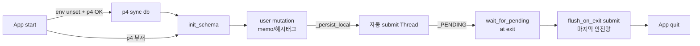

# whooing-tui

후잉 가계부([whooing.com](https://whooing.com))를 **터미널에서 빠르게**
다루기 위한 Textual TUI. 본 패키지는 monorepo 의 `tui/` 서브디렉토리이며,
같은 monorepo 의 [`core/`](../core) (whooing-core 라이브러리) 를 import 한다.

> **자매 도구 정리** — 본래 같은 후잉 REST API 를 공유하던
> `whooing-mcp-server-wrapper` 는 2026-05-10 archived 됐고, **CL #52846
> (0.71.0) 에서 `mcp/` 패키지 자체가 monorepo 에서 제거**됐다. 함께 있던
> `mcp_bridge.py` 도 제거됨 — 현재 코드베이스는 `core/` + `tui/` 두 패키지
> 뿐. 보고서/통계의 공식 후잉 MCP 위임은 wrapper 와 무관하게 `tui/` 자체
> 컴포넌트 [`official_mcp.py`](src/whooing_tui/official_mcp.py) (minimal
> JSON-RPC client) 가 전담한다.

**현재 0.63.0 (CL #52784, 2026-05-18)** — Phase 1~7 + 다음 누적 변경.

> **0.60.1 ~ 0.63.0 핵심 변경 요약** (CL #52770~#52784, 2026-05-18 오후):
> - **CachedWhooingClient call_official_tool wrap (0.60.1, CL #52770)**:
>   0.55.0 의 위임 helper 를 cached client 가 wrap 안 해서 보고서 화면이
>   `INTERNAL: ... no attribute 'call_official_tool'` 로 실패. 한 줄
>   pass-through 추가 + 회귀 방지 테스트 2.
> - **Home/End/PgUp/PgDn 거래 목록 navigation (0.61.0, CL #52772)**:
>   priority=True 인 up/down binding 이 textual DataTable 의 default
>   navigation 을 가려 동작 안 함 → 4 키 명시 binding + action 메서드.
>   sentinel 보일 때도 Home 은 sentinel(0) 건너뛰고 첫 실거래 (1) 로.
> - **MenuPopup backdrop 제거 + Ctrl/Shift multi-select (0.62.0, CL #52776)**:
>   풀다운 메뉴가 화면 하단까지 가린 듯한 시각 — modal 의 default 50%
>   black overlay 가 원인. `background: transparent` + `height: auto`.
>   거래 row 에서 `Ctrl+click` 토글, `Shift+click` / `Shift+arrow/Home/
>   End/PgUp/PgDn` 범위 선택 (`_selection_anchor` + `_extend_selection_to`).
> - **item 인라인 태그 default 무제한 (0.62.1, CL #52780)**:
>   `_ITEM_TAG_INLINE_LIMIT 2 → 0` (sentinel = 무제한). 사용자 캡처의
>   `#…(1)` 축약 사라지고 모든 태그 표시. 좁은 터미널은
>   `WHOOING_ITEM_TAG_INLINE_LIMIT=N` env 로 명시 cap.
> - **Blink 한글 자모 조합 + Esc selection + 시각 강조 + space 갱신
>   (0.63.0, CL #52784)** — 4건 묶음:
>   * iPhone Blink 가 한국어 IME keystroke 를 Compat Jamo (`ㅎㅏㄴ`) 로
>     분리해 보내는 문제 → `core/hangul.py` 신규 (`compose_hangul` 음절
>     state machine) + `widgets/hangul_input.py` 가 `Input.watch_value`
>     wrap. App.on_mount 한 번 호출로 전역 적용.
>   * `Esc` 가 multi-select 도 함께 해제 (column / filter / selection
>     셋 모두).
>   * 선택된 row 의 모든 cell 에 `bold reverse` 강조 + prefix `▣ → ✅`.
>   * `space` 토글 후 즉시 `_render_table` (종전엔 갱신 누락).

> **0.52.0 ~ 0.60.0 핵심 변경 요약** (CL #52716~#52763, 2026-05-18, 새 호스트
> 셋업 세션):
> - **EntryEditDialog 에 attach row (0.52.0, CL #52719)**: 거래 수정 모달
>   안에서 직접 첨부 관리. 수정 모드일 때 `📎 N개 첨부 — Enter 로 관리`
>   버튼, 신규 모드는 `📎 저장 후 첨부 가능` (disabled).
> - **IME 단축키 누락 4 곳 fix (0.53.0, CL #52724)**: q/ㅂ 종료 회귀 fix +
>   AttachmentBrowser a/d/o/e/r / Dashboard r / ConfirmModal y/n 모두
>   `bind_ko` 적용. + dashboard/attachment_browser/widgets/confirm 의
>   filetype `unicode → text+C` (BOM 자동 부여 차단).
> - **AttachmentBrowser modal 팝업 + Enter 미리보기 (0.54.0, CL #52750)**:
>   `Screen → ModalScreen[None]`. 거래내역 위 큰 frame 으로 표시. row 에서
>   Enter 누르면 새 modal 로 파일 내용 미리보기 — text/* + PDF (`pdfplumber`
>   로 페이지별 추출). 새 모듈 `core/preview.py`. UX 개선 (a → FilePicker
>   직접, p → 경로 직접, 빈 list 안내) + action_add/add_by_path 에 `@work`
>   추가 (`NoActiveWorker` fix).
> - **보고서 403 근본 원인 fix — 공식 후잉 MCP 위임 (0.55.0, CL #52755)**:
>   자체 REST path 추측 (`/report/{account}.json`) 그만, 후잉 공식 MCP
>   server (`https://whooing.com/mcp`) 의 `tools/call` 위임. schema 정확
>   매칭 (`account="all"` enum, `budget` 의 YYYYMM). 새 모듈
>   `tui/official_mcp.py` (minimal JSON-RPC client). 11/11 메뉴 정상 응답.
> - **memo substring 필터 + tags hint 중복 제외 (0.56.0, CL #52756)**:
>   memo 컬럼이 정확 일치 → 키워드 substring 매칭 (`memo_keywords()`,
>   2글자 이상). tags hint 가 이미 입력된 태그 추천 안 함.
> - **거래 fetch sqlite 캐시 + 점진적 필터 확장 (0.57.0, CL #52758)**:
>   schema v8 — `entries_cache` 테이블. refresh 시 자동 upsert. 컬럼 필터
>   시 (1) 현재 윈도우 매칭 즉시 표시 → (2) 캐시 lookup → (3) background
>   worker 가 `WHOOING_FILTER_EXPAND_MONTHS` (default `3,6,12,24`) step 으로
>   과거 fetch + 캐시 upsert + 매칭 누적 + 화면 갱신. epoch 카운터로 race
>   방지.
> - **메뉴바 Alt/Option 키 + 마우스 클릭 (0.58.0, CL #52760)**: F10 외에
>   `alt` / `alt+m` / `alt+f` 진입. `MenuBar.on_click` + 새 `MenuClicked`
>   message + `MenuBarMixin.on_menu_bar_menu_clicked` 핸들러.
>   `menubar_index_at_offset(x, menus)` helper.
> - **graceful quit modal (0.59.0, CL #52762)**: `q` action `quit →
>   graceful_quit`. `_ShutdownModal` push 후 thread executor 로 `flush_on_
>   exit` 실행 → 끝나면 `self.exit()`. ctrl+c 는 강제 종료 (종전 `quit`).
> - **거래 row context menu (0.60.0, CL #52763)**: `m` (또는 `ㅡ`) — 선택
>   거래의 context menu popup (수정/삭제/첨부/새 거래 + multi-select 시
>   일괄 태그). 기존 `MenuPopup` 재사용.
> - **기타 (P4 운영 인프라)**: `core/pyproject.toml` / `mcp/pyproject.toml`
>   의 UTF-8 BOM 제거 + filetype unicode→text+C (CL #52716). MEMORY.md
>   워크스페이스 경로 갱신 (`Perforce/surface` → `p4/surface-office`,
>   `.p4config` 자동 client 선택, CL #52717). `.gitignore` 에 `/db/` +
>   `/attachment/` 차단 (CL #52729 — Perforce OK, GitHub 절대 금지).
>   `_do_submit_multi` 가 numbered CL 패턴 (CL #52748 — `submit -d <abs
>   path>` syntax 오류 회귀 fix).

> **0.18.0 ~ 0.51.0 핵심 변경 요약** (CL #51123~#51160, 2026-05-10~11):
> - **첨부 (CL #51123~#51124, #51132~)**: 거래 ↔ 파일 1:N 첨부. 저장 위치
>   `<project>/attachment/YYYY/YYYY-MM-DD/`. sha256 dedup + db row 함께 P4
>   자동 submit.
> - **좁은 터미널 4단계** (CL #51125): ≥80 정상 / <80 memo 숨김 / <60
>   left·right 약어 / <45 right 숨김 / <35 left 숨김.
> - **한국식 줄임말** (CL #51127, #51130): `(주)스타벅스` → "스벅".
> - **F10 풀다운 메뉴** (CL #51126, #51131).
> - **카드 명세서 import** (CL #51126, 5개 카드사 HTML/CSV/PDF) + **PDF
>   영수증 자동 매칭/첨부** (CL #51128).
> - **해시태그 강화** (CL #51133~#51151): section 인덱싱 / rename·merge·
>   delete / 초성 검색 / tag colors.
> - **multi-select + 일괄 태그** (CL #51145).
> - **예산/목표/매월입력 UI** (CL #51152~#51154).
> - **schema v4 → v7** (CL #51155).
> - **6-CL 코드 리뷰** (CL #51155~#51160): P0 fix + widget/test helper 통합.

**과거 버전 핵심:**


- **Phase 1**: 핵심 라이브러리 + 헤드리스 CLI (CL #50931+, 0.1.0)
- **Phase 2a**: HomeScreen → CL #51023 부터 EntriesScreen 으로 흡수 (자체 부팅).
- **Phase 2b**: EntriesScreen (DataTable + 100-cap 인지 footer)
- **Phase 2c**: EntryEditDialog + WhooingClient CRUD (POST/PUT/DELETE)
- **Phase 3**: sqlite 캐시 (accounts 1h TTL / entries 5min TTL, mutation
  시 자동 invalidate)
- **0.10.x ~ 0.11.x**: 컬럼 marker (cell 단위 시각 마커), 컬럼별 Enter
  컨텍스트 (필터 / edit 자동 분기), Esc 의 marker+필터 동시 해제,
  sentinel "[+ 새 거래 추가]" row, 한글 IME 단축키.
- **0.12.0** (CL #51078): EntryEditDialog 폼 전면 개선 — 자동 dash 날짜,
  천단위 콤마 money, 계정 picker 모달, memo 의 로컬 sqlite mirror, 해시태그.
- **0.13.0** (CL #51085): 계정 picker 트리 + tags picker.
- **0.13.1** (CL #51095): sentinel 가운데 정렬, 카테고리 Enter 펼침 버그
  fix, money 우측 정렬.
- **0.13.2** (CL #51100): AccountPicker ←/→ 트리 펼침/접힘, sentinel
  하이라이트 cursor 색상.
- **0.14.0** (CL #51106): 거래 목록 item 컬럼 인라인 해시태그, 태그 단위
  column 네비, 태그 Enter 필터.
- **0.15.0** (CL #51114): 로컬 sqlite 를 `~/.whooing` → `<project>/db/`
  로 이동 + 변경 시 P4 자동 submit.
- **0.15.1** (CL #51115): 한글 IME 단축키 즉시 발화, 해시태그 `#` 자연
  처리.
- **0.16.0** (CL #51116): 후잉 통계 뷰 (드롭다운 메뉴 + 결과 팝업) Phase 1.
- **0.16.1** (CL #51117): 보고서 API path 수정 (라이브 응답 unknown method
  회귀).
- **0.16.2** (CL #51118): p4_sync daemon thread submit 미완료 회귀 fix.
- **0.16.3** (CL #51119): 시작 시 db sync, 종료 시 누락 변경 flush submit.
- **0.17.0** (CL #51120): 좁은 터미널 (iPhone Blink 등) 대응 — 모달 반응형
  width + DataTable 컴팩트 컬럼.
- **0.17.1** (CL #51121): 컬럼 네비 시 가로 스크롤, 컴팩트 hidden 컬럼
  자동 skip.

자세한 로드맵·아키텍처는 [`DESIGN.md`](./DESIGN.md), 변경 이력은
[`CHANGELOG.md`](./CHANGELOG.md).

---

## 빠른 시작

```bash
# 1. monorepo 루트에서 가상환경 + 의존성 설치 (Python 3.11+)
cd ..      # tui/ 의 부모 (monorepo root)
make install

# 2. 후잉 AI 토큰 설정
#    권장 위치: ~/.config/whooing/.env (CL #50961+)
#    backward compat: monorepo root .env 도 동작
cp .env.example .env
# .env 의 WHOOING_AI_TOKEN 을 실 토큰으로 교체
# 발급: 후잉 → 사용자 > 계정 > 비밀번호 및 보안 > AI 토큰 발급

# 3. 헤드리스 CLI 로 동작 확인 — 진입점 3종 모두 동등
.venv/bin/python -m whooing_tui sections list      # 패키지 module
.venv/bin/whooing-tui accounts list                # 콘솔 스크립트
.venv/bin/python ../whooing.py entries list --days 7   # monorepo 루트 진입점

# 4. TUI 실행 — 진입 즉시 거래내역이 표시 (자체 부팅)
make run
# 또는: .venv/bin/python ../whooing.py
```

---

## 데이터 위치 + P4 자동 동기화 (0.15.0+, CL #51114+)

**위치 우선순위**:

1. `$WHOOING_DATA_DIR` (명시 override — 테스트용).
2. `<project_root>/db/` (monorepo 안에서 실행 시).
3. `~/.whooing/` (pip install / monorepo 외 fallback).

`<project>/db/whooing-data.sqlite` 가 P4 control 에 등록된다 (binary).
`.gitignore` 의 `*.sqlite` 가 git mirror 푸시는 차단 — public GitHub 에는
사용자 데이터가 안 올라간다.

**자동 sync / submit 흐름** (CL #51119+):



- **시작 시**: P4 환경 + 워크스페이스 매핑 OK 면 `p4 sync db` 로 head
  동기화 (CL #51119).
- **변경 시**: memo / 해시태그 mutation 후 `p4 reconcile -e -a -d` +
  `p4 submit` 을 백그라운드 thread 로 실행. description 은 mechanical
  (LLM 미관여) — 예: `[whooing-tui] entry e123 memo upsert; hashtags
  set [식비, 커피]`.
- **종료 시**: `wait_for_pending` 으로 진행 중 thread join (daemon=False,
  CL #51118) + `flush_on_exit` 으로 누락 변경 마지막 submit (CL #51119).
- **모든 실패 silent**: P4 부재 / 매핑 외 / 통신 실패 등 어떤 상황에서도
  사용자 표면화 X. 로그 (`log.warning`/`debug`) 까지만.

---

## TUI 키 바인딩 요약

### EntriesScreen (초기 화면)

평소엔 거래 목록만 보이고, 거래 목록 맨 위 row 에서 **↑ 한 번 더** 누르면
**`[+ 새 거래 추가]` sentinel** 등장 (CL #51074+). 거기서 Enter 가 새 거래
dialog. sentinel 에서 ↓ 누르면 숨김 + cursor 가 첫 실거래로 복귀. 빈
entries 일 때는 sentinel 자동 표시 + `.sentinel-active` CSS 가 cursor 를
노란/검정 톤으로 강조 (다른 기능임을 인지 — CL #51100).

거래 화면은 두 가지 상태:

1. **파란 row cursor 만** — 첫 mount 상태. 거래 단위 선택.
2. **파란 + 노란 column marker** — ←/→ 누르면 활성화. cell 단위 선택.
   **태그 모드** (CL #51106+) 도 추가: item 위에서 → 한 번 더 누르면 태그
   하나가 선택돼 cyan 마커로 강조.

| 키 | 파란만 (초기) | 파란+노랑 (컬럼 활성) |
| --- | --- | --- |
| ↑/↓ | 거래 행 이동 | 거래 행 이동 (marker 가 따라감, 태그 모드는 자동 종료) |
| **Home / End / PgUp / PgDn (0.61.0+)** | 첫/마지막/한 페이지 — sentinel 자리 건너뜀 | 〃 |
| ←/→ | **컬럼 marker 활성화** | 활성 컬럼 ±1 (boundary clamp) |
| Enter | 거래 수정 (EntryEditDialog) | 컬럼별 컨텍스트 (아래 표) |
| Esc | **selection / column / filter 한 번에 해제** (0.63.0+) | 〃 |
| `q` | 앱 종료 (`_ShutdownModal` 표시 + flush 완료 후 cli 복귀, 0.59.0+) | 〃 |
| `e` | 거래 수정 | 거래 수정 |
| `n` | 새 거래 입력 | 새 거래 입력 |
| `d` | 선택 거래 삭제 (ConfirmModal) | 〃 |
| `space` | 현재 row 선택 토글 (multi-select, **0.63.0+ 갱신 즉시 반영**) | 〃 |
| **`Shift+↑↓/Home/End/PgUp/PgDn` (0.62.0+)** | **범위 multi-select** (anchor ~ cursor union) | 〃 |
| **`Ctrl+click` / `Shift+click` (0.62.0+)** | 토글 / 범위 마우스 multi-select | 〃 |
| **`m`** | **선택 거래의 context menu popup** (0.60.0+, multi-select 시 일괄 태그 항목 포함) | 〃 |
| `c` | 활성 필터 해제 | 〃 |
| `s` | 섹션 picker 모달 | 〃 |
| `a` | 계정과목 화면 | 〃 |
| `t` | **보고서/통계 메뉴** (0.16.0+; 0.55.0+ 공식 MCP 위임) | 〃 |
| `f` | 첨부 화면 (modal popup, 0.54.0+) | 〃 |
| `r` | 캐시 invalidate + 재로드 (필터/marker 자동 해제) | 〃 |
| `+` / `-` | 조회 윈도우 ±7일 | 〃 |
| `F10` / `Alt+M` / `Alt+F` / 메뉴바 클릭 | F10 메뉴 진입 (0.58.0+, 클릭 — `MenuClicked` message) | 〃 |
| `?` | 화면 도움말 | 〃 |

**컬럼 활성 상태에서 Enter** — 컬럼별 컨텍스트 액션:

| 활성 컬럼 / 마커 | Enter 동작 |
| --- | --- |
| `date` | 같은 날짜의 거래만 필터 (sub-index 무시 — `20260510` 매칭) |
| `left` | 같은 차변 항목만 필터 (`l_account_id` 비교) |
| `right` | 같은 대변 항목만 필터 (`r_account_id` 비교) |
| `item` | 괄호 바깥 키워드 매칭 (예: `스타벅스(커피)` → `스타벅스`) |
| **`memo` (0.56.0+)** | **키워드 substring 매칭** (2글자 이상 토큰) — "수박" 포함이면 다른 "수박" 포함 memo 도 매칭 |
| **태그 (cyan, 0.14.0+)** | **그 태그가 붙은 거래만 필터** |
| `money` | 거래 수정 dialog (EntryEditDialog) |

**필터 점진 확장** (0.57.0+): 컬럼 필터 적용 시 (1) 현재 1개월 윈도우 매칭
즉시 표시 → (2) sqlite 캐시 (`entries_cache` 테이블, schema v8) 의 윈도우
밖 매칭 추가 → (3) background worker 가 `WHOOING_FILTER_EXPAND_MONTHS`
(default `3,6,12,24`) step 으로 과거 fetch + 캐시 upsert + 매칭 누적 + 화면
갱신. 사용자가 필터 변경/해제 시 epoch bump 으로 race 방지.

**Context menu** (0.60.0+, `m` 또는 `ㅡ`): 선택 거래 위에서 `m` 누르면
작은 popup 메뉴 — 수정 (e) / 삭제 (d) / 첨부 (f) / 새 거래 (n). multi-select
활성 시 일괄 태그 (#) 항목 추가.

필터 활성 시 status bar 가 노란색 (warn) 으로 `필터: tag=#식비 — 5/12건.
c 로 해제 / r 로 재로드.` 와 같이 안내. **종료는 q 만** (Esc 는 marker /
필터 해제 전용 — 사용자 의도치 않은 종료 방지).

**`c` vs `Esc` 차이**:

| 키 | 컬럼 marker | 활성 필터 |
|---|---|---|
| `c` (Clear) | 그대로 유지 | **해제** |
| `Esc` (Cancel) | **해제** | **해제** (있으면) |

### 인라인 해시태그 (0.14.0+, CL #51106)

**item** 컬럼 끝에 그 거래의 해시태그를 `#` prefix 로 인라인 표시:

```
| date       | money   | left  | right | item               | memo  |
| 2026-05-09 |  12,000 | 식비  | 현금  | 스타벅스 #식비 #저녁 | 오후  |
```

- 태그가 많으면 (`_ITEM_TAG_INLINE_LIMIT=2` 초과) 앞 2 + `#…(N)` 축약.
- item 이 비어있어도 태그만 표시 (`#월세` 같은 태그-only 거래).
- **저장은 bare** — db 의 `entry_hashtags.tag` 에는 `#` 없이 `식비` 만.
  표시 / 입력 시 `#` 가 시각 구분으로 항상 prefix.

**태그 단위 column 네비** — `_active_col=item` 활성 상태에서 → 한 번 더
누르면 첫 태그 선택 (cyan 마커). 다음 → 마다 다음 태그. 마지막 태그 +
→ = `memo` 컬럼으로 진입. 역방향도 동일. ↑/↓ 로 row 이동 시 자동 종료.

### SectionPickerScreen (`s` 로 push)

| 키 | 동작 |
| --- | --- |
| ↑/↓ | 섹션 이동 |
| Enter | 선택 → 활성 섹션 변경 + EntriesScreen 자동 재로드 |
| `r` | 섹션 목록 재로드 |
| `q` / Esc | 취소 |

### AccountsScreen (`a` 로 push)

| 키 | 동작 |
| --- | --- |
| ↑/↓ | 계정과목 이동 |
| `n` | 새 계정과목 추가 (AccountEditDialog) |
| Enter | 선택된 계정과목 수정 |
| `d` | 삭제 (사전 검사 + 사용자 확인) |
| `r` | 캐시 invalidate + 재로드 |
| `?` | 화면 도움말 |
| `q` / Esc | EntriesScreen 으로 복귀 |

### EntryEditDialog (0.12.0+)

| 키 | 동작 |
| --- | --- |
| Tab | 필드 이동 |
| Ctrl+S | 저장 |
| Esc | 취소 |
| Enter (left/right 위) | 계정과목 picker 모달 |
| Enter (tags 위) | 해시태그 picker 모달 |
| Enter (attach 위, 0.52.0+) | AttachmentBrowser modal (수정 모드만) |

**필드별 입력 규칙**:

- **date** — `YYYY-MM-DD` 형식. 숫자만 입력해도 자동 `-` 삽입 (예:
  `20260509` → `2026-05-09`). 사용자가 직접 `-` 를 타이핑해도 무시.
- **money** — 천단위 콤마 자동 포매팅 (`1,234,567`), 우측 정렬 입력
  (회계 컨벤션, CL #51095).
- **left / right** — *이름* 으로 표시 (`식비  (x20)`). Enter / 클릭 →
  `AccountPickerScreen` 모달:
  - **카테고리 트리** (CL #51085+): 자산 → 부채 → 자본 → 수입 → 지출 →
    그룹 의 6 branch + 항목 leaf.
  - **현재 선택 자동 펼침** + cursor 위치 (CL #51095+).
  - **←/→ 펼침/접힘** (CL #51100+): → 접힌 카테고리 펼침 / 펼친 것은
    첫 자식. ← 펼친 것 접음 / leaf 는 부모로.
- **item** — 적요 (예: `스타벅스`). 후잉의 item 필드와 동일.
- **memo** — 후잉 memo + 로컬 sqlite (`entry_annotations.note`) 동시 저장.
- **tags** — 해시태그 (로컬 sqlite only). 직접 타이핑 또는 **Enter →
  `TagsPickerScreen` 모달**:
  - **추천 섹션** (item/memo 매칭): score = token 일치 +2, substring +1,
    tie 면 사용 빈도 desc.
  - **자주 쓰는 태그**: 사용 빈도 desc (추천 외 나머지).
  - 타이핑 시 prefix/substring 필터, `+ 새 태그 만들기: #카페` 옵션으로
    즉시 생성.
  - 사용자에겐 항상 `#식비` 형태로 표시, 내부 저장은 bare `식비` (CL #51115+).
  - 분리자: 공백 / `,` / `#`.

### AttachmentBrowserScreen (`f` 로 push, 0.54.0+ modal 형태)

거래내역 위 큰 frame 형태 — EntriesScreen 이 뒤에 보임. 또는 EntryEditDialog
의 attach row 에서 Enter 로 진입.

| 키 | 동작 |
| --- | --- |
| Enter | **첨부 내용 미리보기 modal** (0.54.0+) — text 그대로 / PDF 페이지별 텍스트 |
| `a` | 파일 탐색기 (FilePickerScreen) 직접 진입 (0.53.2+) |
| `p` | 절대 경로 직접 입력 (0.53.2+, 고급) |
| cmd+v | 클립보드 paste — 절대 경로 자동 첨부 |
| `d` | 선택 첨부 삭제 (휴지통 옵션) |
| `o` | 외부 viewer (`open` / `xdg-open`) |
| `e` | note 편집 |
| `r` | 새로고침 |
| Esc | 뒤로 |

미리보기 modal 의 지원 type:
- text/* (txt, md, csv, json, html, xml, yml, ...) — UTF-8/cp949/latin-1 fallback
- application/pdf — `pdfplumber` 로 페이지별 추출, 200,000 chars cap
- binary (image/video/archive 등) — "미리보기 불가" 안내, `o` 키 권장

### ReportsMenuScreen (`t` 로 push, 0.16.0+; 0.55.0+ 공식 MCP 위임)

0.55.0 부터 자체 REST path 추측 (`/report/{account}.json` 등) 그만, 후잉
공식 MCP server (`https://whooing.com/mcp`) 의 `tools/call` 위임. schema
정확 매칭 (`account="all"` enum, `budget` 의 YYYYMM 등). 403 회귀 해결.

| 메뉴 항목 | 공식 MCP tool / arguments |
| --- | --- |
| 재무상태표 (전 계정 — 현재) | `report-get` type=report account=all rows_type=none |
| 손익 요약 (이번 달) | `report-get` type=report_summary account=all + 이번 달 YYYYMMDD |
| 월별 추이 (YTD) | `report-get` type=report_summary rows_type=month + YTD YYYYMMDD |
| 항목별 증감 (이번 달) | `report-get` type=in_out + 이번 달 |
| 캘린더 (이번 달) | `report-get` type=calendar |
| 최근 거래 20건 | `report-get` type=entries_latest limit=20 |
| 사용자 정의 BS / PL | `report_customs-list` report=report_bs / report_pl |
| 예산 대비 실적 — 지출 / 수입 | `budget-get` pl=expenses / income + YYYYMM |
| 장기목표 설정 | `budget_goal-get` |

선택 시 `ReportResultScreen` push (worker fetch). Phase 1 은 raw JSON
pretty dump 가 baseline. 에러 / 빈 결과 (`[]`, `{}`, `None`) 도 큰 영역에
명확히 안내 (0.54.1+). Esc / q 로 닫기.

---

## 좁은 터미널 대응 (iPhone Blink 등, 0.17.0+)

iPhone 세로 (~40-50 cells) 환경 우선 대응:

**모든 모달 frame 이 반응형** (CL #51120+, 12 모달 적용):

```css
width: 95%;
max-width: <기존 N>;   /* 76 / 64 / 60 / ... */
min-width: 30;
```

좁으면 95% 로 축소 (단 30 미만 X), 넓으면 max-width 로 cap.

**EntriesScreen DataTable 컴팩트 모드** (CL #51120+):

- `_NARROW_THRESHOLD = 60`. 미만이면 `_compact = True`.
- 컴팩트: `left` / `right` / `memo` 컬럼의 width=0 (시각상 숨김).
  사용자에게는 **`date` / `money` / `item`** 만 보임.
- 정상: 6 컬럼 모두.
- `on_resize` 가 임계값 변화 감지해 자동 토글 + status bar 알림.

**컬럼 네비게이션 + 가로 스크롤** (CL #51121+):

- 컴팩트 모드에서 ← / → 가 hidden 컬럼 (left/right/memo) 자동 skip.
- 모든 컬럼 변경 분기 (←/→ 첫 활성화, +1/-1, 태그 진입/종료, item↔memo
  점프) 후 `_scroll_active_col_into_view()` — 활성 cell 을 가시 영역으로
  가로 스크롤.

---

## 한글 IME (두벌식) 대응

### 단축키 — 영문 + 한글 자모 양쪽 발화

영문 단축키 (`q`, `s`, `r` 등) 가 한글 IME 모드에서도 즉시 발화.

- `bind_ko("q", "back", ...)` 헬퍼가 영문 + 한글 자모 (`ㅂ`) binding 한 쌍을
  반환. 한글 binding 은 항상 `priority=True` (CL #51115+) — focused widget
  이 한글 자모를 텍스트로 흡수해 잠깐 표시되는 시각 지연 차단.

| 영문 | 한글 자모 | 매핑 |
|---|---|---|
| q | ㅂ | quit (graceful, 0.59.0+) |
| s | ㄴ | sections |
| a | ㅁ | accounts |
| n | ㅜ | new entry |
| d | ㅇ | delete |
| r | ㄱ | refresh |
| c | ㅊ | clear filter |
| t | ㅌ | reports menu |
| m | ㅡ | context menu (0.60.0+) |

### 텍스트박스 한글 자모 조합 (0.63.0+, CL #52784)

iPhone Blink 등 일부 terminal 이 한국어 IME keystroke 를 완성된 음절이
아닌 **Hangul Compatibility Jamo** (`ㅎ`/`ㅏ`/`ㄴ` 분리) 로 보냄. textual
Input 은 받은 그대로 표시 → 사용자에겐 자모가 풀어진 채로 보임.

해결: `core/hangul.py::compose_hangul(text)` (state machine) +
`widgets/hangul_input.py::enable_hangul_composing()` 이 `Input.watch_value`
wrap. App 시작 시 한 번 활성화 → 모든 Input 위젯의 value 가 자모 sequence
를 음절로 합성.

지원 케이스:
- Compat Jamo (`ㅎㅏㄴ` → `한`).
- Hangul Jamo (U+1100~) 직접 입력.
- 음절 + 자모 추가 (`한ㄱㅜㄱ` → `한국`) — 음절 분해 후 재합성.
- 종성 다음 모음 split (`ㅎㅏㄴㄱㅜㄱㅇㅓ` → `한국어`) — 종성을 다음
  음절의 초성으로 옮김.
- ASCII / 다른 unicode / 이미 완성된 음절은 통과.

종성 겹받침 (ㄳ, ㄵ, ㄺ 등) — 단일 자모로 변환된 경우만 처리. 자모 둘로
온 경우는 두 음절로 분리됨 (향후 polish 후보).

---

## 헤드리스 CLI

서브커맨드 없이 실행하면 Textual TUI 가 열리고, 다음 서브커맨드는 GUI 없이
바로 실행된다 (cron / 스크립트 친화).

| 명령 | 설명 |
| --- | --- |
| `whooing-tui sections list` | 섹션(가계부) 목록 |
| `whooing-tui accounts list [--section s133178]` | 활성 섹션의 계정과목 |
| `whooing-tui entries list [--days N \| --start YYYYMMDD --end YYYYMMDD]` | 거래내역 |

공통 옵션:

- `--json` — 결과를 JSON 으로 출력 (기본은 정렬된 표)
- `-v` / `-vv` — INFO / DEBUG 로그
- `--section <ID>` — 섹션 명시. 미지정 시 `WHOOING_SECTION_ID` 또는 첫 섹션

---

## 설정 파일 (선택)

`tui/whooing-tui.toml.example` 을 `tui/whooing-tui.toml` 로 복사하면
테마·기본 조회 윈도우·캐시 옵션을 조정할 수 있다.

```toml
[ui]
theme = "textual-dark"   # 또는 "textual-light"
entries_page_size = 50

[entries]
default_window_days = 30

[cache]
enabled = true            # 끄면 매 호출이 후잉 REST 로
accounts_ttl_sec = 3600   # 1시간
entries_ttl_sec = 300     # 5분
```

탐색 우선순위는 `$WHOOING_TUI_CONFIG` → `<project>/tui/whooing-tui.toml` →
`~/.config/whooing-tui/config.toml` 순.

---

## 개발

monorepo 루트의 Makefile 이 양쪽 패키지 (core + tui) 를 일괄 다룬다:

```bash
make install      # venv + core + tui editable install + dev deps
make test         # pytest -q (core + tui 양쪽)
make test-tui     # tui 만
make coverage     # tui 의 pytest --cov (HTML report → htmlcov/)
make run          # python -m whooing_tui (TUI)
make sections     # sections-list 헤드리스 smoke
make clean        # cache 디렉토리 제거
```

**테스트 격리**: `tui/tests/conftest.py` 가 `WHOOING_DATA_DIR` /
`XDG_CONFIG_HOME` 을 tmp 로 격리 — 실 사용자 db / config 안 건드림.
또한 `WHOOING_DATA_DIR` 설정 시 P4 sync / flush 도 skip (테스트가 실
P4 상태 안 끌어옴).

**테스트 도구**:
- `respx` — 후잉 REST 모킹 (토큰 없이 동작).
- `App.run_test(size=(W, H))` — 좁은 터미널 회귀 (40 / 60 / 120 cells).

실 후잉 호출 검증은 `make sections` (`.env` 의 토큰 필요).

**현재 통계**: tui + core 합 **923 passed** (0.63.0 기준, 2026-05-18).

---

## 라이선스

MIT — `LICENSE` 참고 (monorepo root).
